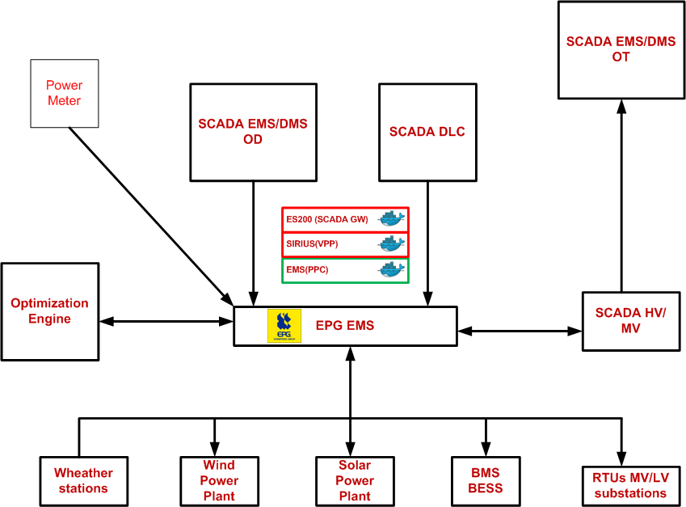
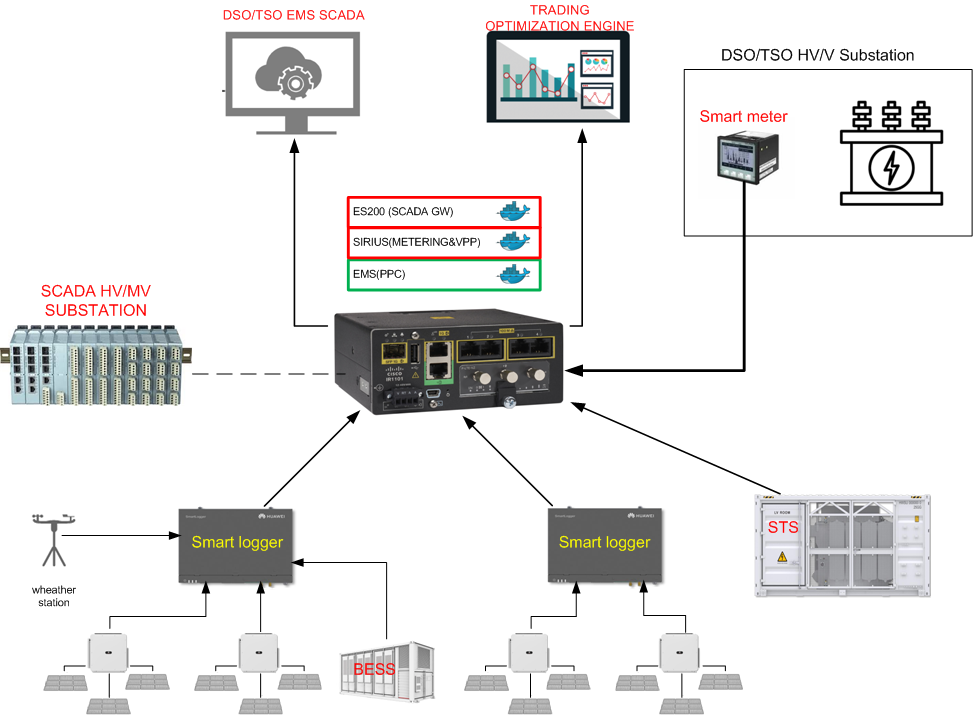
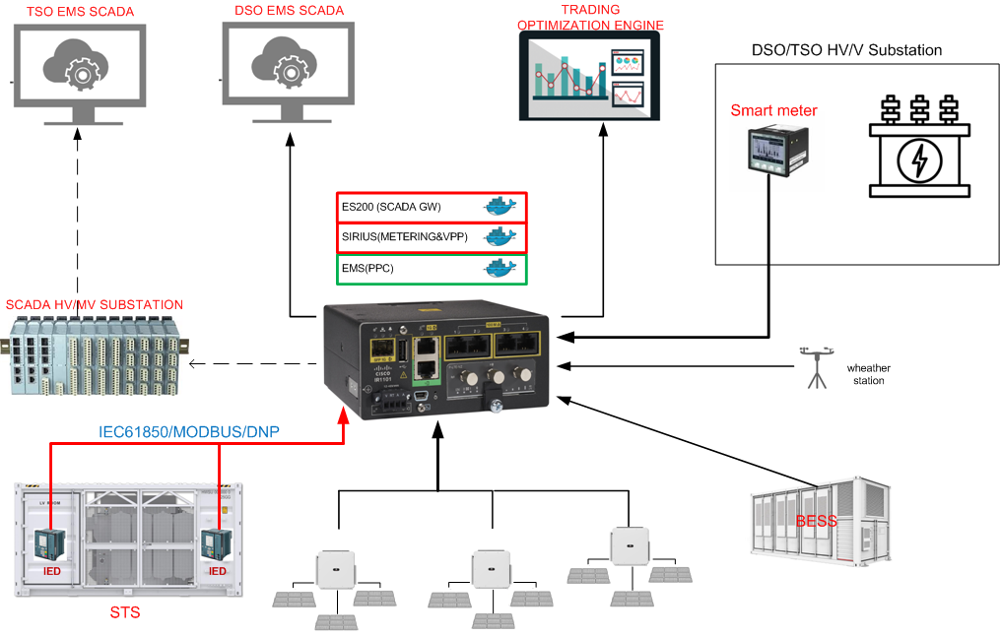
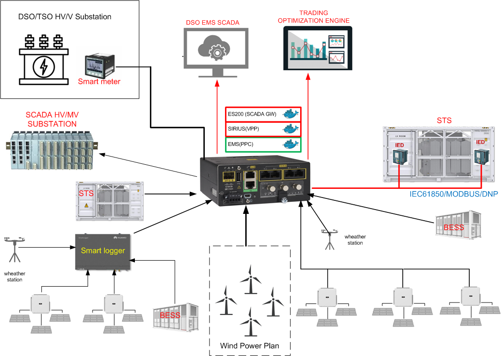
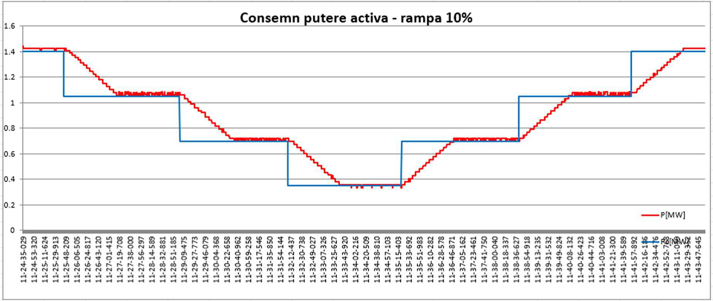
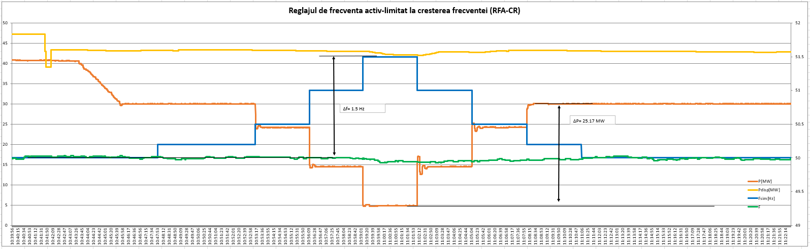
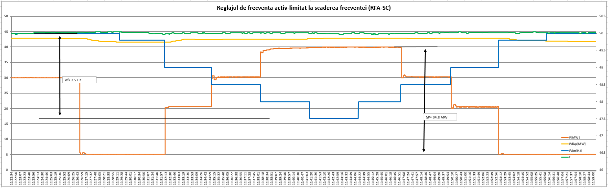
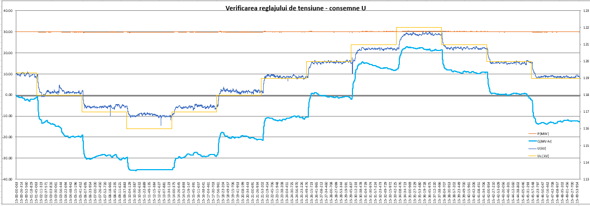
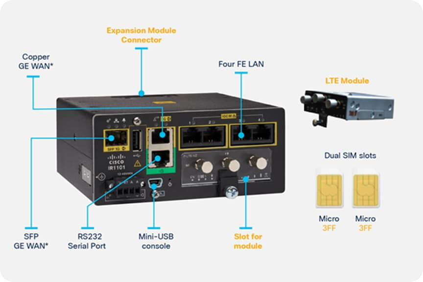

# Energy Management System (EMS)

## Table of Contents

1. [Introduction](#1-introduction)
2. [Energy Management System (EMS200)](#2-energy-management-system-ems200)
   - [2.1 Description of the automated control system for power plants](#21-description-of-the-automated-control-system-for-power-plants)
   - [2.2 Architectures used in EMS200 implementation](#22-architectures-used-in-ems200-implementation)
   - [2.3 SCADA Gateway – ES200](#23-scada-gateway--es200)
   - [2.4 SIRIUS software module for data acquisition from smart meters](#24-sirius-software-module-for-data-acquisition-from-smart-meters)
   - [2.5 Active Power Control](#25-active-power-control)
   - [2.6 Response to frequency variations](#26-response-to-frequency-variations)
   - [2.7 Reactive Power / Power Factor Control](#27-reactive-power--power-factor-control)
   - [2.8 Voltage control](#28-voltage-control)
   - [2.9 System Auxiliary Services](#29-system-auxiliary-services)
   - [2.10 Documentation](#210-documentation)
3. [Solution hardware platform](#3-solution-hardware-platform)
   - [3.1 Cisco IR1101 Communication Router](#31-cisco-ir1101-communication-router)
   - [3.2 Cybersecurity](#32-cybersecurity)
4. [Performance tests — compliance with ANRE Order 51/23.04.2019](#4-performance-tests--compliance-with-anre-order-51-23042019)
5. [Acronyms and Abbreviations](#5-acronyms-and-abbreviations)
6. [Annex – References](#annex--references)
   - [ANRE Certifications](#anre-certifications)
   - [SCADA Work and Complex Automation References](#scada-work-and-complex-automation-references)
   - [References for technical performance verification services for WPP, PPP, CHP](#references-for-technical-performance-verification-services-for-wpp-ppp-chp)

---

## 1. Introduction

This document describes Eximprod Engineering's **Energy Management System (EMS)** solution.

The EMS solution:

- Meets the technical and regulatory requirements of the energy sector
- Combines modern technologies with experience from similar projects
- Delivers reliable performance, operational safety, and compliance with current standards

The scope also includes technical performance testing and verification services — conducted under the applicable procedures and standards — to ensure correct integration with the energy system.

## 2. Energy Management System (EMS200)

### 2.1 Description of the automated control system for power plants

EMS200 is an Energy Management System that coordinates multiple generation and storage installations — photovoltaic, wind, BESS — so that they operate together as a single, unified power plant. The system is fully compliant with Romanian national regulations on hybrid generator unit performance, in line with ANRE provisions (e.g. ANRE 208/2018, ANRE 3/2023).

Developed by Eximprod Engineering, EMS200 acts as the local command and monitoring center for the entire plant, managing all devices and ensuring compliance with the requirements imposed by grid operators.

#### Software components

EMS200 is built around three main software modules:

- **ES200** — SCADA gateway and local control, including the HMI
- **SIRIUS** — retrieves data from the smart meters at the common coupling point (CCP) and on each plant component
- **PPC** — runs the active and reactive power adjustment loops, using inputs from ES200 and SIRIUS

#### System integration

EMS200 operates in coordination with:

- Individual controllers for the WPP and BESS
- Inverters and dataloggers
- The SCADA EMS/DMS systems of the DSO and LPPD
- The local SCADA system of the HV/MV substation serving the plant

It is designed for seamless integration with the substation SCADA, enabling coordinated operation, predictive analytics, and compliance reporting for long-term reliability and efficiency.

EMS200 controls the entire plant in real time (wind + photovoltaic + BESS), delivering optimal performance in full compliance with TSO and DSO requirements and with the operating logic defined by the beneficiary. It can receive commands and exchange data with:

- The local SCADA of the plant's HV/MV station
- The solution's local HMI
- Energy trading optimization engines
- SCADA EMS/DMS systems (DSO, LPPD)

#### Standard functionalities

EMS200 handles the following functions (see Figure 1):

- Coordinated active power control at the common coupling point
- Coordinated active power response to grid frequency variations
- Coordinated voltage control
- Coordinated reactive power and power factor control
- System services — secondary and tertiary regulation
- Maintaining the BESS State of Charge (SOC) at a configurable value
- Holding the active power setpoint at the CCP, drawing emergency energy from the BESS when needed
- SCADA gateway for MV/LV stations, weather stations, and other plant-floor sensors
- Interconnection with DSO and DLC dispatch platforms
- Interconnection with trading platforms via optimization engines

#### Coordination logic

For combined plants (photovoltaic + wind + BESS), EMS200 coordinates the PV inverters, the wind farm PPC, and the BESS controller as a single coherent system. Communication uses standard protocols — IEC-104, Modbus TCP, or DNP3 for the wind farm controller and BESS BMS, and Modbus TCP for inverter dataloggers.

The core function is solar park control. EMS200 simultaneously acts as the **master controller** for active power (P), reactive power (Q), and voltage (U) regulation of the wind turbines, and for keeping output within the band committed on the day-ahead market (DAM) by dispatching the BESS.

For both active (P) and reactive (Q) power, the PPC distributes the setpoint proportionally to the rated power of the wind and solar farms. A PID controller then adjusts the distribution in real time based on the active power actually produced.

#### Frequency response

- **Frequency drop** — energy stored in the BESS is dispatched, subject to two limits: the resulting active power must not exceed the combined nominal power of the wind and solar plants (per the TCA — Technical Connection Approval), and SOC must not fall below 30%
- **Frequency rise** — output is reduced by curtailing wind and solar production; the BESS is not discharged

For voltage regulation, the principle is the same as for active power: reactive power is distributed proportionally between sources.

#### BESS control objectives

The primary goal of BESS control is to maintain delivery within the active power band committed on the DAM, while minimizing battery stress by reducing the number of full cycles and keeping SOC near a configurable target (typically 70%).

**Operating regimes:**

- **Replacement mode** — when BESS power is inside the dead band and the WPP/PPP are throttling, SOC is held near the target through charge/discharge commands sized as `Ki × (measured power − target power)`. In parallel, the PID controller for PPP and WPP maintains the CCP power at its setpoint.
- **Emergency mode** — when measured power deviates from the target beyond the dead band, EMS200 issues discharge commands to the BESS equal to the difference between measured and target power, while keeping SOC within 0.3–0.9.

#### System objectives

EMS200 integrates advanced functionalities and uses standard SCADA protocols for data acquisition and command transmission. It takes measurements from the dedicated smart meter at the CCP and sends precise active and reactive power setpoints to the WPP and BESS (see Figure 1). The main system objectives are:

- Keeping reactive power at the CCP as close to zero as possible, supporting grid stability
- Automatically holding the CCP voltage within the band selected by the plant operator
- Responding automatically to frequency variations by adjusting active power output (BESS charge/discharge)
- Flattening load curves and stabilizing delivery capacity
- Providing system services — secondary and tertiary regulation, integrated with the TSO's external controller
- Acting as the local SCADA solution for MV/LV stations, the substation, and other plant sensors

EMS200 supports both local control (via the on-site graphical interface) and remote control by the relevant network operator (DLC/DSO). Switching between control modes is handled within the EMS itself.

### 2.2 Architectures used in EMS200 implementation

The ES200 can operate in various scenarios and architectures. The most common are described below.

*Figure 1 — General architecture of interconnected elements*

*Figure 2 — Use of predefined plant infrastructure*

#### Scenario 1 — Integration via smartloggers

The EMS solution is installed at the photovoltaic plant level and connects to the smartlogger/datalogger concentrators, which in turn aggregate and manage the generating units (inverters).

EMS EPG automatically coordinates the operation of the entire plant to ensure compliance with connection and operation requirements, in accordance with the Romanian Network Code (ANRE 208).

The MV/LV transformer substations and weather stations are also integrated into the smartlogger. The EMS application retrieves the relevant data either for transmission to dispatch centers and energy-trading optimization engines, or for optimizing the automatic control of the plant.

EMS centralizes and displays alarms, signals, and operating statuses in a local interface, based on information provided by field equipment, giving the operator a complete view and local control of the entire assembly.

*Figure 3 — Direct integration of generating units*

#### Scenario 2 — Direct integration of generating units

The EMS solution is installed directly at the photovoltaic plant level and connects directly to the generating equipment (inverters), without the need for smartloggers/dataloggers.

The platform allows direct integration of weather stations and sensors (temperature, humidity, irradiance), as well as existing digital protection terminals and RTUs (with DI/DO) in the HV/MV transformer substations. EMS EPG automatically coordinates plant operation, ensuring compliance with the connection and operation requirements of the Romanian Network Code (ANRE 208).

By correlating data from MV/LV stations and weather systems, the application calculates the available active power in real time and optimizes its delivery to the grid. Relevant information and orders can be transmitted to specialized dispatch centers (SCADA/EMS/DMS), to trading optimization engines, and to the local control interface — providing complete visibility and effective control at every level.

*Figure 4 — Hybrid mixed-integration power plant*

#### Scenario 3 — Hybrid mixed integration

This architecture combines the previous two scenarios and integrates them simultaneously. In addition, EMS 2.0 also integrates a wind power plant by connecting it to the existing turbine controller without altering its base logic.

This is the most complex variant, as it involves dispatching, balancing, and coordinating in real time all energy sources in the portfolio — photovoltaic, wind, and storage (BESS) — for:

- Maximizing the value of the energy delivered (including optimizing the injection profile and availability)
- Compliance with the technical limitations of each source
- Ensuring compliance with the connection and operation requirements of the Romanian Network Code (ANRE 208), through robust and predictable automatic control

### 2.3 SCADA Gateway – ES200

The proposed solution uses the ES200 platform, a product developed by Eximprod Engineering that performs both the function of a SCADA communication gateway and an RTU (Remote Terminal Unit). The ES200 platform is already widely deployed as a local SCADA solution for the remote control of transformer substations (PTs) and supply points (PAs), integrating communication protocols specific to SCADA systems used in the energy sector.

To implement the solution, an ES200 unit must be installed. Through the existing communication network, it ensures bidirectional data exchange for monitoring and control of the BESS, MV/LV transformer substations, and process information (sensors, weather stations).

The ES200 is a multifunctional software platform that acts as a gateway to industrial communication protocols, designed specifically for energy applications. It is compatible with various hardware platforms and operating systems.

It can be used to integrate digital protection terminals and general signaling (fault, intrusion) — see corresponding scenario — existing in transformer substations, contributing to:

- Reduced intervention times
- Increased operational safety
- Centralized or decentralized control of industrial processes

The platform supports a wide range of standard communication protocols, both on serial interfaces (RS232/RS485) and Ethernet (TCP/IP), as shown in Table 1.

| Communication Protocol | Type                 | Serial RS232/RS485 | Ethernet TCP/IP |
|------------------------|----------------------|--------------------|-----------------|
| Modbus                 | Master/Client        | Yes                | Yes             |
| DNP3.0                 | Master/Client        | Yes                | Yes             |
| IEC 61850 ed1 & ed2    | Client               | No                 | Yes             |
| IEC 60870-5-104        | Master/Client        | No                 | Yes             |
| Modbus TCP             | Slave/Server         | Yes                | Yes             |
| IEC 60870-5-104        | Slave/Server         | No                 | Yes             |
| MQTT                   | Publisher/Subscriber | No                 | Yes             |
| REST API               | —                    | —                  | Yes             |

*Table 1 — Communication protocols supported by the ES200 platform*

#### HMI Module

The ES200 platform can be extended with an HMI (Human-Machine Interface) module, which provides a configurable web-based graphical interface for manual control of industrial processes. This module allows:

- Local operation of energy installations
- Full integration into the command infrastructure, with the ES200 functioning as a protocol gateway

By installing a local HMI, field personnel can safely and quickly control electrical installations — including the BESS — without relying on centralized SCADA infrastructure.

Because of its web-based design, the HMI module can replace a dedicated command center, making it suitable for micro-dispatching the hybrid power plant.

The ES200 also integrates a local automation module, based on standard logic blocks, which allows control logic to be defined at both the local and system level.

### 2.4 SIRIUS software module for data acquisition from smart meters

The SIRIUS SGS module retrieves extended real-time information — average and instantaneous cumulative active energy/power, meter indexes, and instrumentation values — from the smart meters mounted at the common coupling point.

This data is made available in the EMS platform and is used for precise and rapid control of the hybrid power plant.

### 2.5 Active Power Control

During operation, the EMS200 system dynamically limits the active power delivered by the plant. It acts autonomously when production from renewable sources increases suddenly — for instance, due to rising solar irradiance or wind speed. The PPC continuously monitors the common coupling point (CCP) and regulates the injected active power, transmitting appropriate commands to the controlled equipment (WPP).

The EMS200 also manages the active power exchange with the National Electricity System (SEN) by sending orders to the photovoltaic generating units and to the individual controllers for the wind power plants (WPP) and the storage system (BESS). Based on real-time measurements at the CCP, the PPC continuously adjusts the active power flow to ensure compliance with the assigned setpoints.

Active power limitation orders can be issued by the network operator's dispatcher and are executed by EMS200 with configurable ramp speeds (expressed as a percentage of Pmax), in accordance with ANRE Order 208/2018 and ANRE Order 3/2023.

The system enables coordinated scheduling of the WPP and BESS to limit active power injection into the grid during peak periods, thus avoiding penalties and ensuring compliance with any technical restrictions.

WPP production variations are compensated by the BESS, allowing stabilized and constant active power delivery to the SEN.

*Figure 5 — Selectable speed control of the hybrid plant's active power by the EMS200 system*

> **Note:** Figure 5 is a Windows Metafile (`.emf`) and may not render natively on GitHub. Convert to PNG/SVG if needed.

The total active power setpoint is distributed proportionally to the maximum capacity of each generation unit (WPP, BESS), determining the individual setpoint for each.

### 2.6 Response to frequency variations

The EMS200 system can adjust the active power produced according to the system frequency, measured at the CCP. Based on this frequency, the PPC adjusts the plant's power output by changing the active power of the WPP or by charging/discharging the BESS.

Depending on the frequency measured at the CCP, the EMS200 system reacts according to its configured parameters (droop and the plant's maximum active power):

- **Frequency above the acceptable limit** (outside the configured dead band) — the hybrid plant reduces injected active power.

*Figure 6 — Hybrid plant response to frequency increase*

- **Frequency below the acceptable limit** (outside the configured dead band) — the hybrid plant increases injected active power.

*Figure 7 — Hybrid plant response to frequency decrease*

EMS200 performs frequency control by adjusting the output power, with the goal of bringing frequency back into the range defined by the dead band for the current operating mode.

The PPC offers the following frequency control modes, in line with ANRE Order 208 and ANRE Order 3:

- **Active Power Mode (RFA-SC/CR)** — ±0.2 Hz dead band
- **Frequency Mode (RFA)** — 0 Hz dead band

In both modes, the operator can manually control the active power produced by the hybrid plant. The control logic is applied to both WPP and BESS via the centralized EMS200 EPG controller.

### 2.7 Reactive Power / Power Factor Control

The Eximprod PPC commands the generating units to inject the reactive power needed to reach the reference value imposed by the relevant network operator at the common coupling point.

Reactive power measurements are taken by the analyzer at the CCP and used by the PPC to adjust the controls. Reactive power control respects the maximum available limits of the hybrid power plant, ensuring efficient operation in accordance with grid requirements.

EMS200 can adjust the actual reactive output power to a fixed or variable reference, depending on the operating conditions of the network.

As with active power control, reactive power setpoints can be issued by the network operator's dispatcher and executed at configurable ramp speeds, in accordance with ANRE Order 208/2018 and ANRE Order 3/2023.

The total reactive power setpoint is distributed according to the maximum reactive power capacity of the WPP and BESS, determining the individual setpoint for each.

By regulating reactive power flow, the solution also keeps the overall power factor of the installations (WPP and BESS) stable.

### 2.8 Voltage control

The relevant network operator (ORR) can impose a reference voltage or setpoint via a specific dispatch order, which must be maintained at the CCP through the reactive power contribution of the controlled plants (BESS and WPP).

If the reference voltage imposed by the TSO/ORR exceeds the dead band specific to the plant's nominal voltage level, EMS200:

1. Calculates a reactive power adjustment based on the configured ramp (a parameter defined at EMS200 level)
2. Divides the resulting value into samples per unit of time, based on the rate of change calculated under the conditions described in ANRE Order 208
3. Distributes the samples to the individual plants through the PID logic implemented at EMS200 level

*Figure 8 — Voltage response to setpoint variations*

### 2.9 System Auxiliary Services

Hybrid power plants can provide ancillary services thanks to the flexibility offered by the storage system (BESS) and the centralized management system.

Ancillary services are functions provided by energy system participants (such as hybrid power plants) to ensure stable operation of the electricity grid, in addition to the simple delivery of active energy.

These services are managed by the system operator (e.g. Transelectrica in Romania). For the Eximprod EMS200 solution, they include:

- Frequency Containment Reserve (FCR) — *RSF*
- Manual Frequency Restoration Reserve (mFRR) — *RRFm*
- Replacement Reserve (RR) — *RI*

Through its advanced active power control and frequency response functions, EMS200 EPG meets the requirements of ANRE Orders 89/2021 and 127/2021 for ancillary system services.

### 2.10 Documentation

The system is delivered with complete documentation, including equipment descriptions, the spare-parts list, and connection diagrams in accordance with the technical specification (CS).

System documentation is provided in Romanian. At the Beneficiary's request, training sessions for the RTU can be organized in accordance with the technical specification (CS).

## 3. Solution hardware platform

### 3.1 Cisco IR1101 Communication Router

The Cisco IR1101 is the hardware platform on which the ES200 and EMS200 EPG solutions run.

The Cisco Catalyst IR1101 Rugged Series Router is a compact, industrial, utility-optimized router.

The IR1101 is designed for harsh working environments and operates across a wide temperature range (–40 °C to 60 °C). The system is modular and supports a range of expansion modules, providing flexibility throughout the equipment's lifecycle.

### 3.2 Cybersecurity

All communications in the utilities sector — whether for data collection or remote control — must be secured at all levels. SCADA communications are by default transmitted in clear text, without authentication, which makes advanced security mechanisms essential.

The Cisco communication and automation platform protects communications at the level of substations and supply points, as well as the link to the central dispatch.

The proposed solution integrates Layer 2 access control mechanisms, including:

- **MAC Filtering** — restricts access based on physical addresses
- **Storm Control** — prevents network overload from uncontrolled traffic
- **Port Security** — limits port access to authorized devices only

To protect the connection to the dispatcher, the equipment implements hardware-accelerated AES-256 encryption, combined with dynamic and scalable tunneling and VPN technologies:

- IPsec
- DMVPN (Dynamic Multipoint VPN)
- FlexVPN
- IPsec over IPv6

DMVPN technology enables dynamic tunneling based on traffic, destination, and configuration policies. The configuration required on the Cisco IR1101 router involves a single initial tunnel; DMVPN then automatically manages the creation of multiple secure tunnels to various destinations, independent of the IP transport network or provider, and without user intervention.

For authentication, the system supports:

- Fast methods based on pre-shared keys (PSK)
- Scalable methods using public key infrastructure (PKI)

For critical data, the equipment integrates a zone-based firewall that allows granular traffic control on each zone — by type, volume, and frequency — for both monitoring and remote control activities.

The firewall and VPN functions are compatible with virtualized operation in VRF (Virtual Routing and Forwarding) environments, ensuring complete isolation and security of each routing instance.

In addition to these security capabilities, the Cisco platform enables local and secure data processing through an integrated Linux platform (Cisco IOx), which supports Docker and LXC containers. Applications can be managed remotely, with start, stop, restart, and resource-monitoring functions.

To guarantee communication performance regardless of protocols or traffic patterns, the platform integrates advanced Quality of Service (QoS) and buffering functionalities, applicable at both the data and IP levels. Supported technologies include:

- LLQ (Low Latency Queuing)
- WFQ (Weighted Fair Queuing)
- PBR (Policy-Based Routing)
- DSCP (Differentiated Services Code Point)
- CBWRED / WRED (Weighted Random Early Detection)
- RSVP (Resource Reservation Protocol)
- HQoS (Hierarchical QoS)
- CBTS / CBWFQ (Class-Based Traffic Shaping/Queuing)

## 4. Performance tests — compliance with ANRE Order 51/23.04.2019

To carry out the performance tests required to evaluate the technical compliance of the plant with the provisions of ANRE Order 208/2018 and ANRE Order 51/23.04.2019 — *"Notification procedure for connecting generating units and verifying the compliance of generating units with the technical requirements regarding the connection of generating units to electricity networks of public interest"* — the following services are included:

1. Preparation of the plant's test program
2. Conducting the in-house tests and the final tests as set out in the test program, after its approval by the DSO/TSO
3. Preparation of the technical reports for each testing stage — for the in-house tests and the final tests respectively:

   - **Frequency variation response testing:**
     1. Verification of the technical capability of the CEF to continuously vary active power under large frequency variations (categories C and D)
     2. Testing the response to frequency variations in the (49.8 ÷ 50.2) Hz range (RFA), contributing to frequency tuning within the ±200 mHz range; verification of the operating signal transmission with or without contribution to primary regulation (categories C and D)

   - Testing the possibility of reconnecting the CEF to the grid at frequencies in the (47.5 ÷ 51.5) Hz range, after a frequency-related disconnection (categories B, C, D)
   - Testing the CEF response to a variation of the active power setpoint (categories B, C, D)
   - Testing the CEF response to a variation of the reactive power setpoint — reactive power regulation (categories B, C, D)
   - Testing the CEF response to a variation of the voltage setpoint at the connection point — voltage regulation; checking the operating signal in U and Q settings (categories C, D)
   - Verifying the P-Q diagram. Plotting the P-Q diagram and the U-Q/Pmax diagram (categories B, C, D)
   - Verifying the reactive power exchange with the system in the absence of active power production by the CEF (categories B, C, D)
   - Automatic reconnection when parameters return to nominal range (frequency and voltage)
   - Testing data exchange between the CEF and EMS/DMS-SCADA. Checking the switching between operating modes with/without primary regulation, U/Q regulation, and local control / DLC / EMS SCADA control
   - Measurement of power quality at the connection point

4. Submission of the reports to the relevant network operator

### Implementation phases

**Phase 1 — Preparation of the test program** in accordance with ANRE Order 51/23.04.2019, for the CEF (category D).

**Phase 2 — In-house (preliminary) tests** of the hybrid plant, conducted in accordance with the test program approved by the relevant DSO:

- 2.1 Installation and dismantling of equipment, and testing in accordance with the detailed procedures
- 2.2 Preparation of the preliminary test report for the CEF, in accordance with ANRE Order 51/23.04.2019
- 2.3 Submission of the test report and support during review with the representatives of the relevant DSO (DEER) — answering questions and follow-up requests

**Phase 3 — Final tests** in accordance with the TSO/DSO requirements. Tests are conducted with local or remote participation of DSO representatives, as requested:

- 3.1 Installation and dismantling of equipment, testing in accordance with TSO/DSO requirements
- 3.2 Preparation of the final CEF test report in accordance with ANRE Order 51/23.04.2019 and the requests of the DSO
- 3.3 Submission of the test report and support during review with TSO/DSO representatives — answering questions and follow-up requests regarding the conduct and results of the tests

## 5. Acronyms and Abbreviations

| Acronym | Meaning |
|---------|---------|
| **ADMS** | Advanced Distribution Management System |
| **AES** | Advanced Encryption Standard |
| **ANRE** | *Autoritatea Națională de Reglementare în domeniul Energiei* — Romanian National Energy Regulatory Authority |
| **BESS** | Battery Energy Storage System |
| **BMS** | Battery Management System |
| **CBTS / CBWFQ** | Class-Based Traffic Shaping / Class-Based Weighted Fair Queuing |
| **CBWRED** | Class-Based Weighted Random Early Detection |
| **CCP** | Common Coupling Point |
| **CEF** | *Centrală Electrică Fotovoltaică* — Photovoltaic Power Plant (PV plant) |
| **CEH** | *Centrală Electrică Hibridă* — Hybrid Power Plant |
| **CHP** | Combined Heat and Power (cogeneration) |
| **CS** | *Caiet de Sarcini* — Technical Specification |
| **DAM** | Day-Ahead Market |
| **DEER** | *Distribuție Energie Electrică România* — Romanian electricity DSO |
| **DI/DO** | Digital Input / Digital Output |
| **DLC** | Local Dispatch Center |
| **DMS** | Distribution Management System |
| **DMVPN** | Dynamic Multipoint VPN |
| **DNP3** | Distributed Network Protocol 3 |
| **DSCP** | Differentiated Services Code Point |
| **DSO** | Distribution System Operator |
| **EMS** | Energy Management System |
| **EPG** | Eximprod Group |
| **FCR (RSF)** | Frequency Containment Reserve (*Rezerva de Stabilizare a Frecvenței*) |
| **FO** | Fiber Optic |
| **GPRS** | General Packet Radio Service |
| **HMI** | Human-Machine Interface |
| **HQoS** | Hierarchical Quality of Service |
| **HV/MV** | High Voltage / Medium Voltage |
| **IEC** | International Electrotechnical Commission |
| **IED** | Intelligent Electronic Device |
| **IOx** | Cisco IOx (application hosting framework) |
| **IP (rating)** | Ingress Protection rating |
| **IPsec** | Internet Protocol Security |
| **LLQ** | Low Latency Queuing |
| **LPPD** | Local Distribution Process Manager |
| **LTE** | Long-Term Evolution (4G) |
| **LV** | Low Voltage |
| **MAC** | Media Access Control |
| **mFRR (RRFm)** | Manual Frequency Restoration Reserve (*Rezerva de Restabilire a Frecvenței manuală*) |
| **MQTT** | Message Queuing Telemetry Transport |
| **MTBF** | Mean Time Between Failures |
| **MV/LV** | Medium Voltage / Low Voltage |
| **NTP** | Network Time Protocol |
| **OD/OT** | *Operator de Distribuție / Operator de Transport* — DSO / TSO |
| **ORR** | Relevant Network Operator (*Operatorul de Rețea Relevant*) |
| **PA** | *Punct de Alimentare* — Supply Point |
| **PBR** | Policy-Based Routing |
| **PCC** | Point of Common Coupling (synonym for CCP) |
| **PID** | Proportional-Integral-Derivative (controller) |
| **PKI** | Public Key Infrastructure |
| **Pmax** | Maximum active power |
| **PPC** | Power Plant Controller |
| **PPP** | Photovoltaic Power Plant |
| **PSK** | Pre-Shared Key |
| **PT** | *Post de Transformare* — Transformer Substation |
| **PV** | Photovoltaic |
| **Q** | Reactive power |
| **QoS** | Quality of Service |
| **REST API** | Representational State Transfer Application Programming Interface |
| **RFA** | *Reglaj Frecvență-Activă* — Frequency-Active Power Regulation |
| **RFA-SC/CR** | RFA — *Sensibilitate Configurabilă / Cu Răspuns* (configurable sensitivity / with response) |
| **RR (RI)** | Replacement Reserve (*Rezervă de Înlocuire*) |
| **RSVP** | Resource Reservation Protocol |
| **RTU** | Remote Terminal Unit |
| **SCADA** | Supervisory Control and Data Acquisition |
| **SDH** | Synchronous Digital Hierarchy |
| **SEN** | *Sistemul Energetic Național* — Romanian National Electricity System |
| **SFP** | Small Form-factor Pluggable (optical transceiver) |
| **SGS** | Smart Grid System (SIRIUS module) |
| **SIM** | Subscriber Identity Module |
| **SNMP** | Simple Network Management Protocol |
| **SOC** | State of Charge |
| **SSD** | Solid State Drive |
| **TCA** | Technical Connection Approval (*Avizul Tehnic de Racordare*) |
| **TCP/IP** | Transmission Control Protocol / Internet Protocol |
| **TSO** | Transmission System Operator |
| **U** | Voltage |
| **VLAN** | Virtual Local Area Network |
| **VRF** | Virtual Routing and Forwarding |
| **WCCP** | Web Cache Communication Protocol |
| **WFQ** | Weighted Fair Queuing |
| **WPP** | Wind Power Plant |
| **WRED** | Weighted Random Early Detection |

## Annex – References

### ANRE Certifications

Eximprod Engineering holds the following ANRE certifications, specific to the energy sector:

| **ANRE Certificate** | **Scope of Application**                                                                                                                                                                  |
|----------------------|-------------------------------------------------------------------------------------------------------------------------------------------------------------------------------------------|
| **A**                | Electrical equipment and installation tests                                                                                                                                               |
| **A3**               | Tests of electrical equipment and installations for certification of the technical conformity of power plants in relation to the applicable technical norms                               |
| **B**                | Design and execution of outdoor/indoor electrical installations for enclosures/civil and industrial constructions, overhead and underground connections, at the nominal voltage of 0.4 kV |
| **D1**               | Design of overhead and underground power lines with any standardized rated voltages                                                                                                       |
| **E1**               | Design of transformer substations, electrical substations and installations belonging to the electrical part of the power plants with any standardized nominal voltages                  |
| **E2**               | Execution of transformer substations, electrical substations and works on the electrical part of the power plants with any standardized nominal voltages                                 |

### SCADA Work and Complex Automation References

Eximprod Engineering has extensive experience in the energy field and a significant portfolio of projects. Some of the representative completed projects are:

<table>
<colgroup>
<col style="width: 23%" />
<col style="width: 76%" />
</colgroup>
<thead>
<tr class="header">
<th>Client / Final Beneficiary</th>
<th>Project Name</th>
</tr>
</thead>
<tbody>
<tr class="odd">
<td></td>
<td>

SCADA/DMS Integrated Dispatchers for Electricity Distribution Automation

SCADA/DMS integrated dispatch command center: 5 command centers in hot-standby architecture covering HV/MV transformer stations, MV/LV transformer substations, and equipment for the automation of medium-voltage overhead electrical distribution

SCADA systems in 110 kV/MV transformer stations, integrated into the DSO's SCADA/DMS dispatch center: over 50 in operation

SCADA systems in MV/LV transformer substations, MV connection points, and supply points: more than 300 in operation

SCADA systems for PPP/WPP connection points connected to the medium-voltage network: over 40 in operation

Equipment for remote-controlled overhead power lines (sectionalizers and reclosers): over 800 in operation

</td>
</tr>
<tr class="even">
<td></td>
<td>

ADMS system for distribution automation in the DELGAZ GRID area, including consumer interruption management

Cybersecurity system for SCADA systems in 106 transformer stations

Integrated SCADA EMS/DMS dispatch — 6 dispatch centers, 1 main system + 1 disaster recovery center, 25 SCADA systems in HV/MV transformer stations, integration of existing distribution automation systems, SDH telecommunications infrastructure

Equipment for remote-controlled overhead power lines (sectionalizers and reclosers): over 2,500 in operation

SCADA systems in 110 kV/MV transformer substations, integrated into the DSO's SCADA/DMS dispatch: over 100 in operation

SCADA systems in MV/LV transformer substations, MV connection points, and supply points: over 400 in operation

SCADA control system for the natural gas network

</td>
</tr>
<tr class="odd">
<td></td>
<td>

Urban distribution automation system Craiova — 15 RTU units in operation

Remote-controlled sectionalizers for overhead power lines — about 120 in operation

SCADA systems for PPP/WPP connection points connected to the medium-voltage network: approx. 25 in operation

Advanced Distribution Management System (ADMS) implementation

</td>
</tr>
<tr class="even">
<td></td>
<td>

Integrated SCADA / DLC energy dispatch command center

SCADA systems for PPP/WPP connection points

</td>
</tr>
<tr class="odd">
<td></td>
<td>

Transformer station and electrical works for the Corni Wind Farm, installed capacity 70 MW

Protection system and SCADA for the 110/30 kV Corni Transformer Station, integrated with the SCADA/DMS systems of DSO (Electrica Muntenia Nord) and TSO (Transelectrica)

</td>
</tr>
<tr class="even">
<td></td>
<td>

Electrical works for cogeneration producer — 2 × 3 MW

Automation and dispatch system, Zare cogeneration manufacturer

Protection and SCADA system for the connection point, integrated with the SCADA/DMS system of DSO (Electrica Muntenia Nord)

</td>
</tr>
<tr class="odd">
<td></td>
<td>

110/20 kV transformer station and electrical works for the Băleni Wind Farm, installed capacity 50 MW

Protection and SCADA system for the Băleni Transformer Station, integrated with the SCADA/DMS systems of DSO (Electrica Muntenia Nord) and TSO (Transelectrica)

</td>
</tr>
<tr class="even">
<td></td>
<td>Configuration of local SCADA command-control systems in the 110 kV/MV E.ON Moldova power stations and integration into the SCADA EMS/DMS E.ON Moldova dispatch</td>
</tr>
<tr class="odd">
<td></td>
<td>SCADA system for legacy signal integration for Elia Belgium HV/MV processing stations</td>
</tr>
<tr class="even">
<td></td>
<td>Pilot Prosumer Control App</td>
</tr>
<tr class="odd">
<td></td>
<td>SCADA systems in MV/LV transformer substations</td>
</tr>
<tr class="even">
<td></td>
<td>

Integrated SCADA / DLC energy dispatch command center

SCADA systems for PPP/WPP connection points

</td>
</tr>
<tr class="odd">
<td>HVAC Systems</td>
<td>Integrated Energy Dispatch Center (under construction)</td>
</tr>
<tr class="even">
<td></td>
<td>Metering and management system for electricity metering data in the wholesale market</td>
</tr>
</tbody>
</table>

### References for technical performance verification services for WPP, PPP, CHP

<table>
<colgroup>
<col style="width: 31%" />
<col style="width: 54%" />
<col style="width: 15%" />
</colgroup>
<thead>
<tr class="header">
<th><strong>Client / Final Beneficiary</strong></th>
<th><strong>Project Name</strong></th>
<th><strong>Category</strong></th>
</tr>
</thead>
<tbody>
<tr class="odd">
<td></td>
<td>Performance test services to establish compliance with ANRE Order 51/23.04.2019 for WPP 60 MW Ruginoasa</td>
<td>D</td>
</tr>
<tr class="even">
<td><strong><em>Complex Energetic Valea Jiului — SE Paroșeni</em></strong></td>
<td>Technical performance verification services for PPP Paroșeni to qualify for the provision of system services in accordance with ANRE Order 89/2021</td>
<td>System Auxiliary Services</td>
</tr>
<tr class="odd">
<td></td>
<td>Performance test services to establish compliance with ANRE Order 51/23.04.2019 for PPP 2.5 MW Own Services</td>
<td>B</td>
</tr>
<tr class="even">
<td></td>
<td>Technical performance verification services for PPP Pantelimon to qualify for the provision of system services in accordance with ANRE Order 89/2021</td>
<td>System Auxiliary Services</td>
</tr>
<tr class="odd">
<td></td>
<td>Performance test services to establish compliance with ANRE Order 51/23.04.2019 for PPP 2.58 MW</td>
<td>B</td>
</tr>
<tr class="even">
<td></td>
<td>Performance test services to establish compliance with ANRE Order 51/23.04.2019 for PPP 48 MW Glodeni 1 & Glodeni 2 Energy</td>
<td>D</td>
</tr>
<tr class="odd">
<td></td>
<td>Performance test services to establish compliance with ANRE Order 51/23.04.2019 for PPP 49.9 MW Glodeni 2 Energy</td>
<td>D</td>
</tr>
<tr class="even">
<td></td>
<td>Performance test services to establish compliance with ANRE Order 51/23.04.2019 for PPP 30 MW Horia 1</td>
<td>D</td>
</tr>
<tr class="odd">
<td></td>
<td>Performance test services to establish compliance with ANRE Order 51/23.04.2019 for PPP Studina</td>
<td>D</td>
</tr>
<tr class="even">
<td></td>
<td>Performance test services to establish compliance with ANRE Order 51/23.04.2019 for PPP Saint-Gobain 8 MW</td>
<td>C</td>
</tr>
<tr class="odd">
<td>Other Beneficiaries</td>
<td>

Performance test services to establish compliance with ANRE Order 51/23.04.2019:

<ul>
<li>PPP 15.5 MW Ciorani — Category C</li>
<li>PPP 3 MW Stâlpu 2 — Category B</li>
<li>PPP Cojani 14.8 MW — Category C</li>
<li>PPP Ciorani 2 49.5 MW — Category D</li>
</ul>
</td>
<td>B / C / D</td>
</tr>
</tbody>
</table>