# ES200 Dashboard Manual <!-- omit from toc -->

[**Table of Contents:**](#toc)
- [1. Introduction](#1-introduction)
  - [1.1. Legal Information](#11-legal-information)
  - [1.2. General dispositions](#12-general-dispositions)
  - [1.3. Terminology](#13-terminology)
  - [1.4. Abbreviations](#14-abbreviations)
  - [1.5. Minimum browser versions](#15-minimum-browser-versions)
- [2. The ES200 Unit](#2-the-es200-unit)
  - [2.1. Use cases](#21-use-cases)
  - [2.2. Specific Hardware](#22-specific-hardware)
  - [2.3. System architecture](#23-system-architecture)
  - [2.4. Supported comunication protocols](#24-supported-comunication-protocols)
- [3. Installing the ES200 Dashboard](#3-installing-the-es200-dashboard)
- [4. Configuring the database using the ES200 Dashboard](#4-configuring-the-database-using-the-es200-dashboard)
  - [4.1. Database configuration interface](#41-database-configuration-interface)
    - [4.1.1. Main toolbar](#411-main-toolbar)
    - [4.1.2. Secondary toolbar](#412-secondary-toolbar)
    - [4.1.3. Equipment list](#413-equipment-list)
    - [4.1.4. Equipment settings](#414-equipment-settings)
    - [4.1.5. Database table](#415-database-table)
    - [4.1.6. Errors table](#416-errors-table)
  - [4.2. Adding and editing entities in the database](#42-adding-and-editing-entities-in-the-database)
    - [4.2.1. Command centers](#421-command-centers)
    - [4.2.2. Intelligent Electronic Devices](#422-intelligent-electronic-devices)
    - [4.2.3. Points](#423-points)
    - [4.2.4. Editing the table entries for a Command Center](#424-editing-the-table-entries-for-a-command-center)
    - [4.2.5. Editing the table entries for an IED](#425-editing-the-table-entries-for-an-ied)
  - [4.3. Downloading and uploading the database to ES200](#43-downloading-and-uploading-the-database-to-es200)
    - [4.3.1. Downloading the database](#431-downloading-the-database)
    - [4.3.2. Uploading the database](#432-uploading-the-database)
  - [4.4. Viewing the points](#44-viewing-the-points)
  - [4.5. Sending commands](#45-sending-commands)
  - [4.6. Force points value](#46-force-points-value)
- [5. Setting up communication with IED](#5-setting-up-communication-with-ied)
  - [5.1. Modbus](#51-modbus)
    - [5.1.1. General configuration of the communication channel](#511-general-configuration-of-the-communication-channel)
    - [5.1.2. General RTU configuration](#512-general-rtu-configuration)
    - [5.1.3. Adding Discrete Input Register digital inputs](#513-adding-discrete-input-register-digital-inputs)
    - [5.1.4. Adding Coil digital controls](#514-adding-coil-digital-controls)
    - [5.1.5. Adding analog input sizes - Input Register](#515-adding-analog-input-sizes---input-register)
    - [5.1.6. Addition of analogue command sizes - Holding Register](#516-addition-of-analogue-command-sizes---holding-register)
  - [5.2. DNP3.0](#52-dnp30)
    - [5.2.1. General configuration of the communication channel](#521-general-configuration-of-the-communication-channel)
    - [5.2.2. RTU General Configuration](#522-rtu-general-configuration)
    - [5.2.3. Adding digital sizes](#523-adding-digital-sizes)
    - [5.2.4. Adding analogue sizes](#524-adding-analogue-sizes)
    - [5.2.5. Adding commands](#525-adding-commands)
  - [5.3. IEC 61850 Ed1](#53-iec-61850-ed1)
    - [5.3.1. General configuration of the communication channel](#531-general-configuration-of-the-communication-channel)
    - [5.3.2. General configuration of the IED connection](#532-general-configuration-of-the-ied-connection)
    - [5.3.3. Digital and analogue size editing](#533-digital-and-analogue-size-editing)
    - [5.3.4. Editing commands](#534-editing-commands)
    - [5.3.5. Reports editing IEC61850](#535-reports-editing-iec61850)
  - [5.4. IEC 61850 Ed2](#54-iec-61850-ed2)
    - [5.4.1. General configuration of the communication channel](#541-general-configuration-of-the-communication-channel)
    - [5.4.2. General RTU configuration](#542-general-rtu-configuration)
    - [5.4.3. Digital and analogue size editing](#543-digital-and-analogue-size-editing)
    - [5.4.4. Editing commands](#544-editing-commands)
    - [5.4.5. Editing reports](#545-editing-reports)
  - [5.5. IEC-60870-5-104](#55-iec-60870-5-104)
    - [5.5.1. General Configuration of the Communication Channel](#551-general-configuration-of-the-communication-channel)
    - [5.5.2. General Configuration of the RTU](#552-general-configuration-of-the-rtu)
    - [5.5.3. Adding Simple Digital or Double Type Sizes or Analog Sizes](#553-adding-simple-digital-or-double-type-sizes-or-analog-sizes)
    - [5.5.4. Adding Commands](#554-adding-commands)
  - [5.6. MQTT](#56-mqtt)
    - [5.6.1. General Configuration of the Communication Channel](#561-general-configuration-of-the-communication-channel)
    - [5.6.2. Adding Simple Digital Sizes (Boolean Sizes)](#562-adding-simple-digital-sizes-boolean-sizes)
    - [5.6.3. Adding Analog Sizes (Numeric)](#563-adding-analog-sizes-numeric)
  - [5.7. IEC-60870-5-101](#57-iec-60870-5-101)
    - [5.7.1. General Configuration of the Communication Channel](#571-general-configuration-of-the-communication-channel)
    - [5.7.2. Adding Digital and Analog Status Entities](#572-adding-digital-and-analog-status-entities)
    - [5.7.3. Adding Commands](#573-adding-commands)
- [6. Setting up communication with the command center](#6-setting-up-communication-with-the-command-center)
  - [6.1. IEC 60870-5-104](#61-iec-60870-5-104)
    - [6.1.1. General configuration of the communication channel](#611-general-configuration-of-the-communication-channel)
    - [6.1.2. General configuration of CC](#612-general-configuration-of-cc)
    - [6.1.3. Adding digital sizes](#613-adding-digital-sizes)
    - [6.1.4. Adding analogue sizes](#614-adding-analogue-sizes)
    - [6.1.5. Adding commands](#615-adding-commands)
  - [6.2. Modbus](#62-modbus)
    - [6.2.1. General configuration of the communication channel](#621-general-configuration-of-the-communication-channel)
    - [6.2.2. General configuration of CC](#622-general-configuration-of-cc)
    - [6.2.3. Adding digital, analogue and command sizes](#623-adding-digital-analogue-and-command-sizes)
  - [6.3. DNP3.0](#63-dnp30)
    - [6.3.1. General Configuration of the Communication Channel](#631-general-configuration-of-the-communication-channel)
    - [6.3.2. General Configuration of the RTU](#632-general-configuration-of-the-rtu)
    - [6.3.3. Adding Digital, Analog, and Command Sizes](#633-adding-digital-analog-and-command-sizes)
- [7. Configuration example](#7-configuration-example)
  - [7.1. Hypothetic use case](#71-hypothetic-use-case)
  - [7.2. IED configuration](#72-ied-configuration)
  - [7.3. Command Center Configuration](#73-command-center-configuration)
  - [7.4. Saving and uploading the project](#74-saving-and-uploading-the-project)
- [8. Utilities](#8-utilities)
  - [8.1. Exporting and importing templates](#81-exporting-and-importing-templates)
    - [8.1.1. Export](#811-export)
    - [8.1.2. Import](#812-import)
  - [8.2. Project version conversion](#82-project-version-conversion)
    - [8.2.1. Project download](#821-project-download)
    - [8.2.2. Version change](#822-version-change)
    - [8.2.3. Project versions differences](#823-project-versions-differences)
      - [8.2.3.1. Differences between versions 1.3 - 1.5](#8231-differences-between-versions-13---15)
        - [8.2.3.1.1. ModbusMaster](#82311-modbusmaster)
        - [8.2.3.1.2. DNP3Master](#82312-dnp3master)
        - [8.2.3.1.3. IEC61850](#82313-iec61850)
        - [8.2.3.1.4. IEC104Slave](#82314-iec104slave)
        - [8.2.3.1.5. ModbusSlave](#82315-modbusslave)
        - [8.2.3.1.6. IEC104Master](#82316-iec104master)
        - [8.2.3.1.7. MultiDataMaster](#82317-multidatamaster)
        - [8.2.3.1.8. JSON\_MQTT](#82318-json_mqtt)
      - [8.2.3.2. Differences between versions 1.5 - 2.0](#8232-differences-between-versions-15---20)
        - [8.2.3.2.1. DNP3Master](#82321-dnp3master)
        - [8.2.3.2.2. DNP3Slave](#82322-dnp3slave)
      - [8.2.3.3. Differences between versions 2.0 - 2.1](#8233-differences-between-versions-20---21)
        - [8.2.3.3.1. DNP3Master](#82331-dnp3master)
  - [8.3. Change the language](#83-change-the-language)
  - [8.4. Logic block editor](#84-logic-block-editor)
    - [8.4.1. Functionality description of automation blocks](#841-functionality-description-of-automation-blocks)
      - [8.4.1.1. ResetDominantBistable (SET/RESET)](#8411-resetdominantbistable-setreset)
      - [8.4.1.2. TON](#8412-ton)
      - [8.4.1.3. TOF](#8413-tof)
      - [8.4.1.4. Functions for statistical determinations: MAX, MIN, AVG, DISP](#8414-functions-for-statistical-determinations-max-min-avg-disp)
  - [8.5. Configuration of ES200 HMI](#85-configuration-of-es200-hmi)
    - [8.5.1. General Description](#851-general-description)
    - [8.5.2. Adding Digital Quantities](#852-adding-digital-quantities)
    - [8.5.3. Adding Analog Quantities](#853-adding-analog-quantities)
    - [8.5.4. Adding a Command](#854-adding-a-command)
    - [8.5.5. Save, Load, and Use HMI](#855-save-load-and-use-hmi)

# 1. Introduction

ES200 is the ideal solution for the automation of field equipment. Using modern and secure communication and automation standards, the ES200 is designed to efficiently operate power grids, oil and gas devices, manufacturing units, smart city solutions and so on.  

To configure the ES200 solution, we designed a Dashboard that helps edit the database that stores the configuration settings required by the ES200. This document explains how to use the Dashboard to generate the ES200 database. 

## 1.1. Legal Information

The information in this document is subject to change without prior notice and is not a commitment on the part of the supplier. Eximprod does not take responsibility for the use of the information in this document. 

Eximprod is not responsible for any direct or indirect matter of any nature that may result from the use of this document or any product mentioned in the document.

The software described in this document is licensed and may only be used in accordance with the terms of this license.

The information in this document cannot be reproduced or copied without the written permission of Eximprod and the content cannot be given to a third party for unauthorized use.

## 1.2. General dispositions

This document provides information about the ES200 Dashboard software and its main features. The information available in this manual is intended for personnel who will use this product to configure different components or for current use.

## 1.3. Terminology

This document contains a set of terms that specify important or safety information.

| Term            | Description                                                                 |
|-----------------|-----------------------------------------------------------------------------|
| Alarm           | An event that informs the operator about any deviation from normal system conditions.  |
| Application     | Software designed to respond to a specific task.                            |
| Archive         | Storage area for historical and forecasted data.                            |
| Attribute       | A specific property of an object.                                           |
| Button          | Sensitive display area that can be pressed to initiate a specific action.   |
| Click           | Press a mouse button once and release without moving the cursor.            |
| Command center  | Location where the distribution control center (master) is located.         |
| Database        | A collection of information required by the application.                    |
| Default         | Normal, standard.                                                          |
| Display         | Instrument used to indicate information (in this case synonymous with screen). |
| Double-click    | Two successive clicks on the mouse.                                         |
| Log             | Information about the occurrence of an event.                               |
| Protocol UP/DOWN| Communication protocol with equipment at a higher / lower level.            |
| Tag             | A property of an element.                                                   |

## 1.4. Abbreviations

Below is a list of abbreviations used throughout the document.

<table>
  <tr>
   <td><strong>Abbreviations</strong>
   </td>
   <td><strong>Description</strong>
   </td>
  </tr>
  <tr>
   <td>A
   </td>
   <td>Ampere
   </td>
  </tr>
  <tr>
   <td>Ω
   </td>
   <td>Ohm
   </td>
  </tr>
  <tr>
   <td>V
   </td>
   <td>Volt
   </td>
  </tr>
  <tr>
   <td>W
   </td>
   <td>Watt
   </td>
  </tr>
  <tr>
   <td>CC
   </td>
   <td>Command Center
   </td>
  </tr>
  <tr>
   <td>COMx
   </td>
   <td>Serial port x
   </td>
  </tr>
  <tr>
   <td>DNP3
   </td>
   <td>Distributed Network Protocol
   </td>
  </tr>
  <tr>
   <td>I/O
   </td>
   <td>Input/output 
   </td>
  </tr>
  <tr>
   <td>ID
   </td>
   <td>Unique identifier
   </td>
  </tr>
  <tr>
   <td>IEC 60870-5-104
   </td>
   <td>International Electrotechnical Commission 60870-5-104 communication protocol 
   </td>
  </tr>
  <tr>
   <td>IED
   </td>
   <td>Intelligent Electronic Devices
   </td>
  </tr>
  <tr>
   <td>LoRaWAN
   </td>
   <td>Low Power Wide Area Network (LPWAN) specification
   </td>
  </tr>
  <tr>
   <td>RTU
   </td>
   <td>Remote Terminal Unit
   </td>
  </tr>
  <tr>
   <td>SCADA
   </td>
   <td>Supervisory Control and Data Acquisition
   </td>
  </tr>
  <tr>
   <td>TCP
   </td>
   <td>Transmission Control Protocol
   </td>
  </tr>
  <tr>
   <td>TP
   </td>
   <td>Transformation point
   </td>
  </tr>
  <tr>
   <td>WAN
   </td>
   <td>Wide Area Network 
   </td>
  </tr>
</table>

## 1.5. Minimum browser versions

Chrome: 71

Opera: 58

Safari: 13

Mozilla Firefox: N/A

Microsoft Edge: 80

# 2. The ES200 Unit

ES200 is a control, monitoring and data acquisition. It is the ideal solution both for automation and control of transformation, power or connection points and for local SCADA systems.

Our solution works in a distributed architecture, along with the software and devices commonly used today. However, ES200 also allows backward compatibility with legacy equipment. Therefore, it can communicate with standard, legacy and modern devices, thus being a versatile solution that greatly improves security and automation functions.

ES200 is able to run, deploy and operate at the Network Edge, while securely isolating SCADA microservices from any other process. It enables data extraction, concentration, processing and storage by acting as a SCADA gateway.

## 2.1. Use cases

ES200 features monitoring, control and communication gateway functions. The system allows the capture of intelligent protection (IED signals), as well as the direct acquisition of digital signals. The ES200 has a wide range of standard protocols (detailed in section 2.4) for monitoring and transmitting information to the higher level. Also, ES200 can store a history of up to 500,000 events stored in non-volatile memory that are described by:

* The time tag identifying the time at which the event occurred (accuracy of 1ms);
* Source of the event;
* Condition before the event;
* Condition after event;

## 2.2. Specific Hardware

The Cisco IR809 is a router designed for transformer stations, working in conjunction with the ES200 to create a virtual Remote Terminal Unit (RTU). Together, this unit collects data from connected smart measuring devices and sends this information to a command center. The unit can also be used to send commands to Intelligent Electronic Devices (IEDs).

The ES200 is designed to run on Cisco IR809 routers, Cisco IR829, or Cisco IR1101, as well as alternatives such as Phoenix Contact or eManager, depending on the context and desired functionalities. The software operates within the container provided by the existing IOx virtual machine on the Cisco hardware platform.

Figure 1: Cisco IR1101 Router

<table>
  <tr>
    <td>
      <ol>
        <li><strong>SFP GE WAN</strong></li>
      </ol>
    </td>
    <td><strong>6. Grounding Point (located on the device's edge)</strong></td>
  </tr>
  <tr>
    <td>
      <ol>
        <li><strong>USB 2.0</strong></li>
      </ol>
    </td>
    <td><strong>7. DC Power and Alarm Input</strong></td>
  </tr>
  <tr>
    <td>
      <ol>
        <li><strong>RJ45 GE WAN</strong></li>
      </ol>
    </td>
    <td><strong>8. Mini-USB Console</strong></td>
  </tr>
  <tr>
    <td>
      <ol>
        <li><strong>Serial Port</strong></li>
      </ol>
    </td>
    <td><strong>9. Reset Button</strong></td>
  </tr>
  <tr>
    <td>
      <ol>
        <li><strong>FE LAN Ports 1-4</strong></li>
      </ol>
    </td>
    <td><strong>10. Module Slot</strong></td>
  </tr>
</table>

Table 1: References for Cisco IR809 Router

## 2.3. System architecture

The next figures show a general application architecture and an example of a deployment architecture.

Figure 2: The ES200 system architecture

Figure 3: Example of ES200 deployment architecture

## 2.4. Supported comunication protocols

Communications protocols supported by the ES200 include Modbus, DNP3, IEC 60870-5-104 and IEC 61850. These protocols are currently being used by a wide range of modern protection equipment and IEDs, therefore our solution can be easily deployed with existing equipment. Also, the list of available communication protocols is expanding, other protocols being developed on demand.

Depending on the hardware platform that supports it, the ES200 can directly control and transmit information via its own I/O modules. Below you can find a list of the currently supported communication protocols.

| Protocol              | Master    | Slave |
|-                      |-          |-      |
| Modbus                | Yes       | Yes   |
| DNP3                  | Yes       | Yes   |
| IEC 60870-5-104       | Yes       | Yes   |
| IEC 60870-5-101       | Yes       |       |
| IEC 61850             | Yes       |       |
| IEC 61850 Edition 2   | Yes       |       |
| MQTT                  | Yes       | Yes   |
| LoRa                  |           | Yes   |
| OPC Client            | Yes       |       |

Table 2: ES200 supported communication protocols

# 3. Installing the ES200 Dashboard

A wizard has been configured to guide you through the installation process. First, you must double click the installation icon:

The first window of the installer is the one in Figure 4: Install wizard. In order to start the installation process, click Next.

Figure 4: Install wizard

Afterwards, you will be prompted to select the location where you want the program to be installed. We recommend keeping the default file location, as shown in Figure 5. If you wish to choose a different directory, click the Browse button and navigate to the intended file location. After the file destination is chosen, click Next.

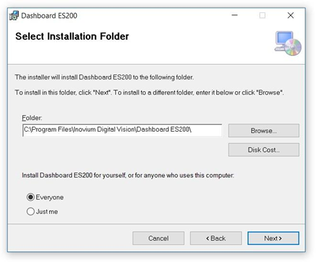

Figure 5: Install wizard (2)

After that, the wizard will ask you to confirm installation, as shown in Figure 6. You can do so by clicking Next. The software will be installed in the chosen (or default) location and the wizard will inform you of the success of the installations, as shown in Figure 7. You can then close the wizard by clicking the Finish button.

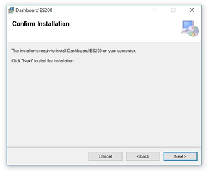

Figure 6: Install wizard (3)

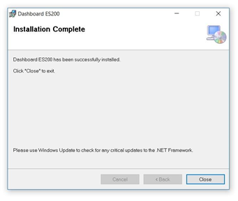

Figure 7: Install wizard (4)

# 4. Configuring the database using the ES200 Dashboard

The data required for the ES200 application to run properly is retrieved from a database. Each unit is delivered with an application for viewing and editing the database.

## 4.1. Database configuration interface

The database configuration interface main menu is illustrated in Figure 8.

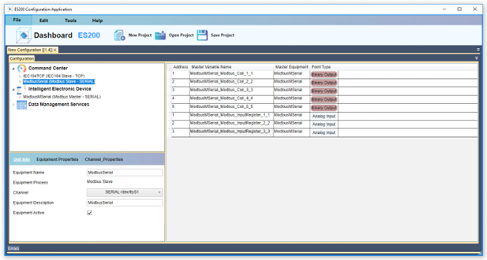

Figure 8: ES200 database configuration interface

The main application areas are highlighted in colored boxes as follows (Figure 9):

1. Main toolbar
2. Secondary toolbar
3. Equipment list
4. Equipment settings
5. Database table
6. Errors table

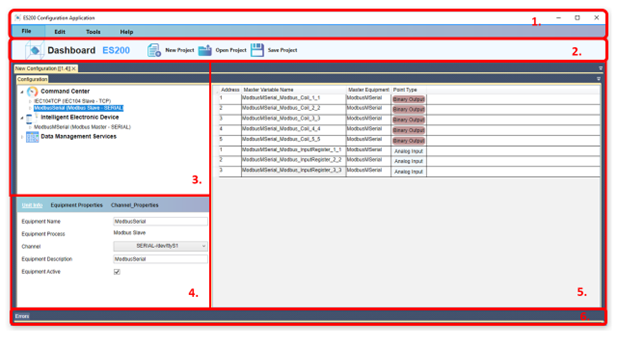

Figure 9: ES200 database configuration interface highlights

### 4.1.1. Main toolbar
* File – allows you to open, save, download/upload projects or exit the application.
* Edit – allows you to add new devices, either slave or master and the license, author and description of the database you are configuring.
* Tools- allows you to change the current language of the application.
* Help – gives you more information about the application you are using.
* The buttons on the right – allow you to minimize or maximize the app window or close the app altogether.

### 4.1.2. Secondary toolbar
* New Project – opens a new project tab (using the latest database configuration version)
* Open Project – opens a browsing window for you to navigate the directory system and select the database you want to view/modify
* Save Project – saves your current work in the database file you have opened

### 4.1.3. Equipment list
* Command Centers – a list of all the CCs that currently exist in the database
* Intelligent Electronic Device – a list of all the IEDs that currently exist in the database
* MultiDataMaster – a list of all MultiDataMaster devices that exist in the database.

### 4.1.4. Equipment settings
If you select an equipment (CC or IED), the window in the lower left corner will have the following submenus:

* Unit info - information about the selected equipment ( name, channel etc.). The editable fields can be changed according to new requirements.
* Equipment Properties - additional information about the selected equipment and the communication protocol it uses. Each field has a help text that will show when you hover over the field name.
* Channel Settings – information regarding the channel (Serial/TCP) used by the equipment for communication purposes. 

### 4.1.5. Database table
A table-like interface that offers information about the points of the selected equipment. By double clicking a field, you can change its content either by selecting one of the given options (when the field has certain content restrictions) or by manually inputting the new content.

### 4.1.6. Errors table
In this table you can see the configuration errors of a database. For example: equipment with the same name, duplicate points etc.

## 4.2. Adding and editing entities in the database

### 4.2.1. Command centers
You can add a new CC device by using the Add slave device option from the Edit button in the Main Toolbar, and selecting the protocol you want the new Command Center to use. Afterwards, you will be able to add additional creation information in the designated area (Figure 10).

An alternative method is to right-click Command Centers and click the Add Device button, selecting the protocol in the EquipmentProcess drop down menu.

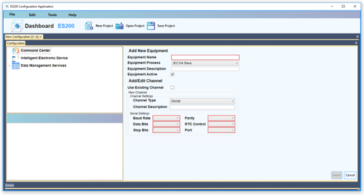

Figure 10: ES200 database configuration interface – adding a new Command Center

The editable fields are:

* Equipment Name - the name you want the equipment to have so it is easy to identify;
* Equipment Process – from a drop-down menu, you can select which protocol you want this Command Center to use;
* Equipment Description – a short sentence that can help identify the equipment’s purpose;
* Equipment Active – activating this field means the equipment is active, unticking it means the equipment will be inactive;
* Use Existing Channel – activating this option will allow you to select an already configured communication channel from a drop down list. Unticking it means you have to configure a new channel.
* If you are configuring a new channel:
    * Channel Type – from the drop-down menu, you can select if you want the Command Center to communicate using a Serial or a TCP connection. Depending on your selection, you will have specific connection properties to edit. (Figure 11);
    * Channel Description – a short sentence that can help you identify the channel and its settings.

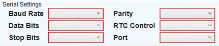

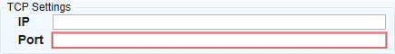

Figure 11: Serial and TCP connection options

1. The Serial Channel has the following editable parameters:
    * BAUDRATE – the speed of the connection (bits/second);
    * DATABITS – the number of bits in each character;
    * STOPBITS – the number of bits used to detect the end of a character;
    * PARITY – a method used for detecting errors in communication;
    * RTSCONTROL – a method used to ensure the sender speed is not higher than the rate at which the receiver can process the data;
    * PORT - the port which the equipment will use to communicate

    These parameters must have the same value at both ends of the connection, therefore you must select the values from the drop-down menus based on the equipment you are connecting to the ES200.

2. The TCP Channel has the following parameters:
    * IP – the IP address of the equipment
    * PORT – the port which the equipment will use to communicate through TCP

All these settings can be edited after the creation of the Command Center. You can do so by clicking on the specific slave you want to modify and then change the settings in the tabs from the Equipment Settings section (as shown in Figure 12)

Figure 12: ES200 database configuration interface – editing a Command Center

A Command Center can be deleted by clicking on it, then right-clicking it and selecting Delete equipment. Alternatively, you can select am equipment and use the Delete key.

### 4.2.2. Intelligent Electronic Devices

Adding an IED is similar to adding a Command Center. By clicking the Edit button and selecting Add master device, you will be asked to select the protocol you want the new device to use. Then, the process is identical to the previous chapter, as shown in Figure 13.

An alternative method is selecting and right-clicking Intelligent Electronic Device and selecting Add Device. The protocol can later be selected from the Equipment Process drop down menu.

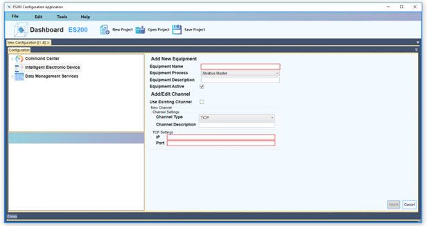

Figure 13: ES200 database configuration interface – adding an Intelligent Electronic Device

The editable fields are:

* Equipment Name - the name you want the equipment to have so it is easy to identify;
* Equipment Process – from a drop-down menu, you can select which protocol you want this IED to use;
* Equipment Description – a short sentence that can help identify the equipment’s purpose;
* Equipment Active – activating this field means the equipment is active, unticking it means the equipment will be inactive;
* Use Existing Channel – activating this option will allow you to select an already configured communication channel from a drop down list. Unticking it means you have to configure a new channel.
* If you are configuring a new channel:
    * Channel Type – from the drop-down menu, you can select if you want the Command Center to communicate using a Serial or a TCP connection. Depending on your selection, you will have specific connection properties to edit, as explained bellow
    * Channel Description – a short sentence that can help you identify the channel and its settings.

Depending on which channel you selected, the parameters that you have to fill in are different and are explaind in the following lists:

1. The Serial Channel has the following editable parameters:
    * BAUDRATE – the speed of the connection (bits/second);
    * DATABITS – the number of bits in each character;
    * STOPBITS – the number of bits used to detect the end of a character;
    * PARITY – a method used for detecting errors in communication;
    * RTSCONTROL – a method used to ensure the sender speed is not higher than the rate at which the receiver can process the data;
    * PORT - the port which the equipment will use to communicate

    These parameters must have the same value at both ends of the connection, therefore you must select the values from the drop-down menus based on the equipment you are connecting to the ES200.

2. The TCP Channel has the following parameters:
    * IP – the IP address of the equipment
    * PORT – the port which the equipment will use to communicate through TCP

All these settings can be edited after the creation of the IED. You can do so by clicking on the specific master you want to modify and then change the settings in the settings submenus from the lower left part of the window, just like you would do if you wanted to modify the properties of a Command Center.

### 4.2.3. Points
The procedure for adding a new point to either a Command Center or a Intelligent Electronic Device is extremely similar. 

The first step is to expand the equipment’s point options by clicking on the arrow to its left. Afterwards, by selecting and then right-clicking the desired point type, you can select the Add point(s) option, that will open a dialogue box (Figure 14) where you can input:

* Starting Address – the address of the first point you wish to add;
* Number of Points – the number of points you wish to add.

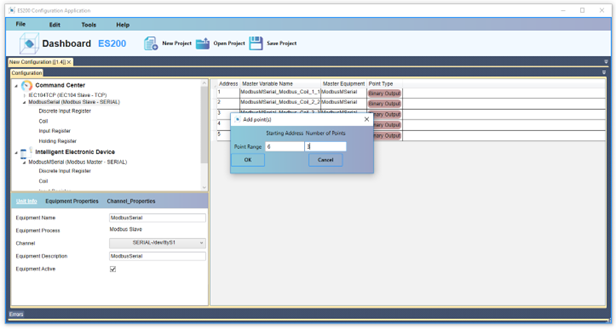

Figure 14: ES200 database configuration interface – adding a point

After the addition, the new points will appear in the table belonging to the equipment where they were added. The editing process will be covered in the next chapter. In order to delete a point, you can select the row in the table by clicking on it and then right-clicking it and selecting the Delete item option.

### 4.2.4. Editing the table entries for a Command Center
In the table in the right of the selected Command Center, you can view or edit the points that the Command Center will receive. Every editable value can be modified by double-clicking the cell you wish to edit. The editable columns of the table are:

* ADDRESS – The address of the point
* Master Variable Name – The name of the correspondent of the point in the Master’s point list. The new value can be selected from a drop-down menu. Selecting a master point will make the row become white.

### 4.2.5. Editing the table entries for an IED
The table in the right of the selected IED can be used to edit the points that the IED will send. Every editable value can be modified by double-clicking the cell you wish to edit. 

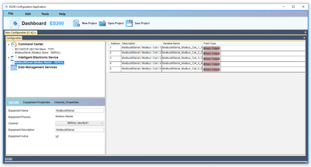

Figure 15: ES200 database configuration interface – editing an IED point

The editable columns of the table are:

* ADDRESS – The address of the point. 
* Description – a short phrase that can help the identify and understand the purpose of the points. 
* Variable Name – the name of the variable stored in the point

## 4.3. Downloading and uploading the database to ES200
### 4.3.1. Downloading the database

In some use cases, the database that is currently in use on the ES200 will need to be modified. In order to do that, you must import it locally and edit it with the Dashboard application. For this, use the File -> Download Project menu. This will open a window in which you can enter the required connection information.

Figure 16: ES200 database configuration interface – connecting to ES Remote**

After entering your credentials, you will be asked to navigate through your own computer and select where you want the remote database to be saved and what name you want it to have. 

### 4.3.2. Uploading the database

After editing a database, in order to use it with the ES200 application, you must upload it to the system running ES200. You can do this from the Dashboard application by using the File -> Upload Project menu. Just like when importing a database, you will be asked for the information necessary to establish a connection. 

After entering the required information, you will be asked to select which local file you want to upload to the system. The location in which it is updated is standard, therefore its unnecessary for you to select it.

## 4.4. Viewing the points

The Dashboard offers you an interface where you can see the points’ status. This interface – called Entity Viewer – also allows you to send commands to the points. To access this interface, use the File -> New EntityViewer and connect to an equipment running the ES200.

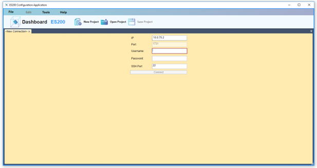

Figure 17: ES200 EntitiyViewer – connecting to an equipment running the ES200

After connecting to the equipment, you can see the points’ status and other useful information. 
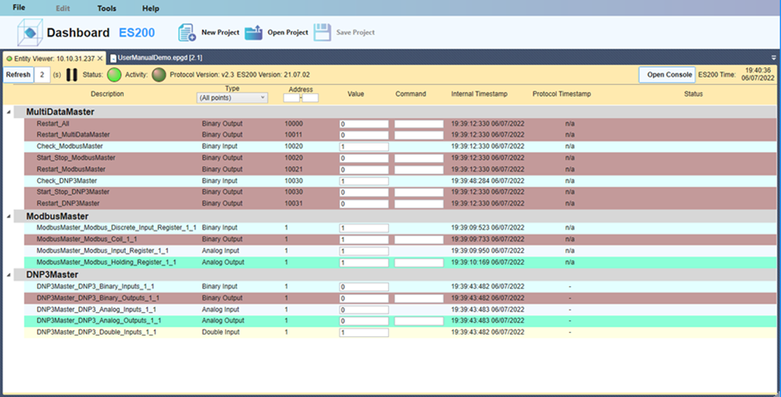

Figure 18: ES200 EntityViewer – The EntitifyViewer interface

Here, you can set the refresh rate (in the example window above, it is set at 2 seconds) and you can view the time of the last refresh and the status of the connection. If the connection is paused (as you can see above), you can reconnect to the equipment by clicking the Play button. If the connection has been lost, you can reattempt a connection by clicking Stop and then Play.

The points are grouped by protocol. Next to each protocol name, you can see how many points of that type are in the database. By using the arrow next to each protocol name, you can expand (or contract) the points. 

After expanding the points, you can see the description of each point, its type, address and value. You can also filter the results by type and address in the header row of the table. For filtering by type, use the dropdown menu. If you want to filter by address, write the starting and ending address in the fields in the header row. If you only want one address, write the same value in both fields.

For each and every point, there are timestamps corresponding to different events:

* Protocol timestamp
* Internal timestamp - the timestamp recorded by the device hosting ES200 - it corresponds with the last event occurred on that point

There is a button in the top right corner of the window labeled “Open Console” - once you press it, a terminal of the ES200 hosting device will be opened.

On the right side, there is a timer labeled “ES200 Time”. It indicates the actual timestamp of the ES200 hosting device. This will update along the refresh interval configured earlier.

There is an indicator on the left side of the status bar which shows the connection status. It glows green if there is connection between the ES200 hosting device and the Dashboard and red otherwise.

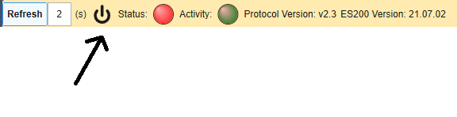

Figure 19: Entity Viewer - Starting button

When a new project is uploaded, the processes are restarted, therefore, it is necessary for the Entity Viewer to be manually started to start the connection with the ES200.

## 4.5. Sending commands

In order to send command to any of the points, you can use the EntityViewer interface. Next to each output point value, there is a textbox cell where you can write the command you want to send. These cells are on the Command column. Only the cells corresponding to points that can receive commands are active textbox cells that can be edited. 

After writing the desired command and clicking the Enter key on your keyboard, the command will be sent, and the result will be shown into the Status column. This behaviour is available only for “Output” points. You can see an example of a written command in the figure below:

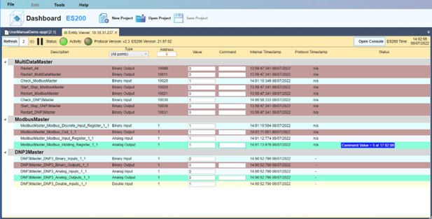

Figure 20: ES200 EntityViewer – Sent command shown in the Status column

If there are multiple commands sent on  the same point, the actual label will be replaced with the most recent one, and on the right side of the label, the number of commands that have been sent will be displayed.

Figure 21: ES200 EntityViewer – multiple commands on the same point

## 4.6. Force points value
Point value forcing is a feature usually used for testing. In order to do it, you have to fill the field under the “Value” of the “Input” points and then press Enter. Once forced, a point will be labeled accordingly in the status column.

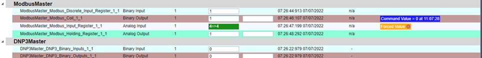

Figure 22: ES200 EntityViewer – force point value

To stop a point value from being forced, press the “x” icon inside the “Forced Value” label. This way, the point value will come back to its initial value after about 10 seconds, if the points are valid.

# 5. Setting up communication with IED
## 5.1. Modbus
### 5.1.1. General configuration of the communication channel

After adding a new IED and configuring as described in section 4.2, we will have the information below available for editing.

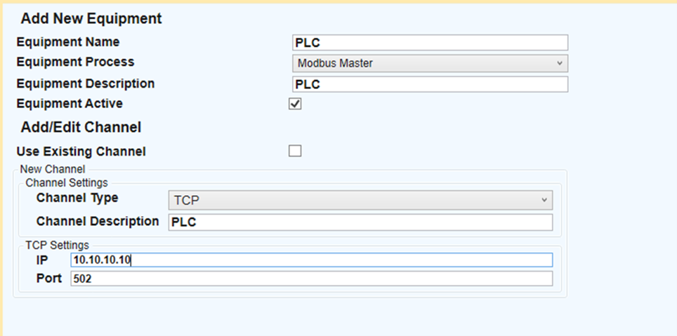

If the channel is TCP type:

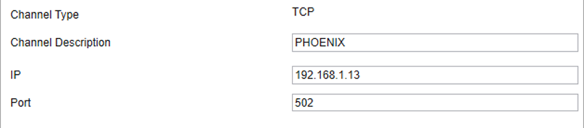

* Channel Description - the name of the communication channel. Does not affect communication with devices helping to organize information.
* IP : The IP address of the device
* Port : TCP port through which TCP/IP communication with the equipment is performed (for Modbus the most used port is 502)

If the communication channel is serial:

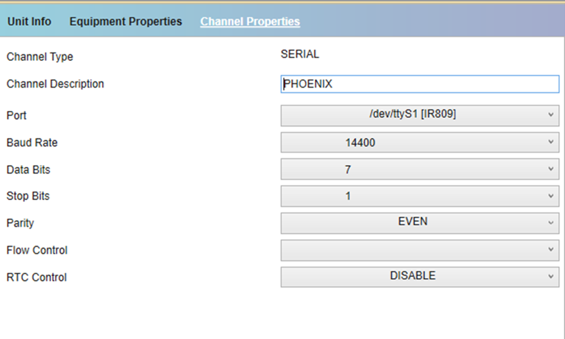

We find the specific settings of a serial communication:
* BAUDRATE - connection speed (measured in bits/second)
* DATABITS - number of bits of a character
* STOPBITS - number of bits used to identify the end of a character
* PARITY - a method used to detect communication errors
* RTSCONTROL - a method used to ensure that the baud rate is no faster than the speed at which the receiver can process the received data

Additionally:

* Channel Description - the name of the communication channel. Does not affect communication with devices helping to organize information.
* Port: The serial port used by the ES200 for communication with the slave device. Depending on the HW platform we are using it may have Linux file system specific descriptions:

  * /dev/ttyS1 (IR809)
  * /dev/ttyS2 (IR809)
  * /dev/ttyTun0 (IR1101)
  * /dev/ttySerial (IR1101)

### 5.1.2. General RTU configuration

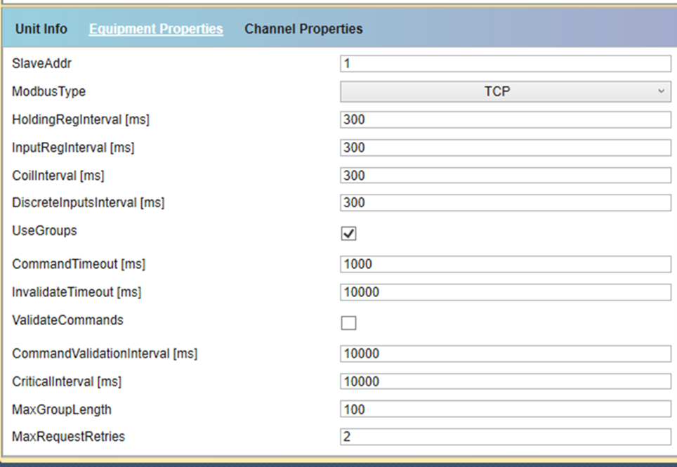

* SlaveAddr - Modbus slave address - is defined at PLC or protection relay level
* ModbusType - Modbus RTU, ASCII or TCP communication type is selected. The Modbus type (RTU, ASCII or TCP) is described in the relay or PLC documentation. Modbus RTU or ASCII is used in situations where a serial link (RS232 or RS485) is used between the HW ES200 and the PLC or relay.
* HoldingReglnterval - The time interval at which the Modbus master in the ES200 sends a polling (polling) message to the holding-register addresses.
* InputRegInterval - The time interval at which the Modbus master in the ES200 sends a polling message on Input-register addresses.
* CoilInterval - The time interval at which the Modbus master in the ES200 sends a message to Coil addresses
* DiscreteInputsInterval - The time interval at which the Modbus master in the ES200 sends a polling message on DiscreteInput addresses.
* UseGroups - parameter that enables/disables the use of address groups in response to a polling message sent to the slave
* CommandTimeout - the time interval after which if the command is not executed and no response is received from the slave it is considered to have failed.
* Invalidate TimeOut - the time interval after which the read margins become invalid if the slave does not respond to the polling for a certain time interval.
* ValidateCommands - parameter whose activation activates the mechanism to send a general query to the address to which the command was sent.
* CommandValidationInterval - the time after issuing a command on an address, after which the ES200 considers that entity invalid if it has not received a response to the query sent to the slave.
* CriticalInterval - Certain addresses may be set to be read at a time interval other than that intended for general Modbus-specific entity types.
* MaxGroupLength - the maximum number of addresses that form an address group that will be polled with a single polling message (can be any value 0-120).

### 5.1.3. Adding Discrete Input Register digital inputs

Discrete Input Register margins are commonly used for binary margins on Modbus communication.

* Address - The address of the Discrete Input Register binary information read from the slave equipment. If the information is read from a Discrete Input Register word this column is filled with -1.
* Description - Detailed description of the entity being retrieved - for internal use (e.g.: Maximum protection operation step 1).
* Variable Name - Fill in a unique TAG for each signal. This TAG will be the internal identifier for that signal and will be used in saved processes and for automation logic.
* SOURCEDATA - allows to retrieve a specific bit from a Word with a predefined address from the integrated slave hardware. The format of this field is as follows:
  * AIxx|y - to retrieve a bit from a word of type Discrete Input Register or Input register
  * AOxx|y - to retrieve a bit from a word of type Holding Register or Coil.
  * AOxx|y - to retrieve a bit from a Holding Register or Coil word.

In the format defined above "xx" is the numeric address of the word to be read from and "y" is the number of the bit to be read (0 is the least significant bit and 7 is the most significant bit).

IsCritical - allows the entity to be placed in a special group of addresses to be read periodically at the CriticalInterval set in the general settings area.

### 5.1.4. Adding Coil digital controls

Coil sizes are commonly used to perform commands on Modbus communication

* Address - The address of the Coil binary information read from the slave equipment. If the information is read from a Discrete Input Register word this column is filled with -1
* Description - Detailed description of the entity being retrieved - for internal use (e.g.: Maximum protection operation step 1)
* Variable Name - Fill in a unique TAG for each signal. This TAG will be the internal identifier for that signal and will be used in the saved processes and for the realization of automation logic
* CmdType - Pulse/ Latch. Pulse, transient command. Will keep the command active for the duration set to "Pulse duration". Latch, the command is automatically maintained until a new cancel command is given (operation is influenced by the type of equipment or the type of installation to be controlled).
* Pulse Duration - Pulse command duration (ms)
* Source - allows control in ES of one bit of a HoldingRegisters size. The format of this field is as follows:
  * AOxx|y - to control one bit of a Holding Register.

    In the format defined above "xx" is the numeric address of the word from which the command is to be made, and "y" is the number of the bit to be controlled (0 is the least significant bit and 7 is the most significant bit).
    
    If this field is filled, the Address field should be filled with the value "-1".

* CommandValidationPoint - List of the TAGs of entities (binary or analogue inputs) separated by a comma, which are to be affected by the performance of the command in question.
* IsCritical - allows the entity to be placed in a special group of Coil addresses that will be read periodically at the CriticalInterval set in the general configuration area.

### 5.1.5. Adding analog input sizes - Input Register

* Address - Address of the Discrete Input Register binary information read from the slave equipment. If the information is read from a Discret Input Register word this column is filled with -1.
* Description - Detailed description of the entity being retrieved - for internal use (e.g.: Maximum protection operation step 1).
* Variable Name - Fill in a unique TAG for each signal. This TAG will be the internal identifier for that signal and will be used in saved processes and for automation logic
* WordCount - Specifies the number of registers used to read a magnitude. By default this column has a value of 1 because most magnitudes are stored in a single register. Other possible values are 2 and 4. These are used for float sizes (which are stored in 2 registers) or large integer sizes (which are stored in 4 registers). The details depend on each device and are given in its documentation
* LittleEndian - The direction (left to right or right to left) in which bits are read from the word(s) represented by the address analogue sizes - LittleEndian - left to right (when the option is selected) or BigEndian (when the option is not activated - right to left)
* ValueType - data type associated with analogue quantities (signed, unsigned, floating point) - the description of the data type should be found in the relay documentation

### 5.1.6. Addition of analogue command sizes - Holding Register
* Holding Register margins are commonly used for analogue command margins on Modbus communication
* Address - The address of the Holding Register binary information read from the slave equipment. Description - Detailed description of the entity being retrieved - for internal use (e.g. power limit setting)
* Variable Name - Fill in a unique TAG for each signal. This TAG will be the internal identifier for the respective command and will be used within the saved processes and for the realization of automation logic
* WordCount - Specifies the register number used to set a magnitude. By default this column has a value of 1 because most magnitudes are stored in a single register. Other possible values are 2 and 4. These are used for float sizes (which are stored in 2 registers) or large integer sizes (which are stored in 4 registers). The details depend on each device and are given in its documentation.
* ValueType - data type associated with analog quantities (signed, unsigned, floating point) - the description of the data type should be found in the relay documentation
* LittleEndian - the direction (left to right or right to left) in which bits are read from the word(s) represented by the analogue size address - LittleEndian - left to right (when option is selected) or BigEndian (when option is not selected - right to left)
* CmdType - Pulse/ Latch. Pulse, transient command. Will keep the command active for the duration set to "Pulse duration". Latch, the command is automatically maintained until a new cancel command is given (operation is influenced by the type of equipment or installation to be controlled)
* Pulse Duration - Pulse command duration (ms)
* CommandValidationPoint - List of the TAGs of entities (binary or analogue inputs) separated by comma, which are to be affected by the command in question
* IsCritical - allows the entity to be placed in a special group of Coil addresses that will be read periodically at the CriticalInterval set in the general configuration area

## 5.2. DNP3.0

### 5.2.1. General configuration of the communication channel

After adding a new IED and configuring as described in section 4.2, we will have the information below available for editing.

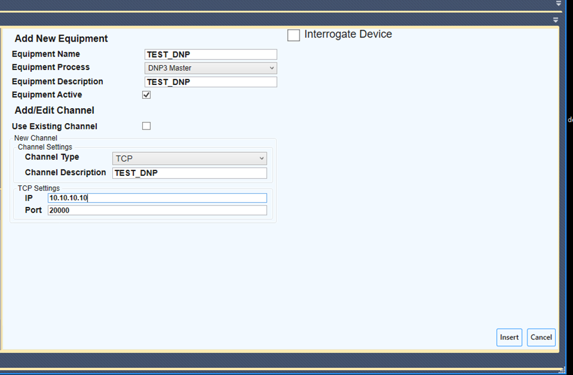

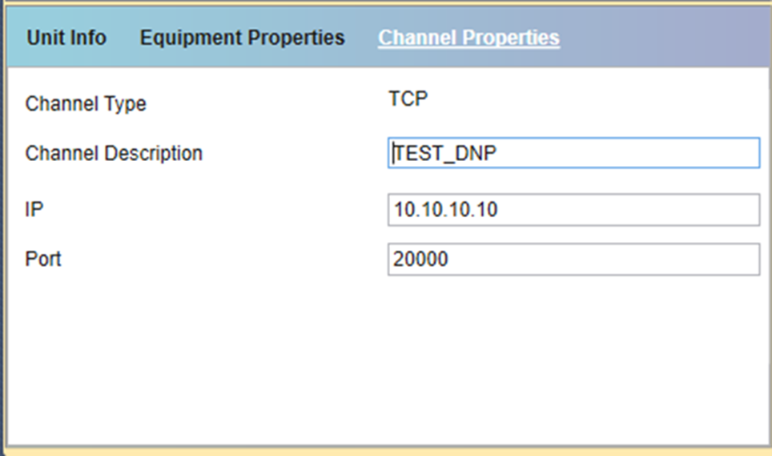

* Channel Description - the name of the communication channel. Does not affect communication with devices helping to organize information
* IP : The IP address of the device
* Port : TCP port through which TCP/IP communication with the equipment is performed (for DNP3 the most used port is 20000)

If the communication channel is serial:

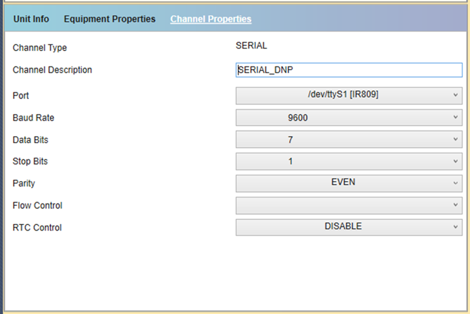

We find the specific settings of a serial communication:

* BAUDRATE - connection speed (measured in bits/second)
* DATABITS - number of bits of a character
* STOPBITS - number of bits used to identify the end of a character
* PARITY - a method used to detect communication errors
* RTSCONTROL - a method used to ensure that the baud rate is no faster than the speed at which the receiver can process the received data

Additionally:
* Channel Description - the name of the communication channel. Does not affect communication with devices helping to organize information
* Port: The serial port used by the ES200 for communication with the slave device. Depending on the HW platform we are using may have Linux file system specific descriptions

  * /dev/ttyS1 (IR809)
  * /dev/ttyS2 (IR809)
  * /dev/ttyTun0 (IR1101)
  * /dev/ttySerial (IR1101)

### 5.2.2. RTU General Configuration

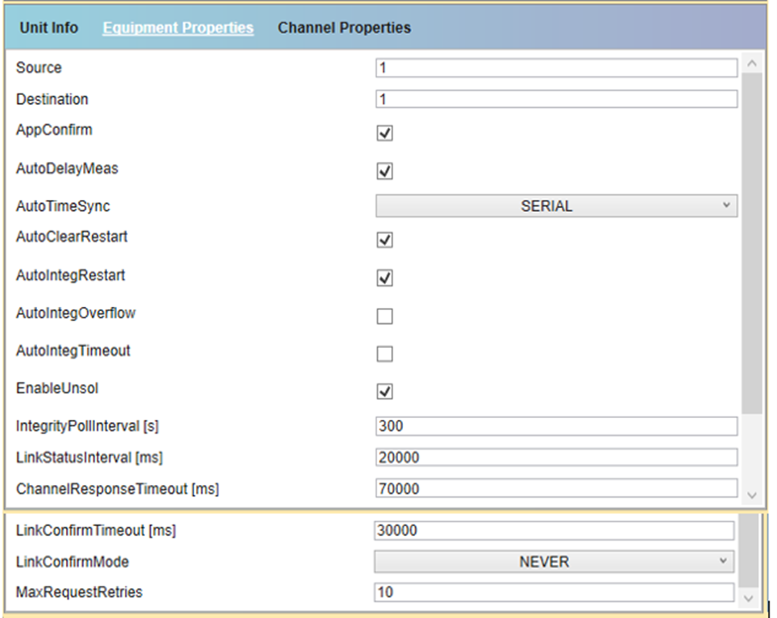

* Source - represents the numeric ID of the communication master in a DNP3.0 session, internal to the DNP3.0 protocol. In equipment communicating over DNP3.0 it is necessary to set the source address (master) and the destination address (oustation or slave)
* Destination - represents the slave address (outstation) of the IED with which the DNP3.0 master of the ES200 is going to establish a communication link.In case we have several devices on serial communication connected on the same serial port (RS485 loop), each device must have a different slave address
* AppConf - parameter to enable/disable the generation of DNP3.0 frame receipt confirmation messages at Application level
* AutoDelayMeas - enables/disables the delay measurements mechanism within the time synchronization procedure especially when using the SERIAL (Object 50 variation 1) time synchronization model
* AutoTimeSync - allows the choice of the time synchronization pattern for the IED communicating with the ES200. The ES200 sends upon IED request, telegrams specific to the internal type synchronization of the requesting IED. Two time synchronization models can be used - SERIAL (Object 50 variation 1) and LAN (Object 50 variation 3), the supported model is described in the IED documentation
* AutoClearRestart - allows the setting of IIN status bits to be enabled when initializing communication or restarting an IED
* AutoIntegRestart - enables the ES200 DNP3.0 master to send an Interity Poll message to an IED after resetting the IED or reinitialising the link to the IED
* AutoIntegOverflow - enables the ES200 DNP3.0 master to send an Interity Poll message to an IED after receiving its event buffer fill message
* AutoIntegTimeout - enables the ES200 DNP3.0 master to send an Interity Poll message to an IED after a timeout set for the communication channel with the IED
* EnableUnsol - allows an unsolicited responses message to be sent to an IED. Unsolicited responses is the mechanism for sending events from a DNP3.0 slave to the master without the need for periodic interrogation of the slave (event driven mechanism in DNP3). If the IED does not have the possibility to send unsolicited messages, it will report the events via the RBE (report by exception) mechanism at each general query it receives from the master in the ES200
* IntegrityPoolInterval - The time interval (seconds) at which the Master sends an interity poll message to the IED it is communicating with
* LinkStatusInterval - the parameter that sets the periodicity of sending link level status check messages between the master and the IED
* ChannelResponseTimeout - represents the time the DNP3Master waits for a response to a request that has been sent at the application level
* LinkConfirmTimeout - the maximum time for DNP3Master to wait for link level status confirmation messages after DNP3Master has issued a request for link level status verification
* LinkConfirmMode - allows setting the mode of waiting for application level confirmation messages. Possible values are NEVER (only confirmation of unsolicited messages transmitted by slaves), SOMETIMES, ALWAYS (requires confirmation for all messages transmitted between master and slaves). If NEVER is set the link level verification mechanism (LINK) configured by the LinkStatusInterval and LinkConfirmTimeout parameters remains in place. It is important that the equivalent parameter in the IED is set to the same value (NEVER, SOMETIMES or ALWAYS) as in the ES200
* MaxRequestRetries - The maximum number of requests sent to the IED that have not been answered after the timeout intervals set above have expired before the connection is terminated by DNP3Master

### 5.2.3. Adding digital sizes

* Address - Address of the Binary input information taken from the FDI. The address map can be created by configuring the IED using the specific configuration sw or in the IED technical documentation
* Description - Detailed description of the retrieved entity - for internal use (e.g.: Maximum protection operation step 1)
* Variable Name - Fill in a unique TAG for each signal. This TAG will be the internal identifier for that signal and will be used within the saved processes and for the realization of automation logic

### 5.2.4. Adding analogue sizes

* Address - The address of the analogue input information taken from the IED. The address map can be created by configuring the IED using the specific configuration sw or in the IED technical documentation
* Description - Detailed description of the retrieved entity - for internal use (e.g. Current value phase A)
* Variable Name - Fill in a unique TAG for each signal. This TAG will be the internal identifier for that signal and will be used within the saved processes and for the realization of automation logic

### 5.2.5. Adding commands

* Address - Address of the binary output information read from the slave equipment. Description - Detailed description of the retrieved entity - for internal use (e.g. Separator command)
* Variable Name - Fill in a unique TAG for each signal. This TAG will be the internal identifier for the respective command and will be used in the save processes and for the realization of automation logic
* CmdType - Pulse/ Latch/ Open_Close. Pulse, transient command. Will keep the command active for the duration set by the parameter "Pulse duration". Latch, the command is automatically maintained until a new cancel command is given. Open/Close - simple command especially on switching equipment. The type of command used depends on the IED configuration (made with specific configuration sw or documented in the IED technical specification)
* Pulse Duration - Pulse command duration (ms)
* Mode - Control pattern for the commands. There are 3 possible values Direct operate, Direct operate no ack, Select before Execute.The type of command model used depends on the IED configuration (made with specific configuration sw or documented in the IED technical specification)

## 5.3. IEC 61850 Ed1
### 5.3.1. General configuration of the communication channel

Adding a new IED that will communicate using the IEC-61850 communication protocol requires a different procedure than adding IEDs on MOdbus, DNP3 and IEC104 protocols.

The IEC61850 client configuration procedure allows the import of addresses (which are in the form of strings) from SCL files that have a content formatted according to the IEC61850 regulations.These files are usually created with the IED configuration sw and are exported in some standard .cid, .icd, .scd, .iid formats.

After adding a new IED, setting the IED name and the connection IP (the port is usually 102 on IEC61850) press the Browse button and choose the .scd file with the description of the IED addresses in question.

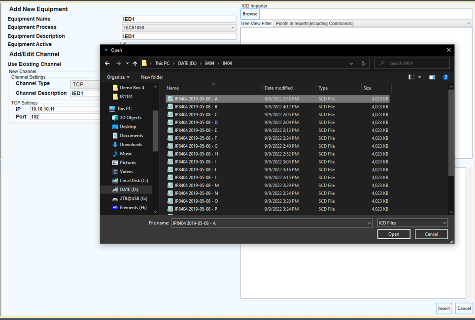

Choose, individually, the addresses to be imported. We recommend choosing addresses that are in the datasets associated with the event reports at the FDI level. To do this, choose the option "Points in reports (including commands) in the .scl file import module. Select the desired addresses and press the Insert button.

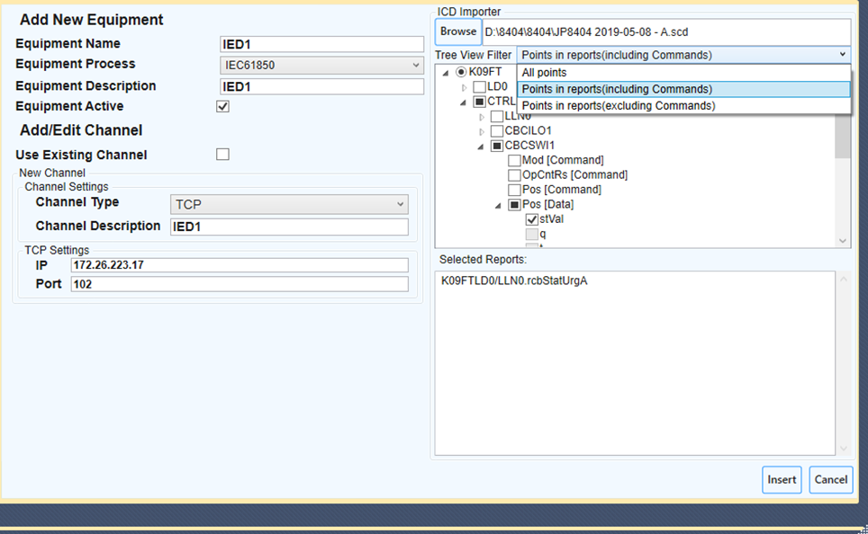

### 5.3.2. General configuration of the IED connection

After adding a new IED and configuring as described above, we will have the general TCP channel level information available for editing with the IED. From this window the IP and port of the equipment connection can be changed.

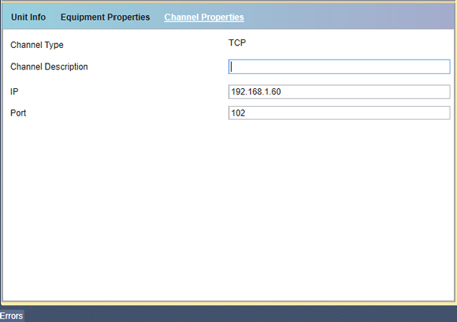

The general IED communication parameters for the IEC61850-8 (MMS) connection are configured from the window below. In the EguipmentName field fill in the IED name usually set using the IED configuration sw. Incorrectly filling in the IED name (EquipmentName) will not allow the communication link between the IEC 61850 client in the ES200 and the IED (acting as a server in the IEC 61850 standard architecture).

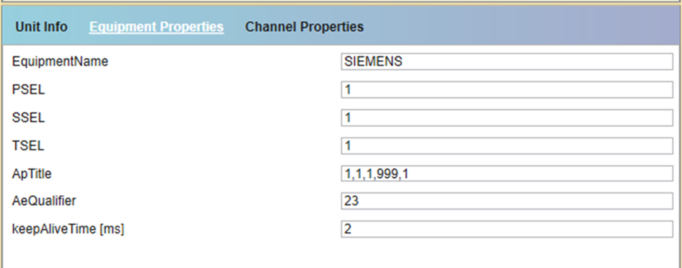

We recommend keeping the default values for the other (MMS connection specific) parameters in this window.

### 5.3.3. Digital and analogue size editing

In the Measurements section we will find the digital and analogue state quantities imported according to the procedure in 5.3.1. They can be edited and new entities can be added manually according to the procedure in 4.2.3.

The structure of a status address according to IEC61850 is as follows:
* IED nameLogical Device/Logical Node.Data Object.Data Attribute (ex:SIEMENSCTRL/CSWI1.Pos.stVal)
* The fields in the Measurements section have the following meaning:
  * Address - Internal address of the Analog or Digital information. This address is not related to specific IEC 61850 protocol addresses and is used for internal use. When adding an entity manually, it is not allowed to duplicate this address
  * Description - Detailed description of the retrieved entity - for internal use (e.g. Phase A current value)
  * Variable Name - Fill in a unique TAG for each signal. This TAG will be the internal identifier for that signal and will be used in the saved processes and for the realization of automation logic
  * AddressName - IEC61850 protocol address of the entity to be monitored
  * Poll Interval - In case a quantity is not part of the data sets associated with the event reports due to the IED not being configured correctly, there is the possibility to retrieve its status by repeated polling at a time interval set by this parameter

### 5.3.4. Editing commands

The Controls section contains the controls imported according to the procedure in point 5.3.1. They can be edited and new entities can be added manually according to the procedure in point 4.2.3.

The structure of a status address according to IEC61850 is as follows:
* IED nameLogical Device/Logical Node.Data Object (e.g. SIEMENSCB1/CSWI1.Pos)
* The fields in the Controls section have the following meaning:
  * Address - Internal address of the Control information type. This address is not related to IEC 61850 protocol specific addresses and is used for internal use. When adding an entity manually, duplication of this address is not allowed
  * Description - Detailed description of the retrieved entity - for internal use (e.g. Switch command)
  * Variable Name - Fill in a unique TAG for each signal. This TAG will be the internal identifier for that signal and will be used in saved processes and for automation logic
  * AddressName - IEC61850 protocol address of the entity to be controlled

### 5.3.5. Reports editing IEC61850

In the case of adding an FDI (section 5.3.1) the reports are automatically added to the Reports section with the properties configured according to the .scd file.

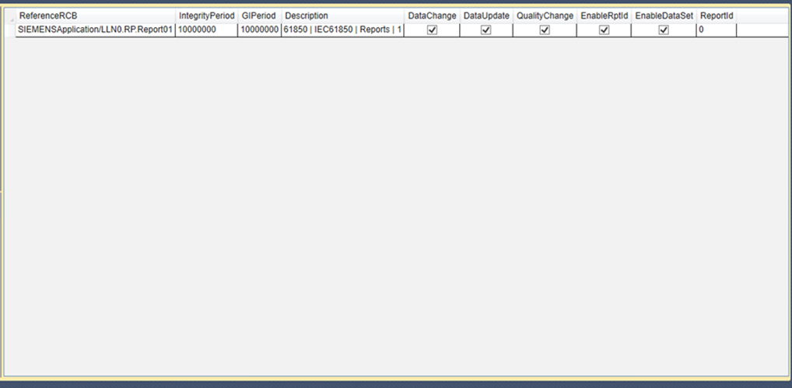

* ReferenceRCB - IEC61850 address of the report in question. This address is imported from the file. scl file and contains the data set in which all or part of the addresses in the Measurements section are contained
* IntegrityPeriod - Time interval set by the IEC61850 client in the IED, by which the periodicity of automatic report generation by the IED is configured, regardless of whether there are changes in the associated datasets
* GIPeriod - The time interval at which the IEDC61850 client in the ES200 sends a general query message to the IED concerned
* Description - Detailed description of the entity being retrieved - for internal use (e.g. Switching Equipment Report)
* DataChange - Trigger for generating a report. The principle used, if this trigger is activated, is to generate an event report on any change in the values of the entity states in the data set associated with the report
* DataUpdate - Trigger for generating a report. The principle used, if this trigger is activated, is the generation of an event report on any internal FDI update of entity information in the report's associated dataset
* QualityChange - Trigger for generating a report. The principle used, if this trigger is activated, is the generation of an event report on any change in the quality elements of the information associated with the entities in the dataset associated with the report
* EnableRpID - Enables the report identifier submission mechanism to be enabled as part of the report generation mechanism by the IED. We recommend enabling this property
* EnableDataSet - Enables the mechanism for the data set name associated with a report to be part of the general information associated with the report when the report is generated by the IED
* ReportID - The default value is 0. We recommend using this value

## 5.4. IEC 61850 Ed2
### 5.4.1. General configuration of the communication channel

Adding a new IED that will communicate using the IEC-61850 Ed2 communication protocol requires a different procedure than adding IEDs on Modbus, DNP3 and IEC104 protocols.

The IEC61850 Ed2 client configuration procedure allows the import of addresses (which are in the form of strings) from SCL files that have a content formatted according to the IEC 61850 standard regulations.These files are usually created with the IED configuration sw and are exported in some standard .cid, .icd, .scd, .iid formats.

After adding a new IED, setting the IED name and connection IP (port is usually 102 on IEC61850 Ed2) press the Browse button and choose the .scl file with the description of the IED addresses in question.

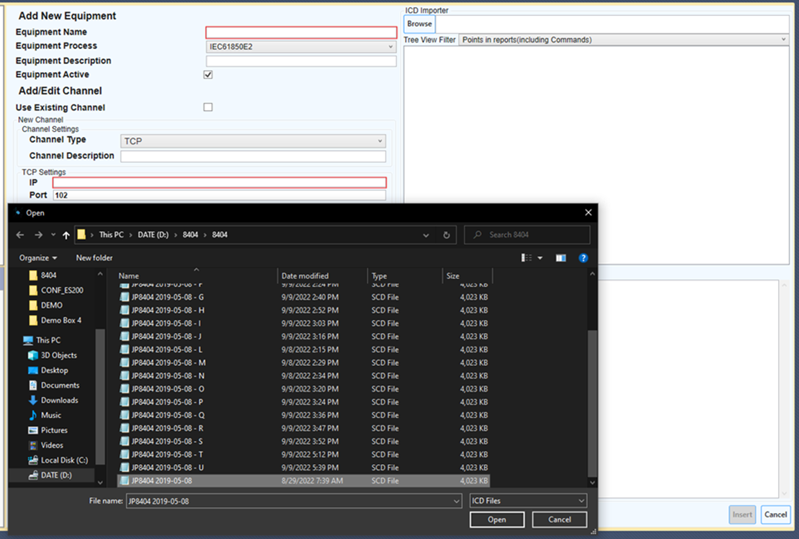

Choose, individually, the addresses to be imported. We recommend choosing addresses that are in the datasets associated with the event reports at the FDI level. To do this, choose the option "Points in reports (including commands) from the .scl file import module. Select the desired addresses and press the Insert button.

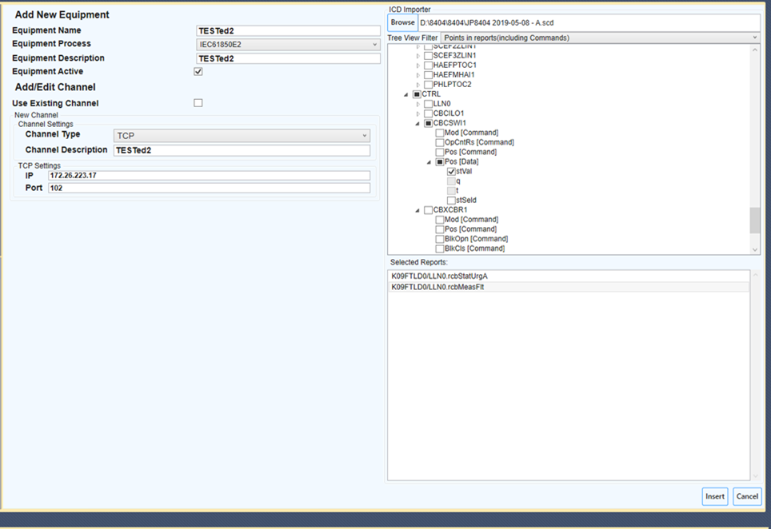

### 5.4.2. General RTU configuration

After adding a new IED and configuring as described above, we will have the general TCP channel level information available for editing with the IED. From this window the IP and port of the equipment connection can be changed.
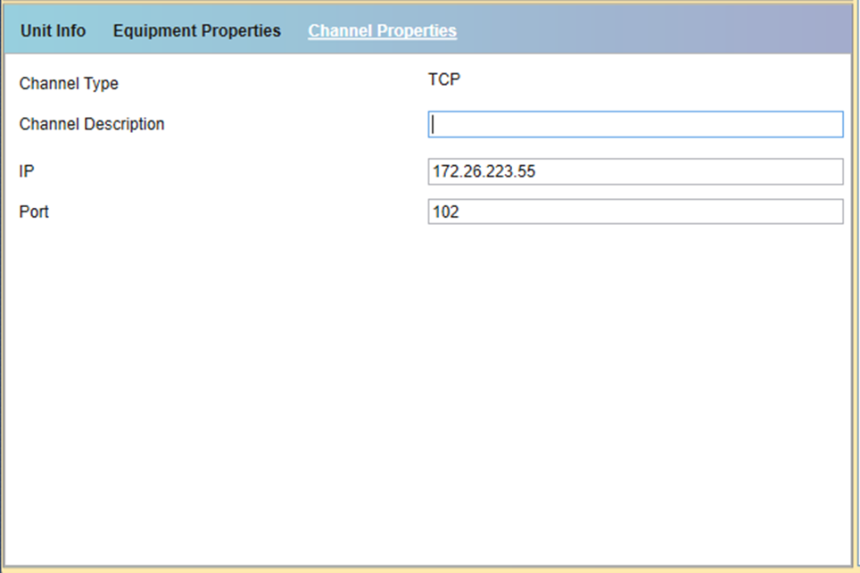

The general IED communication parameters for the IEC61850-8 Ed2 (MMS) connection are configured from the window below. In the EguipmentName field fill in the IED name usually set using the IED configuration sw. Incorrectly filling in the IED name (EquipmentName) will not allow the communication link between the IEC 61850 client in the ES200 and the IED (acting as a server in the IEC 61850 standard architecture).

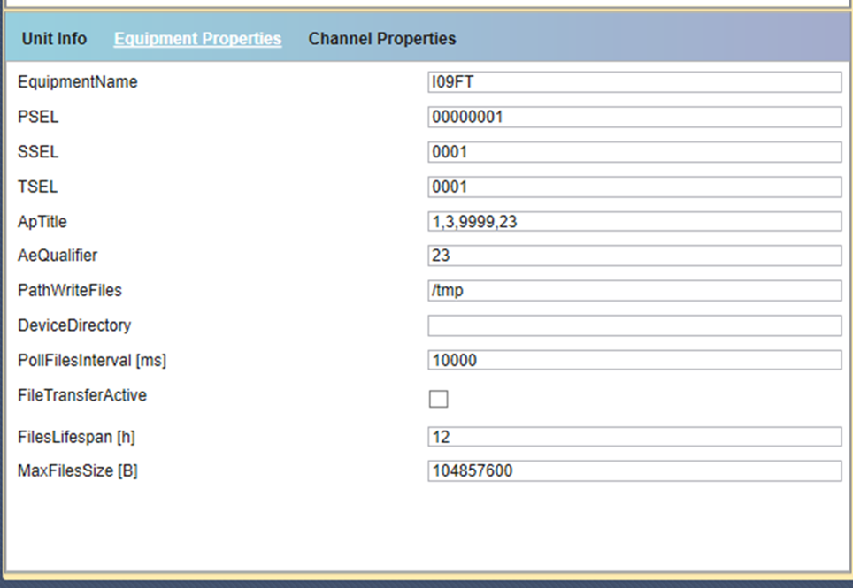

We recommend keeping the following default values (specific to the MMS connection) in this window:

* PSEL
* SSEL
* TSEL
* ApTitle
* AeQualifier

The IEC 61850 ed2 client in the ES200 allows automatic extraction of oscillogram files (COMTRADE standard format). The operation is based on the file transfer service implemented by the IEC 61850 standard.

To set up the automatic extraction mechanism of the record files (osilograms) it is necessary to configure the following parameters:
* PathWriteFiles - the path of the directory where the oscillogram files will be saved
* DeviceDirectory - path to the directory in the IED structure where the oscillograms will be saved
* PollFielsInterval - the time interval at which new record files (oscillograms) are checked for occurrence in the directory of the IED set in the previous step
* FileTransferActive - activation of the automatic oscillogram extraction mechanism
* FileLifeSpan - time period (h) after the files downloaded from the IED are deleted from the HW platform where the ES200 runs
* MaxFileSize - The maximum allowed size (in bytes) for downloaded record files. This must be less than 104857600 and greater than 0.

### 5.4.3. Digital and analogue size editing

In the Measurements section we will find the digital and analogue state quantities imported according to the procedure in 5.4.1. They can be edited and new entities can be added manually according to the procedure in 4.2.3.

The structure of a status address according to IEC61850 is as follows:

* IED nameLogical Device/Logical Node.Data Object.Data Attribute (e.g.:SIEMENSCTRL/CSWI1.Pos.stVal)
* The fields in the Measurements section have the following meaning:
  * Address - Internal address of the Analog or Digital information. This address is not related to specific IEC 61850 protocol addresses and is used for internal use. When adding an entity manually, duplication of this address is not allowed
  * Description - Detailed description of the retrieved entity - for internal use (e.g. Phase A current value)
  * Variable Name - A unique TAG is filled in for each signal. This TAG will be the internal identifier for that signal and will be used in saved processes and for the realization of automation logic
  * AddressName - IEC61850 protocol address of the entity to be monitored
  * Poll Interval - In case a quantity is not part of the data sets associated with the event reports due to the non compliant configuration of the FDI, there is the possibility to retrieve its status by repeated queries at a time interval set by this parameter
  * TriggerDownload - Enabling this parameter associated with an entity allows the automatic extraction from the IED of the oscilloperturbogram (COMTRADE) log files when the status of that entity changes

### 5.4.4. Editing commands

The Controls section contains the imported commands according to the procedure in point 5.4.1. They can be edited (AddressName field) and new entities can be added manually according to the procedure in point 4.2.3.

The structure of a status address according to IEC61850 is as follows:
* IED nameLogical Device/Logical Node.Data Object (e.g. SIEMENSCB1/CSWI1.Pos)
* The fields in the Controls section have the following meaning:
  * Address - Internal address of the Control information type. This address is not related to IEC 61850 protocol specific addresses and is used for internal use. When adding an entity manually, duplication of this address is not allowed
  * Description - Detailed description of the retrieved entity - for internal use (e.g. Switch command)
  * Variable Name - Fill in a unique TAG for each signal. This TAG will be the internal identifier for that signal and will be used in the saved processes and for the realization of automation logic
  * AddressName - IEC61850 protocol address of the entity to be controlled
  * OriginCategory - indicates the source of the command. We recommend using the option - Remote Control

### 5.4.5. Editing reports

In case of adding an FDI (section 5.4.1) the reports are automatically added to the Reports section with the properties configured according to the .scl file.

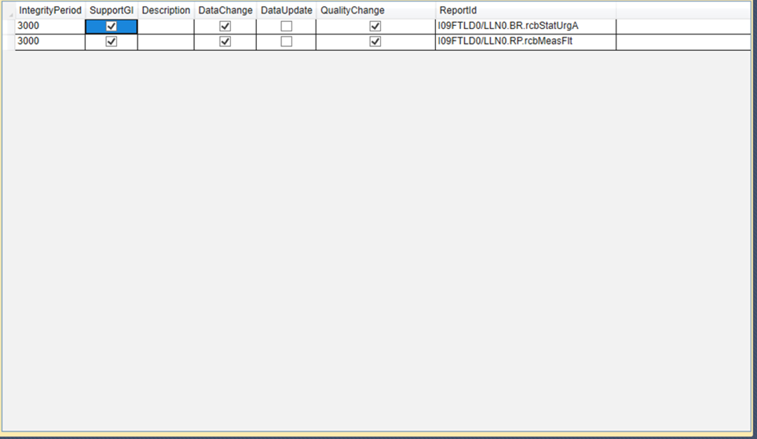

* IntegrityPeriod - Time interval set by the IEC61850 client in the IED, which sets the periodicity of automatic report generation by the IED regardless of whether there are changes in the associated data sets
* GIPeriod - Activates the mechanism by which the IEC61850 ed2 client in the ES200 sends a general query message to "read" the report content from the IED in question
* Description - Detailed description of the entity being retrieved - for internal use (e.g. Switching Equipment Report)
* DataChange - Trigger for generating a report. The principle used, if this trigger is activated, is the generation of an event report on any change of the entity state values in the data set associated with the report
* DataUpdate - Trigger for generating a report. The principle used, if this trigger is activated, is to generate an event report on any internal FDI update of the entity information in the dataset associated with the report
* QualityChange - Trigger for generating a report. The principle used, if this trigger is activated, is to generate an event report on any change in the quality information elements associated with the entities in the dataset associated with the report
* ReportID - IEC61850 address of the report in question. This address is imported from the file. scl file and contains the dataset in which some or all of the addresses in the Measurements section are contained

Warning!!! Automatic import may result in incomplete addition of the report address - sometimes the report type (buffer - BR or unbuffer - RP may be missing from the address).

The address of a report on IEC61850 has the following structure:
* IED nameLogical Device/LLN0.type"_raport(BR orRP).DO (e.g. I09FTLD0/LLN0.BR.rcbStatUrgA)

## 5.5. IEC-60870-5-104
### 5.5.1. General Configuration of the Communication Channel
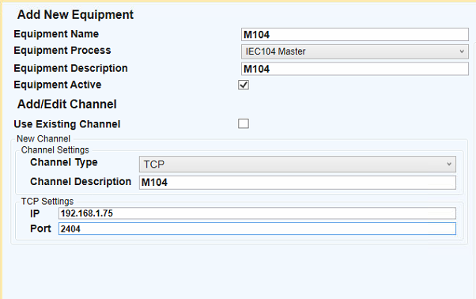

After adding a new IED and configuring it according to the description in section #4.2, the following information will be available for editing.

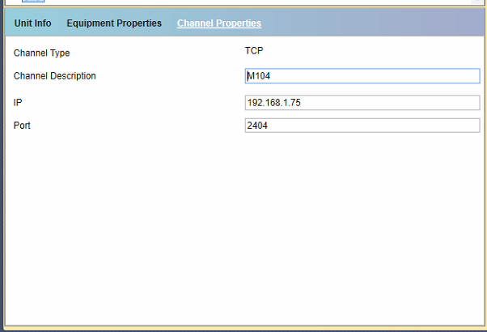

Channel Description - the name of the communication channel. It does not affect communication with devices and helps organize information.

IP: IP address of the equipment;

Port: the TCP port through which communication is established (for IEC-60870-5-104, the most commonly used port is #2404).

### 5.5.2. General Configuration of the RTU
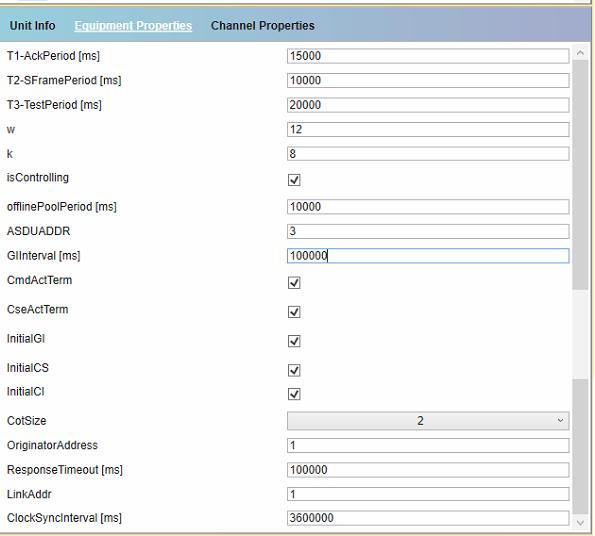

T1-AckPeriod [ms] - the waiting time interval for a confirmation response from the IED (slave) of IEC104. After this interval expires without receiving an IEC-104 packet from the communication slave, the communication link is interrupted;

T2-SFramePeriod [ms] - the time interval, after receiving the last IEC-104 packet from the slave, after which a confirmation message is issued to the slave by the ES200;

T3-TestPeriod [ms] – the time interval at which test connection frames are issued by the master to the IED (slave);

k - the number of IEC-104 packets that ES200 sends to the communication slave before waiting for a confirmation response;

w - the number of packets that ES200 receives from the communication slave before issuing a confirmation response;

isControlling – a parameter that configures the behavior of the IEC-104 master to initiate/stop communication with the IEC-104 slave at the application level using STARTDT and STOPDT frames.

offlinePoolPeriod [ms] - The time after which an attempt to reconnect via the protocol is made after a communication interruption;

ASDUADDR – the common address of the IED (slave) on the IEC-104 protocol

GIInterval – the time interval at which a general interrogation message is issued to the IED

CmdActTerm – the parameter indicates the use of the ACTERM mechanism in the case of issuing commands to the slave. If this parameter is activated, it is expected that after activating a command, the slave will send a response containing ACTERM.

CseActTerm - the parameter indicates the use of the ACTERM mechanism in the case of issuing setpoint commands to the slave. If this parameter is activated, it is expected that after activating a setpoint command, the slave will send a response containing ACTERM.

InitialGI – activation of the mechanism to send a general interrogation command to the slave after initializing communication;

InitialCS - activation of the mechanism to send a time synchronization command to the slave after initializing communication;

InitialCI - activation of the mechanism to send a counter interrogation command (accumulators) to the slave after initializing communication

CotSize – the size in bytes of the COT (cause of transmission) reserved section in ASDU. The recommended value is 2;

OriginatorAddress – the initiator's address. Will be filled with the value 1.

ResponseTimeout(ms) – the time interval in which a command issued by the master must be received and executed by the slave, which will send an ACK (validation) message;

LinkAddr – the link address. Will be filled with the value 1.

ClockSyncInterval (ms) – the time interval at which a time synchronization command will be transmitted from the master to the slave. Time synchronization commands can be issued even if there are significant time differences between master and slave.

### 5.5.3. Adding Simple Digital or Double Type Sizes or Analog Sizes
Sections Single-Point Information (SPI) and Double-Point Information (DPI) are used for binary and double entities, and sections Normalized, Scaled, and Short-Floating for analog-sized entities.

The IEC-60870-5-104 protocol allows the use of 2 types of status sizes - binary and double. Double-sized entities are used for transmitting and monitoring the state of switching equipment. Switching equipment (disconnectors, breakers) has 4 states that need to be monitored - intermediate (value 0), open/disconnected (value 1), closed/connected (value 2), faulty (value 3).

ASDU specific to analog sizes defined by the IEC-60870-5-104 standard and implemented by the IEC-104 master in ES200 are: M_ME_NA (Normalized), M_ME_NB (Scaled), and M_ME_NC (Short Floating).

Address – The address of the SPI, DPI, Normalized, Scaled, or Short Floating information to be retrieved from the IED. The address map can be created by configuring the IED with specific configuration software or in the technical documentation of the IED.

Description – Detailed description of the retrieved entity - for internal use (e.g., Maximum protection function level 1).

Variable Name – A unique TAG is filled in for each signal. This TAG will be the internal identifier for the respective signal and will be used in ES200 slave processes and for implementing automation logics.

HasTimeTag – the parameter indicates whether the size to be retrieved from the IED is accompanied by the IED's time tag, or this will be associated with the entity by the ES200.

### 5.5.4. Adding Commands
Sections Single-Point Command and Double-Point Command are used, depending on the type of commands to be transmitted to the IEDs.

The IEC-60870-5-104 protocol implemented by ES200 allows the use of 2 types of commands - binary and double. Double commands can be used for controlling switching equipment if the IED requires the use of these commands. The types of commands configured in the master (ES200) must be identical to those configured in the IED for them to work.

Address – The address of the command information to be transmitted to the slave. In the IED, the presence of an identical address is required to receive the command by ES200;

CmdMode - represents the command mode - With Select (Select Before Operate), Without Select (Direct Operate). In case the control model set in the IED is not known, the Any option is used;

CmdQualifier - represents the command qualifier property. Possible values for this field - Default, Short pulse, Long pulse, Persistent. The type of command qualifier must be identical to that of the equivalent command in the IED (slave). In case the control model set in the IED is not known, the Any option is used. This field is not used for setpoint-type commands.

## 5.6. MQTT
### 5.6.1. General Configuration of the Communication Channel

After adding a new IED and configuring it according to the description in section #4.2, the following information will be available for editing.

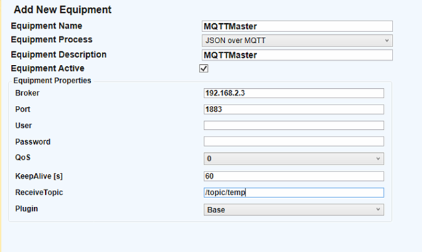

**#Equipment Name** - the name of the MQTT communication master. It does not affect communication with devices and helps organize information;

**#Equipment Description** - the name of the MQTT communication master. It does not affect communication with devices and helps organize information.

**#Broker** : IP address of the MQTT broker. In case ES200 has an installed MQTT broker, set its internal IP address. If using a CISCO device with IoS/IoX OS running an MQTT broker, the address is usually set to 192.168.2.3;

**#Port** : the TCP port for MQTT communication with MQTT clients (1883);

#User&Pass – username and password for the MQTT broker if credentials are set;

#QoS – quality of service for MQTT – the level of certainty for message delivery. This parameter must be set identically on both communication partners. We recommend using the value 0 – the client does not wait for acknowledgment of receipt from the recipient;

#KeepAlive – the waiting time for a response from the broker before considering the connection to be interrupted;

#ReceiveTopic – Description of the client's topic through which data is received;

#Plugin – different types of custom MQTT implementations can be used (Sparkplug, Veribox, or default).

### 5.6.2. Adding Simple Digital Sizes (Boolean Sizes)

These are completed in the **Json Boolean** section of the MQTT Master in the Dashboard.

**#Address**  – The internal address of the information taken through MQTT in ES200. This identifier is NOT the specific MQTT protocol address; it is only used for internal ES200 processes. Changing these does not affect the retrieval in ES200 from MQTT clients (sensors, etc.) of the desired information;

**#Description** – Detailed description of the retrieved entity - for internal use (e.g., Maximum protection function level 1).

**#Variable Name** – A unique TAG is filled in for each signal. This TAG will be the internal identifier for the respective signal and will be used in ES200 slave processes and for implementing automation logics.

**#JSONPointer **– can be associated with the MQTT protocol address and is in the form of a string formatted like /PT/sensorX/context (e.g., /PT10/sensor1/contact1)

### 5.6.3. Adding Analog Sizes (Numeric)

These are completed in the **Json Numeric** section of the MQTT Master in the Dashboard.

**#Address**  – The internal address of the information taken through MQTT in ES200. This identifier is NOT the specific MQTT protocol address; it is only used for internal ES200 processes. Changing these does not affect the retrieval in ES200 from MQTT clients (sensors, etc.) of the desired information;

**#Description** – Detailed description of the retrieved entity - for internal use (e.g., Maximum protection function level 1).

**#Variable Name** – A unique TAG is filled in for each signal. This TAG will be the internal identifier for the respective signal and will be used in ES200 slave processes and for implementing automation logics.

**#JSONPointer **– is associated with the MQTT protocol address and is in the form of a string formatted like /PT/sensorX/temperature (e.g., /PT10/sensor1/temperature).

## 5.7. IEC-60870-5-101
### 5.7.1. General Configuration of the Communication Channel

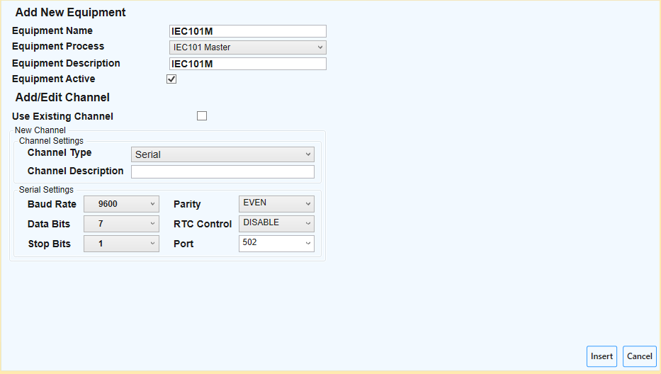

The general configuration parameters for an IEC-101 Master in ES200 are:

**#Equipment Name** - the name of the IEC-101 communication master. It does not affect communication with devices, helping organize information;

**#Equipment Description** - a general description of the IEC-101 communication master. It does not affect communication with devices, helping organize information.

**#Channel Description** - the name of the communication channel. It is used for debugging IEC-101 communication and does not affect communication with devices, helping organize information.

IEC-60870-5-101 is a protocol that uses serial communication lines (RS232, RS485).

General communication parameters will also include specific settings for serial communication (used serial port, Baud Rate, Parity, etc.).

BAUDRATE – connection speed (measured in bits/second);

DATABITS – the number of bits in a character;

STOPBITS – the number of bits used to identify the end of a character;

PARITY – a method used for error detection in communication;

RTSCONTROL – a method used to ensure that the transmission speed is not higher than the speed at which the receiver can process received data;

**Port:** The serial port used by ES200 for communication with the slave device. Depending on the HW platform used, it may have specific descriptions for the Linux file system.

  * /dev/ttyS1 (IR809)
  * /dev/ttyS2 (IR809)
  * /dev/ttyTun0 (IR1101)
  * /dev/ttySerial (IR1101)

After adding a new IED and configuring it according to the description in section #4.2, the following information will be available for editing.

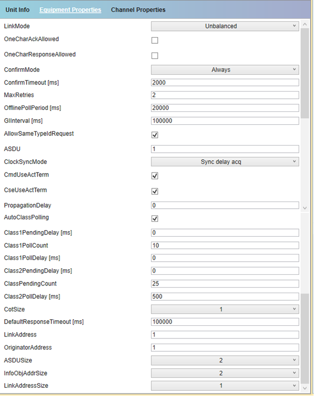

LinkMode – ES200 always uses the Unbalanced option. It is used for communication on RS485 serial lines to which multiple IEC-101 slave devices can be connected;

OneCharAckAllowed – an option that will not be used and will be deactivated. Activation allows confirmation responses for messages received from IEC-101 slaves to be sent as a single character;

OneCharResponseAllowed - an option that will not be used and will be deactivated. Activation allows the use and interpretation of confirmation responses received from IEC-101 slaves as a single character;

ConfirmMode – will always be set to ALWASY;

ConfirmTimeout – the waiting time for a response from the IEC-101 slave after transmitting a link status verification message by the IEC-101 master in ES200;

MaxRetries – the maximum number of retries for sending link status verification messages from the ES200 master to the slave if no confirmation response is received within the time set by the ConfirmTimeout parameter;

OfflinePollPeriod – specifies the interval at which communication with an IEC-101 slave is attempted to be restored by the IEC-101 master in ES200;

GIInterval - the interval at which a general interrogation message is sent to the IED;

AllowSameTypeIdRequest - an option that will not be used and will be deactivated. Activation allows sending the same commands to different sectors of an IEC-101 slave (if the 101 slave supports the use of multiple sectors differentiated by the common ASDU address);

ASDU - the common address of the IED (slave) integrated into ES200 using the IEC-101 protocol;

ClockSyncMode – the option SYNC_ONLY will be used. For time synchronization, correction time intervals for the time tag can be added to increase accuracy. These intervals depend on the communication delays that may occur on serial communication lines;

PropagationDelay – the parameter will always be set to 0. This parameter represents the correction interval for the time synchronization mechanism in case the ClockSyncMode parameter is set to Sync Load Delay.

**CmdActTerm** – the parameter indicates the use of the ACTERM mechanism when issuing commands to the slave. If this parameter is activated, it is expected that, after activating a command, the slave will send a response containing ACTERM.

**CseActTerm** - the parameter indicates the use of the ACTERM mechanism when issuing setpoint-type commands to the slave. If this parameter is activated, it is expected that, after activating a setpoint-type command, the slave will send a response containing ACTERM.

AutoClassPolling – activation of the general interrogation mechanism for state entities in Class 1 and 2;

Class1PendingDelay – the waiting time interval for Class 1 events sent by the slave;

Class1PollCount – the maximum number of interrogation requests for Class 1 events for a slave before moving on to the next slave on the RS485 communication bus;

Class1PollDelay - the time interval between queries for Class 1 events sent to the slave;

Class2PendingDelay - the waiting time interval for Class 2 events sent by the slave;

Class2PollDelay - the time interval between queries for Class 2 events sent to the slave;

ClassPendingCount - the maximum number of interrogation requests for all events (Class 1 and 2) for a slave before moving on to the next slave on the RS485 communication bus;

DefaultResponseTimeout – the maximum time allowed for the execution of a command and the receipt of execution confirmation from the IEC-101 slave;

CotSize - the size in bytes of the section reserved for COT (cause of transmission) in ASDU;

LinkAddress – the link level address of the slave integrated into ES200. IEC-101 implements the link level (Link Layer in the OSI stack);

OriginatorAddress – the sector address in IEC-101 of the integrated slave from which communication is initiated. It is represented by an octet in the section where we find COT (Cause of Transmission).

ASDUSize – the size in bytes of the common address in ASDU;

InfoObjAddrSize - the size in bytes of the IOA (Information Object Address) in ASDU;

LinkAddressSize - the size in bytes of the link level address.

### 5.7.2. Adding Digital and Analog Status Entities

Use the sections **Single-Point Information (SPI) and Double-Point Information (DPI)** for binary and double entities and the sections Normalized, Scaled, and Short-Floating for analog entities.

The IEC-60870-5-101 protocol allows the use of 2 types of status entities - binary and double. Double-sized entities are used for transmitting and monitoring the state of switching equipment. Switching equipment (disconnectors, circuit breakers) has 4 states that need to be monitored - intermediate (value 0), open/disconnected (value 1), closed/connected (value 2), defective (value 3).

ASDU specific to analog entities defined by the IEC-60870-5-101 standard and implemented by the IEC-101 Master in ES200 are: M_ME_NA (Normalized), M_ME_NB (Scaled), and M_ME_NC(Short Floating).

**#Address**  – The address of the SPI, DPI, Normalized, Scaled, or Short Floating information to be retrieved from the IED. The address map can be created by configuring the IED with specific configuration software or in the technical documentation of the IED.

**#Description** – Detailed description of the retrieved entity - for internal use (e.g., Maximum protection function level 1).

**#Variable Name** – Fill in a unique TAG for each signal. This TAG will be the internal identifier for the respective signal and will be used in ES200 slave processes and for implementing automation logics.

**#HasTimeTag** – the parameter indicates whether the size to be retrieved from the IED is accompanied by the IED time tag, or this will be associated with the entity by ES200.

### 5.7.3. Adding Commands

Use the sections Single-Point Command and Double-Point Command, depending on the type of commands to be transmitted to IEDs.

The IEC-60870-5-101 protocol implemented by ES200 allows the use of 2 types of commands - binary and double. Double-type commands can be used to control switching equipment if the IED requires the use of these commands. The types of commands configured in the master (ES200) must be identical to those configured in the IED for them to work.

**#Address** – The address of the command-type information to be transmitted to the slave. In the IED, the presence of an identical address is required to receive the command from ES200;

**#CmdMode** - represents the command model - With Select (Select Before Operate), Without Select (Direct Operate). If the control model set in the IED is not known, the Any option is used;

**#CmdQualifier** - represents the qualifier property of the command. Possible values for this field - Default, Short pulse, Long pulse, Persistent. The type of command qualifier must be identical to that of the equivalent command from the IED (slave). If the control model set in the IED is not known, the Any option is used. **This field is not used for setpoint-type commands.**

# 6. Setting up communication with the command center
## 6.1. IEC 60870-5-104
### 6.1.1. General configuration of the communication channel

The window below configures the main properties of the TCP communication channel between the ES200 and the command center. The name of the control center (Equipment name) and its general description (EquipmenDescription) do not influence the specific communication characteristics of the IEC-69870-5-104 protocol.

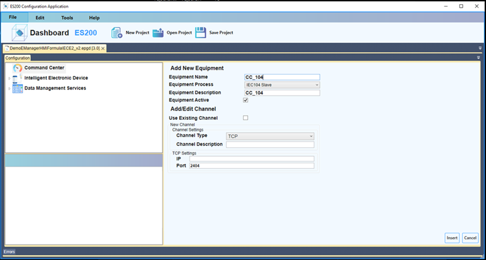

It is necessary to fill in the TCP port to be used. The completion of the IP address is not required for the connection to the command center. The IP address of the control center can be filled in this field if it is desired to ensure the exclusivity of the IEC-104 connection between the ES200 and the control center with the IP address in question.

After adding a new command center and configuring as described in section 4.2.1, we will have the information below available for editing where:
* Channel Description - the name of the communication channel. Does not affect communication with devices helping to organize information.
* IP : IP address of the command center - we recommend that this field remains blank. The IP address of the control center can be filled in this field if it is desired to ensure the exclusivity of the IEC-104 connection between the ES200 and the control center having the IP address in question.
* Port : the TCP port through which the TCP/IP communication with the equipment is made (for IEC-104 the most used port is 2404).

### 6.1.2. General configuration of CC

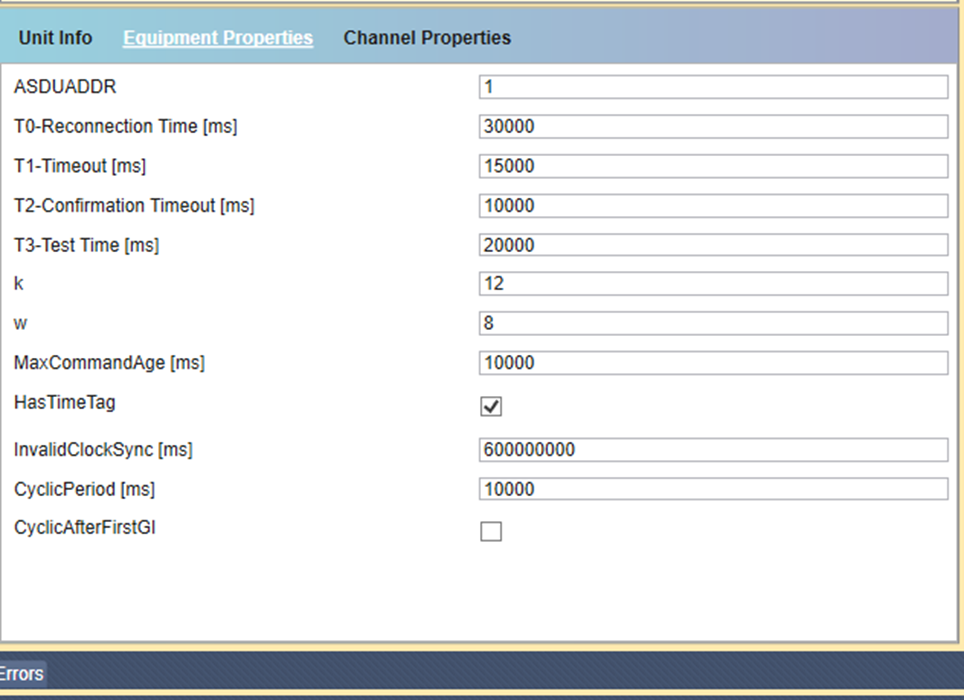

* ASDUADDR - common address of the ASDU (Application service data unit). This address must BE identical to the address set in the command center (IEC-104 communication master) for initiating application level communication on this protocol. Note that the ASDU size is 2 bytes and the IOA size is 3 bytes
* k - the number of IEC-104 packets the es200 sends to the communication master before waiting for an acknowledgement response
* w - the number of packets the es200 receives from the communication master before issuing an acknowledgement response
* T0 - Reconnection Time (ms)- The time after which a reconnection is attempted on the protocol after a communication interruption
* T1 - Time interval to wait for an acknowledgement response from the IEC104 master. After this time has elapsed without receipt of an IEC-104 packet from the communication master, the communication link is interrupted, and re-establishment is attempted after the T0 time
* T2 - the time interval after the last IEC-104 packet has been received from the master, after which an acknowledgement message is sent by the es200 to the master
* MaxCommandAge [ms] - the time interval during which the command issued by the master is stored in the es200 memory and can be executed. The command is considered to be executed if it could be transmitted and executed by the IED
* HasTimeTag - setting this parameter causes binary and double status flags sent to the master to be accompanied by the time tag
* InvalidClockSync [ms] - After expiry of this time interval, the time tag associated with the IEC-104 salvo becomes invalid and a new time synchronization request (ASDU type 103) must be issued by the master. If time synchronization is done periodically by the master card, the master synchronization time interval must be less than this parameter
* CyclicPeriod [ms] - General interval representing the period used to send quantities with cyclic set as transmission mode. The other modes for sending magnitudes as an event are a change in jitter or validity
* CyclicAfterGi - if this parameter is set, the es200 will no longer send to the master sizes with cyclic transmission mode set (in the table corresponding to the size type) cyclic requests before the first general query request issued by the master

### 6.1.3. Adding digital sizes

Single-Point Information and Double-Point Information sections are used, depending on the type of information to be transmitted to the command center.

The IEC-60870-5-104 protocol allows the use of 2 types of status sizes - binary and double. Double type sizes are used for transmission and monitoring of switchgear status. Switching equipment (splitters, circuit breakers) have 4 states required to be monitored - intermediate (value 0), open/disconnected (value 1), closed/connected (value 2), fault ( value 3).

The entities whose state is to be sent to the command center are those taken from the IEDs and will be chosen from the list available in the Master Variable Name section. The name of the IED from which the information is retrieved is automatically filled in after the choice of the entity.

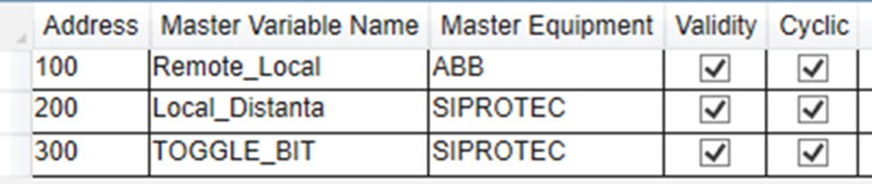

* Address - Address of the Binary input information to be sent to the command center. In the command center it is necessary to add an identical address for receiving the entity state
* Validity - Enabling this option allows the IEC-104 slave process in the ES200 to initiate the sending of an event to the command centre when the quality of the monitored entity information changes
* Cyclic - Enabling this option allows the IEC-104 slave process in the ES200 to initiate the cyclic sending, with the periodicity set by the CyclicPeriod parameter (paragraph 6.1.2), of the status and quality information related to the entity in question. We do not recommend using this option, as IEC-104 is a protocol based on spontaneous transmission of status changes in the form of events.

### 6.1.4. Adding analogue sizes

Normalized, Scaled, Short Floating sections are used depending on the type of analogue size information to be transmitted to the control center.

The IEC-60870-5-104 protocol allows the use of 3 types of analogue quantities - Normalized, Scaled, Short Floating. For the ES200 we currently use the Short Floating data type.

The analog quantities whose status is to be sent to the control center are those taken from the IEDs and will be chosen from the list available in the Master Variable Name section. The name of the IED from which the information is retrieved is automatically filled in after the choice of the entity.

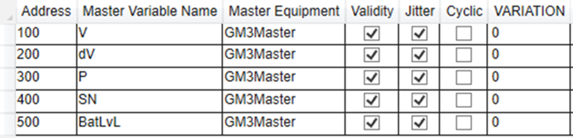

* Address - The address of the analogue size information to be transmitted to the command center. In the command center it is necessary to add an identical address for receiving the entity state
* Validity - Enabling this option allows the IEC-104 slave process in the ES200 to initiate the sending of an event to the command centre when the quality of the monitored entity information changes
* Jitter - Enabling this option allows the IEC-104 slave process in the ES200 to initiate the sending of the analog magnitude value to the command center when a certain settable threshold is exceeded. The mechanism allows that following a variation (+ or -) greater than a set value (Variation field) of the instantaneous value of the magnitude transmitted by the IED relative to the last value recorded by the ES200, an event containing the instantaneous value of the magnitude will be generated by the IEC-104 slave and sent to the command centre
* Variation - the value of the minimum threshold required to initiate the procedure for the transmission of the value of the analogue quantity in question by the ES200 to the command center. A variation greater than the value set in this field of the instantaneous value of the measurement transmitted by the IED relative to its last reading generates an event and will be sent to the command center
* Cyclic - Enabling this option allows the IEC-104 slave process in the ES200 to initiate the cyclic sending, with the periodicity set by the CyclicPeriod parameter (paragraph 6.1.2 ), of status and quality information related to the entity in question. We do not recommend using this option, as IEC-104 is a protocol based on spontaneous transmission of status changes in the form of events

### 6.1.5. Adding commands

Single-Point Command and Double-Point Command sections are used, depending on the type of commands to be received from the command center and subsequently transmitted to the IEDs.The IEC-60870-5-104 protocol implemented by the ES200 allows the use of 2 types of commands - binary and double. Dual type commands can be used to control switching equipment if the dispatching platforms force the use of these commands. The types of commands configured in the command center must be identical to those configured in the ES200 for them to work.**

The commands to be received from the command center are what will be sent to the IEDs and will be chosen from the list available in the Master Variable Name section. The IED name from which the information is retrieved is automatically filled in after the choice of entities (Master Equipment).**

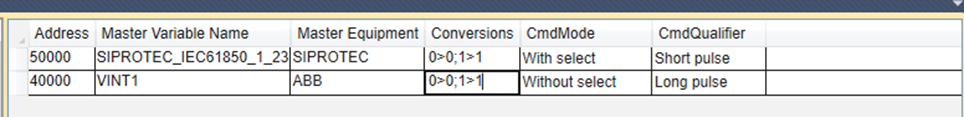

* Address - The address of the command type information to be transmitted by the command center. In the command center it is necessary to add an identical address for the reception of the command by the ES200
* Conversion - The value received from the command center on the IEC-104 address of the entity can be converted into another value to be sent on protocol down to the protection relays or PLCs in the PT. (e.g.: the value 1 is received on IEC-104, but the value 0 must be sent to the relay: 1>0 must be entered in the database)
* CmdMode - represents the control model - With Select (Select Before Operate), Without Select (Direct Operate). If the control model set in the dispatcher is not known, the Any option is used
* CmdQualifier - represents the qualifier property of the control. Possible values for this field - Default, Short pulse, Long pulse, Persistent. The command qualifier type must be identical to the equivalent command in the command center. If the control model set in the dispatcher is not known the Any option is used

## 6.2. Modbus

### 6.2.1. General configuration of the communication channel

The window below configures the main properties of the TCP communication channel between the ES200 and the command center. The control center name (Equipment name) and the general description of the control center (Equipment Description) do not influence the specific communication characteristics of the Modbus TCP protocol. It is necessary to fill in the TCP port to be used. The IP address is not required to connect to the control center. The IP address of the control center can be filled in this field if it is desired to ensure the exclusivity of the Modbus TCP connection between the ES200 and the control center having the IP address in question.

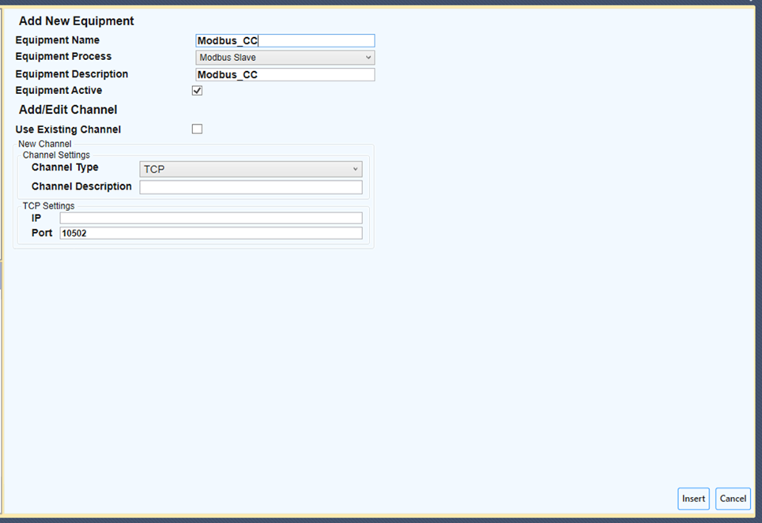

After adding a new command center and configuring as described in section 4.2.1, we will have the information below available for editing where:
* Channel Description - the name of the communication channel. Does not affect communication with devices helping to organize information
* IP : IP address of the command center - we recommend that this field remains blank. The IP address of the control center can be filled in this field if it is desired to ensure the exclusivity of the Modbus connection between the ES200 and the control center having the IP address in question
* Port : TCP port through which the TCP/IP communication with the equipment is made (for Modbus TCP the most used port is 10502).

### 6.2.2. General configuration of CC

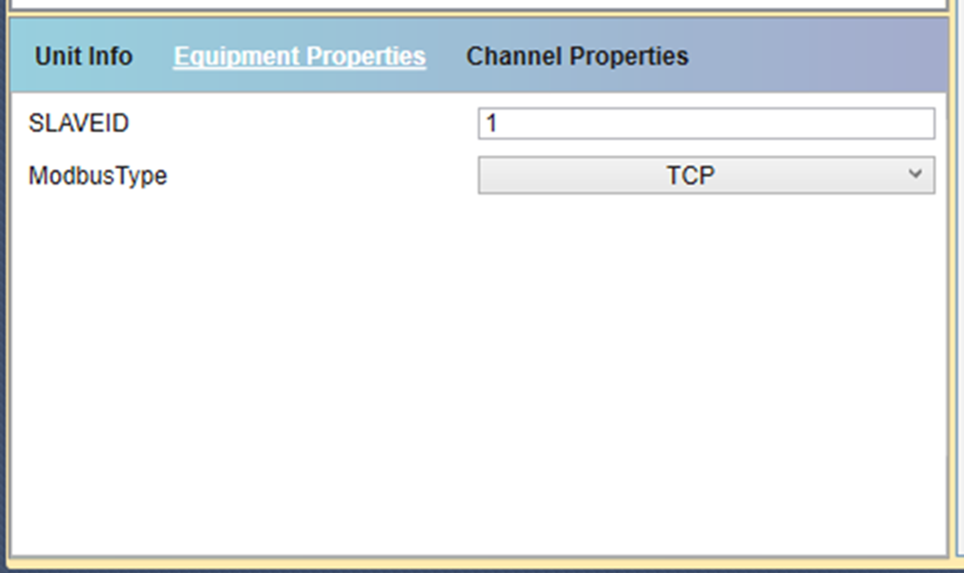

* SLAVEID - protocol address of the ES200 acting as a slave link to the master. This address must be identical to the address set in the command center (Modbus communication master) for initiating application level communication on this protocol
* ModbusType - The only accepted setting is TCP

### 6.2.3. Adding digital, analogue and command sizes

The entities whose status is to be sent to the command center are those taken from the IEDs and will be chosen from the list available in the Master Variable Name section. The IED name from which the information is retrieved is automatically filled in after the entity is chosen.

The commands to be received from the command center are those to be passed to the IEDs and will be chosen from the list available in the Master Variable Name section. The IED name from which the information is retrieved is automatically filled in after the choice of the entity (Master Equipment).

Address - Address of the entity to be transmitted to the command center. In the command center it is necessary to add an identical address for receiving the entity status. The same principle applies for commands.

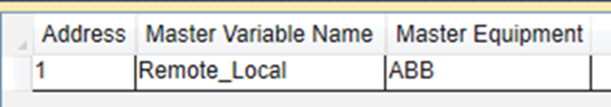

## 6.3. DNP3.0
### 6.3.1. General Configuration of the Communication Channel

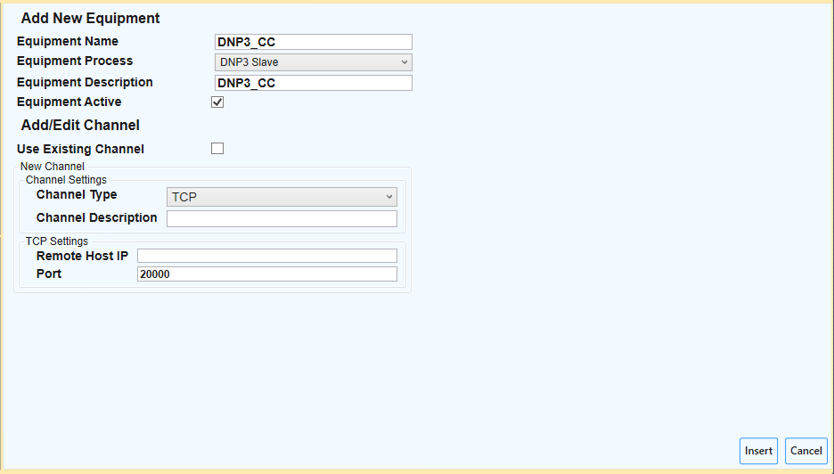

In the window above, the main properties of the TCP communication channel between ES200 and the control center are configured. The control center's name (Equipment Name) and its general description (Equipment Description) do not affect the communication characteristics specific to the DNP3 protocol.

It is necessary to complete the TCP port to be used. Completing the IP address is not required to establish a connection with the control center. The IP address of the control center can be filled in this field if exclusive connection on DNP3 between ES200 and the control center with that IP address is desired.

After adding a new control center and configuring it according to the description in section 4.2.1, the information below becomes available for editing:

**Channel Description** - the name of the communication channel. It does not affect communication with devices but helps organize information.

**IP**: IP address of the control center - it is recommended that this field remain blank. The IP address of the control center can be filled in this field if exclusive connection on DNP3 between ES200 and the control center with that IP address is desired.

**Port**: TCP port for TCP/IP communication with the equipment (for DNP3, the most commonly used port is 20000).

### 6.3.2. General Configuration of the RTU

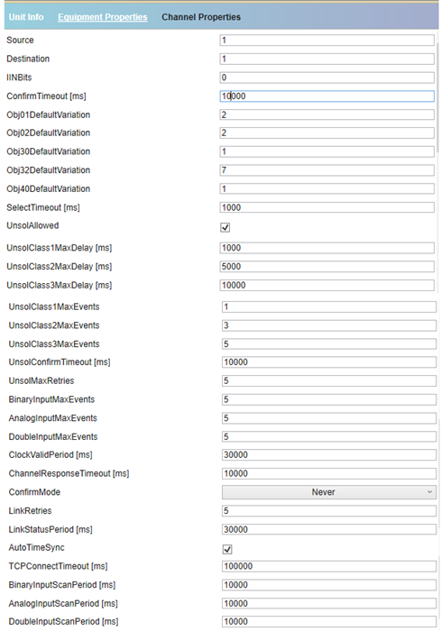

**Source** - represents the numeric ID of the master or control center in a DNP3.0 session, internal to the DNP3 protocol. It is necessary to set the source (master) address and destination address (outstation or slave) in devices communicating on DNP3.0;

**Destination** - represents the address of the slave (outstation) that will establish a communication link with the master or control center of DNP3.0 from ES200;

**IINBits** – internal status indicators can provide information about the state of the DNP slave (e.g., whether it is on local or remote, needs a new synchronization of a certain type, etc.). The recommended and used value is 0; these indicators are automatically generated by ES200 based on the situation.

**ConfirmTimeout (ms)** - the time interval that defines the waiting period for a response from the master after an application-level request sent by the slave. If no response is received from the master within this time interval, the communication channel will be closed by the DNP3 slave in ES200.

**Obj01DefaultVariation** – defines the type of variations that will be used for the DNP object of type 1 (Binary Input status). Accepted values are 0, 1, 2, with the recommendation to use variation 2. Obj01 is a DNP element used to transmit the status of a Binary Input element following a general query command (Integrity Poll) received from the Master;

**Obj02DefaultVariation** - defines the type of variations that will be used for the DNP object of type 2 (Binary Input event). Accepted values are 0, 1, 2, 3, with the recommendation to use variation 2. Obj02 is a DNP element used to transmit events of state change of a Binary Input element in the form of unsolicited messages;

**Obj30DefaultVariation** - defines the type of variations that will be used for the DNP object of type 30 (Analog Input status). Accepted values are 0-6, with the recommendation to use variation 3. Obj30 is a DNP element used to transmit the status of an Analog Input following a general query command (Integrity Poll) received from the Master;

**Obj32DefaultVariation** - defines the type of variations that will be used for the DNP object of type 30 (Analog Input status). Accepted values are 0-8, with the recommendation to use variation 7. Obj32 is a DNP element used to transmit events of state change of an Analog Input element in the form of unsolicited messages;

**Obj40DefaultVariation** - defines the type of variations that will be used for the DNP object of type 40 (Analog Output status). Accepted values are 0, 1, with the recommendation to use variation 1. Obj40 is a DNP element used to transmit the status of an Analog Output following a general query command (Integrity Poll) received from the Master;

**SelectTimeout (ms)** – in the case of using Select/Execute commands, the parameter represents the time after which the selection of the object is deactivated. Select/Execute commands involve the initial selection of the command object (Obj10) and then the actual execution of the command.

**UnsolAllowed** – the parameter enables/disables the mechanism for reporting DNP-specific event messages - unsolicited messages.

**UnsolClass1MaxDelay** - the time interval at which an unsolicited class 1 message will be generated and periodically sent to the Master, containing the states of all entities configured to be part of this class;

**UnsolClass2MaxDelay** - the time interval at which an unsolicited class 2 message will be generated and periodically sent to the Master, containing the states of all entities configured to be part of this class;

**UnsolClass3MaxDelay** - the time interval at which an unsolicited class 3 message will be generated and periodically sent to the Master, containing the states of all entities configured to be part of this class;

**UnsolClass1MaxEvents** – the number of state changes of entities configured to be part of Class 1 reports to generate and send such an unsolicited message to the Master;

**UnsolClass2MaxEvents** - the number of state changes of entities configured to be part of Class 2 reports to generate and send such an unsolicited message to the Master;

**UnsolClass3MaxEvents** - the number of state changes of entities configured to be part of Class 3 reports to generate and send such an unsolicited message to the Master;

**UnsolConfirmTimeout** – the maximum waiting time from sending an unsolicited message by the DNP slave in ES200 to receiving the acknowledgment message from the Master.

**UnsolMaxRetries** – the maximum number of attempts by the DNP slave in ES200 to resend an unsolicited message if no acknowledgment is received from the Master.

**BinaryInputMaxEvents** – the maximum number of Binary Input events that will be stored in the event buffer of the DNP3 slave in ES200 and will be sent upon restoring communication with the Master. Note that in case of interruption of communication between Master and Slave, events that occurred at the Slave level during this period will be stored in an event buffer and will be transmitted to the Master when the connection is restored;

**AnalogInputMaxEvents** - the maximum number of Analog Input events that will be stored in the event buffer of the D

NP3 slave in ES200 and will be sent upon restoring communication with the Master. Note that in case of interruption of communication between Master and Slave, events that occurred at the Slave level during this period will be stored in an event buffer and will be transmitted to the Master when the connection is restored;

**DoubleInputMaxEvents** – Not used;

**ClockValidPeriod** - After this time interval expires, the timestamp associated with the DNP3 slave in ES200 becomes invalid, one of the internal status indicators (IIN) changes, and a message is sent to the Master, requiring the Master to issue a new time synchronization message (Obj50);

**ChannelResponseTimeout** - represents the waiting time for a response to an application-level request that was transmitted;

**ConfirmMode** - allows setting the waiting mode for acknowledgment messages at the application level. Possible values are NEVER (acknowledgment only for unsolicited messages transmitted by the slave), SOMETIMES, ALWAYS (requires acknowledgment for all messages transmitted between master and slave). If the value NEVER is set, the link-level (LINK) verification mechanism configured by the LinkStatusPeriod, LinkRetries, and ConfirmTimeout parameters remains active. It is important that the equivalent parameter in the Master is set to the same value (NEVER, SOMETIMES, or ALWAYS) as in ES200.

**LinkRetries** – the maximum number of retries for sending link-level verification messages in case no acknowledgment is received from the master.

**LinkStatusPeriod** - the parameter that sets the periodicity of transmitting link status verification messages between the slave and master;

**AutoTimeSync** – activates the time synchronization mechanism of the DNP3 slave in ES200 by the Master in the control center;

**TCPConnectTimeout** – the type of waiting for establishing the TCP connection before it is closed by the slave in ES200;

### 6.3.3. Adding Digital, Analog, and Command Sizes

Entities whose status is desired to be sent to the control center are those taken from IEDs and will be chosen from the available list in the **Master Variable Name** section. The name of the IED from which the information is retrieved is automatically completed after selecting the entity. It is also necessary to complete the event class (1, 2, or 3) to generate unsolicited messages to the Master in the event of state changes of entities in the Binary Input and Analog Input sections.

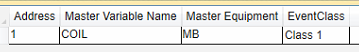

The commands to be received from the control center are those that will be transmitted to the IEDs and will be chosen from the available list in the **Master Variable Name** section. The name of the IED from which the information is retrieved is automatically completed after selecting the entity (Master Equipment).

**Address** – The address of the entity to be transmitted to the control center. In the control center, adding an identical address is necessary for receiving the status of the entity. The same principle applies to commands.

# 7. Configuration example

## 7.1. Hypothetic use case

Let’s assume you want to gather data from a Modbus equipment and you want to send that data to a Command Center using the IEC 104 protocol. To do this, we will need to create the two pieces of equipment in the Dashboard, add the points to each of them and connect the points. This chapter will show you how to do that. 

First, you need to start a new project. To do that, click File -> New Project and select the latest version (3.0)

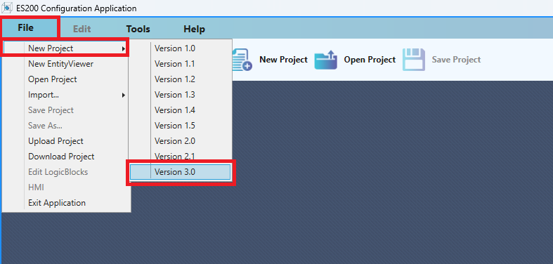

Figure 23: ES200 configuration example – New Project

## 7.2. IED configuration

In order to create the Modbus Equipment, right click on the Intelligent Electronic Device button and select Add Device. Alternatively, you can use Edit -> Add Master Device -> Modbus Master.

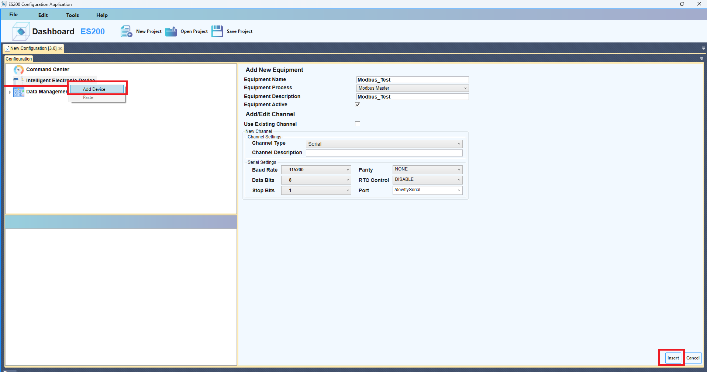

Figure 24: ES200 configuration example – Adding a new IED

In the Equipment Name field, write the name you want to give to the device. Use a sugestive name. Then, use the Equipment Process drop down menu to select the communication protocol you want to use. In our case, I chose Modbus Master. You can also select the channel type. In our case, I chose the SERIAL channel and I left all the default for the connection at their default values. After finishing the configuration, click Insert.

Then, we must configure the points for the new IED. To do that, click the arrow next to the equipment name to view the point options. For this use case I will create 10 Discrete Input Register points. To do that, right click the Discrete Input Register option and select Add Points. Then write the first address and the number of points you want.

The dialogue box for adding the 10 points is shown in the next figure. This is the setup for the IEDs for this example.

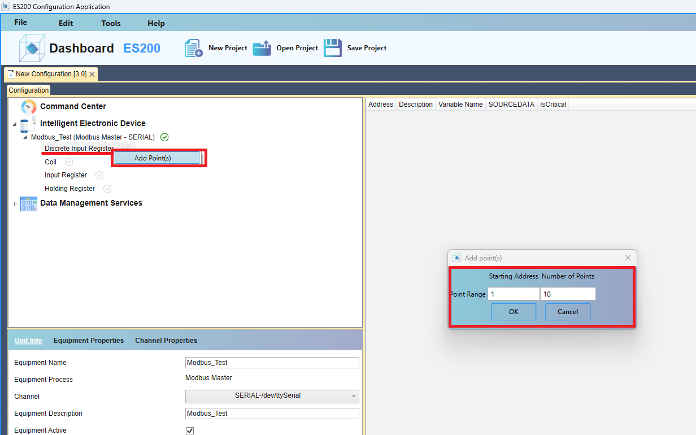

Figure 25: ES200 configuration example – Adding 10 points to an IED

## 7.3. Command Center Configuration

In order to onfigure the Command Center, we must first create it. To do this, right click the Command Center button and select Add item. 

The next figure shows the interface where you can customize the Command Center. There, you can give a suggestive name for your equipment using the Equipment Name field. You can also select the communication protocol for the new equipment using the Equipment Process drop-down menu.

You can also select the type of connection to the Command Center using the Channel Type drop down menu. In our example, I used the TCP connection and I added the IP & Port of the Command Center.

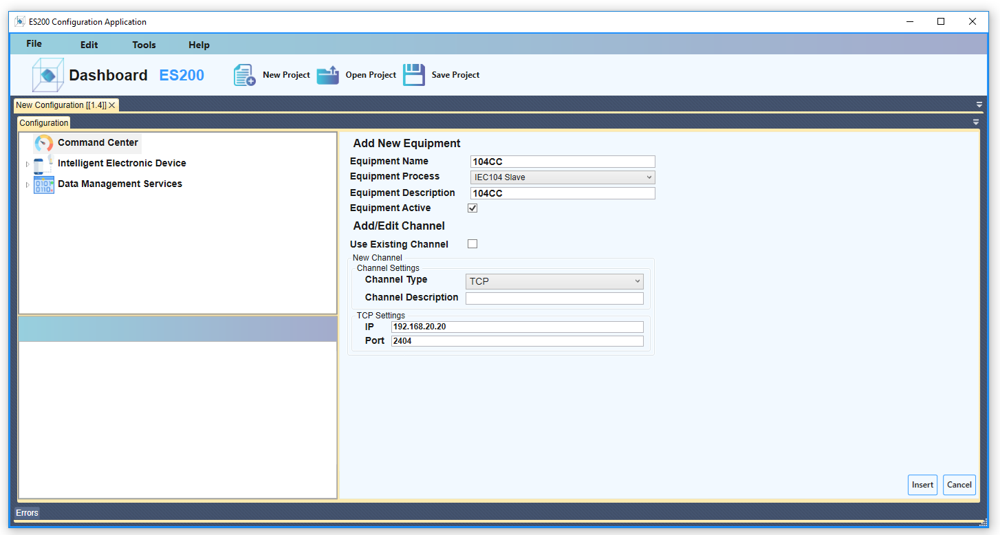

Figure 26: ES200 configuration example – Adding a new Command Center

After you click Insert, the new Command Center will be created. Now we need to add the corresponding 10 points. Because the IED has 10 Discrete Input Register points, the correspondent for that type of data in the IEC 104 protocol is the Single Point Information type.

Therefore, you must click the arrow next to the new Command Center to expand the point types. Then, right click the Single Point Information and select Add point(s). In the pop-up window, write the starting address and the number of points you want. Then click ok. The end result should look like the next figure. 

Now that we have created the points, we need to connect them to the points from the IED. To do this, click the Master Variable Name column and select the corresponding point from the drop-down menu, as shown in the next figure.

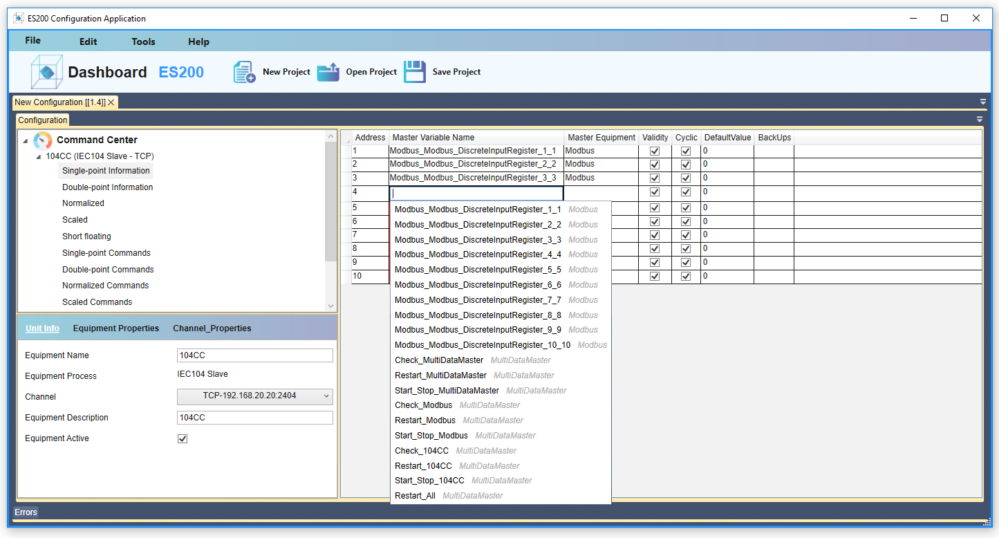

Figure 27: ES200 configuration example – Connecting the points

## 7.4. Saving and uploading the project

After finishing the configuration, you can either save the file locally, using the File-> Save option or you can send the file directly to the equipment running the ES200 using the File -> Upload project option. In the pop-up window, write the necessary information for connecting to the router and your credentials. Then, the file will be exported.

# 8. Utilities
## 8.1. Exporting and importing templates
### 8.1.1. Export
A template is a copy of an equipment configuration. To create a template (.epgt file), right click on the equipment na,e press “Export template” and save it.

### 8.1.2. Import
To import a template, either create a new project or import it into an already existing project. To do that, open the “Edit” menu, select “Import template” and select the desired “.epgt” file. It is important for the template version to correspond with the actual project version. Otherwise, a conversion will be necessary. (see the project version conversion document) 

##  8.2. Project version conversion
There are multiple versions for the project, the newest having backward compatibility. However, sometimes it is desired for the project version to be changed. To do that,m simply press the “Edit” button-> “Convert version to:” and select the desired (and available version).

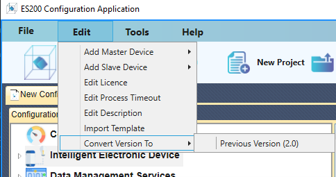

Figure 28: Project version conversion

### 8.2.1. Project download

To download a project that needs to have its version changed, the Dashboard application is used.

From the “File” menu, select “Download Project”. In the popup window, insert the authentication credentials (IP/ Host Name, Username, Password).

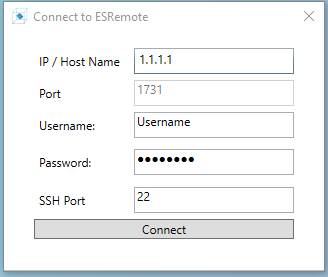

Figura 29: Project download popup

Pick the save location and set a name, as shown in the following figure.

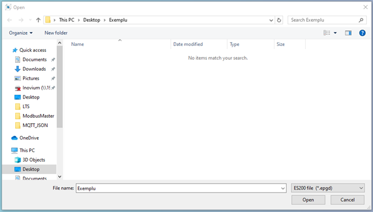

Figura 30: Location picking for project saving

### 8.2.2. Version change

Open the project with the Dashboard application using “File” -> “Open Project” or using the button “Open Projec” from the application interface.

To convert the project, select “Convert version to -> Latest version (1.5)”. In this example, a conversion from 1.3 to the last version 1.5 has been made.

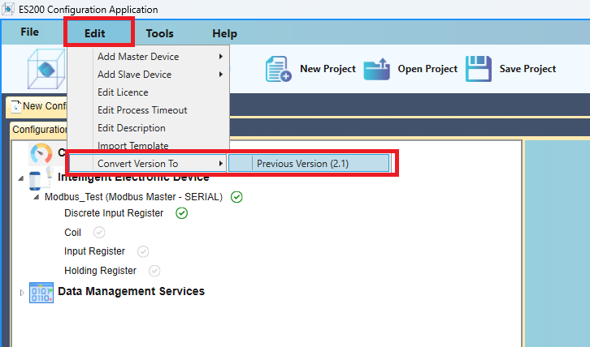

Figure 31: Project conversion

A new project called “Name.epgd [previous version] -> [1.5] will be opened and saved.

### 8.2.3. Project versions differences
Between various project versions there are differences such as:

* Subtractions or additions of equipment property fields
* Default value changes
* Substraction or addition of point property fields

#### 8.2.3.1. Differences between versions 1.3 - 1.5

For every new property, there has been added a Help Text to further explain their functionality.

##### 8.2.3.1.1. ModbusMaster
The following equipment properties have been substracted:
* ProcessRestartTimeout
* ValidityTimeout

The following point properties have been subtracted:
* DefaultValue
* WordCount, only having value 4

The following equipment properties have been added:
* MaxRequestRetries

##### 8.2.3.1.2. DNP3Master
The following equipment properties have been added:
* ChannelResponseTimeout
* LinkConfirmTimeout
* LinkConfirmMode
* MaxRequestRetries
* ClockSyncInterval

The following point properties have been added:
* Mode

The following default values have been changed
* LinkStatusInterval [setat la 10000]
##### 8.2.3.1.3. IEC61850
The following equipment properties have been substracted:
* Path
* FileLogPath

The following default values have been changed:
* PSEL [set to 00000001]
* SSEL [set to 0001]
* TSEL [set to 0001]

##### 8.2.3.1.4. IEC104Slave
The following equipment properties have been substracted:
* FileLogPath
* MonitoredPath

The following point properties have been substracted:
* DefaultValue

The following equipment properties have been added:
* CyclicAfterFirstGI
* FileMonitorPath
* FilesEncoderMonitorPath

##### 8.2.3.1.5. ModbusSlave
The following point properties have been substracted:
    * DefaultValue
    * DataType
    * MeasurementUnit

##### 8.2.3.1.6. IEC104Master
* The following point properties have been substracted:
    * DefaultValue

The following equipment properties have been added:
* ClockSyncInterval
* HasFileTransfer
* FileStorePath
* FileDirectoryRequestInterval
* HasFilesDecoder
* FilesDecoderStorePath

##### 8.2.3.1.7. MultiDataMaster
* Analog Output (AO) points have been added

##### 8.2.3.1.8. JSON_MQTT
* The addition of MQTT Master

#### 8.2.3.2. Differences between versions 1.5 - 2.0

##### 8.2.3.2.1. DNP3Master
The following equipment properties have been substracted:
* AutoTimeSync
* AutoEnableUnsol
* AutoDisableUnsol
* IntegrityPoolInterval
* ClockSyncInterval

The following equipment properties have been added:
* AutoTimeSyncIIN + with its options:
    * LAN
    * Serial
* EnableUnsol
* IntegrityPollInterval

##### 8.2.3.2.2. DNP3Slave
* CyclicPeriod property has been substracted

#### 8.2.3.3. Differences between versions 2.0 - 2.1

##### 8.2.3.3.1. DNP3Master
QualifierCode property has been added

## 8.3. Change the language

The language can be changed by accessing “Tools” -> “Options” -> “Language” and select the desired language.

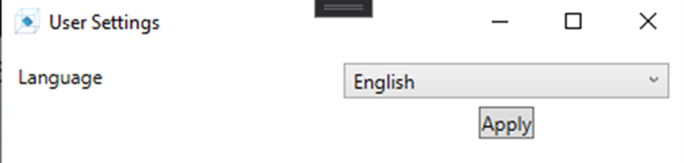

Figura 31: Language changing options

## 8.4. Logic block editor

MultiDataMaster is a module that can be used to implement specific automation logic, similar to those implemented in a PLC (Programmable Logic Controller). AAR (Automatic Reserve Arrangement) type automation can be implemented, double variables can be created for switchgear positions by adding simple (Boolean) variables, summations of analog values, and various conditionings.

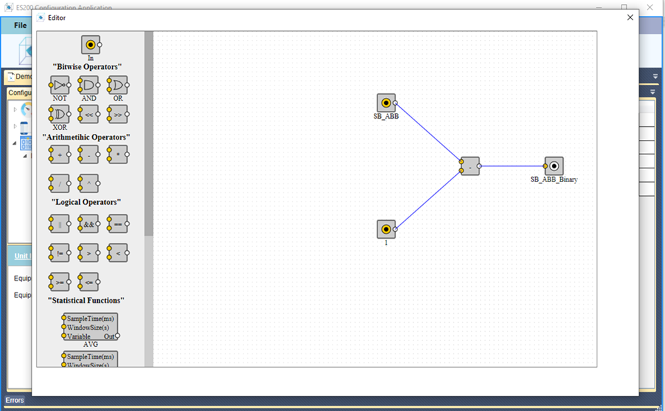

Figure 33: Logic block editor

The module provides predefined blocks specific to the standard programming languages (LD, FBD, SFC) used for PLC configuration. Blocks can be grouped into several distinct categories:
* blocks for logic operations: AND, OR, NOT, XOR;
* blocks for bit operations: left/right shift with a predefined number of positions
* 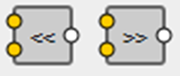 extracting a specific bit from a predefined position in a byte
* 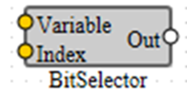 Bit Selector
* blocks implementing timers: TON and TOF
* 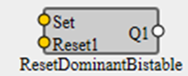 block for self-propelled (bistable) - ResetDominantBistable (SET/RESET)
* block for statistical determinations for (usually analog) quantities over time intervals: MIN, MAX, AVG (arithmetic mean) , DISP (dispersion)
 
These blocks can be interlinked using a graphical editor included in the MultiDataMaster module.

The system of interconnected predefined logical blocks is automatically converted after saving in the graphical editor into an equation which is found in the tables in the specific sections of the MultiDataMater.

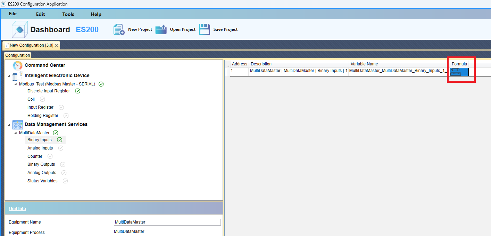

Figure 34: Accessing the configuration menu of the logical blocks in the MDM

Pressing the button shown in figure 34, within the MultiDataMaster points configuration, will open a window that allows editing the logical blocks for that point, as shown in figure 33.

### 8.4.1. Functionality description of automation blocks

#### 8.4.1.1. ResetDominantBistable (SET/RESET) 

Function used to implement conditioned autometers.

Description of block entrance signals:

<table>
  <tr>
   <td><strong>Input signal name</strong>
   </td>
   <td><strong>Type of data</strong>
   </td>
   <td><strong>Detailed description</strong>
   </td>
  </tr>
  <tr>
   <td><strong>Set</strong>
   </td>
   <td><strong>BOOL</strong>
   </td>
   <td><strong>Self-timer activation signal</strong>
   </td>
  </tr>
  <tr>
   <td><strong>Reset1</strong>
   </td>
   <td><strong>BOOL</strong>
   </td>
   <td><strong>Self-timer deactivation signal</strong>
   </td>
  </tr>
</table>
 
Description of exit signals from the block:

<table>
  <tr>
   <td><strong>Output signal name</strong>
   </td>
   <td><strong>Type of data</strong>
   </td>
   <td><strong>Detailed description</strong>
   </td>
  </tr>
  <tr>
   <td><strong>Q1</strong>
   </td>
   <td><strong>BOOL</strong>
   </td>
   <td><strong>Result</strong>
   </td>
  </tr>
</table>

The Q1 output is reset if the Reset1 input is set, regardless of the state of the Set input. If the SET input is set and Reset1 is not set, output bit Q1 is set. If both inputs are FALSE, output Q1 will retain its previous value.

#### 8.4.1.2. TON

A timer that results in a delay in the activation of the output signal Q by a time interval settable by the PT parameter. The condition is that the IN input remains active for the time interval PT.

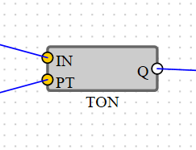

 
Description of input signals in block:

<table>
  <tr>
   <td><strong>Input signal name</strong>
   </td>
   <td><strong>Type of data</strong>
   </td>
   <td><strong>Detailed description</strong>
   </td>
  </tr>
  <tr>
   <td><strong>IN</strong>
   </td>
   <td><strong>BOOL</strong>
   </td>
   <td><strong>Timer activation signal</strong>
   </td>
  </tr>
  <tr>
   <td><strong>PT</strong>
   </td>
   <td><strong>unsigned integer</strong>
   </td>
   <td><strong>Settable time interval [ms]</strong>
   </td>
  </tr>
</table>

Description of exit signals from the block:

<table>
  <tr>
   <td><strong>Output signal name</strong>
   </td>
   <td><strong>Type of data</strong>
   </td>
   <td><strong>Detailed description</strong>
   </td>
  </tr>
  <tr>
   <td><strong>Q</strong>
   </td>
   <td><strong>BOOL</strong>
   </td>
   <td><strong>Result</strong>
   </td>
  </tr>
</table>

The operation is described in the diagrams below:

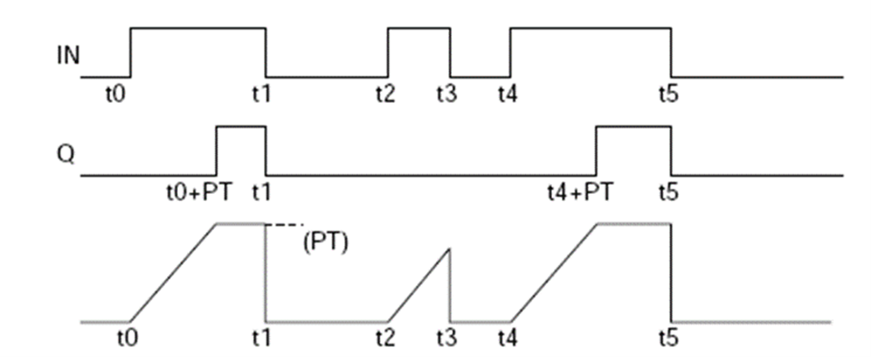

#### 8.4.1.3. TOF

Timer that results in keeping the output signal Q active for a time interval settable by the PT parameter, even if the input signal IN has become inactive.

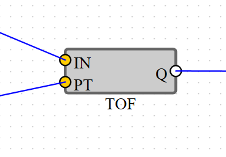

Block input signal description:

<table>
  <tr>
   <td><strong>Input signal name</strong>
   </td>
   <td><strong>Type of data</strong>
   </td>
   <td><strong>Detailed description</strong>
   </td>
  </tr>
  <tr>
   <td><strong>IN</strong>
   </td>
   <td><strong>BOOL</strong>
   </td>
   <td><strong>Timer activation signal</strong>
   </td>
  </tr>
  <tr>
   <td><strong>PT</strong>
   </td>
   <td><strong>unsigned integer</strong>
   </td>
   <td><strong>Settable time interval [ms]</strong>
   </td>
  </tr>
</table>

Description of exit signals from the block:

<table>
  <tr>
   <td><strong>Output signal name</strong>
   </td>
   <td><strong>Type of data</strong>
   </td>
   <td><strong>Detailed description</strong>
   </td>
  </tr>
  <tr>
   <td><strong>Q</strong>
   </td>
   <td><strong>BOOL</strong>
   </td>
   <td><strong>Result</strong>
   </td>
  </tr>
</table>

The operation is described in the diagrams below:

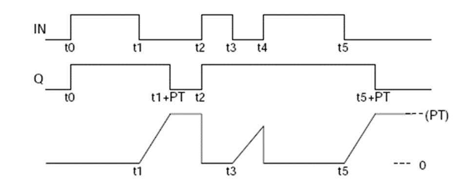

#### 8.4.1.4. Functions for statistical determinations: MAX, MIN, AVG, DISP

Blocks can be used to calculate the arithmetic mean, minimum, maximum or dispersion for a quantity monitored by the ES200 over a settable time interval (WindowSize) and measured at a frequency (sample rate) defined by the SampleTime(ms) parameter.

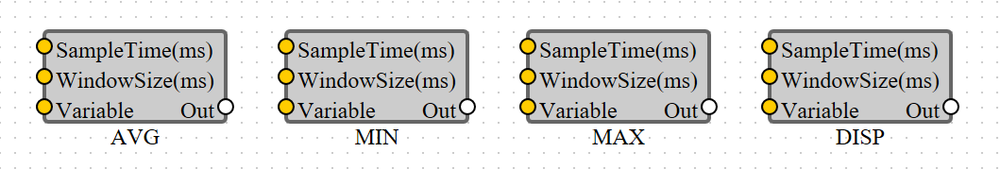

Description of input signals in block:

<table>
  <tr>
   <td><strong>Input signal name</strong>
   </td>
   <td><strong>Type of data</strong>
   </td>
   <td><strong>Detailed description</strong>
   </td>
  </tr>
  <tr>
   <td><strong>SampleTime(ms)</strong>
   </td>
   <td><strong>unsigned integer</strong>
   </td>
   <td><strong>Sampling rate for the measurement interval</strong>
   </td>
  </tr>
  <tr>
   <td><strong>WindowSize(ms)</strong>
   </td>
   <td><strong>unsigned integer</strong>
   </td>
   <td><strong>Measurement range for which it is calculated</strong>
   </td>
  </tr>
  <tr>
   <td><strong>Variable</strong>
   </td>
   <td>
   </td>
   <td><strong>Size to which the function in question applies</strong>
   </td>
  </tr>
</table>

Description of exit signals from the block:

<table>
  <tr>
   <td><strong>Output signal name</strong>
   </td>
   <td><strong>Type of data</strong>
   </td>
   <td><strong>Detailed description</strong>
   </td>
  </tr>
  <tr>
   <td>Out
   </td>
   <td><strong>Same type as Variable size</strong>
   </td>
   <td><strong>Result of the statistical function</strong>
   </td>
  </tr>
</table>

## 8.5. Configuration of ES200 HMI
### 8.5.1. General Description

To configure the Human Machine Interface (HMI) function of ES200, the same configuration package, Dashboard ES200, will be used.

It is necessary to use a configuration file specific to ES200 (with the extension .epgd) containing entities retrieved through various communication protocols from IEDs.

After importing this file into the Dashboard ES200 application (using the "Open" option from the File menu), to edit/create a graphical user interface, the HMI option from the File menu will be used.

In the newly opened window, at the bottom left, use the **Editor** option.

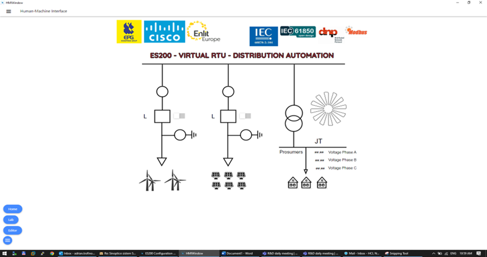

After activating this option, the graphical user interface editor provided by the ES200 platform will open. In this editor, specific HMI functionalities can be configured – presenting dynamic symbols (various shapes) for entities monitored through ES200, graphical elements for transmitting commands, and displaying analog quantities. Additionally, static images can be constructed, and static graphic elements can be imported from .jpeg, .jpg, .gif files.

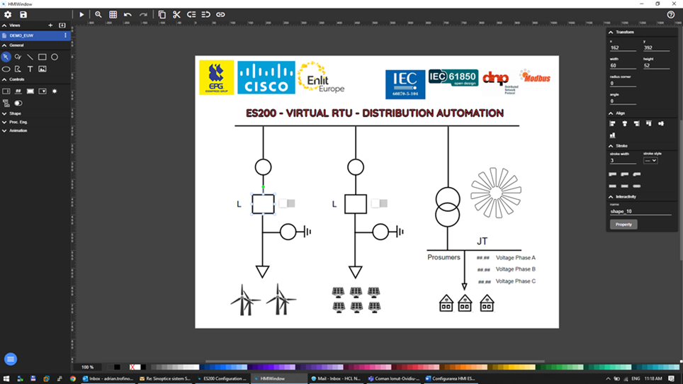

Fig.1 – ES200 HMI Editor – main interface

Inside the square, we have seven buttons :

The first button ( Settings ) lets us edit the View, Layout or the Connections made to the HMI interface.

The second button ( Save ) lets us save the current HMI interface we are currently working with. The user will be prompted to choose his desired save location.

The third button ( Play ) lets us run the current HMI configuration we are currently working with.

The fourth button ( Zoom ) lets us zoom in/out inside the HMI interface.

The fifth button ( Grid ) lets us show grids around the whole interface for easier placements.

The sixth and seventh buttons ( Undo and Redo ) lets us undo or redo the current modifications made to the HMI interface.

In the Views section, the user will be able to see all the current HMI interfaces loaded at the moment and will be able to switch between them or create certain links between them.

The add and import buttons will let the user add another view or imported an already existing one.

 

In the General section, the user will have different buttons which will let him implement different things inside the canvas:

The first button, which is selected from the beginning by the configuration, is the button which is used to select other settings in that section.

The second button, draw pencil, will let the user draw around the canvas.

The third button, line tool, will let the user draw lines inside the canvas.

The fourth button, rectangle tool, will let the user draw rectangular shapes inside the canvas.

The fifth and sixth buttons, circle tool, will let the user draw circular shapes inside the canvas.

The seventh button, path tool, will let the user draw paths from one eq. to another.

The eighth button, text tool, will let the user insert a text box inside the canvas.

The ninth button, image tool, will let the user import an image inside the canvas.

In the Controls section, the user will be able to implement different buttons or inputs, each with its own behaviour.

The first button, input value, will allow the user to insert a value inside the canvas.

The second button, output value, will output a value regarding the one inserted by the user using the input.

The third option is a button whose behaviour will be selected by the user.

The fourth button , select value, will output different values which will be shown by the user.

The fifth button, led gauge, will implement a led which will have different behaviours regarding its current eq. status.

The sixth button, pipe, will let the user draw a pipe from one eq. to another.

The last button, switch, will switch from one instance to another, both chosen by the user.

The bottom section of the canvas will let the user choose the desired background color.

### 8.5.2. Adding Digital Quantities

To associate an entity with a dynamically added symbol on the interface, left-click on the newly added symbol, and the properties window will open (see the figure above on the left).

In this window, properties such as the geometric properties of the symbol, alignment and placement on the page, and presentation mode can be set. In the Interactivity section, by pressing the Properties button, display modes (coloring, animation) of a symbol can be set by associating it with an entity from the ES200 database. The entity can be chosen from the list available in the database, and the behavior of the symbol will depend on the values of this entity.

### 8.5.3. Adding Analog Quantities

Adding analog quantities to the HMI component is done using the element called **Output value**, present in the list of predefined elements in the left section of the HMI editor.

After adding the element to the HMI screen, associating it with an analog quantity entity from the current ES200 database is done similarly to the association with a digital quantity described in point 1 of the same menu system model.

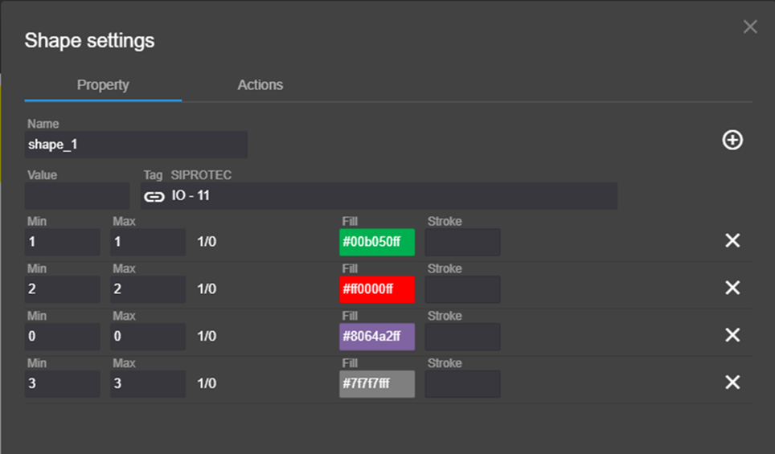

Fig 2 – Specific settings for the behavior of a symbol representing a digital entity

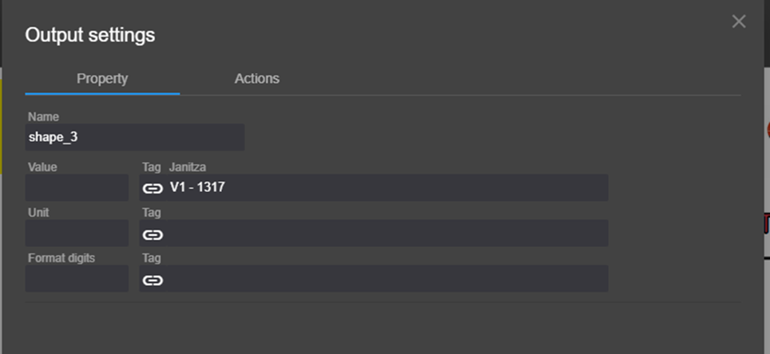

Fig 3 – Specific settings for the behavior of a symbol representing an analog entity

### 8.5.4. Adding a Command

Adding commands to the HMI component is done using the element called **Switch**, present in the list of predefined elements in the left section of the HMI editor.

After adding the element to the HMI screen, associating it with a command entity from the current ES200 database is done similarly to the association with a command by setting the available properties according to Figure 4.

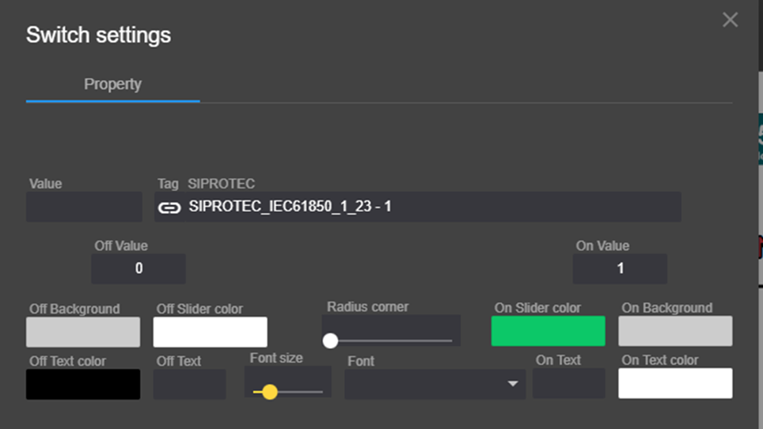

Fig 4 – Specific settings for the behavior of a symbol representing a command entity

### 8.5.5. Save, Load, and Use HMI

After completing the configuration, save it using the **Save project** option (top left) in the HMI editor.

After closing the HMI editor, it is also necessary to save the entire ES200 configuration made in **Dashboard ES200** (File menu option **Save project). IT DOES NOT SAVE AUTOMATICALLY!**

After loading the configured ES200, the previously created human-machine interface can be viewed with a web browser (Chrome, Mozilla) available on any personal computer (Figure 5).

The connection address is https://IP_machine:3000

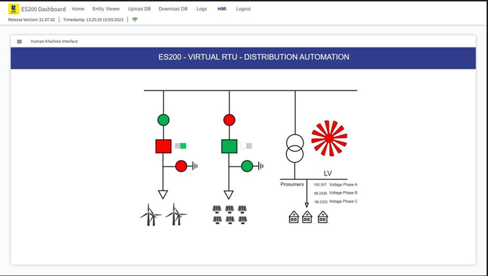

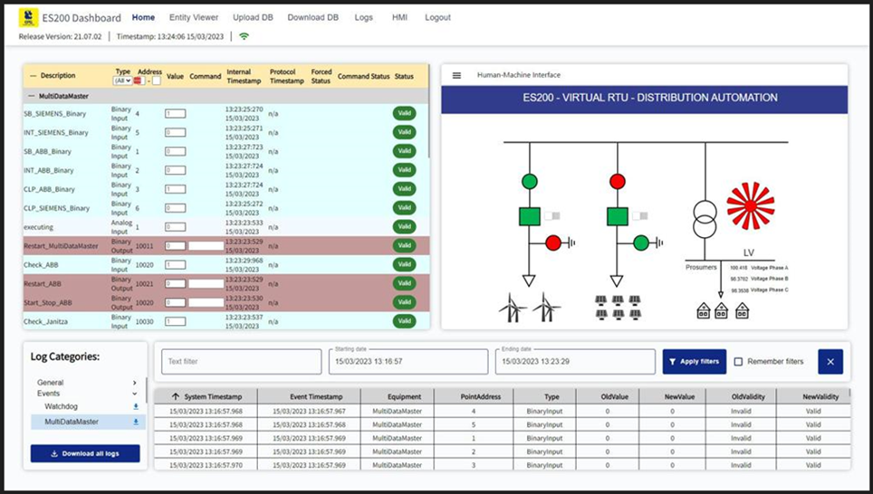

Figure 5 – WEB-HMI ES200 Interface