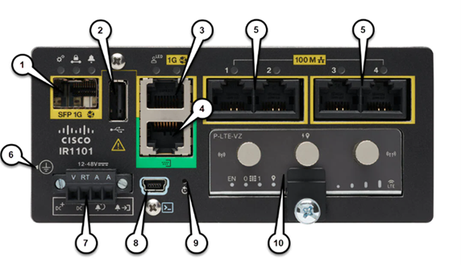
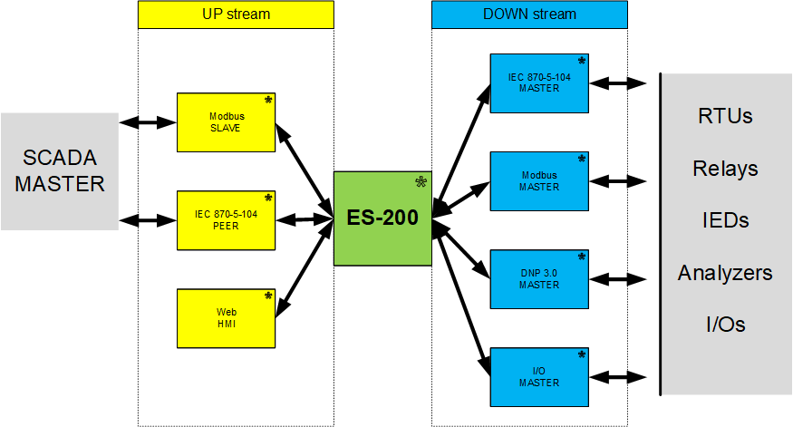
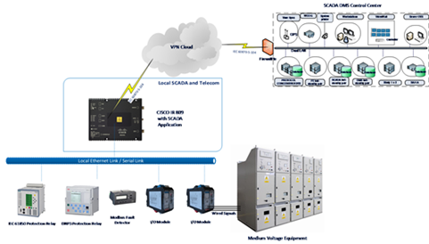
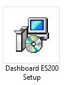
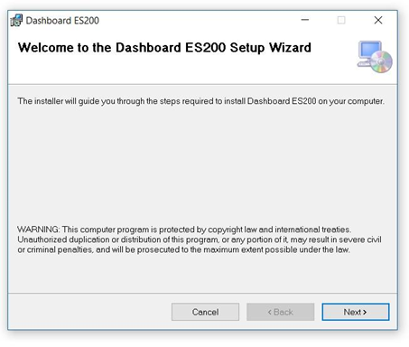

# ES200 Manual de utilizare <!-- omit from toc -->

# 1. Despre acest manual

ES200 este un software care rulează pe echipamente Cisco IOx. Împreună, software-ul și hardware-ul alcătuiesc o unitate care controlează, monitorizează și face achiziții de date pe echipamente din domeniul utilităților și/sau pe alte tipuri de echipamente industriale. Practic, ES200 este un RTU (Remote Terminal Unit) virtual de generația a 4-a (Internet of Things).

ES200 este soluția ideală pentru automatizarea echipamentelor industriale. Soluția noastră poate prelua și trimite date și comenzi către alte echipamente folosind protocoale de comunicație moderne și sigure, fiind creată pentru a opera în mod eficient rețele electrice, echipamente din industria petrolieră, soluții pentru smart city și multe alte tipuri de echipamente. 

Pentru a putea configura soluția noastră, am creat un Dashboard cu ajutorul căruia se poate edita baza de date care conține configurația și setările necesare software-ului ES200. Acest manual explică modul de folosire al Dashboard-ului.

## 1.1. Informații legale

Informațiile cuprinse în acest document se pot schimba fără avertisment anterior și nu constituie o obligație din partea furnizorului. Eximprod nu își asumă responsabilitatea pentru modul cum este utilizată informația din acest document.

Eximprod nu este responsabil pentru orice eveniment direct sau indirect care rezultă din folosirea acestui document sau a oricărui produs menționat în acest document.

Software-ul descris în acest document este licențiat și poate fi folosit doar conform termenilor licenței.

Informația cuprinsă în acest document nu poate fi reprodusă sau copiată fără permisiunea scrisă a Eximprod-ului și conținutul nu poate fi transmis către o altă entitate pentru utilizare neautorizată.

## 1.2. Dispoziții generale

Acest document conține informații despre software-ul ES200, aplicația Dashboard și funcționalitățile lor. Informațiile cuprinse în acest manual sunt destinate personalului calificat, care va folosi acest software pentru a configura diverse componente sau pentru vizualizarea unor informații.

## 1.3. Terminologie

Acest document conține un set de termeni care se referă la informații importante sau legate de siguranță:

<table>
  <tr>
   <td>Termen
   </td>
   <td>Definiție
   </td>
  </tr>
  <tr>
   <td>Alarmă
   </td>
   <td>Un eveniment care informează operatorul despre orice deviație a sistemului de la parametri normali.
   </td>
  </tr>
  <tr>
   <td>Aplicație
   </td>
   <td>Software destinat să îndeplinească o funcție specifică.
   </td>
  </tr>
  <tr>
   <td>Arhivă
   </td>
   <td>Locul în care sunt stocate mai multe seturi de date, de obicei dintr-o perioadă mare de timp.
   </td>
  </tr>
  <tr>
   <td>Atribut
   </td>
   <td>O proprietate specifică a unui obiect.
   </td>
  </tr>
  <tr>
   <td>Bază de date
   </td>
   <td>O serie de informații structurare, necesare pentru funcționarea aplicației.
   </td>
  </tr>
  <tr>
   <td>Buton
   </td>
   <td>O zonă a display-ului care poate fi apăsată pentru a iniția o anumită acțiune.
   </td>
  </tr>
  <tr>
   <td>Centru de Comandă (Command Center)
   </td>
   <td>Locul unde se află centrul de control al distribuției.
   </td>
  </tr>
  <tr>
   <td>Click
   </td>
   <td>Acțiunea de a apăsa un buton al mouse-ului o singură dată și a elibera butonul fără a muta cursorul. În mod implicit, click se referă la butonul stâng al mouse-ului și click-dreapta se referă la butonul drept al mouse-ului.
   </td>
  </tr>
  <tr>
   <td>Dublu-click
   </td>
   <td>Două click-uri succesive pe același buton al mouse-ului.
   </td>
  </tr>
  <tr>
   <td>Ecran (Display)
   </td>
   <td>Instrument utilizat pentru vizualizarea informației.
   </td>
  </tr>
  <tr>
   <td>Log
   </td>
   <td>Informație despre un eveniment.
   </td>
  </tr>
  <tr>
   <td>Protocol UP/DOWN
   </td>
   <td>Protocol de comunicație cu un echipament aflat la un nivel superior/inferior.
   </td>
  </tr>
  <tr>
   <td>Tag
   </td>
   <td>O proprietate a unui element.
   </td>
  </tr>
  <tr>
   <td>Valoare implicită (Default)
   </td>
   <td>Valoare normală, standard.
   </td>
  </tr>
</table>

## 1.4. Abrevieri

Tabelul de mai jos conține o listă de abrevieri folosite de-a lungul documentului.

<table>
  <tr>
   <td><strong>Abreviere</strong>
   </td>
   <td><strong>Definiție</strong>
   </td>
  </tr>
  <tr>
   <td>A
   </td>
   <td>Amper
   </td>
  </tr>
  <tr>
   <td>Ω
   </td>
   <td>Ohm
   </td>
  </tr>
  <tr>
   <td>V
   </td>
   <td>Volt
   </td>
  </tr>
  <tr>
   <td>W
   </td>
   <td>Watt
   </td>
  </tr>
  <tr>
   <td>CC
   </td>
   <td>Command Center (Centru de comandă)
   </td>
  </tr>
  <tr>
   <td>COMx
   </td>
   <td>Portul serial cu numărul X
   </td>
  </tr>
  <tr>
   <td>DNP3
   </td>
   <td>Distributed Network Protocol (protocol de comunicație)
   </td>
  </tr>
  <tr>
   <td>I/O
   </td>
   <td>Input/output 
   </td>
  </tr>
  <tr>
   <td>ID
   </td>
   <td>Identificator unic
   </td>
  </tr>
  <tr>
   <td>IEC 60870-5-104
   </td>
   <td>International Electrotechnical Commission 60870-5-104 (protocol de comunicație)
   </td>
  </tr>
  <tr>
   <td>IED
   </td>
   <td>Intelligent Electronic Devices (Echipament electronic inteligent)
   </td>
  </tr>
  <tr>
   <td>LoRaWAN
   </td>
   <td>Low Power Wide Area Network (protocol de comunicație)
   </td>
  </tr>
  <tr>
   <td>RTU
   </td>
   <td>Remote Terminal Unit
   </td>
  </tr>
  <tr>
   <td>SCADA
   </td>
   <td>Supervisory Control and Data Acquisition
   </td>
  </tr>
  <tr>
   <td>TCP
   </td>
   <td>Transmission Control Protocol (protocol de comunicație)
   </td>
  </tr>
  <tr>
   <td>TP
   </td>
   <td>Transformation point (punct de transformare)
   </td>
  </tr>
  <tr>
   <td>WAN
   </td>
   <td>Wide Area Network (tip de rețea de date)
   </td>
  </tr>
</table>

# 2. Unitatea ES200

ES200 este o unitate de control, monitorizare și achiziție de date. Este o soluție ideală atât pentru automatizare, cât și pentru controlul punctelor din** **sistemele SCADA locale.

Soluția noastră funcționează pe o arhitectură distribuită, împreună cu software-ul și echipamentele folosite uzual în industrie. Totuși, ES200 este compatibil cu multiple tipuri de echipamente, indiferent de vechimea lor, fiind așadar o soluție versatilă care îmbunătățește substanțial securitatea și funcțiile de automatizare.

ES200 este capabil să ruleze și să opereze la marginea rețelei (Network Edge) și să izoleze microserviciile SCADA de orice alt proces. De asemenea, permite extragerea, centralizarea, procesarea și stocarea datelor, comportându-se ca un gateway de SCADA.

## 2.1. Exemple de aplicații practice

ES200 are funcții de monitorizare, de control și de gateway de comunicare. Sistemul permite captarea semnalelor de protecție de la IED-uri, precum și achiziția directă a semnalelor digitale. De asemenea, soluția noastră poate folosi o gamă largă de protocoale de comunicație (detalii în secțiunea 2.4) pentru monitorizarea și transmiterea de informație. De asemenea, ES200 poate stoca un istoric de până la 500.000 de evenimente într-o memorie nonvolatilă. Aceste log-uri cuprind următoarele informații:

* Tag-ul care stochează momentul exact al producerii evenimentului (cu acuratețe de 1 milisecundă);
* Sursa evenimentului;
* Condițiile dinaintea producerii evenimentului;
* Condițiile de după producerea evenimentului;

## 2.2. Hardware-ul specific

Cisco IR809 este un router destinat posturilor de transformare, care funcționează alături de ES200 pentru a crea un RTU virtual. Împreună, această unitate colectează date de la aparatele de măsură inteligente la care se conectează și trimite aceste date către un centru de comandă. Unitatea poate fi folosită și pentru a trimite comenzi către IED-uri.

ES200 a fost creat pentru a rula pe routerele Cisco IR809, Cisco IR829 sau Cisco IR1101, dar si pe alternative precum Phoenix Contact sau eManager., în funcție de context și de funcționalitățile dorite. Software-ul rulează în containerul constituit de mașina virtuală IOx existentă pe platforma hardware Cisco.

Figura 1: Routerul CISCO IR1101

<table>
  <tr>
   <td>
<ol>

<li>
<strong>SFP GE WAN</strong>
</li>
</ol>
   </td>
   <td><strong>6. Punct de impamantare (amplasat pe marginea dispozitivului)</strong>
   </td>
  </tr>
  <tr>
   <td>
<ol>

<li>
<strong>USB 2.0</strong>
</li>
</ol>
   </td>
   <td><strong>7. Curent continuu si input de alarma</strong>
   </td>
  </tr>
  <tr>
   <td>
<ol>

<li>
<strong>RJ45 GE WAN</strong>
</li>
</ol>
   </td>
   <td><strong>8. Consola Mini-USB</strong>
   </td>
  </tr>
  <tr>
   <td>
<ol>

<li>
<strong>Port Serial</strong>
</li>
</ol>
   </td>
   <td><strong>9. Buton de reset</strong>
   </td>
  </tr>
  <tr>
   <td>
<ol>

<li>
<strong>Porturi FE LAN 1-4</strong>
</li>
</ol>
   </td>
   <td><strong>10. Modul conectabil</strong>
   </td>
  </tr>
</table>

**Tabelul 1: Referințe pentru routerul Cisco IR809**

## 2.3. Arhitectura sistemului

Următoarele imagini prezintă arhitectura generală a soluției și un exemplu de arhitectură în care este folosit ES200.

Figura 2: Arhitectura sistemului ES200

Figura 3: Exemplu de arhitectură care integrează ES200

## 2.4. Protocoale de comunicație suportate

Protocoalele de comunicație suportate de ES200 includ protocoale precum Modbus, DNP3, IEC 60870-5-104 și IEC 61850. Aceste protocoale sunt folosite de o gamă largă de echipamente de protecție și IED-uri moderne, prin urmare soluția noastră poate fi integrată foarte ușor cu echipamentele deja existente. În plus, lista de protocoale de comunicație suportate se extinde constant, alte protocoale putând fi implementate la cerere.

În funcție de platforma hardware pe care rulează, ES200 poate controla și transmite informații în mod direct, prin intermediul propriilor module I/O. Mai jos este lista protocoalelor de comunicație suportate în acest moment:

<table>
  <tr>
   <td><strong>Protocol</strong>
   </td>
   <td><strong>Master </strong>
   </td>
   <td><strong>Slave</strong>
   </td>
  </tr>
  <tr>
   <td>Modbus
   </td>
   <td>Da
   </td>
   <td>Da
   </td>
  </tr>
  <tr>
   <td>DNP3
   </td>
   <td>Da
   </td>
   <td>Da
   </td>
  </tr>
  <tr>
   <td>IEC 60870-5-104
   </td>
   <td>Da
   </td>
   <td>Da
   </td>
  </tr>
  <tr>
   <td>IEC60-870-5-101
   </td>
   <td>Da
   </td>
   <td>
   </td>
  </tr>
  <tr>
   <td>IEC61850 Editia 1
   </td>
   <td>Da
   </td>
   <td>
   </td>
  </tr>
  <tr>
   <td>IEC61850 Ediția 2
   </td>
   <td>Da
   </td>
   <td>
   </td>
  </tr>
  <tr>
   <td>MQTT
   </td>
   <td>
   </td>
   <td>Da
   </td>
  </tr>
  <tr>
   <td>OPC Client
   </td>
   <td>Da
   </td>
   <td>
   </td>
  </tr>
</table>

**Tabelul 2: protocoalele de comunicație suportate de ES200**

# 3. Instalarea ES200 Dashboard

Un wizard a fost configurat pentru vă ghida de-a lungul procesului de instalare. În primul rând, trebuie să dați dublu click pe iconița de instalare din figura de mai jos:

Prima fereastră a wizard-ului de instalare este cea din Figura 4. Pentru a începe procesul de instalare, apăsați butonul Next.

Figura 4: Wizard de instalare (1)

Ulterior, vi se va cere să selectați fișierul unde doriți să vi se instaleze programul. Vă recomandăm să păstrați destinația implicită, care apare în Figura 5. Dacă doriți să alegeți alt fișier, apăsați butonul Browse și navigați la fișierul dorit. După ce ați ales destinația unde doriți să fie instalat fișierul, apăsați butonul Next.

>>>>>  gd2md-html alert: inline image link here (to images/image6.jpg). Store image on your image server and adjust path/filename/extension if necessary.  (<a href="#">Back to top</a>)(<a href="#gdcalert7">Next alert</a>) >>>>> 

**Figura 5: Wizard de instalare (2)**

După acest pas, wizardul vă va cere să confirmați instalarea (Figura 6). Puteți confirma apăsând butonul Next. Software-ul va fi instalat la destinația aleasă (sau la cea implicită) și wizard-ul vă va informa de succesul instalării (Figura 7). Pentru a închide wizard-ul, apăsați butonul Finish.

>>>>>  gd2md-html alert: inline image link here (to images/image7.jpg). Store image on your image server and adjust path/filename/extension if necessary.  (<a href="#">Back to top</a>)(<a href="#gdcalert8">Next alert</a>) >>>>> 

**Figura 6: Wizard de instalare (3)**

>>>>>  gd2md-html alert: inline image link here (to images/image8.jpg). Store image on your image server and adjust path/filename/extension if necessary.  (<a href="#">Back to top</a>)(<a href="#gdcalert9">Next alert</a>) >>>>> 

**Figura 7: Wizard de instalare (4)**

3. Configurarea bazei de date folosind Dashboard-ul

Informațiile și setările necesare pentru ca aplicația ES200 să poată rula sunt salvate într-o bază de date. Fiecare unitate este livrată cu o aplicație (Dashboard) destinată editării respectivei baze de date.

    9.  Interfața de configurare

Interfața aplicației de configurare a bazei de date este ilustrată în Figura 8.

>>>>>  gd2md-html alert: inline image link here (to images/image9.png). Store image on your image server and adjust path/filename/extension if necessary.  (<a href="#">Back to top</a>)(<a href="#gdcalert10">Next alert</a>) >>>>> 

**Figura 8: Interfața de configurare a bazei de date**

Secțiunile principale ale aplicației sunt delimitate în Figura 9 și sunt următoarele:

* 
Toolbar-ul principal (1);

* 
Toolbar-ul secundar (2);

* 
Lista de echipamente (3);

* 
Setările echipamentelor (4)

* 
Tabelul de puncte (5);

* 
Tabelul de erori (6);

>>>>>  gd2md-html alert: inline image link here (to images/image10.png). Store image on your image server and adjust path/filename/extension if necessary.  (<a href="#">Back to top</a>)(<a href="#gdcalert11">Next alert</a>) >>>>> 

**Figura 9: Secțiunile interfeței de configurare**

        1. Toolbar-ul principal (1)

Toolbar-ul principal conține următoarele butoane:

* 
File – permite deschiderea, salvarea, descărcarea și încărcarea bazelor de date (denumite și proiecte) și închiderea aplicației Dashboard.

* 
Edit – permite adăugarea de noi echipamente (atât slave, cât și master), adăugarea licenței, autorului și descrierii pentru o bază de date.

* 
Tools – permite schimbarea limbi curente a aplicației.

* 
Help – oferă informații suplimentare despre aplicația Dashboard.

* 
Butoanele din partea dreaptă – permit minimizarea sau maximizarea ferestrei, precum și închiderea aplicației.

        2. Toolbar-ul secundar (2)

Toolbar-ul secundar conține următoarele butoane:

* 
New Project – deschide un tab nou, cu o bază de date goală (care respectă în mod implicit cea mai recentă versiune de bază de date existentă)

* 
Open Project – deschide o nouă fereastră care permite navigarea prin structura de fișiere pentru selectarea unei baze de date pentru vizualizare sau editare.

* 
Save Project – salvează configurația curentă în fișierul de baze de date deschis (dacă este vorba de un proiect nou-creat, o fereastră de navigare va permite selectarea destinației de salvare)

        3. Lista de echipamente (3)

În lista de echipamente, acestea sunt grupate în următoarele categorii:

* 
Command Centers – o listă a centrelor de comandă din baza de date

* 
Intelligent Electronic Device – o listă a tuturor IED-urilor din baza de date

* 
Data Management Services – echipamentul de tip MultiDataMaster din baza de date.

        4. Setările echipamentelor (4)

La selectarea unui echipament (fie el centru de comandă sau IED), secțiunea setărilor echipamentului va avea următoarele sub-meniuri:

* 
Unit info – conține informații despre echipamentul selectat (nume, numar canal, etc). Câmpurile editabile pot fi modificate conform noilor cerințe.

* 
Equipment Properties – informații adiționale despre echipamentul selectat și protocoalele de comunicare folosite. Fiecare câmp are un text de ajutor care va fi afișat atunci când treceți peste numele câmpului cu mouse-ul.

* 
Channel Settings – informații despre canalul (Serial sau TCP) folosit de echipament pentru comunicare. 

        5. Tabelul de puncte (5)

Această secțiune conține o interfață tabelară care oferă informații despre punctele echipamentului selectat. Apăsând dublu-click pe un câmp al tabelului, celula selectată astfel devine editabilă și conținutul acesteia poate fi modificat fie prin selectarea unei opțiuni (atunci când câmpul respectiv are anumite restricții), fie prin modificarea manuală a informației.

        6. Tabelul de erori (6)

În acest tabel puteți vedea erorile de configurare ale unei baze de date. De exemplu: echipamente cu același nume, puncte duplicate etc.

    10. Adăugarea de echipamente în baza de date
        7. Centre de comandă: 

Pentru adăugarea unui nou echipament de tip Command Center, se poate selecta opțiunea Add Slave Device din meniul butonului Edit (din toolbar-ul principal). Ulterior, va fi necesară selectarea protocolului de comunicație al centrului de comandă, urmând să se poată configura și alte setări ale echipamentului în interfața ilustrată în Figura 10.

Alternativ, un echipament nou poate fi adăugat și apăsând dreapta-click pe secțiunea Command Center a listei de echipamente și apoi prin apăsarea butonului Add Device. Ulterior, protocolul poate fi selectat din submeniul Equipment Process.

>>>>>  gd2md-html alert: inline image link here (to images/image11.png). Store image on your image server and adjust path/filename/extension if necessary.  (<a href="#">Back to top</a>)(<a href="#gdcalert12">Next alert</a>) >>>>> 

**Figura 10**: Adăugarea unui nou centru de comandă (Command Center)

Câmpurile editabile din interfața prezentată în Figura 10 sunt:

* 
Equipment Name – numele echipamentului, folosit pentru identificarea ușoară în momentul configurării bazei de date;

* 
Equipment Process – protocolul de comunicație folosit de centrul de comandă. Selecția se face dintr-un sub-meniu;

* 
Equipment Description – (opțional) câteva cuvinte care explică scopul sau funcția respectivului echipament;

* 
Equipment Active – bifa din acest câmp reprezintă faptul că echipamentul este activ. Debifarea căsuței este echivalentul dezactivării echipamentului;

* 
Use Existing Channel – bifarea acestui câmp oferă opțiunea de a selecta un canal de comunicație configurat anterior dintr-un sub-meniu. Debifarea acestui câmp presupune configurarea unui nou canal de comunicație.

* 
Opțiunile pentru configurarea unui canal de comunicație nou sunt:

    * 
Channel Type – dintr-un sub-meniu, poate fi selectat tipul canalului de comunicație. Acesta poate fi TCP sau Serial. În funcție de opțiunea aleasă, există anumite câmpuri specifice care trebuie completate (ilustrate în Figura 11);

    * 
Channel Description – (opțional) câteva cuvinte care ajută la identificarea canalului și a scopului acestuia.

>>>>>  gd2md-html alert: inline image link here (to images/image12.png). Store image on your image server and adjust path/filename/extension if necessary.  (<a href="#">Back to top</a>)(<a href="#gdcalert13">Next alert</a>) >>>>> 

>>>>>  gd2md-html alert: inline image link here (to images/image13.png). Store image on your image server and adjust path/filename/extension if necessary.  (<a href="#">Back to top</a>)(<a href="#gdcalert14">Next alert</a>) >>>>> 

**Figura 11: Setările pentru conexiunile serială respectiv TCP**

1. 
Opțiunea Serial Channel are următorii parametrii editabili (fiecare parametru are un set fix de valori posibile, prezentate în sub-meniuri):

    * 
BAUDRATE – viteza conexiunii (măsurată în biți/secundă);

    * 
DATABITS – numărul de biți ai unui caracter;

    * 
STOPBITS – numărul de biți folosiți pentru identificarea finalului unui caracter;

    * 
PARITY – o metodă folosită pentru detectarea erorilor de comunicație;

    * 
RTSCONTROL – o metodă folosită pentru a garanta faptul că viteza de transmisie nu este mai mare decât viteza la care receptorul poate procesa datele primite;

    * 
PORT – portul folosit de echipament pentru comunicare.
Pentru realizarea conexiunii, acești parametri trebuie să fie identici la ambele capete ale canalului de comunicație. Prin urmare, configurarea lor se face în funcție de echipamentul de comandă care va fi conectat la ES200.

2. 
Opțiunea TCP Channel are următorii parametri editabili:

    * 
IP – adresa IP a echipamentului (nu este obligatorie completarea adresei IP a centrului de comanda - recomandam ca acest camp sa ramana necompletat);

    * 
PORT – portul folosit de echipament pentru comunicația TCP
Toate aceste setări pot fi editate și după crearea echipamentului. Pentru modificări ulterioare, se selectează echipamentul care trebui editat și se modifică setările sale din secțiunea Equipment Settings, după cum este ilustrat în Figura 12.

>>>>>  gd2md-html alert: inline image link here (to images/image14.png). Store image on your image server and adjust path/filename/extension if necessary.  (<a href="#">Back to top</a>)(<a href="#gdcalert15">Next alert</a>) >>>>> 

**Figura 12**: Editarea unui centru de comandă (Command Center)

Ștergerea unui centru de comandă se poate face prin selectarea acestuia, apoi click-dreapta și selectarea opțiunii Delete equipment. Alternativ, se poate selecta echipamentul și apoi se poate apăsa tasta DeleteDetele.

        8. IED-uri

Adăugarea unui IED este similară cu adăugarea unui nou centru de comandă. Se poate realiza prin apăsarea opțiunii Add Master Device din meniul Edit, urmând să fie selectat protocolul de comunicare dorit din sub-meniul apărut. Ulterior, procesul este identic cu acela din capitolul anterior, după cum este ilustrat și în Figura 13.

O metodă alternativă este apăsarea click-dreapta pe secțiunea Intelligent Electronic Device din lista de echipamente și selectarea opțiunii Add Device. Protocolul de comunicare folosit poate fi selectat ulterior din sub-meniul Equipment Process.

>>>>>  gd2md-html alert: inline image link here (to images/image15.png). Store image on your image server and adjust path/filename/extension if necessary.  (<a href="#">Back to top</a>)(<a href="#gdcalert16">Next alert</a>) >>>>> 

**Figura 13**: Adăugarea unui IED

Câmpurile editabile din interfața prezentată în Figura 13 sunt:

* 
Equipment Name – numele echipamentului, folosit pentru identificarea ușoară în momentul configurării bazei de date;

* 
Equipment Process – protocolul de comunicație folosit de centrul de comandă. Selecția se face dintr-un sub-meniu;

* 
Equipment Description – (opțional) câteva cuvinte care explică scopul sau funcția respectivului echipament;

* 
Equipment Active – bifa din acest câmp reprezintă faptul că echipamentul este activ. Debifarea căsuței este echivalentul dezactivării echipamentului;

* 
Use Existing Channel – bifarea acestui câmp oferă opțiunea de a selecta un canal de comunicație configurat anterior dintr-un sub-meniu. Debifarea acestui câmp presupune configurarea unui nou canal de comunicație.

* 
Opțiunile pentru configurarea unui canal de comunicație nou sunt:

    * 
Channel Type – dintr-un sub-meniu, poate fi selectat tipul canalului de comunicație. Acesta poate fi TCP sau Serial. În funcție de opțiunea aleasă, există anumite câmpuri specifice care trebuie completate (ilustrate în Figura 11);

    * 
Channel Description – (opțional) câteva cuvinte care ajută la identificarea canalului și a scopului acestuia.
În funcție de tipul de canal selectat, parametrii necesari configurării sunt diferiți, după cum urmează: 

1. 
Opțiunea Serial Channel are următorii parametrii editabili (fiecare parametru are un set fix de valori posibile, prezentate în sub-meniuri):

    * 
BAUDRATE – viteza conexiunii (măsurată în biți/secundă);

    * 
DATABITS – numărul de biți ai unui caracter;

    * 
STOPBITS – numărul de biți folosiți pentru identificarea finalului unui caracter;

    * 
PARITY – o metodă folosită pentru detectarea erorilor de comunicație;

    * 
RTSCONTROL – o metodă folosită pentru a garanta faptul că viteza de transmisie nu este mai mare decât viteza la care receptorul poate procesa datele primite;

    * 
PORT – portul folosit de echipament pentru comunicare.
Pentru realizarea conexiunii, acești parametri trebuie să fie identici la ambele capete ale canalui de comunicație. Prin urmare, configurarea lor se face în funcție de echipamentul de comandă care va fi conectat la ES200.

2. 
Opțiunea TCP Channel are următorii parametri editabili:

    * 
IP – adresa IP a echipamentului 

    * 
PORT – portul folosit de echipament pentru comunicația TCP
Toate aceste setări pot fi editate și după crearea echipamentului. Pentru modificări ulterioare, se selectează echipamentul care trebuie editat și se modifică setările sale din secțiunea Equipment Settings, exact la fel ca în cazul editării setărilor unui centru de comandă.

        9. Adăugarea și editarea de elemente (binare, analogice, comenzi)

Procedura pentru adăugarea elementelor monitorizate de la nivelul unui echipament, este similară pentru un centru de comandă și un IED. Primul pas este expandarea opțiunilor echipamentului făcând click pe săgeata din stânga numelui acestuia. Ulterior, prin selectarea și apăsarea dreapta-click pe tipul de punct dorit, se poate selecta opțiunea Add point(s), care va deschide o nouă fereastră, ilustrată în Figura 14.

În această fereastră se pot configura următoarele câmpuri:

* 
Starting Address – adresa primului punct pe care dorești să-l adaugi echipamentului;

* 
Number of Points – numărul de puncte care se vor adăuga. Adresele lor se vor aloca în mod crescător începând cu adresa setată la Starting Address.

>>>>>  gd2md-html alert: inline image link here (to images/image16.png). Store image on your image server and adjust path/filename/extension if necessary.  (<a href="#">Back to top</a>)(<a href="#gdcalert17">Next alert</a>) >>>>> 

**Figura 14**: Adăugarea unui punct

După adăugarea punctelor, acestea apar în tabelul corespunzător echipamentului căruia i-au fost adăugate. Procesul de editare va fi explicat în capitolul următor. Pentru ștergerea unui punct, se va selecta rândul corespunzător printr-un click la capătul din stânga al rândului, apoi se va apăsa fie tasta Delete, fie dreapta-click pe capătul rândului și se va selecta opțiunea Delete.

        10. Editarea punctelor unui centru de comandă

În tabelul din dreapta centrului de comandă selectat, se pot vizualiza sau edita punctele care vor fi trimise către respectivul echipament. Fiecare câmp editabil poate fi modificat apăsând dublu-click pe celula respectivă. Câmpurile editabile sunt următoarele:

* 
ADDRESS – adresa punctului

* 
Master Variable Name – numele punctului corespunzător din lista punctelor Masterului corespunzător. Numele va fi selectat dintr-un sub-meniu. Selectarea unui punct va face ca rândul să devină alb.  

        11. Editarea punctelor unui IED

Tabelul din dreapta echipamentului selectat poate fi folosit pentru editarea punctelor pe care IED-ul le va trimite către echipament. Fiecare câmp editabil poate fi modificat prin dublu-click pe celula respectivă. 

>>>>>  gd2md-html alert: inline image link here (to images/image17.png). Store image on your image server and adjust path/filename/extension if necessary.  (<a href="#">Back to top</a>)(<a href="#gdcalert18">Next alert</a>) >>>>> 

**Figura 15**: Editarea punctului unui IED

Câmpurile editabile sunt:

* 
ADDRESS – adresa punctului. 

* 
Description – câteva cuvinte care ajută la identificarea punctului și a scopului acestuia. 

* 
Variable Name – numele punctului

    11.  Descărcarea și încărcarea bazei de date în ES200
        12. Descărcarea bazei de date

În anumite cazuri de utilizare, baza de date de pe echipamentul pe care rulează ES200 va trebui modificată. Pentru asta, baza de date trebuie importată local și editată cu aplicația Dashboard. Pentru descărcarea locală, se folosește meniul File -> Download Project. Acesta va deschide o fereastră de navigare unde se vor introduce datele de conectare la echipamentul pe care se găsește baza de date.

>>>>>  gd2md-html alert: inline image link here (to images/image18.png). Store image on your image server and adjust path/filename/extension if necessary.  (<a href="#">Back to top</a>)(<a href="#gdcalert19">Next alert</a>) >>>>> 

**Figura 16: Crearea unui conexiuni la ES Remote**

După introducerea datelor de conectare, va apărea o fereastră de navigare prin structura de fișiere locală, care permite selectarea destinației unde va fi salvată baza de date. De asemenea, aceasta poate fi denumită astfel încât să fie ușor identificabilă. 

        13. Încărcarea bazei de date

După editarea bazei de date, aceasta trebuie încărcată pe echipamentul unde rulează ES200. Pentru asta, se folosește meniul File -> Upload Project. La fel ca în cazul descărcării unei baze de date, se vor cere datele de conectare la echipamentul unde va fi încărcată baza de date.

Ulterior introducerii credențialelor, cu ajutorul unei ferestre de navigare se va putea selecta fișierul de pe mașina locală care va fi încărcat pe echipamentul pe care rulează ES200.

    12. Vizualizarea punctelor.

Dashboard-ul pune la dispoziția utilizatorilor o interfață unde se poate vedea statusul punctelor. Aceasta se numește Entity Viewer și poate fi folosită și pentru a trimite comenzi către echipament. Pentru accesarea acestei interfețe se folosește meniul File -> New EntityViewer și se introduc datele de conectare către un echipament pe care rulează ES200.

>>>>>  gd2md-html alert: inline image link here (to images/image19.png). Store image on your image server and adjust path/filename/extension if necessary.  (<a href="#">Back to top</a>)(<a href="#gdcalert20">Next alert</a>) >>>>> 

**Figura 17: ES200 EntitiyViewer – conectarea la un echipament pe care rulează ES200**

După conectarea la echipament, se poate vizualiza statusul punctelor și alte informații utile. 

>>>>>  gd2md-html alert: inline image link here (to images/image20.png). Store image on your image server and adjust path/filename/extension if necessary.  (<a href="#">Back to top</a>)(<a href="#gdcalert21">Next alert</a>) >>>>> 

**Figura 18: ES200 EntityViewer – interfața EntitifyViewer**

De asemenea, în Entity Viewer se poate configura rata de refresh (în fereastra din Figura 18, aceasta este setată la 2 secunde). În plus, se poate vedea data și ora la care s-a efectuat ultimul refresh și statusul conexiunii la echipament. Dacă conexiunea este întreruptă (paused), aceasta poate fi repornită apăsând pe butonul Play. Dacă conexiunea s-a întrerupt, se poate încerca reconectarea apăsând butonul Stop, apoi butonul Play.

Folosind săgeata din stânga fiecărei categorii, punctele grupate pot fi ascunse sau vizualizate. În momentul în care nu sunt ascunse, se afișează descrierea fiecărui punct, tipul lor, adresa și valoarea curentă. Pentru a filtra punctele în funcție de tip, se poate folosi sub-meniul din primul rând al tabelului. Pentru a filtra punctele în funcție de adresă, se poate scrie intervalul de adrese care se dorește afișat în câmpurile din primul rând al tabelului. Dacă se dorește vizualizarea unei singura adrese, se va trece aceasta în ambele câmpuri.

Pentru fiecare punct, sunt specificate marci temporale precum: 

* 
Protocol timestamp - momentul de timp inregistrat de catre protocol

* 
Internal timestamp - momentul de timp corespondent masinii pe care ruleaza ES200 - prezinta ultimul eveniment ce a avut loc pe punctul respectiv
In coltul dreapta sus a ferestrei se poate identifica un buton intitulat “Open Console” - acesta are rolul de a deschide un terminal de pe routerul pe care ruleaza ES200.

In dreapta acestuia poate fi identificat indicatorul de timp “ES200 Time”. Acesta indica momentul de timp actual al masinii pe care ruleaza ES200. Acesta se actualizeaza odata cu intervalul de refresh setat anterior.

Indicatorul verde din stanga barei de status prezinta statusul conexiunii. Acesta este verde daca exista conexiune intre masina pe care ruleaza aplicatia si ES200 si rosu daca nu.

>>>>>  gd2md-html alert: inline image link here (to images/image21.png). Store image on your image server and adjust path/filename/extension if necessary.  (<a href="#">Back to top</a>)(<a href="#gdcalert22">Next alert</a>) >>>>> 

**Figura 19: Butonul de pornire **

 La încărcarea unei baze de date noua, procesele se restarteaza, astfel, este nevoie ca Entity Viewer-ul sa fie pornit manual pentru a relua conexiunea cu ES200. 

    13.  Trimiterea comenzilor

Pentru a trimite comenzi către puncte, se poate folosi interfața Entity Viewer. În dreapta celulei care conține valoarea punctului, se poate scrie comanda care va fi trimisă. Aceste celule pentru comenzi se găsesc în coloana Command. Doar celulele de pe rândurile punctelor care pot fi comandate sunt celule editabile. Dublu-click pe o astfel de celulă va permite editarea.

După scrierea comenzii dorite și apăsarea tastei Enter, comanda va fi trimisă și rezultatul va apărea în coloana Status. Comenzile pot fi executate doar pe puncte de tip “Output”.

>>>>>  gd2md-html alert: inline image link here (to images/image22.png). Store image on your image server and adjust path/filename/extension if necessary.  (<a href="#">Back to top</a>)(<a href="#gdcalert23">Next alert</a>) >>>>> 

**Figura 20: ES200 EntityViewer – trimiterea unei comenzi**

Daca se trimit mai multe comenzi pe acelasi punct, eticheta actuala va fi inlocuita de cea mai recenta, iar in dreapta acesteia va aparea numarul de comenzi ce au fost trimise pana atunci.

 

>>>>>  gd2md-html alert: inline image link here (to images/image23.png). Store image on your image server and adjust path/filename/extension if necessary.  (<a href="#">Back to top</a>)(<a href="#gdcalert24">Next alert</a>) >>>>> 

**Figura 21: ES200 EntityViewer – trimiterea mai multor comenzi pe acelasi punct**

    14.  Fortarea de puncte

Fortarea de puncte este o caracteristica folosita de cele mai multe ori pentru testare. Pentru a o efectua, este nevoie sa se completeze campul de text de sub coloana “Value” a punctelor de Input (doar pentru punctele de Input este valabila) si apoi sa se apese tasta Enter. Odata fortat, un punct va avea aceasta eticheta sub coloana de status. 

>>>>>  gd2md-html alert: inline image link here (to images/image24.png). Store image on your image server and adjust path/filename/extension if necessary.  (<a href="#">Back to top</a>)(<a href="#gdcalert25">Next alert</a>) >>>>> 

**Figura 22: ES200 EntityViewer – fortarea de puncte**

Pentru a opri fortarea unui punct, se apasa pictograma “x” din interiorul etichetei de “Forced Value”. Astfel, punctul va reveni la valoarea dinainte de fortare dupa aproximativ 10 secunde, daca punctele au o conexiune valida.

4.  Configurarea comunicatiei cu IED 
    15. Modbus

        14. 
Configurare generală a canalului de comunicatie

>>>>>  gd2md-html alert: inline image link here (to images/image25.png). Store image on your image server and adjust path/filename/extension if necessary.  (<a href="#">Back to top</a>)(<a href="#gdcalert26">Next alert</a>) >>>>> 

După adaugarea unui nou IED si configurarea conform descrierii din secțiunea 4.2, vom avea disponibile pentru a fi editate informațiile de mai jos.

**În cazul în care canalul este de tip TCP:**

>>>>>  gd2md-html alert: inline image link here (to images/image26.png). Store image on your image server and adjust path/filename/extension if necessary.  (<a href="#">Back to top</a>)(<a href="#gdcalert27">Next alert</a>) >>>>> 

**Channel Description** - denumirea canalului de comunicatie. Nu afectează comunicatia cu dispozitivele ajutand la organizarea informațiilor.

**IP** : Adresa IP a echipamentului;

**Port** : portul TCP prin care se realizeaza comunicatia TCP/IP cu echipamentul (pt Modbus cel mai utilizat este portul 502).

In cazul in care canalul de comunicație este de tip serial:

>>>>>  gd2md-html alert: inline image link here (to images/image27.png). Store image on your image server and adjust path/filename/extension if necessary.  (<a href="#">Back to top</a>)(<a href="#gdcalert28">Next alert</a>) >>>>> 

Regasim setarile specifice unei comunicatii seriale:

BAUDRATE – viteza conexiunii (măsurată în biți/secundă);

DATABITS – numărul de biți ai unui caracter;

STOPBITS – numărul de biți folosiți pentru identificarea finalului unui caracter;

PARITY – o metodă folosită pentru detectarea erorilor de comunicație;

RTSCONTROL – o metodă folosită pentru a garanta faptul că viteza de transmisie nu este mai mare decât viteza la care receptorul poate procesa datele primite;

Suplimentar:

**Channel Description** - denumirea canalului de comunicatie. Nu afectează comunicatia cu dispozitivele ajutand la organizarea informațiilor.

**Port:** Portul serial utilizat de ES200 pentru comunicatia cu dispozitivul slave. Funcție de platforma HW pe care o folosim poate avea descrieri specifice sistemului de fișiere Linux.

**Port 1** - /dev/ttyS1 (IR809)

**Port 2** - /dev/ttyS2 (IR809)

**Port 3**  - /dev/ttyTun0 (IR1101)

        15. 
Configurarea generala a RTU

>>>>>  gd2md-html alert: inline image link here (to images/image28.png). Store image on your image server and adjust path/filename/extension if necessary.  (<a href="#">Back to top</a>)(<a href="#gdcalert29">Next alert</a>) >>>>> 

**SlaveAddr** – adresa slave-ului de Modbus – este definită la nivelul PLC sau al releului de protectie

**ModbusType** – Se selectează tipul de comunicatie Modbus RTU,  ASCII sau TCP. Tipul de Modbus( RTU, ASCII sau TCP) este descris în documentația releului sau PLC. Modbus RTU sau ASCII este utilizat in situatiiile in care utilizam o legatura serialala (RS232 sau RS485)ntre HW ES200 si PLC sau releu.

**HoldingReglnterva**l – Intervalul de timp la care master-ul de Modbus din ES200 trimite un mesaj de polling (de interogare) pe adresele de Holding- registry

InputRegInterval - Intervalul de timp la care master-ul de Modbus din ES200 trimite un mesaj de polling pe adresele de tip Input- registry

**CoilInterval** - Intervalul de timp la care master-ul de Modbus din ES200 trimite un mesaj pe adresele de tip Coil

**DiscreteInputsInterval** - Intervalul de timp la care master-ul de Modbus din ES200 trimite un mesaj polling pe adresele de tip DiscreteInput

**UseGroups** - parametru ce activeaza/dezactiveaza utilizarea grupurilor de adrese ca răspuns la un mesaj de polling (interogare) trimis către slave

**CommandTimeout**  - intervalul de timp după care daca comanda nu este executată și nu se primește niciun răspuns de la slave este considerată ca fiind esuata.

**Invalidate TimeOut** – intervalul de timp după care marimile citite devin invalide, în situația în care slave-ul nu răspunde la polling un anumit interval de timp.

**ValidateCommands - parametru prin a cărui activare se activează mecanismmul prin care se trimite o interogare generala pe adresa pe care a fost trimisa comanda**

**CommandValidationInterval - **timpul de la emiterea unei comenzi pe o adresa, după care ES200 considera invalida respectivă entitate dacă nu a primit un răspuns la interogarea trimisă către slave.

**CriticalInterval **- Anumite adrese pot fi setate pentru a fi citite la un interval de timp altul decât cel destinat tipurilor generale de entități specific Modbus 

**MaxGroupLength** - numărul maxim de adrese care formează un grup de adrese care va fi interogat cu un singur mesaj de polling (poate avea orice valoare 0-120).

        16. 
Adaugarea intrărilor digitale de tip Discrete Input Register 
Marimile de tip Discrete Input Register sunt in mod curent utilizate pentru marimilor de tip binar pe comunicația de tip Modbus.

**Address**  – Adresa informației binare de tip Discret Input Register citită din echipamentul slave. Dacă informația este citită dintr-un word de tip Discret Input Register aceasta coloana de completează cu valoarea -1. 

**Description** – Descrierea detaliată a entității preluate - pentru uz intern(ex: Funcționat protectie maximal treapta 1).

**Variable Name** – Se completează un TAG unic pentru fiecare semnal. Acest TAG va fi identificatorul intern pentru respectivul semnal si va fi utilizat in cadrul proceselor salve si pentru realizarea unor logici de automatizare.

**SOURCEDATA** - permite preluarea  anumit bit dintr-un Word avand o adresa prestabilita din echipamentul slave integrat . Formatul acestui câmp este următorul :

-	AIxx|y – pentru a prelua un bit dintr-un word de tip Discret Input Register sau Input register

-	AOxx|y – pentru a prelua un bit dintr-un word de tip Holding Register sau Coil.

În formatul definit mai sus “xx” este adresa numerică a word din care se dorește citirea iar “y” este numărul bit-ului ce se dorește a fi citit (0 este bitul cel mai puțin semnificativ iar 7 este bitul cel mai semnificativ).

**IsCritical **- permite încadrarea entității într-un grup special de adrese care vor fi citite periodic la intervalul **CriticaInterval** setat în zona de configurații generale

        17. 
Adăugarea comenzilor digitale de tip Coil 
Marimile de tip Coil sunt în mod curent utilizate pentru efectuarea comenzilor pe comunicația de tip Modbus

**Address**  – Adresa informației binare de tip Coil citită din echipamentul slave. Dacă informația este citită dintr-un word de tip Discret Input Register aceasta coloana de completează cu valoarea -1. 

**Description** – Descrierea detaliată a entității preluate - pentru uz intern(ex: Funcționat protectie maximal treapta 1).

**Variable Name** – Se completează un TAG unic pentru fiecare semnal. Acest TAG va fi identificatorul intern pentru respectivul semnal și va fi utilizat în cadrul proceselor salve si pentru realizarea unor logici de automatizare.

**CmdType** – Pulse/ Latch. Pulse, comanda tranzitorie. Va menține active comanda pe durata setata la “Pulse duration”. Latch, comanda este automentinuta pană se da o nouă comanda de anulare (funcționarea este influențată de tipul de echipament sau de tipul de instalație ce se vrea controlată).

**Pulse Duration** – Durata comenzii de tip Pulse (ms).

**Sourcedata** – permite controlul în ES a unui bit dintr-o mărime de tip  HoldingRegisters. Formatul acest camp este următorul: 

-	AOxx|y – pentru a control un bit dintr-un Holding Register.

În formatul definit mai sus “xx” este adresa numerică a word-ului din care se dorește efectuarea comenzii, iar “y” este numărul bit-ului ce trebuie controlat (0 este bitul cel mai puțin semnificativ iar 7 este bitul cel mai semnificativ).

Dacă acest camp este completat, campul Address ar trebui completat cu valoarea “-1”.

**CommandValidationPoint **- Lista cu TAG-urile unor entități (intrari binare sau analogice) separate prin virgula, care sunt urmează sa fie afectate de efectuarea comenzii in cauză

**IsCritical **- permite încadrarea entității într-un grup special de adrese de tip Coil care vor fi citite periodic la intervalul **CriticaInterval** setat în zona de configurații generale

        18. 
Adăugarea marimilor tip intrări analogice - Input Register
**Address**  – Adresa informației binare de tip Discret Input Register citită din echipamentul slave. Dacă informația este citită dintr-un word de tip Discret Input Register aceasta coloana de completează cu valoarea -1. 

**Description** – Descrierea detaliată a entității preluate - pentru uz intern(ex: Funcționat protectie maximal treapta 1).

**Variable Name** – Se completează un TAG unic pentru fiecare semnal. Acest TAG va fi identificatorul intern pentru respectivul semnal si va fi utilizat in cadrul proceselor salve si pentru realizarea unor logici de automatizare.

**WordCount** – Specifica numărul de registru folosiți pentru citirea unei mărimi. In mod implicit aceasta coloana are valoarea 1 deoarece majoritatea marimilor sunt stocate intr-un singur registru. Alte valori posibile sunt 2 si 4. Acestea sunt folosite pentru marimile de tip float (care sunt memorate in 2 registre) sau pentru cele de large integer (care sunt memorate pe 4 registre). Detaliile acestea depind de fiecare echipament si se regasesc in documentația acestuia.

**LittleEndian** – Direcția (de la stanga la dreapta sau de la dreapta la stanga) în care sunt citiți biți din word-ul sau word-urile reprezentate de adresa mărimi analogice – LittleEndian - de la stanga la dreapta (cand este selectata opțiunea) sau BigEndian (cand nu este activată opțiunea - a dreapta la stanga).

**ValueType**  - tipul de data asociat mărimi analogice (cu semn, fără semn, floating point) – descrierea tipului de data ar trebui sa o regasim in documentația releului.

        19. 
Adaugarea marimilor tip comenzi analogice - Holding Register
Marimile de tip Holding Register sunt în mod curent utilizate pentru marimilor de tip comenzi analogice pe comunicația de tip Modbus.

**Address**  – Adresa informației binare de tip Holding Register citită din echipamentul slave. **Description** – Descrierea detaliată a entității preluate - pentru uz intern(ex: Setare limita putere).

**Variable Name** – Se completează un TAG unic pentru fiecare semnal. Acest TAG va fi identificatorul intern pentru respectivă comanda și va fi utilizat în cadrul proceselor salve și pentru realizarea unor logici de automatizare.

**WordCount** – Specifica numărul de registru folosiți pentru setarea unei mărimi. In mod implicit aceasta coloana are valoarea 1 deoarece majoritatea marimilor sunt stocate intr-un singur registru. Alte valori posibile sunt 2 si 4. Acestea sunt folosite pentru marimile de tip float (care sunt memorate in 2 registri) sau pentru cele de large integer (care sunt memorate pe 4 registri). Detaliile acestea depind de fiecare echipament si se regasesc in documentația acestuia.

**ValueType**  - tipul de data asociat mărimi analogice (cu semn, fără semn, floating point) – descrierea tipului de data ar trebui sa o regasim in documentația releului.

**LittleEndian** – Direcția (de la stanga la dreapta sau de la dreapta la stanga) în care sunt citiți biți din word-ul sau word-urile reprezentate de adresa mărimi analogice – LittleEndian - de la stanga la dreapta (cand este selectata opțiunea) sau BigEndian (cand nu este activată opțiunea - a dreapta la stanga).

**CmdType** – Pulse/ Latch. Pulse, comanda tranzitorie. Va menține active comanda pe durata setata la “Pulse duration”. Latch, comanda este automentinuta pană se da o nouă comanda de anulare (funcționarea este influențată de tipul de echipament sau de tipul de instalație ce se vrea controlată).

**Pulse Duration** – Durata comenzii de tip Pulse (ms)

**CommandValidationPoint **- Lista cu TAG-urile unor entități (intrari binare sau analogice) separate prin virgula, care sunt urmează sa fie afectate de efectuarea comenzii in cauză

**IsCritical **- permite încadrarea entității într-un grup special de adrese de tip Coil care vor fi citite periodic la intervalul **CriticaInterval** setat în zona de configurații generale

    16. DNP3.0

        20. 
 Configurare generală a canalului de comunicatie

>>>>>  gd2md-html alert: inline image link here (to images/image29.png). Store image on your image server and adjust path/filename/extension if necessary.  (<a href="#">Back to top</a>)(<a href="#gdcalert30">Next alert</a>) >>>>> 

După adaugarea unui nou IED si configurarea conform descrierii din secțiunea 4.2, vom avea disponibile pentru a fi editate informațiile de mai jos.

>>>>>  gd2md-html alert: inline image link here (to images/image30.png). Store image on your image server and adjust path/filename/extension if necessary.  (<a href="#">Back to top</a>)(<a href="#gdcalert31">Next alert</a>) >>>>> 

**Channel Description** - denumirea canalului de comunicatie. Nu afectează comunicatia cu dispozitivele ajutand la organizarea informațiilor.

**IP** : Adresa IP a echipamentului;

**Port** : portul TCP prin care se realizeaza comunicatia TCP/IP cu echipamentul (pt DNP3 cel mai utilizat este portul 20000).

În cazul în care canalul de comunicație este de tip serial:

>>>>>  gd2md-html alert: inline image link here (to images/image31.png). Store image on your image server and adjust path/filename/extension if necessary.  (<a href="#">Back to top</a>)(<a href="#gdcalert32">Next alert</a>) >>>>> 

Regasim setarile specifice unei comunicatii seriale:

BAUDRATE – viteza conexiunii (măsurată în biți/secundă);

DATABITS – numărul de biți ai unui caracter;

STOPBITS – numărul de biți folosiți pentru identificarea finalului unui caracter;

PARITY – o metodă folosită pentru detectarea erorilor de comunicație;

RTSCONTROL – o metodă folosită pentru a garanta faptul că viteza de transmisie nu este mai mare decât viteza la care receptorul poate procesa datele primite;

Suplimentar:

**Channel Description** - denumirea canalului de comunicatie. Nu afectează comunicatia cu dispozitivele ajutand la organizarea informațiilor.

**Port:** Portul serial utilizat de ES200 pentru comunicatia cu dispozitivul slave. Funcție de platforma HW pe care o folosim poate avea descrieri specifice sistemului de fișiere Linux.

**Port 1** - /dev/ttyS1 (IR809)

**Port 2** - /dev/ttyS2 (IR809)

**Port 3**  - /dev/ttyTun0 (IR1101)

        21. 
 Configurarea generala a RTU

>>>>>  gd2md-html alert: inline image link here (to images/image32.png). Store image on your image server and adjust path/filename/extension if necessary.  (<a href="#">Back to top</a>)(<a href="#gdcalert33">Next alert</a>) >>>>> 

**Source** - reprezinta ID numeric a master-ului de comunicatie dintr-o sesiune de DNP3.0, internă pentru protocolul DNP3.In echipamentele ce comunica pe DNP3.0 este necesar setarea adresei sursa(master) și a adresei destinatie (oustation sau slave);

**Destination**  - reprezinta adresa slave-ul (outstation) a IED cu care urmează sa stabilească o legătură de comunicatie master-ul de DNP3.0 din ES200.In cazul in care avem mai multe echipamente pe comunicatie tip serial conectate pe același port serial (bucla RS485),  fiecare echipament trebuie sa aiba adresa slave diferită;

**AppConf** -  parametru pentru activare/dezactivare generării mesajelor de confirmare de primirea frame-urilor de DNP3.0 la nivel Aplicație;

**AutoDelayMeas** - activeaza/dezactiveaza mecanismul de **delay measurements** în cadrul procedurii de sincronizare de timp în special în cazul în care se folosește modelul de sincronizare de timp de tip SERIAL (Object 50 variație 1);

**AutoTimeSync** - permite alegerea modelului de sincronizare a timpului pentru IED care comunica cu ES200. ES200 trimite la cererea IED, telegrame specifice pentru sincronizare tipului intern a IED care a făcut cererea. Se pot utiliza doua modele de sincronizare de timp  - SERIAL (Object 50 variație 1) si LAN (Object 50 variație 3), modelul suportat fiind descris în documentația IED;

**AutoClearRestart - **permite activarea setării biților de stare de tip IIN la inițializarea comunicației sau la restart unui IED;

**AutoIntegRestart** - permite activarea trimiterii de către masterul DNP3.0 din ES200 a unui mesaj de intergogare generala (Interity Poll) a unui IED, după resetarea acestuia sau dupa reinitializarea legăturii cu acesta;

**AutoIntegOverflow** - permite activarea trimiterii de către masterul DNP3.0 din ES200 a unui mesaj de intergogare generala (Interity Poll) a unui IED, după recepționarea mesajului de umplere a bufferului de evenimente a acestuia;

**AutoIntegTimeout** - permite activarea trimiterii de către masterul DNP3.0 din ES200 a unui mesaj de intergogare generala (Interity Poll) a unui IED, dupa depășirea unui interval de timp (timeout) setat pentru canalul de comunicație cu IED;

**EnableUnsol** - permite trimiterea unui mesaj de activare a mesajelor nesolicitate (unsolicited responses) la nivelul unui IED. Unsolicited responses reprezinta mecanismul de tranmitere a evenimetelor de către un slave de DNP3.0 catre master fara a fi necesara intergoarea perioadica a slave-ul (mecanism de event driven in DNP3). În cazul în care IED nu are posibilitatea de a trimite mesaje de tip unsolicited, acesta va raporta evenimentele prin mecanismul RBE (report by exception) la fiecare interogare generala pe care o primește din partea masterului din ES200;

**IntegrityPoolInterval** - Intervalul de timp (secunde) la care Masterul trimite un mesaj de inerogare generala (interity poll) catre IED cu care se afla in comunicatie;

**LinkStatusInterval** - parametrul prin care se setează periodicitate transmiterii mesajelor de verificare a stării nivelului de legatura (link) între master și IED;

**ChannelResponseTimeout** - reprezinta timpul de așteptare a DNP3Master pentru un răspuns la o cerere care a fost transmisă la nivel de aplicație ;

**LinkConfirmTimeout** - timpul maxim de așteptarea a  DNP3Master a mesajelor de confirmare a stării de la nivelul de legatura (LINK) după emiterea de către DNP3Master a unei cereri de verificare a acestei stări ;

**LinkConfirmMode** - permite setare modului de asteptare a mesajelor de confirmare de la nivel de aplicație. Valorile posibile sunt NEVER (confimare doar a mesajelor nesolicitate transmise de către slave), SOMETIMES, ALWAYS (necesita confirmare pentru toate mesajele transmise între master si slave). În cazul în care este setată valoarea NEVER mecanismul de verificare a nivelului de legatura (LINK) configurat prin parmaterii **LinkStatusInterval **și **LinkConfirmTimeout **ramane in functie. Este important ca pamatertul echivalent din IED sa fie setat cu aceeași valoare (NEVER, SOMETIMES sau ALWAYS) ca în ES200.

**MaxRequestRetries** - Numărul maxim de cereri trimise către IED la care nu s-a primit răspuns după expirarea intervalelor de timeout setate mai sus înainte ca conexiunea să fie  întrerupta de DNP3Master

        22. 
Adaugarea marimilor digitale
**Address**  – Adresa informației de tip Binary input preluate din IED. Harta de adrese poate fi creata prin configurare IED cu ajutorul sw de configurare specific sau în documentația tehnică a IED.

**Description** – Descrierea detaliată a entității preluate - pentru uz intern(ex: Funcționat protectie maximal treapta 1).

**Variable Name** – Se completează un TAG unic pentru fiecare semnal. Acest TAG va fi identificatorul intern pentru respectivul semnal și va fi utilizat în cadrul proceselor salve si pentru realizarea unor logici de automatizare.

        23. 
Adăugarea marimilor analogice
**Address**  – Adresa informației de tip Analogic input preluate din IED. Harta de adrese poate fi creata prin configurare IED cu ajutorul sw de configurare specific sau în documentația tehnică a IED.

**Description** – Descrierea detaliată a entității preluate - pentru uz intern(ex: Valoare curent faza A).

**Variable Name** – Se completează un TAG unic pentru fiecare semnal. Acest TAG va fi identificatorul intern pentru respectivul semnal si va fi utilizat in cadrul proceselor salve si pentru realizarea unor logici de automatizare.

        24. 
Adăugarea comenzilor
**Address**  – Adresa informației binare de tip binary output citită din echipamentul slave. **Description** – Descrierea detaliată a entității preluate - pentru uz intern(ex: Comanda Separator).

**Variable Name** – Se completează un TAG unic pentru fiecare semnal. Acest TAG va fi identificatorul intern pentru respectivă comanda și va fi utilizat în cadrul proceselor salve și pentru realizarea unor logici de automatizare.

**CmdType** – Pulse/ Latch/ Open_Close. Pulse, comanda tranzitorie. Va menține activa comanda pe durata setata prin parametrul “Pulse duration”. Latch, comanda este automentinuta pana se da o nouă comanda de anulare. Open/Close – comanda simpla mai ales pe echipamente de comutatie. **Tipul de comanda utilizat depinde de configurația IED (realizata cu sw de configurare specific sau documentată în specificatia tehnica a IED).**

**Pulse Duration** – Durata comenzii (ms) de tip Pulse.

**Mode** - Modelul de control pentru comenzi. Regasim 3 valori posibile **Direct operate, Direct operate no ack, Select before Execute.Tipul de model de comanda utilizat depinde de configurația IED (realizata cu sw de configurare specific sau documentată în specificatia tehnica a IED).**

    17.  IEC 61850 Ed1
        25.  Configurarea generală a canalului de comunicatie

>>>>>  gd2md-html alert: inline image link here (to images/image33.png). Store image on your image server and adjust path/filename/extension if necessary.  (<a href="#">Back to top</a>)(<a href="#gdcalert34">Next alert</a>) >>>>> 

Adaugarea unui nou IED care va comunica folosind protocolul de comunicatie IEC-61850 presupune o procedura diferită de adăugarea IED pe protocoalele MOdbus, DNP3 și IEC104.

Procedura de configurarea clientului de IEC61850 permite importul adreselor (care sunt sub forma unor șiruri de caractere) din fișiere de tip SCL care au un conținut formatat după reglementările din standardul IEC 61850.Aceste fișiere sunt create de obicei cu sw de configurare a IED și sunt exportate în cateva formaturi standard .cid, .icd, .scd, .iid.

După adaugarea unui IED nou, setarea numelui IED și a IP de conectare (portul este de obicei 102 pe IEC61850) se apăsa butonul Browse și se alege fisieru .scl cu descrierea adreselor IED în cauză.

>>>>>  gd2md-html alert: inline image link here (to images/image34.png). Store image on your image server and adjust path/filename/extension if necessary.  (<a href="#">Back to top</a>)(<a href="#gdcalert35">Next alert</a>) >>>>> 

Se aleg, individual, adresele care se doresc a fi importate. Recomandăm alegerea adreselor care se afla în seturile de date asociate rapoartelor de evenimente de la nivelul IED. Pentru aceasta se alege opțiunea “Points in reports (including commands) din modulul de import a fișierelor .scl. Se selecteaza adresele dorite și se apăsa butonul Insert.

>>>>>  gd2md-html alert: inline image link here (to images/image35.png). Store image on your image server and adjust path/filename/extension if necessary.  (<a href="#">Back to top</a>)(<a href="#gdcalert36">Next alert</a>) >>>>> 

        26.  Configurarea generala a conexiunii cu IED

După adaugarea unui nou IED și configurarea conform descrierii de mai sus, vom avea disponibile pentru a fi editate informațiile generale de la nivel de canal de comunicatie TCP cu IED. Din aceasta fereastra poate fi modificat IP si portul de conectare a echipamentului.

>>>>>  gd2md-html alert: inline image link here (to images/image36.png). Store image on your image server and adjust path/filename/extension if necessary.  (<a href="#">Back to top</a>)(<a href="#gdcalert37">Next alert</a>) >>>>> 

Parametrii generali de comunicatie cu IED pentru conexiunea IEC61850-8 (MMS) se configurează din fereastra de mai jos. În campul EguipmentName se completeaza numele IED setat de obicei cu ajutorul sw de configurare a IED. **Completarea incorectă a numelui IED (EquipmentName) nu va permite realizarea legăturii de comunicație dintre clientul IEC 61850 din ES200 si IED (avand rol de server în arhitectura standard IEC 61850).**

>>>>>  gd2md-html alert: inline image link here (to images/image37.png). Store image on your image server and adjust path/filename/extension if necessary.  (<a href="#">Back to top</a>)(<a href="#gdcalert38">Next alert</a>) >>>>> 

**Recomandăm păstrare valorilor default pentru ceilalti parmetrii (specifici conexiunii MMS) din aceasta fereastra.**

        27. Editarea marimilor digitale si analogice

În secțiunea Measurements vom regasi mărimile de stare digitale și analogice importate conform procedurii de la punctul 5.3.1. Acestea pot fi editate și pot fi adaugate manual noi entități conform procedurii de la punctul 4.2.3.

Structura unei adrese de status conform standardului IEC61850 este următoarea:

IED nameLogical Device/Logical Node.Data Object.Data Attribute (ex:SIEMENSCTRL/CSWI1.Pos.stVal)

Campurile din secțiunea Measurements au următoarea semnificație:

**Address**  – Adresa internă a informației de tip Analogic sau Digital. Aceasta adresa nu are legatura cu adresele specifice de protocol IEC 61850 fiind utilizata pentru uz intern. La adaugarea manuala a unei entități nu este permisă duplicare acestei adrese.

**Description** – Descrierea detaliată a entității preluate - pentru uz intern (ex: Valoare curent faza A).

**Variable Name** – Se completează un TAG unic pentru fiecare semnal. Acest TAG va fi identificatorul intern pentru respectivul semnal și va fi utilizat în cadrul proceselor salve si pentru realizarea unor logici de automatizare;

**AddressName** - adresa de protocol IEC61850 a entitatii ce se dorește a fi monitorizata;

**Poll Interval** - În cazul o mărime nu face parte din seturile de date asociate rapoartelor de evenimete din cauza configurarii neconforme a IED, exista posibilitatea de preluare a stării acesteia prin interogari repetate la un interval de timp setat prin acest parametru.

        28. Editarea comenzilor

Secțiunea Controls contine comenzile importate conform procedurii de la punctul 5.3.1.Acestea pot fi editate și pot fi adaugate manual noi entități conform procedurii de la punctul 4.2.3.

Structura unei adrese de status conform standardului IEC61850 este următoarea:

IED nameLogical Device/Logical Node.Data Object (ex:SIEMENSCB1/CSWI1.Pos)

Campurile din secțiunea Controls au următoarea semnificație:

**Address**  – Adresa internă a informației de tip Control. Aceasta adresa nu are legatura cu adresele specifice de protocol IEC 61850 fiind utilizata pentru uz intern. La adaugarea manuala a unei entități nu este permisă duplicare acestei adrese.

**Description** – Descrierea detaliată a entității preluate - pentru uz intern (ex: Comanda intrerupator).

**Variable Name** – Se completează un TAG unic pentru fiecare semnal. Acest TAG va fi identificatorul intern pentru respectivul semnal și va fi utilizat în cadrul proceselor salve si pentru realizarea unor logici de automatizare.

**AddressName** - adresa de protocol IEC61850 a entitatii ce se dorește a fi comandata;

        29. Editarea rapoartelor IEC61850

În cazul adăugării unui IED (punctul 5.3.1)  rapoartele sunt adăugate automat  în secțiunea Reports avand proprietățile configurate conform fișierului .scl.

>>>>>  gd2md-html alert: inline image link here (to images/image38.png). Store image on your image server and adjust path/filename/extension if necessary.  (<a href="#">Back to top</a>)(<a href="#gdcalert39">Next alert</a>) >>>>> 

**ReferenceRCB**  - Adresa IEC61850 a raportului in cauză. Aceasta adresa este importata din fișierul. scl și contine setul de date în care se regasesc parțial sau în totalitate adresele din secțiunea Measurements;

**IntegrityPeriod - **Interval de timp setabil de către clientul IEC61850 în IED, prin care se configurează periodicitatea de generare automată a rapoartelor de către IED indiferent dacă exista sau nu schimbări în seturile de date asociate;

**GIPeriod** - Intervalul de timp la care clientul IEDC61850 din ES200 trimite un mesaj de interogare generala cartre IED in cauza;

**Description** -  Descrierea detaliată a entității preluate - pentru uz intern (ex: Raport echipamente comutatie);

**DataChange** - Trigger pentru generarea unui raport. Principiu utilizat,  în cazul în care acest trigger este activat,  este generarea unui raport de evenimente la orice schimbare a valorilor stărilor entităților din setul de date asociat raportului;

**DataUpdate** - Trigger pentru generarea unui raport. Principiu utilizat,  în cazul în care acest trigger este activat,  este generarea unui raport de evenimente la orice update intern la nivel de IED a informațiilor  entităților din setul de date asociat raportului;

**QualityChange** - Trigger pentru generarea unui raport. Principiu utilizat,  în cazul în care acest trigger este activat,  este generarea unui raport de evenimente la orice schimbare a elementelor de calitate a informațiilor  asociate entităților din setul de date asociat raportului;

**EnableRpID** - Permite activarea mecanismului de trimitere a identificatorului raportului in cadrul mecanismul de generarea a rapoartelor de către IED. Recomandăm activarea acestei proprietăți.

**EnableDataSet** - Permite activarea mecanismului prin care denumirea setului de date asociat unui raport sa faca parte din informațiile generale asociate raportului in momentul generarii acestuia de catre IED;

**ReportID** - Valoarea default este 0. Recomandăm utilizarea acestei valori.

    18.  IEC 61850 Ed2
        30.  Configurarea generală a canalului de comunicatie

Adaugarea unui nou IED care va comunica folosind protocolul de comunicatie IEC-61850 Ed2 presupune o procedura diferită de adăugarea IED pe protocoalele Modbus, DNP3 și IEC104.

Procedura de configurarea clientului IEC61850 Ed2 permite importul adreselor (care sunt sub forma unor șiruri de caractere) din fișiere de tip SCL care au un conținut formatat după reglementările din standardul IEC 61850.Aceste fișiere sunt create de obicei cu sw de configurare a IED și sunt exportate în cateva formaturi standard .cid, .icd, .scd, .iid.

După adaugarea unui IED nou, setarea numelui IED și a IP de conectare (portul este de obicei 102 pe IEC61850 Ed2) se apăsa butonul Browse și se alege fisieru .scl cu descrierea adreselor IED în cauză.

>>>>>  gd2md-html alert: inline image link here (to images/image39.png). Store image on your image server and adjust path/filename/extension if necessary.  (<a href="#">Back to top</a>)(<a href="#gdcalert40">Next alert</a>) >>>>> 

Se aleg, individual, adresele care se doresc a fi importate. Recomandăm alegerea adreselor care se afla în seturile de date asociate rapoartelor de evenimente de la nivelul IED. Pentru aceasta se alege opțiunea “Points în reports (including commands) din modulul de import a fișierelor .scl. Se selecteaza adresele dorite și se apăsa butonul Insert.

>>>>>  gd2md-html alert: inline image link here (to images/image40.png). Store image on your image server and adjust path/filename/extension if necessary.  (<a href="#">Back to top</a>)(<a href="#gdcalert41">Next alert</a>) >>>>> 

        31.  Configurarea generala a RTU

După adaugarea unui nou IED și configurarea conform descrierii de mai sus, vom avea disponibile pentru a fi editate informațiile generale de la nivel de canal de comunicatie TCP cu IED. Din aceasta fereastra poate fi modificat IP si portul de conectare a echipamentului.

>>>>>  gd2md-html alert: inline image link here (to images/image41.png). Store image on your image server and adjust path/filename/extension if necessary.  (<a href="#">Back to top</a>)(<a href="#gdcalert42">Next alert</a>) >>>>> 

Parametrii generali de comunicatie cu IED pentru conexiunea IEC61850-8 Ed2 (MMS) se configurează din fereastra de mai jos. În campul EguipmentName se completeaza numele IED setat de obicei cu ajutorul sw de configurare a IED. **Completarea incorectă a numelui IED (EquipmentName) nu va permite realizarea legăturii de comunicație dintre clientul IEC 61850 din ES200 si IED (avand rol de server în arhitectura standard IEC 61850).**

>>>>>  gd2md-html alert: inline image link here (to images/image42.png). Store image on your image server and adjust path/filename/extension if necessary.  (<a href="#">Back to top</a>)(<a href="#gdcalert43">Next alert</a>) >>>>> 

**Recomandăm păstrare valorilor default urmatorii parametrii (specifici conexiunii MMS) din aceasta fereastra:**

**PSEL**

**SSEL**

**TSEL**

**ApTitle**

**AeQualifier**

Clientul IEC 61850 ed2 din ES200 permite extragerea automată a fișierelor cu oscilograme (format standard COMTRADE). Operațiunea se bazează pe serviciul de transfer fisiere implementat de standardul IEC 61850.

Pentru configurarea mecanismului de extragere automată a fișierelor cu inregistrari (osilograme) este necesara configurarea urmatorilor parmaterii:

**PathWriteFiles - **calea directorului în care vor fi salvate fișierele cu oscilograme**;**

**DeviceDirectory - **calea directorului din structura IED de unde vor fi preluate oscilogramele**;**

**PollFielsInterval - **intervalul de timp la care se verifica apariția unor noi fișiere cu înregistrări (oscilograme) în directorul din IED setat la pasul anterior;

**FileTransferActive** - activare mecanismului de extragere automata a oscilogramelor;

FileLifeSpan - Perioada de timp (h) după ce fișierele descărcate de pe IED sunt șterse de pe plaforma HW unde ruleaza ES200;

MaxFileSize - Dimensiunea maximă permisă (în octeți) pentru fișierele cu inregistrari descărcate. Aceasta trebuie să fie mai mică decât 104857600 și mai mare decât 0.

        32. Editare marimilor digitale și analogice

În secțiunea Measurements vom regasi mărimile de stare digitale și analogice importate conform procedurii de la punctul 5.4.1. Acestea pot fi editate și pot fi adaugate manual noi entități conform procedurii de la punctul 4.2.3.

Structura unei adrese de status conform standardului IEC61850 este următoarea:

IED nameLogical Device/Logical Node.Data Object.Data Attribute (ex:SIEMENSCTRL/CSWI1.Pos.stVal)

Campurile din secțiunea Measurements au următoarea semnificație:

**Address**  – Adresa internă a informației de tip Analogic sau Digital. Aceasta adresa nu are legatura cu adresele specifice de protocol IEC 61850 fiind utilizata pentru uz intern. La adaugarea manuala a unei entități nu este permisă duplicare acestei adrese;

**Description** – Descrierea detaliată a entității preluate - pentru uz intern (ex: Valoare curent faza A);

**Variable Name** – Se completează un TAG unic pentru fiecare semnal. Acest TAG va fi identificatorul intern pentru respectivul semnal și va fi utilizat în cadrul proceselor salve si pentru realizarea unor logici de automatizare;

**AddressName** - adresa de protocol IEC61850 a entitatii ce se dorește a fi monitorizata;

**Poll Interval** - În cazul o mărime nu face parte din seturile de date asociate rapoartelor de evenimete din cauza configurarii neconforme a IED, exista posibilitatea de preluare a stării acesteia prin interogari repetate la un interval de timp setat prin acest parametru.

**TriggerDownload** - Activarea acestui parametrului asociat unei entități permite extragerea automată din IED a fișierelor de înregistrare de tip osciloperturbograma (COMTRADE) la schimbarea de stare a entității în cauză.

        33. Editarea comenzilor

Secțiunea Controls contine comenzile importate conform procedurii de la punctul 5.4.1.Acestea pot fi editate (campul **AddressName**) și pot fi adaugate manual noi entități conform procedurii de la punctul 4.2.3.

Structura unei adrese de status conform standardului IEC61850 este următoarea:

IED nameLogical Device/Logical Node.Data Object (ex:SIEMENSCB1/CSWI1.Pos)

Campurile din secțiunea Controls au următoarea semnificație:

**Address**  – Adresa internă a informației de tip Control. Aceasta adresa nu are legatura cu adresele specifice de protocol IEC 61850 fiind utilizata pentru uz intern. La adaugarea manuala a unei entități nu este permisă duplicare acestei adrese;

**Description** – Descrierea detaliată a entității preluate - pentru uz intern (ex: Comanda intrerupator);

**Variable Name** – Se completează un TAG unic pentru fiecare semnal. Acest TAG va fi identificatorul intern pentru respectivul semnal și va fi utilizat în cadrul proceselor salve si pentru realizarea unor logici de automatizare;

**AddressName** - adresa de protocol IEC61850 a entitatii ce se dorește a fi comandata;

**OriginCategory** - indica sursa comenzii. **Recomandăm utilizarea opțiunii -  Remote Control.**

        34. Editarea rapoartelor

În cazul adăugării unui IED (punctul 5.4.1)  rapoartele sunt adăugate automat  în secțiunea Reports avand proprietățile configurate conform fișierului .scl.

>>>>>  gd2md-html alert: inline image link here (to images/image43.png). Store image on your image server and adjust path/filename/extension if necessary.  (<a href="#">Back to top</a>)(<a href="#gdcalert44">Next alert</a>) >>>>> 

**IntegrityPeriod - **Interval de timp setabil de către clientul IEC61850 în IED, prin care se configurează periodicitatea de generare automată a rapoartelor de către IED indiferent dacă exista sau nu schimbări în seturile de date asociate;

**GIPeriod** - Activează mecanismul prin care clientul de IEC61850 ed2 din ES200 trimite un mesaj de interogare generala pentru “citirea” continutului raportul din IED în cauza;

**Description** -  Descrierea detaliată a entității preluate - pentru uz intern (ex: Raport echipamente comutatie);

**DataChange** - Trigger pentru generarea unui raport. Principiu utilizat,  în cazul în care acest trigger este activat,  este generarea unui raport de evenimente la orice schimbare a valorilor stărilor entităților din setul de date asociat raportului;

**DataUpdate** - Trigger pentru generarea unui raport. Principiu utilizat,  în cazul în care acest trigger este activat,  este generarea unui raport de evenimente la orice update intern la nivel de IED a informațiilor  entităților din setul de date asociat raportului;

**QualityChange** - Trigger pentru generarea unui raport. Principiu utilizat,  în cazul în care acest trigger este activat,  este generarea unui raport de evenimente la orice schimbare a elementelor de calitate a informațiilor  asociate entităților din setul de date asociat raportului;

**ReportID**  - Adresa IEC61850 a raportului in cauză. Aceasta adresa este importata din fișierul. scl și contine setul de date în care se regasesc parțial sau în totalitate adresele din secțiunea Measurements.

**Atenție!!! Importul automat poate sa produca adăugarea incompletă a adresei raportului - uneori tipul de raport (buffer - BR sau unbuffer - RP poate sa lipseasca din adresa).**

Adresa unui raport pe IEC61850 are urmatoarea structura:

IED nameLogical Device/LLN0.tip”_raport(BR sauRP).DO (ex: I09FTLD0/LLN0.BR.rcbStatUrgA).

    19. IEC-60870-5-104
        35.  Configurare generală a canalului de comunicație

>>>>>  gd2md-html alert: inline image link here (to images/image44.png). Store image on your image server and adjust path/filename/extension if necessary.  (<a href="#">Back to top</a>)(<a href="#gdcalert45">Next alert</a>) >>>>> 

După adăugarea unui nou IED si configurarea conform descrierii din secțiunea 4.2, vom avea disponibile pentru a fi editate informațiile de mai jos.

>>>>>  gd2md-html alert: inline image link here (to images/image45.png). Store image on your image server and adjust path/filename/extension if necessary.  (<a href="#">Back to top</a>)(<a href="#gdcalert46">Next alert</a>) >>>>> 

**Channel Description** - denumirea canalului de comunicație. Nu afectează comunicația cu dispozitivele ajutand la organizarea informațiilor.

**IP** : Adresa IP a echipamentului;

**Port** : portul TCP prin care se realizează comunicația TCP/IP cu echipamentul (pt IEC-60870-5-104 cel mai utilizat este portul 2404).

        36.  Configurarea generala a RTU

>>>>>  gd2md-html alert: inline image link here (to images/image46.png). Store image on your image server and adjust path/filename/extension if necessary.  (<a href="#">Back to top</a>)(<a href="#gdcalert47">Next alert</a>) >>>>> 

**T1-AckPeriod [ms]** - intervalul de timp de așteptare a unui răspuns de confirmare de la IED (slave) de IEC104. După expirarea acestui interval fără recepția unui pachet de IEC-104 de la slave-ul de comunicație, legătura de comunicație este întreruptă;

**T2-SFramePeriod** [ms]- intervalul de timp, după primirea ultimului pachet de IEC-104 de la slave, după care este emis de către es200 a unui mesaj de confirmare către slave;

**T3-TestPeriod [ms]** – intervalul de timp la care sunt emise de către master a  frame-urile de tip test conexiune către IED (slave);

**k** - numărul de pachete IEC-104 pe care es200 le trimite către slave de comunicație înainte sa aștepte un răspuns de confirmare;

**w** - numărul de pachete pe care es200 le primește de la slave-ul de comunicație înainte de a emite un răspuns de confirmare;

**isControlling** – parametru prin care se configurează comportatul master-ului de IEC-104 de a iniția/opri comunicația cu slave-ul de IEC-104 la nivel de aplicație prin utilizarea frame-uilor STARTDT si STOPDT

offlinePoolPeriod [ms] - Timpul după care se încearcă o reconectare pe protocol după o întrerupere de comunicatie;

**ASDUADDR** – adresa comuna a IED (slave) pe protocol IEC-104

**GIInterval** – intervalul de timp la care se emite un mesaj de interogare generala către IED

**CmdActTerm** – parametrul indica utilizarea mecanismului ACTERM in cazul efectuării unor comenzi către slave. Daca acest parametru este activat se așteaptă ca in urma activării unei comenzi, slave-ul sa trimită răspuns care sa conțină ACTERM.

**CseActTerm** - parametrul indica utilizarea mecanismului ACTERM in cazul efectuării unor comenzi de tip setpoint către slave. Daca acest parametru este activat se așteaptă ca in urma activării unei comenzi de tip setpoint, slave-ul sa trimită răspuns care sa conțină ACTERM.

**InitialGI** – activarea mecanismului de trimitere a unei comenzi de interogare generala către slave după inițializarea comunicației;

**InitialCS** - activarea mecanismului de trimitere a unei comenzi de sincronizare de timp către slave după inițializarea comunicației;

**InitialCI** - activarea mecanismului de trimitere a unei comenzi de interogare contori (acumulatori) către slave după inițializarea comunicației

**CotSize** – dimensiunea in octeți a secțiunii rezervata COT (cause of transmission) din ASDU.Valoarea recomandata este 2;

**OriginatorAddress** – adresa inițiatorului (Originator adress). Va fi completata cu valoarea 1.

**ResponseTimeout(ms)** – intervalul de timp in care o comanda emisa de master trebui sa fie recepționata si executata de slave care va trimite un mesaj de ACK (validare);

**LinkAddr** – adresa de legătură. Va fi completata cu valoarea 1.

**ClockSyncInterval (ms)** – intervalul de timp la care va fi transmisa o comanda de sincronizare de timp  de către master către slave. Comenzile de sincronizare de timp se pot emite si in cazul in care exista diferențe semnificative de timp intre master si slave.

        37. Adăugarea mărimilor digitale simple, de tip double (ex:echipamente de comutație) sau a celor analogice

Se utilizează secțiunile **Single-Point Information (SPI) si Double-Point Information (DPI)** pentru entitățile binare si duble si secțiunile Normalized, Scaled si Short-Floating pentru entitățile de tip mărimi analogice.

Protocolul IEC-60870-5-104 permite utilizarea a 2 tipuri de mărimi de stare  - binare și duble. Mărimile de tip dublu sunt utilizate pentru transmiterea si monitorizare stării echipamentelor de comutație. Echipamentele de comutație (separatoare, întrerupătoare) au 4 stări necesar a fi monitorizate - intermediar (valoare 0), deschis/deconectat (valoarea 1), închis/conectat (valoarea 2), defect ( valoare 3).

ASDU specific mărimilor analogice definite de standardul IEC-60870-5-104 si implementate de Master-ul de IEC-104 din ES200 sunt: M_ME_NA (Normalized), M_ME_NB (Scaled) si M_ME_NC(Short Floating).

**Address**  – Adresa informației de tip SPI,DPI, Normalized, Scaled sau Short Floating ce urmează sa fie preluate din IED. Harta de adrese poate fi creata prin configurare IED cu ajutorul sw de configurare specific sau în documentația tehnică a IED.

**Description** – Descrierea detaliată a entității preluate - pentru uz intern(ex: Funcționat protecție maximal treapta 1).

**Variable Name** – Se completează un TAG unic pentru fiecare semnal. Acest TAG va fi identificatorul intern pentru respectivul semnal și va fi utilizat în cadrul proceselor salve si pentru realizarea unor logici de automatizare.

**HasTimeTag** – parametrul indica daca mărimea care va fi preluata de la IED este însoțita de eticheta de timp a IED sau aceasta va fi asociata entității de către ES200

        38. Adăugarea comenzilor

Se utilizează secțiunile Single-Point Command și Double-Point Command, funcție de tipul de comenzi ce se doresc a fi transmise către IED-uri.

Protocolul IEC-60870-5-104 implementat de ES200 permite utilizarea a 2 tipuri de comenzi  - binare și duble. Comenzile de tip dublu pot fi utilizate pentru controlul echipamentelor de comutatie, dacă IED obliga la utilizarea acestor comenzi. Tipurile comenzilor configurate în master(ES200) trebuie sa fie identice cu cel configurate în IED pentru ca acestea sa funcționeze.

**Address** – Adresa informației de tip comanda ce urmează sa fie transmisă către slave. In IED este necesara prezenta unei adrese identice pentru recepționarea comenzii de către ES200;

**CmdMode** - reprezinta modelul de comada - With Select (Select Before Operate), Without Select (Direct Operate). În cazul în care modelul de control setat în IED nu este cunoscut se utilizează opțiunea Any;

**CmdQualifier** - reprezinta proprietatea de calificator a comenzii. Valorile posibile pentru acest camp - Default, Short pulse, Long pulse, Persistent. Tipul de calificator a comenzii trebuie sa fie identic cu cel a comenzii echivalente din IED (slave). În cazul în care modelul de control setat în IED  nu este cunoscut se utilizează opțiunea Any. **Acest câmp nu este utilizat in cazul comozilor de tip setpoint.**

    20. MQTT
        39. Configurare generală a canalului de comunicație

După adăugarea unui nou IED si configurarea conform descrierii din secțiunea 4.2, vom avea disponibile pentru a fi editate informațiile de mai jos.

>>>>>  gd2md-html alert: inline image link here (to images/image47.png). Store image on your image server and adjust path/filename/extension if necessary.  (<a href="#">Back to top</a>)(<a href="#gdcalert48">Next alert</a>) >>>>> 

**Equipment Name** - denumirea masterului de comunicație MQTT. Nu afectează comunicația cu dispozitivele ajutând la organizarea informațiilor;

**Equipment Description** - denumirea masterului de comunicație MQTT. Nu afectează comunicația cu dispozitivele ajutând la organizarea informațiilor.

**Broker** : Adresa IP a broker-ului MQTT In cazul in care pe echipamentul pe care ruleaza ES200, exista instalat si un broker de MQTT se va seta adresa IP interna a acestuia. In cazul utilizării unei echipament CISCO cu OS IoS/IoX pe care rulează si un broker de MQTT de obicei adresa acestuia va fi setata 192.168.2.3;

**Port** : portul TCP prin care se realizează comunicația MQTT cu clienții de MQTT (1883);

User&Pass – user si parola de acces pentru broker-ul de MQTT daca acesta are setate credentiale;

QoS – quality of service pt MQTT – nivelul de certitudine pentru livrarea unui mesaj. Acest parametru trebuie setat identic pe ambii parteneri de comunicație. Recomandam utilizarea valorii 0 – clientul nu așteaptă confirmarea de primire de la destinatar;

KeepAlive – timpul de așteptare a unui răspuns din partea broker-ului înainte de a se considera ca legătura cu acesta este intrerupta;

ReceiveTopic – Descrierea topic-ului clientului prin care se recepționează date;	

Plugin – poți fi utilizate diferite tipuri de implementări custom de MQTT (Sparkplug, Veribox sau default).

        40. Adăugarea mărimilor digitale simple( mărimi boolene) 

Acestea sunt completate in secțiunea **Json Boolean** aferent Masterului de MQTT in Dashboard.

**Address**  – Adresa interna a ES200 a informatiei preluate prin MQTT. Aceast identificator NU este adresa de protocol specifica MQTT, fiind utilizat doar pentru procesele interne a ES200. Modificare aceștia nu afectează preluarea in ES200 de la clientii MQTT (senzori etc) a informațiilor dorite;

**Description** – Descrierea detaliată a entității preluate - pentru uz intern(ex: Funcționat protecție maximal treapta 1).

**Variable Name** – Se completează un TAG unic pentru fiecare semnal. Acest TAG va fi identificatorul intern pentru respectivul semnal și va fi utilizat în cadrul proceselor salve si pentru realizarea unor logici de automatizare.

**JSONPointer **– poate fi asociat adresei de protocol MQTT si este sub forma unui string formatat astfel /PT/senozorX/contatctx  (ex: /PT10/senzor1/contact1)

        41. Adăugarea mărimilor analogice (numerice)

Acestea sunt completate in secțiunea **Json Numeric** aferent Masterului de MQTT in Dashboard.

**Address**  – Adresa interna a ES200 a informatiei preluate prin MQTT. Aceast identificator NU este adresa de protocol specifica MQTT, fiind utilizat doar pentru procesele interne a ES200. Modificare aceștia nu afectează preluarea in ES200 de la clientii MQTT (senzori etc) a informațiilor dorite;

**Description** – Descrierea detaliată a entității preluate - pentru uz intern(ex: Funcționat protecție maximal treapta 1).

**Variable Name** – Se completează un TAG unic pentru fiecare semnal. Acest TAG va fi identificatorul intern pentru respectivul semnal și va fi utilizat în cadrul proceselor salve si pentru realizarea unor logici de automatizare.

**JSONPointer **– este asociat adresei de protocol MQTT si este sub forma unui string formatat astfel /PT/senozorX/temeratura (ex: /PT10/senzor1/temperatura).

    21. IEC-60870-5-101
        42.  Configurare generală a canalului de comunicație

>>>>>  gd2md-html alert: inline image link here (to images/image48.png). Store image on your image server and adjust path/filename/extension if necessary.  (<a href="#">Back to top</a>)(<a href="#gdcalert49">Next alert</a>) >>>>> 

Parametrii generali din configurație pentru un Master de IEC-101 din ES200 sunt:

**Equipment Name** - denumirea masterului de comunicație IEC-101. Nu afectează comunicația cu dispozitivele ajutând la organizarea informațiilor;

**Equipment Description** -descriere generala a masterului de comunicație IEC-101. Nu afectează comunicația cu dispozitivele ajutând la organizarea informațiilor.

**Channel Description** - denumirea canalului de comunicație. Se utilizează pentru  depanarea comunicatie IEC-101 si uu afectează comunicația cu dispozitivele ajutând la organizarea informațiilor.

IEC-60870-5-101 este un protocol care utilizează linii de comunicație seriale (RS232, RS485).

Parametrii generali de comunicație vor include si setări specifice comunicației seriale ( portul serial utilizat, Baud Rate, Parity etc).

BAUDRATE – viteza conexiunii (măsurată în biți/secundă);

DATABITS – numărul de biți ai unui caracter;

STOPBITS – numărul de biți folosiți pentru identificarea finalului unui caracter;

PARITY – o metodă folosită pentru detectarea erorilor de comunicație;

RTSCONTROL – o metodă folosită pentru a garanta faptul că viteza de transmisie nu este mai mare decât viteza la care receptorul poate procesa datele primite;

**Port:** Portul serial utilizat de ES200 pentru comunicația cu dispozitivul slave. Funcție de platforma HW pe care o folosim poate avea descrieri specifice sistemului de fișiere Linux.

**Port 1** - /dev/ttyS1 (IR809)

**Port 2** - /dev/ttyS2 (IR809)

**Port 3**  - /dev/ttyTun0 (IR1101)

După adăugarea unui nou IED si configurarea conform descrierii din secțiunea 4.2, vom avea disponibile pentru a fi editate informațiile de mai jos.

>>>>>  gd2md-html alert: inline image link here (to images/image49.png). Store image on your image server and adjust path/filename/extension if necessary.  (<a href="#">Back to top</a>)(<a href="#gdcalert50">Next alert</a>) >>>>> 

LinkMode – ES200 folosește întotdeauna opțiune Unbalaced. Acesta este utilizată pentru comunicația pe linii seriale tip RS485 pe care pot fi conectate mai multe echipamente slave de iec-101;

OneCharAckAllowed – opțiune care nu va fi utilizata si va fi dezactivata. Activarea permite ca răspunsurile de confimare pentru mesajele primite de la slave de 101 sa fie trimise sub forma unui singur caracter;

OneCharResponseAllowed - opțiune care nu va fi utilizata si va fi dezactivata. Activarea permite utilizarea  si interpretarea răspunsurilor de confirmare primite de la slave de 101 sub forma unui singur caracter;

ConfirmMode – va fi întotdeauna setat cu valoare ALWASY;

ConfirmTimeout – intervalul de timp de așteptare a unui răspuns din partea slave de IEC101 după transmiterea unui mesaj de verificare a legăturii (link status) de către masterul de IC-101 din ES200;

MaxRetries – numărul maxim de reîncercări de trimiterea a mesajelor de verificare a nivelului de legătură de către master-ul din ES200 către slave, în cazul în care nu se primește un răspuns de confirmare din partea acestuia in intervalul de timp setat prin parametrul ConfirmTimeout;

OfflinePollPeriod – specifica intervalul de timp la care se încerca restabilirea comunicației cu un slave de IEC-101 de catre masterul de ied011 din ES200;

GIInterval - intervalul de timp la care se emite un mesaj de interogare generala către IED;

AllowSameTypeIdRequest - opțiune care nu va fi utilizata si va fi dezactivata. Activarea permite trimiterea acelorași comenzi pe sectoare diferite dintr-un slave de IEC-101 (daca slave-ul de 101 suporta utilizarea mai multor sectoare diferențiate prin adresa comuna a ASDU);

ASDU - adresa comuna a IED (slave) integrat in ES200 pe protocol IEC-101;

ClockSyncMode – se va utiliza opțiunea SYNC_ONLY. Pentru sincronizarea de timp se pot adaugă pentru creșterea acurateței, intervale de timp de corecție a etichetei de timp. Aceste intervale sunt in funcție de intarzierile de comunicație ce pot apare pe liniile de comunicație seriale;

PropagationDelay – parametrul va fi întotdeauna setat cu valoarea 0. Acest parametru reprezintă intervalul de corectie pentru mecanismul de sincronizare de timp in cazul in care parametru ClockSyncMode este setat cu valoarea Sync Load Delay

**CmdActTerm** – parametrul indica utilizarea mecanismului ACTERM in cazul efectuării unor comenzi către slave. Daca acest parametru este activat se așteaptă ca in urma activării unei comenzi, slave-ul sa trimită răspuns care sa conțină ACTERM.

**CseActTerm** - parametrul indica utilizarea mecanismului ACTERM in cazul efectuării unor comenzi de tip setpoint către slave. Daca acest parametru este activat se așteaptă ca in urma activării unei comenzi de tip setpoint, slave-ul sa trimită răspuns care sa conțină ACTERM.

AutoClassPolling – activarea mecanismului de interogare generala pentru entitățile de stare din Clasa 1 si 2;

Class1PendingDelay – intervalul de timp de așteptare pentru evenimentele de clasa 1 trimise de către slave;

Class1PollCount – numărul maxim de cereri de interogare pentru evenimentele din clasa 1 pentru un slave înainte de a trece la următorul slave de pe magistrala de comunicație de RS485;

Class1PollDelay - intervalul de timp dintre interogările pentru evenimentele de clasa 1 trimise către slave;

Class2PendingDelay - intervalul de timp de așteptare pentru evenimentele de clasa 2 trimise de către slave;

Class2PollDelay - intervalul de timp dintre interogările pentru evenimentele de clasa 2 trimise către slave;

ClassPendingCount - numărul maxim de cereri de interogare pentru toate evenimentele (Clasa 1 si 2) pentru un slave înainte de a trece la următorul slave de pe magistrala de comunicație de RS485;

DefaultResponseTimeout – timpul maxim permis pentru execuția unei comenzi si primirea confirmării de executie de la slave de IEC-101;

CotSize - dimensiunea in octeți a secțiunii rezervata COT (cause of transmission) din ASDU;

LinkAddress – adresa nivelului de legătură a slave-ului integrat in ES200. IEC-101 implementează si nivelul de legătură (Link Layer din stiva OSI);

OriginatorAddress – adresa sectorului din IEC-101 a slave-ului integrat de la care se inițiază comunicație. Este reprezentata de un octet din secțiunea in care regăsim COT (Cauza transmisei).

ASDUSize – dimensiunea in octeți a adresei comune din ASDU;

InfoObjAddrSize - dimensiunea in octeți a IOA (Information Object Address) din ASDU;

LinkAddressSize - dimensiunea in octeți a adresei nivelului de legătură.

        43. Adăugarea mărimilor de stare digitale si analogice

Se utilizează secțiunile **Single-Point Information (SPI) si Double-Point Information (DPI)** pentru entitățile binare si duble si secțiunile Normalized, Scaled si Short-Floating pentru entitățile de tip mărimi analogice.

Protocolul IEC-60870-5-101 permite utilizarea a 2 tipuri de mărimi de stare  - binare și duble. Mărimile de tip dublu sunt utilizate pentru transmiterea si monitorizare stării echipamentelor de comutație. Echipamentele de comutație (separatoare, întrerupătoare) au 4 stări necesar a fi monitorizate - intermediar (valoare 0), deschis/deconectat (valoarea 1), închis/conectat (valoarea 2), defect ( valoare 3).

ASDU specific mărimilor analogice definite de standardul IEC-60870-5-101 si implementate de Master-ul de IEC-101 din ES200 sunt: M_ME_NA (Normalized), M_ME_NB (Scaled) si M_ME_NC(Short Floating).

**Address**  – Adresa informației de tip SPI,DPI, Normalized, Scaled sau Short Floating ce urmează sa fie preluate din IED. Harta de adrese poate fi creata prin configurare IED cu ajutorul sw de configurare specific sau în documentația tehnică a IED.

**Description** – Descrierea detaliată a entității preluate - pentru uz intern(ex: Funcționat protecție maximal treapta 1).

**Variable Name** – Se completează un TAG unic pentru fiecare semnal. Acest TAG va fi identificatorul intern pentru respectivul semnal și va fi utilizat în cadrul proceselor salve si pentru realizarea unor logici de automatizare.

**HasTimeTag** – parametrul indica daca mărimea care va fi preluata de la IED este însoțita de eticheta de timp a IED sau aceasta va fi asociata entității de către ES200

        44. Adăugarea comenzilor

Se utilizează secțiunile Single-Point Command și Double-Point Command, funcție de tipul de comenzi ce se doresc a fi transmise către IED-uri.

Protocolul IEC-60870-5-101 implementat de ES200 permite utilizarea a 2 tipuri de comenzi  - binare și duble. Comenzile de tip dublu pot fi utilizate pentru controlul echipamentelor de comutație, dacă IED obliga la utilizarea acestor comenzi. Tipurile comenzilor configurate în master(ES200) trebuie sa fie identice cu cel configurate în IED pentru ca acestea sa funcționeze.

**Address** – Adresa informației de tip comanda ce urmează sa fie transmisă către slave. In IED este necesara prezenta unei adrese identice pentru recepționarea comenzii de către ES200;

**CmdMode** - reprezinta modelul de comada - With Select (Select Before Operate), Without Select (Direct Operate). În cazul în care modelul de control setat în IED nu este cunoscut se utilizează opțiunea Any;

**CmdQualifier** - reprezinta proprietatea de calificator a comenzii. Valorile posibile pentru acest camp - Default, Short pulse, Long pulse, Persistent. Tipul de calificator a comenzii trebuie sa fie identic cu cel a comenzii echivalente din IED (slave). În cazul în care modelul de control setat în IED  nu este cunoscut se utilizează opțiunea Any. **Acest câmp nu este utilizat in cazul comozilor de tip setpoint.**

5. Configurarea comunicației cu centrul de comanda
    22. IEC 68870-5-104
        45. Configurare generală a canalului de comunicație

În fereastră de mai sus se configurează proprietățile principale ale canalului de comunicatie TCP dintre ES200 și centrul de comanda. Denumirea centrului de comanda (Equimpment name) si descrierea generala a acestuia (Equipment Description) nu influențează caracteristicile de comunicație specifice IEC-60870-5-104. 

>>>>>  gd2md-html alert: inline image link here (to images/image50.png). Store image on your image server and adjust path/filename/extension if necessary.  (<a href="#">Back to top</a>)(<a href="#gdcalert51">Next alert</a>) >>>>> 

t 

Este necesara completarea portului TCP care urmeaza sa fie utilizat. Completarea adresei IP nu este necesara pentru realizarea legăturii cu centrul de comanda. Adresa IP a centrului de comanda poate fi completata în acest camp dacă se dorește sa se asigure exclusivitatea conexiunii pe IEC-104 dintre ES200 și centrul de comanda avand adresa |IP în cauză.

După adaugarea unui nou centru de comanda și configurarea conform descrierii din secțiunea 4.2.1, vom avea disponibile pentru a fi editate informațiile de mai jos unde:

**Channel Description** - denumirea canalului de comunicatie. Nu afectează comunicatia cu dispozitivele ajutand la organizarea informațiilor.

**IP** : Adresa IP a centrului de comanda - recomandăm ca acest camp sa ramana necompletat. Adresa IP a centrului de comanda poate fi completata în acest camp dacă se dorește sa se asigure exclusivitatea conexiunii pe IEC-104 dintre ES200 și centrul de comanda avand adresa |IP în cauză.

**Port** : portul TCP prin care se realizează comunicația TCP/IP cu echipamentul (pt IEC-104 cel mai utilizat este portul 2404).

        46. Configurarea generala a CC

>>>>>  gd2md-html alert: inline image link here (to images/image51.png). Store image on your image server and adjust path/filename/extension if necessary.  (<a href="#">Back to top</a>)(<a href="#gdcalert52">Next alert</a>) >>>>> 

**ASDUADDR** - adresa comuna a ASDU (Application service data unit). Aceasta adresa trebuie sa fie identică cu adresa setata în centrul de comanda(master de comunicatie IEC-104) pentru inițierea comunicatiei la nivel de aplicație pe acest protocol. Precizăm ca dimensiunea ASDU este 2 bytes și dimensiunea IOA este de 3 bytes;

**k** - numărul de pachete IEC-104 pe care es200 le trimite către masterul de comunicatie înainte sa astept un raspuns de confirmare;

**w** - numărul de pachete pe care es200 le primește de la masterul de comunicatie înainte de a emite un răspuns de confirmare;

**T0** - Reconnection Time (ms)– Timpul după care se încearcă o reconectare pe protocol după o întrerupere de comunicatie;

**T1** -  intervalul de timp de așteptare a unui răspuns de confirmare de la master-ul de IEC104. După expirarea acestui interval fără recepția unui pachet de IEC-104 de la master-ul de comunicatie, legatura de comunicatie este întreruptă, incercandu-se restabilirea după intervalul T0;

**T2**  - intervalul de timp, după primirea ultimului pachet de IEC-104 de la master, după care este emis de către es200 a unui mesaj de confirmare către master;

**MaxCommandAge [ms]** - Intervalul de timp în care comanda emisă de către master este păstrată în memoria es200 și poate fi executată. Comanda se considera a fi executată dacă a putut fi transmisă și executată de către IED;

**HasTimeTag** - setarea acestui parametru face ca marimile de stare binare si duble trimise către master sa fie însoțite de eticheta de timp;

**InvalidClockSync [ms]** - După expirarea acestui interval de timp, eticheta de timp asociată salve de IEC-104 devine invalida si este necesara emiterea de catre master a unei noi cereri de sincronizare de timp (ASDU tip 103). Dacă sincronizarea de timp se face periodic de carte master, intervalul de timp de sincronizarea a masterului trebuie sa fie mai mic decat acest parametru.

**CyclicPeriod [ms]** - Interval general reprezentand perioada utilizată pentru a trimite mărimi avand setat ciclic ca mod de transmitere. Celelalte moduri de transmitere a marimilor sub forma de eveniment sunt modificarea unui jitter sau a validitatii ;

**CyclicAfterGi** - dacă acest parametru este setat, es200 nu va mai trimite către master mărimi cu mod de transmisie ciclica setata (în tabelul corespunzător tipului de mărime) cereri ciclice înainte de prima cerere de interogare generala emisa de catre master.

        47. Adăugarea marimilor digitale

Se utilizează secțiunile Single-Point Information si Double-Point Information, funcție de tipul de informații ce se doresc a fi transmise către centrul de comanda.

Protocolul IEC-60870-5-104 permite utilizarea a 2 tipuri de mărimi de stare  - binare și duble. Marimile de tip dublu sunt utilizate pentru transmiterea si monitorizare stării echipamentelor de comutatie. Echipamentele de comutatie (separatoare, intrerupatoare) au 4 stări necesar a fi monitorizate - intermediar (valoare 0), deschis/deconectat (valoarea 1), închis/conectat (valoarea 2), defect ( valoare 3).

Entitățile a căror stare se dorește a fi trimisă către centru de comanda sunt cele preluate din IED-uri si si vor fi alese din lista disponibilă în secțiunea **Master Variable Name**. Numele IED de la care este preluata informatia este completat automat dupa alegerea entitatii.

>>>>>  gd2md-html alert: inline image link here (to images/image52.png). Store image on your image server and adjust path/filename/extension if necessary.  (<a href="#">Back to top</a>)(<a href="#gdcalert53">Next alert</a>) >>>>> 

**Address** – Adresa informației de tip Binary input ce urmează sa fie transmisă către centrul de comanda. In centru de comanda este necesara adaugarea unei adrese identice pentru recepționarea stării entității.

**Validity** – Activarea acestei opțiuni permite procesului IEC-104 slave din ES200 sa inițieze trimiterea unui eveniment către centru de comanda la schimbarea calității informațiilor entității monitorizate;

**Cyclic** – Activarea acestei opțiuni permite procesului IEC-104 slave din ES200 sa inițieze trimiterea ciclică, cu periodicitatea setata prin parametrul **CyclicPeriod (**punctul 6.1.2 ) a informațiilor de stare și calitate aferente entitatii în cauză. **Nu recomandăm utilizarea acestei opțiuni, IEC-104 fiind un protocol bazat pe tramisia spontana a schimbarilor de stare sub forma unor evenimente.**

        48. Adăugarea marimilor analogice

Se utilizează secțiunile Normalized, Scaled, Short Floating funcție de tipul de informații de tip mărimi analogice ce se doresc a fi transmise către centrul de comanda.

Protocolul IEC-60870-5-104 permite utilizarea a 3 tipuri de mărimi analogice - Normalized, Scaled, Short Floating. În mod curent, pentru ES200 utilizăm tipul de data Short Floating.

Marimile analogice a căror stare se dorește a fi trimisă către centru de comanda sunt cele preluate din IED-uri si si vor fi alese din lista disponibilă în secțiunea **Master Variable Name**. Numele IED de la care este preluata informatia este completat automat dupa alegerea entitatii.

>>>>>  gd2md-html alert: inline image link here (to images/image53.png). Store image on your image server and adjust path/filename/extension if necessary.  (<a href="#">Back to top</a>)(<a href="#gdcalert54">Next alert</a>) >>>>> 

**Address** – Adresa informației de tip mărime analogică ce urmează sa fie transmisă către centrul de comanda. In centru de comanda este necesara adaugarea unei adrese identice pentru recepționarea stării entității.

**Validity** – Activarea acestei opțiuni permite procesului IEC-104 slave din ES200 sa inițieze trimiterea unui eveniment către centru de comanda la schimbarea calității informațiilor entității monitorizate;

**Jitter** -  Activare acestei optiuni permite procesului IEC-104 slave din ES200 sa inițieze trimiterea valorii mărimii analogice către centru de comanda la depasirea unui anumit prag setabil. Mecanismul permite ca în urma unei variații (+ sau -) mai mari decat o valoare setata (câmpul Variation) a valorii instantanee a mărimii transmise de IED raportata la ultima valoare înregistrată de ES200, sa fie generat, de către slave de IEC-104, un eveniment continand valoarea instantanee a mărimii care va fi trimis către centrul de comanda;

**Variation** – valoarea pragului minim necesar pentru inițierea procedurii de transmitere a valorii mărimi analogice în cauză de către ES200 către centru de comanda. La o variație mai mari decat valoarea setata în acest câmp a valorii instantanee a mărimii transmise de IED raportata la ultima citire a acestuia se genereaza eveniment si va fi trimis către centrul de comanda.

**Cyclic** – Activarea acestei opțiuni permite procesului IEC-104 slave din ES200 sa inițieze trimiterea ciclică, cu periodicitatea setata prin parametrul **CyclicPeriod (**punctul 6.1.2 ) a informațiilor de stare și calitate aferente entitatii în cauză. **Nu recomandăm utilizarea acestei opțiuni, IEC-104 fiind un protocol bazat pe tramisia spontana a schimbarilor de stare sub forma unor evenimente.**

        49. Adăugarea comenzilor

Se utilizează secțiunile Single-Point Command și Double-Point Command, funcție de tipul de comenzi ce se doresc a fi receptionate de la centrul de comanda și ulterior transmise către IED-uri.

Protocolul IEC-60870-5-104 implementat de ES200 permite utilizarea a 2 tipuri de comenzi  - binare și duble. Comenzile de tip dublu pot fi utilizate pentru controlul echipamentelor de comutatie, dacă platformele de dispecerat obliga la utilizarea acestor comenzi. Tipurile comenzilor configurate în centrul de comanda trebuie sa fie identice cu cel configurate în ES200 pentru ca acestea sa functioneze.

Comenzile ce urmează sa fie primite de la centrul de comanda sunt ce vor fi transmise către IED-uri și vor fi alese din lista disponibilă în secțiunea **Master Variable Name**. Numele IED de la care este preluata informatia este completat automat dupa alegerea entitati (Master Equipmnet).

>>>>>  gd2md-html alert: inline image link here (to images/image54.png). Store image on your image server and adjust path/filename/extension if necessary.  (<a href="#">Back to top</a>)(<a href="#gdcalert55">Next alert</a>) >>>>> 

**Address** – Adresa informației de tip comanda ce urmează sa fie transmisă de către centrul de comanda. In centru de comanda este necesara adaugarea unei adrese identice pentru recepționarea comenzii de către ES200;

**Conversion** – Valoarea primită din centrul de comanda pe adresa IEC-104 a entitatii poate fi convertită într-o alta valoare ce urmeaza a fi trimisa pe protocol down către releele de protectie sau PLC din PT.(ex:se primește pe IEC-104 valoarea 1, dar către releu trebuie trimisă valoarea 0 :în baza de date se completează 1>0);

**CmdMode** - reprezinta modelul de comada - With Select (Select Before Operate), Without Select (Direct Operate). În cazul în care modelul de control setat în dispecerat  nu este cunoscut se utilizează opțiunea Any;

**CmdQualifier** - reprezinta proprietatea de calificator a comenzii. Valorile posibile pentru acest camp - Default, Short pulse, Long pulse, Persistent. Tipul de calificator a comenzii trebuie sa fie identic cu cel a comenzii echivalente din centrul de comanda. În cazul în care modelul de control setat în dispecerat  nu este cunoscut se utilizează opțiunea Any;

    23. Modbus
        50. Configurare generală a canalului de comunicatie

În fereastră de mai sus se configurează proprietățile principale ale canalului de comunicatie TCP dintre ES200 și centrul de comanda. Denumirea centrului de comanda (Equimpment name) si descrierea generala a acestuia (Equipment Description) nu influențează caracteristicile de comunicatie specifice protocolului Modbus TCP. 

>>>>>  gd2md-html alert: inline image link here (to images/image55.png). Store image on your image server and adjust path/filename/extension if necessary.  (<a href="#">Back to top</a>)(<a href="#gdcalert56">Next alert</a>) >>>>> 

Este necesara completarea portului TCP care urmeaza sa fie utilizat. Completarea adresei IP nu este necesara pentru realizarea legăturii cu centrul de comanda. Adresa IP a centrului de comanda poate fi completata în acest camp dacă se dorește sa se asigure exclusivitatea conexiunii pe Modbus TCP dintre ES200 și centrul de comanda avand adresa |IP în cauză.

După adaugarea unui nou centru de comanda și configurarea conform descrierii din secțiunea 4.2.1, vom avea disponibile pentru a fi editate informațiile de mai jos unde:

**Channel Description** - denumirea canalului de comunicatie. Nu afectează comunicatia cu dispozitivele ajutand la organizarea informațiilor.

**IP** : Adresa IP a centrului de comanda - recomandăm ca acest camp sa ramana necompletat. Adresa IP a centrului de comanda poate fi completata în acest camp dacă se dorește sa se asigure exclusivitatea conexiunii pe Modbus dintre ES200 și centrul de comanda avand adresa IP în cauză.

**Port** : portul TCP prin care se realizeaza comunicatia TCP/IP cu echipamentul (pt Modbus TCP cel mai utilizat este portul 10502).

        51. Configurarea generala a CC

>>>>>  gd2md-html alert: inline image link here (to images/image56.png). Store image on your image server and adjust path/filename/extension if necessary.  (<a href="#">Back to top</a>)(<a href="#gdcalert57">Next alert</a>) >>>>> 

**SLAVEID** - adresa de protocol a ES200 avand rol de slave legătura cu centrul de comanda(master). Aceasta adresa trebuie sa fie identică cu adresa setata în centrul de comanda(master de comunicatie Modbus) pentru inițierea comunicatiei la nivel de aplicație pe acest protocol.

ModbusType - Singura setare acceptata este TCP.

        52. Adaugarea marimilor digitale, analogice și comenzi

Entitățile a căror stare se dorește a fi trimisă către centru de comanda sunt cele preluate din IED-uri si si vor fi alese din lista disponibilă în secțiunea **Master Variable Name**. Numele IED de la care este preluata informatia este completat automat dupa alegerea entitatii.

Comenzile ce urmează sa fie primite de la centrul de comanda sunt ce vor fi transmise către IED-uri și vor fi alese din lista disponibilă în secțiunea **Master Variable Name**. Numele IED de la care este preluata informatia este completat automat dupa alegerea entitati (Master Equipmnet).

**Address**  – Adresa entității ce urmează sa fie transmisă către centrul de comanda. In centru de comanda este necesara adaugarea unei adrese identice pentru recepționarea stării entității. In cazul comenzilor se aplica același principiu.

>>>>>  gd2md-html alert: inline image link here (to images/image57.png). Store image on your image server and adjust path/filename/extension if necessary.  (<a href="#">Back to top</a>)(<a href="#gdcalert58">Next alert</a>) >>>>> 

    24. DNP3.0
        53. Configurare generală a canalului de comunicație

>>>>>  gd2md-html alert: inline image link here (to images/image58.png). Store image on your image server and adjust path/filename/extension if necessary.  (<a href="#">Back to top</a>)(<a href="#gdcalert59">Next alert</a>) >>>>> 

    În fereastră de mai sus se configurează proprietățile principale ale canalului de comunicație TCP dintre ES200 și centrul de comanda. Denumirea centrului de comanda (Equimpment name) si descrierea generala a acestuia (Equipment Description) nu influențează caracteristicile de comunicație specifice protocolului DNP3. 

    Este necesara completarea portului TCP care urmează sa fie utilizat. Completarea adresei IP nu este necesara pentru realizarea legăturii cu centrul de comanda. Adresa IP a centrului de comanda poate fi completata în acest câmp dacă se dorește sa se asigure exclusivitatea conexiunii pe DNP3 dintre ES200 și centrul de comanda având adresa IP în cauză.

    După adăugarea unui nou centru de comanda și configurarea conform descrierii din secțiunea 4.2.1, vom avea disponibile pentru a fi editate informațiile de mai jos unde:

    **Channel Description** - denumirea canalului de comunicație. Nu afectează comunicația cu dispozitivele ajutând la organizarea informațiilor.

    **IP** : Adresa IP a centrului de comanda - recomandăm ca acest câmp sa rămână necompletat. Adresa IP a centrului de comanda poate fi completata în acest câmp dacă se dorește sa se asigure exclusivitatea conexiunii pe DNP3 dintre ES200 și centrul de comanda având adresa IP în cauză.

    **Port** : portul TCP prin care se realizează comunicația TCP/IP cu echipamentul (pt DNP3 cel mai utilizat este portul 20000).

        54. Configurarea generala a RTU

>>>>>  gd2md-html alert: inline image link here (to images/image59.png). Store image on your image server and adjust path/filename/extension if necessary.  (<a href="#">Back to top</a>)(<a href="#gdcalert60">Next alert</a>) >>>>> 

**Source** - reprezintă ID numeric a master-ului sau a centrului de comanda dintr-o sesiune de DNP3.0, internă pentru protocolul DNP3.In echipamentele ce comunica pe DNP3.0 este necesar setarea adresei sursa(master) și a adresei destinație (oustation sau slave);

**Destination** - reprezintă adresa slave-ul (outstation care urmează sa stabilească o legătură de comunicație cu master-ul sau centrul de comanda de DNP3.0 din ES200

**IINBits** – indicatori interni de stare pot oferi informații despre starea slave-ului de DNP (ex: este pe local sau pe remote, necesita o noua sincronizare de tip etc). Valoarea utilizata si recomandata este 0, acești indicatori fiind generați automat funcție de situație de către ES200.

**ConfirmTimeout** (ms)- interval de timp care definește perioada de așteptare a unui răspuns din partea masterului după o solicitare la nivel de aplicație trimisa de către slave. In cazul in care după acest interval de timp nu se primește nici un răspuns din partea master-ului canalul de comunicație va fi închis de către slave DNP3 din ES200.

**Obj01DefaultVariation** – definește tipul de variații care vor fi folosite pentru obiectul DNP de tip 1 (Binary Input status). Valorile acceptate sunt 0,1,2, recomandarea fiind utilizarea variantei 2. Obj01 este un element DNP utilizat pentru transmiterea stării unui element de tip Binary input in urma unei comenzi de tip interogare generala (Integrity Poll) recepționata de la Master;

**Obj02DefaultVariation** - definește tipul de variații care vor fi folosite pentru obiectul DNP de tip 2 (Binary Input event). Valorile acceptate sunt 0,1,2,3 recomandarea fiind utilizarea variantei 2. Obj02 este un element DNP utilizat pentru transmiterea evenimentelor de schimbare de stare a unui element de tip Binary Input sub forma unor mesaje nesolicitate;

**Obj30DefaultVariation** - definește tipul de variații care vor fi folosite pentru obiectul DNP de tip 30 (Analog Input status). Valorile acceptate sunt 0-6 recomandarea fiind utilizarea variantei 3. Obj30 este un element DNP utilizat pentru transmiterea stării unui Analog input in urma unei comenzi de tip interogare generala (Integrity Poll) recepționata de la Master;

**Obj32DefaultVariation** - definește tipul de variații care vor fi folosite pentru obiectul DNP de tip 30 (Analog Input status). Valorile acceptate sunt 0-8 recomandarea fiind utilizarea variantei 7. Obj32 este un element DNP utilizat pentru transmiterea evenimentelor de schimbare de stare a unui element de tip Analog input sub forma unor mesaje nesolicitate;

**Obj40DefaultVariation** - definește tipul de variații care vor fi folosite pentru obiectul DNP de tip 40 (Analog Output status). Valorile acceptate sunt 0,1 recomandarea fiind utilizarea variantei 1. Obj40 este un element DNP utilizat pentru transmiterea stării unui Analog Output  in urma unei comenzi de tip interogare generala (Integrity Poll) recepționata de la Master;

**SelectTimeout (ms) **– in cazul utilizării comenzilor de tip Select/Execute parametrul reprezintă timpul de după care selecția obiectului este dezactivată. Comenzile de tip select/execute presupun in prima etapa selecția obiectului de comanda (Obj10) apoi executarea efectiva a comenzii.

**UnsolAllowed** – parametrul permite activare/dezactivarea mecanismului de raportare de evenimente specific DNP  - unsolicited messages – mesaje nesolicitate;

**UnsolClass1MaxDelay** - intervalul de timp la care va fi generat si transmis periodic către Master un mesaj nesolicitat de clasa 1 ce va conține stările tuturor entităților configurate sa facă parte din aceasta clasa;

**UnsolClass2MaxDelay** - intervalul de timp la care va fi generat si transmis periodic către Master un mesaj nesolicitat de clasa 2 ce va conține stările tuturor entităților configurate sa facă parte din aceasta clasa;

**UnsolClass3MaxDelay** - intervalul de timp la care va fi generat si transmis periodic către Master un mesaj nesolicitat de clasa 3 ce va conține stările tuturor entităților configurate sa facă parte din aceasta clasa;

**UnsolClass1MaxEvents** – numărul de schimbări de stare a entităților configurate ca făcând parte din rapoartele de Clasa 1 pentru a fi generat si trimis un astfel de mesaj nesolicitat către Master;

**UnsolClass2MaxEvents** - numărul de schimbări de stare a entităților configurate ca făcând parte din rapoartele de Clasa 2 pentru a fi generat si trimis un astfel de mesaj nesolicitat către Master;

**UnsolClass3MaxEvent**s - numărul de schimbări de stare a entităților configurate ca făcând parte din rapoartele de Clasa 3 pentru a fi generat si trimis un astfel de mesaj nesolicitat către Master;

**UnsolConfirmTimeout **– timpul maxim de așteptare de la trimiterea unui mesaj nesolicitat de către slave DNP3 din ES200 si recepția mesajului de confirmare de primire a Masterului;** **

**UnsolMaxRetries** – nr maxim de încercări de retrimitere de către slave-ul DNP din ES200 a unui mesaj (raport) nesolicitat daca nu se primește confirmarea de primire din partea Masterului. 

**BinaryInputMaxEvents** – nr maxim de evenimente de tip Binary Input care vor fi memorate in buffer-ul de evenimente a slave de DNP3 din ES200 care vor fi trimise la restabilirea comunicație cu Master-ul. Precizam ca in cazul întreruperii comunicației dintre Master si Slave, evenimentele petrecute la nivelul Slave-ului in aceasta perioada vor fi memorate intr-un buffer de evenimente urmând sa fie transmise către Master la restabilirea legăturii;

**AnalogInputMaxEvents** - nr maxim de evenimente de tip Analog Input care vor fi memorate in buffer-ul de evenimente a slave de DNP3 din ES200 care vor fi trimise la restabilirea comunicație cu Master-ul. Precizam ca in cazul întreruperii comunicației dintre Master si Slave, evenimentele petrecute la nivelul Slave-ului in aceasta perioada vor fi memorate intr-un buffer de evenimente urmând sa fie transmise către Master la restabilirea legăturii;

**DoubleInputMaxEvents** – Nu este utilizat;

**ClockValidPeriod** - După expirarea acestui interval de timp, eticheta de timp asociată salve de DNP3 devine invalida, unul din indicatorii interni de stare IIN se modifica si este trimis către Master si este necesara emiterea de către master a unui nou mesaj de sincronizare de timp (Obj50);

**ChannelResponseTimeout** - reprezintă timpul de așteptare a unui răspuns la o cerere care a fost transmisă la nivel de aplicație ;

**ConfirmMode** - permite setare modului de așteptare a mesajelor de confirmare de la nivel de aplicație. Valorile posibile sunt NEVER (confirmare doar a mesajelor nesolicitate transmise de către slave), SOMETIMES, ALWAYS (necesita confirmare pentru toate mesajele transmise între master si slave). În cazul în care este setată valoarea NEVER mecanismul de verificare a nivelului de legatura (LINK) configurat prin parametrii LinkStatusPeriod, LinkRetries și ConfirmTimeout rămâne in funcție. Este important ca parametrul echivalent din Master sa fie setat cu aceeași valoare (NEVER, SOMETIMES sau ALWAYS) ca în ES200.

**LinkRetries **– numărul maxim de reîncercări de trimiterea a mesajelor de verificare a nivelului de legătură în cazul în care nu se primește un răspuns de confirmare din partea master-ului

**LinkStatusPeriod** - parametrul prin care se setează periodicitate transmiterii mesajelor de verificare a stării nivelului de legătură (link) între slave și master;

**AutoTimeSync** – activează mecanismul de sincronizare de timp a slave-ul de DNP3 din ES200 de catre Masterul din centrul de comanda;

**TCPConnectTimeout** – tipul de așteptare pentru stabilirea conexiunii TCP înainte ca aceasta sa fie închisa de către slave din ES200;

        55. Adaugarea marimilor digitale, analogice si comenzi

Entitățile a căror stare se dorește a fi trimisă către centru de comanda sunt cele preluate din IED-uri si si vor fi alese din lista disponibilă în secțiunea **Master Variable Name**. Numele IED de la care este preluata informația este completat automat după alegerea entității. Este necesara si completarea clasei de evenimente (1,2 sau 3) pentru a putea fi generate mesajele nesolicitate către Master in cazul unor schimbări de stare a entităților din secțiunea Binary Input si Analog Input.

>>>>>  gd2md-html alert: inline image link here (to images/image60.png). Store image on your image server and adjust path/filename/extension if necessary.  (<a href="#">Back to top</a>)(<a href="#gdcalert61">Next alert</a>) >>>>> 

Comenzile ce urmează sa fie primite de la centrul de comanda sunt ce vor fi transmise către IED-uri și vor fi alese din lista disponibilă în secțiunea **Master Variable Name**. Numele IED de la care este preluata informația este completat automat după alegerea entității (Master Equipment).

**Address**  – Adresa entității ce urmează sa fie transmisă către centrul de comanda. In centru de comanda este necesara adăugarea unei adrese identice pentru recepționarea stării entității. In cazul comenzilor se aplica același principiu.

6. Exemplu de configurare
    25.  O situație ipotetică

Să presupunem că vrem să colectăm date de la un echipament Modbus și vrem să le trimitem mai departe la un centru de comandă care folosește protocolul IEC 104. Pentru a realiza acest lucru, este nevoie să creăm o bază de date care să conțină cele două echipamente și să adăugăm pentru fiecare dintre ele punctele corespunzătoare datelor pe care dorim să le conectăm.

În primul rând, trebuie să creăm un proiect nou. Pentru asta, vom folosi butonul New Project de pe toolbar-ul secundar, marcat în Figura 20.

>>>>>  gd2md-html alert: inline image link here (to images/image61.png). Store image on your image server and adjust path/filename/extension if necessary.  (<a href="#">Back to top</a>)(<a href="#gdcalert62">Next alert</a>) >>>>> 

**Figura 23: Exemplu de configurare – crearea unui proiect nou**

    26.  Configurarea IED-ului

Pentru a crea echipamentul Modbus, vom apasă dreapta-click pe secțiunea Intelligent Electronic Device din lista de echipamente și vom selecta Add Device. Alternativ putem folosi meniul Edit -> Add Master Device -> Modbus Master.

>>>>>  gd2md-html alert: inline image link here (to images/image62.png). Store image on your image server and adjust path/filename/extension if necessary.  (<a href="#">Back to top</a>)(<a href="#gdcalert63">Next alert</a>) >>>>> 

**Figura 24: Exemplu de configurare – Adăugarea unui nou IED**

În câmpul Equipment Name vom completa numele echipamentului folosind un nume sugestiv. Apoi, în sub-meniul Equipment Proceess vom selecta protocolul de comunicare pe care îl folosește echipamentl – în cazul nostru, Modbus Master. De asemenea, în această fereastră putem configura canalul folosit. Echipamentul nostru folosește o conexiune serială cu valorile implicte, așa că vom selecta opțiunile din Figura 21. La final, vom apasa butonul Insert.

După crearea echipamentului, trebuie să configurăm punctele sale. Pentru a realiza acest lucru, vom apasă săgeata din stânga numelui echipamentului. În acest exemplu, vom crea 10 puncte de tip Discrete Input Register, așadar vom apăsa dreapta-click pe opțiunea Discrete Input Register și vom selecta opțiunea Add Point(s). Apoi vom completa fereastra apărută precum în Figura 22.

>>>>>  gd2md-html alert: inline image link here (to images/image63.png). Store image on your image server and adjust path/filename/extension if necessary.  (<a href="#">Back to top</a>)(<a href="#gdcalert64">Next alert</a>) >>>>> 

**Figura 25: Exemplu de configurare – Adăugarea a 10 puncte unui IED**

    27.  Configurarea unui centru de comandă

Pentru a adăuga un nou echipament de tip centru de comandă, se apasă dreapta-click pe butonul Command Center și se selectează Add item.

Figura 23 ilustrează interfața unde vom configura noul centru de comandă. În câmpul Equipment Name vom scrie un nume sugestiv și folosind sub-meniul Equipment Process vom selecta protocolul de comunicație – în cazul nostru, IEC104 Slave.

De asemenea, în această interfață vom configura și canalul de comunicație al centrului de comandă. În exemplul nostru, vom folosi o conexiune TCP și vom completa IP-ul și portul centrului de comandă.

La finalul configurării, vom apăsa butonul Insert pentru a crea noul echipament.

>>>>>  gd2md-html alert: inline image link here (to images/image64.png). Store image on your image server and adjust path/filename/extension if necessary.  (<a href="#">Back to top</a>)(<a href="#gdcalert65">Next alert</a>) >>>>> 

**Figura 26: Exemplu de configurare – Adăugarea unui nou centru de comandă (Command Center)**

După crearea echipamentului, trebuie să adăugăm cele 10 puncte preluate de la IED. Acestea sunt de tip Discrete Input Register, iar corespondentul lor în protocolul IEC 104 îl constituie punctele de tip Single Point Information.

Prin urmare, vom apăsa pe săgeata din stânga noului echipament și vom selecta Single Point Information, pe care vom apăsa dreapta-click. Ulterior, vom apăsa pe oțiunea Add Point(s). În fereastra apărută, vom scrie adresa și numărul de puncte dorite (1 și 10) și vom apăsa pe ok. Rezultatul final este ilustrat în Figura 24.

După crearea punctelor, trebuie să le conectăm cu punctele IED-ului pentru a prelua informația lor. Pentru acest lucru, vom da click pe celulele din coloana Master Variable Name și vom selecta punctele corespunzătoare, ca în Figura 24.

>>>>>  gd2md-html alert: inline image link here (to images/image65.png). Store image on your image server and adjust path/filename/extension if necessary.  (<a href="#">Back to top</a>)(<a href="#gdcalert66">Next alert</a>) >>>>> 

**Figura 27: Exemplu de configurare – Interconectarea punctelor**

    28.  Salvarea și încărcarea bazei de date

La finalul configurațiilor, vom salva local baza de date folosind meniul File-> Save. Ulterior, o vom încărca pe echipamentul unde rulează ES200 folosind meniul File -> Upload project. După ce vom introduce credențialele și vom selecta fișierului salvat anterior, acesta va fi încărcat pe echipament.

7. Optiuni utile
    29. Exportul si importul de template-uri

        56. 
Exportul
Un template este o copie a unei configuratii de echipament, astfel, pentru a crea un template (fisier .epgt), se apasa butonul de click-dreapta pe un echipament si se salveaza fisierul dupa ce se apasa butonul de “Export template”

        57. 
Importul
Pentru a importa un template, fie se creeaza un proiect nou, fie se importa intr-un proiect deja existent. Acest lucru se realizeaza accesand meniul “Edit”, optiunea “Import template” si importandu-se fisiere “.epgt”, create la pasul anterior (Export). Este important ca template-ul importat sa corespunda versiunii actuale de baze de date. In caz contrar, va fi nevoie sa se realizeze o conversie a bazei de date (vezi documentul despre conversia bazei de date). 

## 
    

    30. Conversia bazei de date

Exista mai multe versiuni pentru baza de date, cele mai noi prezentand compatibilitate pentru cele mai vechi. Cu toate acestea, uneori se poate dori conversia bazei de date, astfel incat diverse proprietati ale echipamentelor sa fie aduse la o stare corespunzatoare unei alte versiuni. 

Acest lucru se realizeaza prin accesarea meniului “Edit” -> “Convert version to:” si selectandu-se versiunea dorita (si disponibila)

>>>>>  gd2md-html alert: inline image link here (to images/image66.png). Store image on your image server and adjust path/filename/extension if necessary.  (<a href="#">Back to top</a>)(<a href="#gdcalert67">Next alert</a>) >>>>> 

**Figura 28: Conversia bazei de date**

#### 

        58. 
Download-ul bazei de date
Pentru a descărca o baza de date care necesita schimbarea versiunii se folosește aplicația Dashboard.

Din meniul “File” se selectează “Download project”. În fereastra nou apărută se introduc datele

de autentificare (IP/Host Name, Username, Password) [Figure 29].

>>>>>  gd2md-html alert: inline image link here (to images/image67.png). Store image on your image server and adjust path/filename/extension if necessary.  (<a href="#">Back to top</a>)(<a href="#gdcalert68">Next alert</a>) >>>>> 

**Figura 29: Descarcarea bazei de date**

Se alege locul în care baza de date se salvează și numele acesteia din fereastra de salvare [Figure 30].

 

>>>>>  gd2md-html alert: inline image link here (to images/image68.png). Store image on your image server and adjust path/filename/extension if necessary.  (<a href="#">Back to top</a>)(<a href="#gdcalert69">Next alert</a>) >>>>> 

**Figura 30: Selectarea locatiei de salvare a bazei de date**

        59. 
Conversia versiunii
Se deschide baza de date în aplicația Dashboard din meniul “File->Open Project” sau folosind butonul “Open Project” din interfața aplicației.

Pentru a converti baza de date, din meniul “Edit” se selectează “Convert version to->Latest version (1.5)” [Figura 3]. În acest exemplu este făcută o conversie de la versiunea 1.3 la ultima versiune 1.5.

>>>>>  gd2md-html alert: inline image link here (to images/image69.png). Store image on your image server and adjust path/filename/extension if necessary.  (<a href="#">Back to top</a>)(<a href="#gdcalert70">Next alert</a>) >>>>> 

**Figura 31: Conversia bazei de date**

Se va deschide o nouă bază de date numita Denumire.epgd [versiune anterioara] ->[1.5] și se salvează.

        60. 
Diferente intre versiunea bazelor de date
Între diferite versiuni de baze de date exista diferente precum:

* 
scoaterea sau adaugarea unor câmpuri de proprietăți ale echipamentelor

* 
schimbarea valorilor default (implicite)

* 
scoaterea sau adaugarea unor câmpuri de proprietăți ale punctelor

##### 

            1. 
Diferente intre versiunile 1.3 - 1.5
Pentru fiecare dintre noile proprietăți au fost adaugate câmpuri de Helptext pentru a explica functionalitatea acestora.

                1. 
ModbusMaster

* 
Următoarele proprietăți de echipament au fost scoase:

    * 
ProcessRestartTimeout

    * 
ValidityTimeout

* 
Următoarele proprietăți de puncte au fost scoase:

    * 
DefaultValue

    * 
WordCount, doar posibilitatea de a lua valoare 4.

* 
Următoarele proprietăți de echipament au fost adaugate::

* 
MaxRequestRetries

                2. 
DNP3Master

* 
Următoarele proprietăți de echipament au fost adaugate::

* 
ChannelResponseTimeout

* 
LinkConfirmTimeout

* 
LinkConfirmMode

* 
MaxRequestRetries

* 
ClockSyncInterval

* 
Următoarele proprietăți de puncte au fost adaugate:

* 
Mode

* 
Următoarele valori default au fost schimbate:

    * 
LinkStatusInterval [setat la 10000]

                3. 
IEC61850

* 
Următoarele proprietăți de echipament au fost scoase:

    * 
Path

    * 
FileLogPath

* 
Următoarele valori default au fost schimbate:

    * 
PSEL [setat la 00000001]

    * 
SSEL [setat la 0001]

    * 
TSEL [setat la 0001]

                4. 
IEC104Slave

* 
Următoarele proprietăți de echipament au fost scoase:

    * 
FileLogPath

    * 
MonitoredPath

* 
Următoarele proprietăți de puncte au fost scoase:

    * 
DefaultValue

* 
Următoarele proprietăți de echipament au fost adaugate::

* 
CyclicAfterFirstGI

* 
FileMonitorPath

* 
FilesEncoderMonitorPath

                5. 
ModbusSlave

* 
Următoarele proprietăți de puncte au fost scoase:

    * 
DefaultValue

    * 
DataType

    * 
MeasurementUnit

                6. 
IEC104Master

* 
Următoarele proprietăți de puncte au fost scoase:

    * 
DefaultValue

* 
Următoarele proprietăți de echipament au fost adaugate::

* 
ClockSyncInterval

* 
HasFileTransfer

* 
FileStorePath

* 
FileDirectoryRequestInterval

* 
HasFilesDecoder

* 
FilesDecoderStorePath

                7. 
MultiDataMaster
Au fost adaugate punctele de tip Analog output (AO).

                8. 
JSON_MQTT
Adaugarea masterului de MQTT.

            2. 
Diferenta intre versiunile 1.5 - 2.0

                9. 
DNP3Master
	

* 
Au fost modificate următoarele proprietati au fost scoase:

    * 
AutoTimeSync

    * 
AutoEnableUnsol

    * 
AutoDisableUnsol

    * 
IntegrityPoolInterval

    * 
ClockSyncInterval

* 
Au fost adaugate următoarele proprietati:

    * 
AutoTimeSyncIIN + si optiunile:

        * 
LAN

        * 
Serial

    * 
EnableUnsol

    * 
IntegrityPollInterval

                10. 
DNP3Slave:

* 
A fost scoasa proprietatea de CylicPeriod

            3. 
Diferenta intre 2.0 si 2.1

                11. 
DNP3Master

* 
A fost adaugata proprietatea de QualifierCode

    31. Schimbarea de limba

Se poate realiza schimbarea limbii interfetei Dashboard-ului accesand meniul “Tools” -> “Options”. Aici, sub selectorul “Language” poate fi aleasa limba dorita.

>>>>>  gd2md-html alert: inline image link here (to images/image70.png). Store image on your image server and adjust path/filename/extension if necessary.  (<a href="#">Back to top</a>)(<a href="#gdcalert71">Next alert</a>) >>>>> 

**Figura 32: Schimbarea limbii**

    32. Editorul de blocuri logice

MultiDataMaster reprezintă un modul cu ajutorul căruia se pot realiza logici de automatizare specifice, similare cu cele implementate într-un automat programabil (PLC). Se pot implementa automatizări tip AAR (anclanșare automată a rezervei), crearea unor variabile duble pentru pozițiile de echipamente de comutație prin cumularea unor variabile simple (boolean), sumarizari de valori analogice, diverse condiționări.

>>>>>  gd2md-html alert: inline image link here (to images/image71.png). Store image on your image server and adjust path/filename/extension if necessary.  (<a href="#">Back to top</a>)(<a href="#gdcalert72">Next alert</a>) >>>>> 

**Figura 33: Editorul de blocuri logice**

Modulul pune la dispoziție blocuri predefinite specifice limbajelor de programare standard (LD, FBD, SFC) utilizate pentru configurarea PLC. Blocurile  pot fi grupate pe mai câte categorii distincte:

* 
blocuri destinate operațiilor logice: AND, OR, NOT, XOR;

* 
blocuri destinate operațiilor pe biti: deplasare la stanga/dreapta cu un nr. predefinit de poziții 

>>>>>  gd2md-html alert: inline image link here (to images/image72.png). Store image on your image server and adjust path/filename/extension if necessary.  (<a href="#">Back to top</a>)(<a href="#gdcalert73">Next alert</a>) >>>>> 

, extragerea unui anumit bit de pe o poziție predefinita dintr-un octet 

>>>>>  gd2md-html alert: inline image link here (to images/image73.png). Store image on your image server and adjust path/filename/extension if necessary.  (<a href="#">Back to top</a>)(<a href="#gdcalert74">Next alert</a>) >>>>> 

;

* 
blocuri care implementează timere: TON si TOF;

* 
bloc pentru automentinere (bistabil) - ResetDominantBistabil (SET/RESET)

>>>>>  gd2md-html alert: inline image link here (to images/image74.png). Store image on your image server and adjust path/filename/extension if necessary.  (<a href="#">Back to top</a>)(<a href="#gdcalert75">Next alert</a>) >>>>> 

;**		**

* 
bloc pentru determinari statistice pentru mărimi (de obicei analogice) pe anumite intervale de timp : MIN, MAX, AVG (media aritmetică) , DISP (dispersia).
Aceste blocuri pot fi interconectare prin utilizarea unui editor grafic inclus în modulul de MultiDataMaster.

Sistemul de blocuri logice predefinite interconectate este convertit automat după salvarea efectuata in editorul grafic într-o ecuație pe care o regăsim în tabele din secțiunile specifice din MultiDataMater.

>>>>>  gd2md-html alert: inline image link here (to images/image75.png). Store image on your image server and adjust path/filename/extension if necessary.  (<a href="#">Back to top</a>)(<a href="#gdcalert76">Next alert</a>) >>>>> 

**Figura 34: Accesarea meniului de configurare al blocurilor logice din MDM**

Actionand butonul indicat în figura 34, din cadrul configurarii punctelor din MultiDataMaster, se va deschide o fereastra ce permite editarea blocurilor logice pentru punctul respectiv, așa cum a fost exemplificat în figura 33.

* 
8.4.1 Descriere functionalitate blocuri de automatizare

1. 
ResetDominantBistabil (SET/RESET) - funcție utilizata pentru implementarea unor autometineri conditionate.

>>>>>  gd2md-html alert: inline image link here (to images/image76.png). Store image on your image server and adjust path/filename/extension if necessary.  (<a href="#">Back to top</a>)(<a href="#gdcalert77">Next alert</a>) >>>>> 

Descriere semnale de intrare în bloc:

<table>
  <tr>
   <td>Denumire semnal de intrare
   </td>
   <td>Tip de data
   </td>
   <td>Descriere detaliată
   </td>
  </tr>
  <tr>
   <td>Set
   </td>
   <td>BOOL
   </td>
   <td>Semnal de activare automentinere
   </td>
  </tr>
  <tr>
   <td>Reset1
   </td>
   <td>BOOL
   </td>
   <td>Semnal de dezactivare automentinere 
   </td>
  </tr>
</table>

Descriere semnale de ieșire din bloc:

<table>
  <tr>
   <td>Denumire semnal de intrare
   </td>
   <td>Tip de data
   </td>
   <td>Descriere detaliată
   </td>
  </tr>
  <tr>
   <td>Q1
   </td>
   <td>BOOL
   </td>
   <td>Rezultat
   </td>
  </tr>
</table>

Ieșirea Q1 este resetată dacă intrarea Reset1 este setată, indiferent de starea intrării Set. Dacă intrarea SET este setată și Reset1 nu este setata, bit-ul  de ieșire Q1 este setat. Dacă ambele intrări sunt FALSE, ieșirea Q1 își va păstra valoarea anterioară.

2. 
TON

>>>>>  gd2md-html alert: inline image link here (to images/image77.png). Store image on your image server and adjust path/filename/extension if necessary.  (<a href="#">Back to top</a>)(<a href="#gdcalert78">Next alert</a>) >>>>> 

Temporizator care are ca rezultat intarzierea activarii semnalului de ieșire Q cu un interval de timp setabil prin parametrul PT. Condiția este ca intrarea IN sa ramana activa pe intervalul de timp PT.

Descriere semnale de intrare în bloc:

<table>
  <tr>
   <td>Denumire semnal de intrare
   </td>
   <td>Tip de data
   </td>
   <td>Descriere detaliată
   </td>
  </tr>
  <tr>
   <td>IN
   </td>
   <td>BOOL
   </td>
   <td>Semnal de activare temporizator
   </td>
  </tr>
  <tr>
   <td>PT
   </td>
   <td>unsigned integer
   </td>
   <td>Interval de timp setabil [ms]
   </td>
  </tr>
</table>

Descriere semnale de ieșire din bloc:

<table>
  <tr>
   <td>Denumire semnal de intrare
   </td>
   <td>Tip de data
   </td>
   <td>Descriere detaliată
   </td>
  </tr>
  <tr>
   <td>Q
   </td>
   <td>BOOL
   </td>
   <td>Rezultat
   </td>
  </tr>
</table>

Modul de funcționare este descris de diagramele de mai jos:

>>>>>  gd2md-html alert: inline image link here (to images/image78.png). Store image on your image server and adjust path/filename/extension if necessary.  (<a href="#">Back to top</a>)(<a href="#gdcalert79">Next alert</a>) >>>>> 

3. 
TOF

>>>>>  gd2md-html alert: inline image link here (to images/image79.png). Store image on your image server and adjust path/filename/extension if necessary.  (<a href="#">Back to top</a>)(<a href="#gdcalert80">Next alert</a>) >>>>> 

Temporizator care are ca rezultat menținerea activa semnalului de ieșire Q un interval de timp setabil prin parametrul PT, chiar dacă semnalul de intrare IN a devenit inactiv.

Descriere semnale de intrare în bloc:

<table>
  <tr>
   <td>Denumire semnal de intrare
   </td>
   <td>Tip de data
   </td>
   <td>Descriere detaliată
   </td>
  </tr>
  <tr>
   <td>IN
   </td>
   <td>BOOL
   </td>
   <td>Semnal de activare temporizator
   </td>
  </tr>
  <tr>
   <td>PT
   </td>
   <td>unsigned integer
   </td>
   <td>Interval de timp setabil [ms]
   </td>
  </tr>
</table>

Descriere semnale de ieșire din bloc:

<table>
  <tr>
   <td>Denumire semnal de intrare
   </td>
   <td>Tip de data
   </td>
   <td>Descriere detaliată
   </td>
  </tr>
  <tr>
   <td>Q
   </td>
   <td>BOOL
   </td>
   <td>Rezultat
   </td>
  </tr>
</table>

Modul de funcționare este descris de diagramele de mai jos:

>>>>>  gd2md-html alert: inline image link here (to images/image80.png). Store image on your image server and adjust path/filename/extension if necessary.  (<a href="#">Back to top</a>)(<a href="#gdcalert81">Next alert</a>) >>>>> 

4. 
Funcții pentru determinari statistice: MAX, MIN, AVG, DISP

>>>>>  gd2md-html alert: inline image link here (to images/image81.png). Store image on your image server and adjust path/filename/extension if necessary.  (<a href="#">Back to top</a>)(<a href="#gdcalert82">Next alert</a>) >>>>> 

Blocurile pot fi utilizate pentru calcularea mediei aritmetice, minimului, maximului sau dispersiei pentru o mărime monitorizata de ES200 pe un interval de timp setabil (WindowSize) și măsurată cu o frecvență (rata de eșantionare) definită de parametrul SampleTime(ms).

Descriere semnale de intrare în bloc:

<table>
  <tr>
   <td>Denumire semnal de intrare
   </td>
   <td>Tip de data
   </td>
   <td>Descriere detaliată
   </td>
  </tr>
  <tr>
   <td>SampleTime(ms)
   </td>
   <td>unsigned integer
   </td>
   <td>Rata de eșantionare pentru intervalul de masura
   </td>
  </tr>
  <tr>
   <td>WindowSize(s)
   </td>
   <td>unsigned integer
   </td>
   <td>Interval de masura pentru care se calculeaza 
   </td>
  </tr>
  <tr>
   <td>Variable
   </td>
   <td>
   </td>
   <td>Mărimea pe care se aplica funcția în cauză
   </td>
  </tr>
</table>

Descriere semnale de ieșire din bloc:

<table>
  <tr>
   <td>Denumire semnal de intrare
   </td>
   <td>Tip de data
   </td>
   <td>Descriere detaliată
   </td>
  </tr>
  <tr>
   <td>Out
   </td>
   <td>Același tip ca a mărimii Variable
   </td>
   <td>Rezultatul funcției statistice
   </td>
  </tr>
</table>

## 
    8.5 Configurarea HMI ES200

* 8.5.1	Descriere generala

Pentru a configura funcția de HMI (Human Maschine Inteface) a ES200 se va utiliza același pachet de configurare Dashboard ES200.

Este necesara utilizarea unu fier de configurație specific ES200 (extensia .epgd) care sa conțină entități preluate prin diverse protocoale de comunicație de la IED.

După importul acestui fișier in aplicația Dashboard ES200 (opțiunea open din meniul File), pentru editarea/realizarea unei interfețe grafice cu utilizatorul se va utiliza opțiunea HMI din meniul File.

 

>>>>>  gd2md-html alert: inline image link here (to images/image82.png). Store image on your image server and adjust path/filename/extension if necessary.  (<a href="#">Back to top</a>)(<a href="#gdcalert83">Next alert</a>) >>>>> 

In fereastra nou deschisa in partea din stânga jos utilizăm opțiunea **Editor.**

>>>>>  gd2md-html alert: inline image link here (to images/image83.png). Store image on your image server and adjust path/filename/extension if necessary.  (<a href="#">Back to top</a>)(<a href="#gdcalert84">Next alert</a>) >>>>> 

După activarea acestei opțiuni se va deschide editorul interfeței grafice om-mașina pusă la dispoziție de platforma ES200. In acest editor se pot configura funcționalități specifice HMI – prezentarea sub forma unor simboluri dinamice (diverse forme) a unor entități monitorizate prin ES200, elemente grafice de transmitere a unor comenzi, afișarea unor mărimi analogice. Suplimentar se pot construi imagini statice si se pot importa elemente grafice statice din fișiere de tip .jpeg, .jpg, .gif.

>>>>>  gd2md-html alert: inline image link here (to images/image84.png). Store image on your image server and adjust path/filename/extension if necessary.  (<a href="#">Back to top</a>)(<a href="#gdcalert85">Next alert</a>) >>>>> 

**Fig.1 – Editor HMI ES200 – interfața principala**

* 8.5.2	Adăugarea de mărimi digitale

Pentru a asocia o entitate cu simbol dinamic adăugat pe interfața se face click stânga pe simbolul nou adăugat si se va deschide fereastra de proprietăți (vezi figura de mai sus in partea stânga).

In aceasta fereastra sunt disponibile pentru a fi setate proprietățile geometrice a simbolului, modul de aliniere si așezare in pagina, modul de prezentare. In secțiunea Interactivity, prin apăsarea butonului Propriety se pot seta modalitățile de afișare (colorare, animare) a unui simbol prin asociere cu o entitate din baza de date de ES200. Entitatea poate fi aleasă din lista celor disponibile în baza de date, iar comportamentul simbolului va depinde de valorile acestei entități.

**9.3 ** **Adăugarea de mărimi analogice**

Adăugarea unor mărimi analogice in componenta HMI se face prin utilizarea elementului denumit **Output value**, prezent in lista de elemente predefinite in secțiunea din partea stânga a editorului HMI.

După adăugarea elementului in ecranul HMI, asocierea cu o entitate de tip mărime analogică din baza de date curentă a ES200 se face similar cu asocierea cu o mărime digitală descrisă la punctul 1 din același model de sistem de meniuri.

>>>>>  gd2md-html alert: inline image link here (to images/image85.png). Store image on your image server and adjust path/filename/extension if necessary.  (<a href="#">Back to top</a>)(<a href="#gdcalert86">Next alert</a>) >>>>> 

**Fig 2 – Setări specifice pentru comportamentul unui simbol reprezentând o entitate de tip digital**

>>>>>  gd2md-html alert: inline image link here (to images/image86.png). Store image on your image server and adjust path/filename/extension if necessary.  (<a href="#">Back to top</a>)(<a href="#gdcalert87">Next alert</a>) >>>>> 

**Fig 3 – Setări specifice pentru comportamentul unui simbol reprezentând o entitate de tip analogic**

* 8.5.4	 Adăugarea unei comenzi

Adăugarea unor comenzi in componenta HMI se face prin utilizarea elementului denumit **Switch**, prezent in lista de elemente predefinite in secțiunea din partea stânga a editorului HMI.

După adăugarea elementului in ecranul HMI, asocierea cu o entitate de tip comanda din baza de date curentă a ES200 se face similar cu asocierea cu o comandă se face prin setarea proprietăților disponibile conform figurii 4.

** **

>>>>>  gd2md-html alert: inline image link here (to images/image87.png). Store image on your image server and adjust path/filename/extension if necessary.  (<a href="#">Back to top</a>)(<a href="#gdcalert88">Next alert</a>) >>>>> 

**Fig 4 – Setări specifice pentru comportamentul unui simbol reprezentând o entitate de tip comanda**

* 8.5.5	Salvare, încărcare si utilizare HMI

>>>>>  gd2md-html alert: inline image link here (to images/image88.png). Store image on your image server and adjust path/filename/extension if necessary.  (<a href="#">Back to top</a>)(<a href="#gdcalert89">Next alert</a>) >>>>> 

După finalizare configurația se salvează prin utilizarea opțiunii **Save project** (partea din stânga sus) a editorului HMI.

După închiderea editorului HMI mai este necesara o salvare o întregii configurații de ES200 realizata in **Dashboard ES200 (**Meniul File opțiunea **Save project).NU SE SALVEAZA AUTOMAT!!!!**

După încărcarea configurației realizate in ES200, interfața om-mașina realizata anterior, poate fi vizualizata cu un brower web (Chrome, Mozilla) disponibil la nivelului orcicarului calculator personal (figura 5).

Adresa de conectare este https:/IP_masina:3000

>>>>>  gd2md-html alert: inline image link here (to images/image89.png). Store image on your image server and adjust path/filename/extension if necessary.  (<a href="#">Back to top</a>)(<a href="#gdcalert90">Next alert</a>) >>>>> 

>>>>>  gd2md-html alert: inline image link here (to images/image90.png). Store image on your image server and adjust path/filename/extension if necessary.  (<a href="#">Back to top</a>)(<a href="#gdcalert91">Next alert</a>) >>>>> 

**Figura 5 – Interfața WEB-HMI ES200**

 

 

 

 
