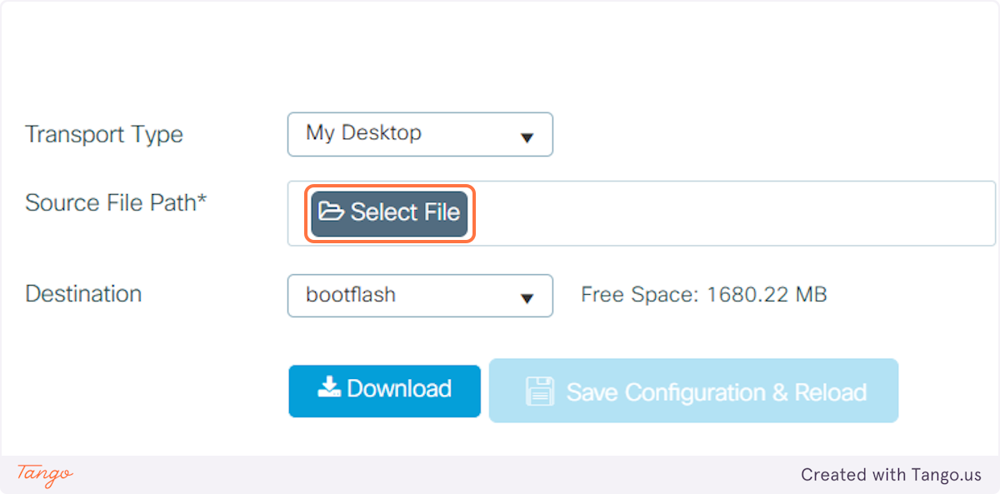
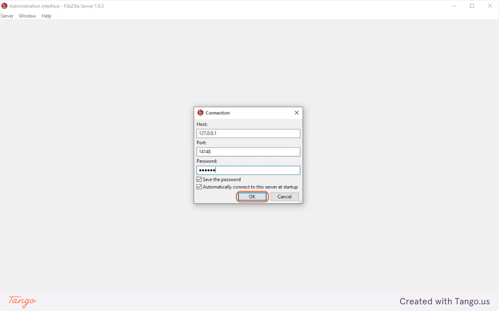
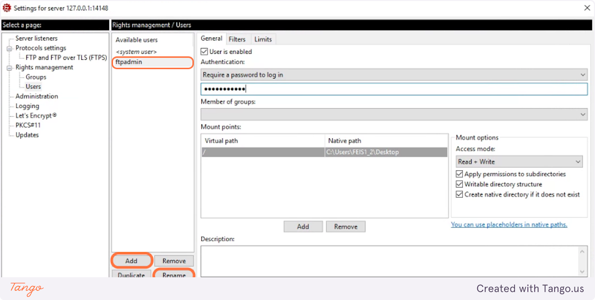
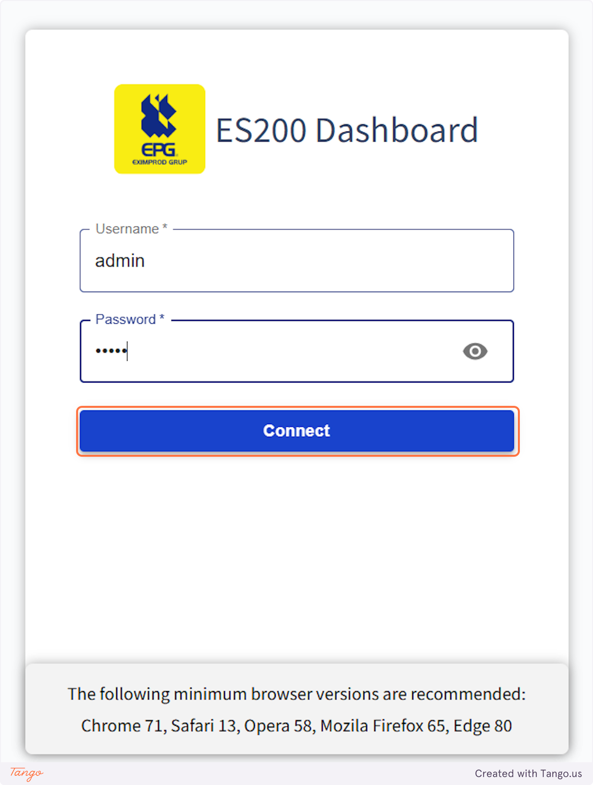

# ES200 manual: transfer loguri prin FTP <!-- omit from toc -->

[**Cuprins:**](#toc)
- [1. Prerechizite](#1-prerechizite)
- [2. Configurarea routerului Cisco IR1101](#2-configurarea-routerului-cisco-ir1101)
  - [2.1. Accesare Cisco WebUI](#21-accesare-cisco-webui)
  - [2.2. Autentificare Cisco](#22-autentificare-cisco)
  - [2.3. Verificarea compatibilității versiunii IOS](#23-verificarea-compatibilității-versiunii-ios)
  - [2.4. Actualizarea versiunii de IOS](#24-actualizarea-versiunii-de-ios)
    - [2.4.1. Navigare către meniul de actualizare a firmware-ului](#241-navigare-către-meniul-de-actualizare-a-firmware-ului)
    - [2.4.2. Selectarea firmware-ului](#242-selectarea-firmware-ului)
    - [2.4.3. Transferul fișierului pe router](#243-transferul-fișierului-pe-router)
    - [2.4.4. Actualizarea firmware-ului](#244-actualizarea-firmware-ului)
    - [2.4.5. Salvarea și reîncărcarea configurării](#245-salvarea-și-reîncărcarea-configurării)
  - [2.5. Adăugarea ES200 pe router](#25-adăugarea-es200-pe-router)
    - [2.5.1. Navigare către meniul IOx](#251-navigare-către-meniul-iox)
    - [2.5.2. Adăugarea unei noi aplicații](#252-adăugarea-unei-noi-aplicații)
    - [2.5.3. Activarea și pornirea aplicației ES200](#253-activarea-și-pornirea-aplicației-es200)
      - [2.5.3.1. Setarea fusului orar](#2531-setarea-fusului-orar)
      - [2.5.3.2. Configurarea rețelei](#2532-configurarea-rețelei)
      - [2.5.3.3. Configurarea perifericelor](#2533-configurarea-perifericelor)
      - [2.5.3.4. Activarea aplicației](#2534-activarea-aplicației)
      - [2.5.3.5. Pornirea aplicației](#2535-pornirea-aplicației)
- [3. Configurarea serverului FTP](#3-configurarea-serverului-ftp)
  - [3.1. Instalare FileZilla Server](#31-instalare-filezilla-server)
  - [3.2. Configurare FileZilla Server](#32-configurare-filezilla-server)
    - [3.2.1. Conectare la serverul de administrare FileZilla](#321-conectare-la-serverul-de-administrare-filezilla)
    - [3.2.2. Configurare Server listeners](#322-configurare-server-listeners)
    - [3.2.3. Configurare utilizatori](#323-configurare-utilizatori)
    - [3.2.4. Configurare Firewall Windows](#324-configurare-firewall-windows)
      - [3.2.4.1. Configurare path FileZilla Server](#3241-configurare-path-filezilla-server)
      - [3.2.4.2. Rulare script PowerShell](#3242-rulare-script-powershell)
      - [3.2.4.3. Verificare regulă în Windows Firewall](#3243-verificare-regulă-în-windows-firewall)
- [4. Configurarea ES200 (logare prin FTP)](#4-configurarea-es200-logare-prin-ftp)
  - [4.1. Accesare ES200 WebServer](#41-accesare-es200-webserver)
  - [4.2. Autentificare ES200](#42-autentificare-es200)
  - [4.3. Încărcarea bazei de date ES200](#43-încărcarea-bazei-de-date-es200)
  - [4.4. Configurarea logării prin FTP](#44-configurarea-logării-prin-ftp)
    - [4.4.1. Configurarea conexiunii FTP](#441-configurarea-conexiunii-ftp)
    - [4.4.2. Configurarea logării punctelor](#442-configurarea-logării-punctelor)
    - [4.4.3. Testarea logării și transferului prin FTP](#443-testarea-logării-și-transferului-prin-ftp)

# 1. Prerechizite

| Nume | Link |
| - | - |
| Firmware Cisco IOS | [https://box.epg.ro/s/d4FJw3xMWWqzPLd](https://box.epg.ro/s/d4FJw3xMWWqzPLd) |
| Pachete ES200 & Dashboard | [https://box.epg.ro/s/TySocdwLp2kMjDW](https://box.epg.ro/s/TySocdwLp2kMjDW) |
| FileZilla Server | [https://filezilla-project.org/download.php?platform=win64&type=server](https://filezilla-project.org/download.php?platform=win64&type=server) |
| Script PowerShell Firewall Windows | [https://box.epg.ro/s/TySocdwLp2kMjDW](https://box.epg.ro/s/TySocdwLp2kMjDW) |

# 2. Configurarea routerului Cisco IR1101

## 2.1. Accesare Cisco WebUI
- În acest exemplu, routerul este accesibil la adresa IP ***10.10.31.43***, astfel că se poate accesa interfața web prin [https://10.10.31.43](https://10.10.31.43).

## 2.2. Autentificare Cisco
- Se introduc credențialele de autentificare pentru routerul Cisco IR1101.
- Click pe ***Login***.

## 2.3. Verificarea compatibilității versiunii IOS
- Se confirmă că versiunea curentă de IOS este compatibilă cu pachetul ES200 care urmează să fie încărcat.
- Versiunea minimă necesară este ***17.13***.
- În caz contrar, se va actualiza versiunea de IOS.

## 2.4. Actualizarea versiunii de IOS

### 2.4.1. Navigare către meniul de actualizare a firmware-ului
- Click pe ***Administration*** -> ***Software Management*** în meniul de navigare din stânga.

### 2.4.2. Selectarea firmware-ului
- Click pe ***Select File*** pentru a încărca [firmware-ul](#1-prerechizite)  corespunzător.
- Se verifică că ***Transport Type*** este setat la ***My Desktop***.
- Pentru ***Destination*** se poate selecta ***flash***, ***bootflash*** sau altă opțiune, în funcție de spațiul de stocare disponibil.

### 2.4.3. Transferul fișierului pe router
- Click pe ***Download*** pentru a transfera fișierul pe router.

- Click pe ***Yes*** pentru a confirma transferul fișierului pe router.

- Se așteaptă finalizarea transferului fișierului pe router.

### 2.4.4. Actualizarea firmware-ului
- Se așteaptă finalizarea procesului de configurare a parametrilor de boot.

- În cazul în care imaginea nu a fost deja verificată, click pe ***Click Here To Verify***.

### 2.4.5. Salvarea și reîncărcarea configurării
- Click pe ***Save Configuration & Reload*** pentru a începe actualizarea firmware-ului.

- Click pe ***Yes*** pentru a confirma repornirea routerului. **Atenție: routerul va reporni!**

- Se așteaptă ca procesul de actualizare a firmware-ului să se încheie și ca routerul să se repornească complet.

- După finalizarea repornirii, este necesară o nouă autentificare.

## 2.5. Adăugarea ES200 pe router

### 2.5.1. Navigare către meniul IOx
- Click pe ***Configuration*** -> ***IOx*** în meniul de navigare din stânga.

- Pentru a accesa meniul IOx, este necesară o nouă autentificare.

### 2.5.2. Adăugarea unei noi aplicații
- Click pe ***Add New*** pentru a adăuga o nouă aplicație.

- Click pe ***Choose File*** pentru a selecta [pachetul](#1-prerechizite) cu extensia ***.tar*** corespunzător imaginii ***ES200***.
- Se completează titlul aplicației cu ***ES200*** și click pe ***OK*** pentru a încărca imaginea pe router.

- Se așteaptă finalizarea încărcării imaginii pe router și crearea aplicației.

### 2.5.3. Activarea și pornirea aplicației ES200

- Click pe ***Activate*** pentru a modifica setările aplicației.

#### 2.5.3.1. Setarea fusului orar

- Se ajustează fusul orar în setările Docker. În prezent, fusul orar este setat pe România. Lista completă a fusurilor orare disponibile poate fi consultată aici: https://en.wikipedia.org/wiki/List_of_tz_database_time_zones#List

#### 2.5.3.2. Configurarea rețelei

- Click pe ***Edit*** pentru a accesa și configura setările de rețea.

- Click pe ***Interface Setting*** pentru a configura interfața de rețea a containerului.

- Se alege opțiunea ***Static*** pentru configurarea adresei IPv4.
- Se setează ***adresa IP***, ***masca de rețea*** și ***adresa gateway-ului*** pentru containerul ES200, conform specificațiilor rețelei ***VirtualPortGroup0***.
- Click pe ***OK*** pentru a salva configurațiile de rețea efectuate.

- Click pe ***OK*** încă o dată pentru confirmare.

#### 2.5.3.3. Configurarea perifericelor

- Click pe ***Edit*** pentru a accesa și configura perifericele, cum ar fi ***porturile seriale***.

- Click pe ***OK*** pentru a adăuga portul serial.

#### 2.5.3.4. Activarea aplicației

- Click pe ***Activate App*** pentru a salva și aplica toate setările.

- Se așteaptă finalizarea procesului de activare a aplicației.

#### 2.5.3.5. Pornirea aplicației

- Click pe ***Applications*** pentru a vizualiza toate aplicațiile.

- Click pe ***Start*** pentru a porni aplicația.

- Containerul ES200 rulează cu succes.

# 3. Configurarea serverului FTP

## 3.1. Instalare FileZilla Server

- Se rulează [installer-ul](#1-prerechizite) pentru FileZilla server.

- Click pe ***I Agree*** pentru a accepta termenii licenței.

- Click pe ***Next*** pentru a continua instalarea.

- Click pe ***Next*** pentru a continua instalarea.

- Click pe ***Next*** pentru a continua instalarea.

- Se alege ***Install as service, started with Windows (default)***.
- Se bifează ***Start server after setup completes***.
- Se bifează ***Run service under the SYSTEM Windows account***.
- Click pe ***Next*** pentru a continua instalarea.

- Se alege o parolă pentru administrarea serverului FTP.
- Se bifează ***Allow administration connections on all network adapters (requires password)***.
- Click pe ***Next*** pentru a continua instalarea.

- Click pe ***Yes*** pentru a accepta faptul că parola nu îndeplinește criteriile de securitate, sau click pe ***No*** pentru a alege o altă parolă.

- Se alege ***Start if user logs on, apply to all users (default)***.
- Se bifează ***Start administration interface after setup completes***.  
- Click pe ***Install*** pentru a finaliza instalarea.

## 3.2. Configurare FileZilla Server

### 3.2.1. Conectare la serverul de administrare FileZilla

- Click pe ***Connect to Server*** pentru a deschide FileZilla Server Interface.

- Se introduce parola de administrare a serverului FTP.    
- Se bifează ***Save the password***.    
- Se bifează ***Automatically connect to this server at startup***.    
- Click pe ***OK*** pentru autentificare.

- Click pe ***Server*** -> ***Configure*** pentru a deschide meniul de configurare.

### 3.2.2. Configurare Server listeners

- În meniul ***Server listeners*** se verifică existența celor două listenere:
  * IPv4: Adresă 0.0.0.0, port 21
  * IPv6: Adresă ::, port 21
- Protocolul pentru orice listener trebuie să fie unul care să suporte ***insecure plain FTP***. Implementarea unui modul FTP securizat în ES200 este ***încă în dezvoltare***.

### 3.2.3. Configurare utilizatori

- Se navighează la ***Rights management*** -> ***Users*** folosind meniul din stânga.
- Click pe ***Add*** pentru a adăuga un utilizator FTP nou:
  * se bifează ***User is enabled***
  * în meniu ***Authentication***
    * se selectează ***Require a password to log in***
    * se introduce o parolă
  * în meniu ***Mount points***
    * se adaugă "/" pentru ***Virtual path***
    * se adaugă o cale din Windows unde se vor salva logurile primite prin FTP pentru ***Native path***
  * în meniu ***Mount options***
    * se selectează ***Read + Write***
    * se bifează ***Apply permissions to subdirectories***
    * se bifează ***Writable directory structure***
    * se bifează ***Create native directory if it does not exist***
- Click pe ***Rename*** pentru a redenumi utilizatorul FTP.
- Click pe ***Apply*** și pe ***OK*** pentru a salva toate setările.

### 3.2.4. Configurare Firewall Windows

- Pentru a permite conexiuni FTP, este necesară configurarea unor reguli în Windows Firewall.

#### 3.2.4.1. Configurare path FileZilla Server

- Se verifică că path-ul pentru executabilul ***FileZilla Server*** este ***C:\\Program Files\\FileZilla Server\\filezilla-server.exe***. În caz contrar, se va actualiza path-ul corect în scriptul PowerShell [***filezilla-firewall-rule.ps1***](#1-prerechizite).

#### 3.2.4.2. Rulare script PowerShell

- Click dreapta pe scriptul [***filezilla-firewall-rule.ps1***](#1-prerechizite) -> ***Run with PowerShell***.
- Se va deschide ***User Account Control*** pentru a acorda drepturi de ***Administrator***.

#### 3.2.4.3. Verificare regulă în Windows Firewall

- Se poate verifica dacă regula pentru FileZilla Server a fost adăugată în Firewall folosind:
  * shortcut-ul ***WIN + R*** și apoi deschiderea ***wf.msc***
  * deschizând ***Windows PowerShell*** și rulând comanda ***Get-NetFirewallRule -DisplayName "Allow FileZilla Server"***

# 4. Configurarea ES200 (logare prin FTP)

## 4.1. Accesare ES200 WebServer

- În acest exemplu, routerul este accesibil la adresa IP ***10.10.31.43***, iar containerul cu ES200, deși are adresa locală ***192.168.2.2***, este expus în exterior prin ***NAT*** la adresa ***10.10.31.44***.
- Astfel, interfața web a ES200 poate fi accesată la [https://10.10.31.44:3000](https://10.10.31.44:3000).
- Atenție: se recomandă utilizarea unui browser bazat pe Chromium, precum ***Google Chrome*** sau ***Microsoft Edge***. **Internet Explorer** NU este suportat!

## 4.2. Autentificare ES200
- Credențialele default sunt:
  * username: ***admin***
  * password: ***admin***

## 4.3. Încărcarea bazei de date ES200

- Click pe ***Upload DB*** pentru a încărca baza de date (configurația) de ES200.
- Se va selecta fișierul cu extensia ***.epgd*** corespunzător.

- După încărcarea bazei de date, procesele ES200 vor reporni, iar conexiunea cu ES200 va fi întreruptă (***Connection Status: Down***). Este necesar să se aștepte restabilirea conexiunii (***Connection Status: Up***) pentru încărcarea completă a configurației.

## 4.4. Configurarea logării prin FTP

- Click pe ***Configure FTP*** pentru a deschide meniul de configurare pentru loguri transmise prin FTP.

### 4.4.1. Configurarea conexiunii FTP
- Se vor completa setările pentru conexiunea cu serverul FTP:
  * Adresa IP
  * Port (default 21)
  * Username
  * Parola
- Acestea trebuie să coincidă cu setările făcute în serverul FTP.

### 4.4.2. Configurarea logării punctelor

- Se vor alege tipurile de puncte care urmează să fie logate în fișiere ***CSV***, pentru fiecare echipament prezent în baza de date din ES200.
- Se va alege dimensiunea maximă a fiecărui log (fișier CSV), până ca acesta să fie transferat prin FTP către server (default 5MB).
- Click pe ***Save*** pentru a salva setările.

### 4.4.3. Testarea logării și transferului prin FTP

- Pentru a testa că ES200 loghează corect punctele selectate și că logurile se transmit cu succes prin FTP, se poate intra din nou în meniul anterior, făcând click pe ***Configure FTP***, după care se va bifa checkbox-ul ***Force transfer all available CSVs*** și se va face click pe ***Save*** pentru a forța transferul logurilor.
- Acest mecanism este destinat **exclusiv** testării sau pentru situațiile în care se dorește transferul fișierelor la un **moment specific**. În mod obișnuit, logurile sunt înregistrate și transferate **automat** prin FTP.

