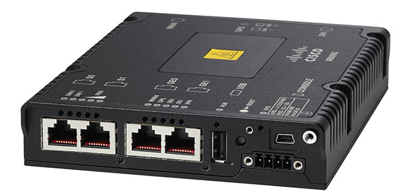

# ES200 vRTU Installation Manual for IOx  <!-- omit from toc -->

- [1. About this manual](#1-about-this-manual)
  - [1.1. Legal Disclaimer](#11-legal-disclaimer)
  - [1.2. General Provisions](#12-general-provisions)
  - [1.3. Abbreviations and terminology](#13-abbreviations-and-terminology)
- [2. Introduction](#2-introduction)
  - [2.1. System Architecture](#21-system-architecture)
  - [2.2. Hardware](#22-hardware)
    - [2.2.1. IR-809: A Compact Powerhouse for Industrial Communications](#221-ir-809-a-compact-powerhouse-for-industrial-communications)
    - [2.2.2. IR-1101: A Secure IoT Gateway for the Modern Edge](#222-ir-1101-a-secure-iot-gateway-for-the-modern-edge)
  - [2.3. Software](#23-software)
    - [2.3.1. ES200: A Software-Defined Remote Terminal Unit (RTU) for Modern Utilities](#231-es200-a-software-defined-remote-terminal-unit-rtu-for-modern-utilities)
- [3. IOS configuration](#3-ios-configuration)
  - [3.1. IR809](#31-ir809)
    - [3.1.1. Network interfaces configuration](#311-network-interfaces-configuration)
    - [3.1.2. DHCP server for IOx VM](#312-dhcp-server-for-iox-vm)
    - [3.1.3. Serial interfaces configuration (optional)](#313-serial-interfaces-configuration-optional)
  - [3.2. IR1101](#32-ir1101)
    - [3.2.1. Enabling IOx](#321-enabling-iox)
    - [3.2.2. Network configuration](#322-network-configuration)
    - [3.2.3. NAT configuration](#323-nat-configuration)
    - [3.2.4. Serial interface configuration (optional)](#324-serial-interface-configuration-optional)
- [4. ES200 Software installation](#4-es200-software-installation)
  - [4.2. IR809](#42-ir809)
  - [4.3. IR1101](#43-ir1101)

# 1. About this manual
The **ES200** virtual RTU software is a versatile solution designed to address a wide range of automation needs in various industries. By leveraging current communication standards, ES200 provides a modern and scalable platform that seamlessly integrates with most existing automation systems. This document outlines the steps required to install and utilize the ES200 software on a Cisco IOx-enabled device.

## 1.1. Legal Disclaimer
The information contained in this document is subject to change without prior notice and does not constitute a commitment from Eximprod. Eximprod assumes no responsibility for the use of the information provided herein.

Eximprod is not liable for any direct or indirect damages arising from the use of this document or any product mentioned herein.

This document is protected by copyright and cannot be reproduced without the written permission of Eximprod. The content of this document cannot be transferred to third parties for unauthorized use.

## 1.2. General Provisions
This document provides comprehensive information about the ES200 software and its installation process. The information presented herein is intended for individuals who will utilize this product to configure various components or for current application purposes.

## 1.3. Abbreviations and terminology

| Abbreviations | Description                  |
| ------------- | ---------------------------- |
| RTU           | Remote Terminal Unit         |
| IED           | Intelligent Electronic Device|
| DC            | Direct Current               |
| SSH           | Secure Shell                 |
| IOS           | Cisco Operating System       |
| IOx           | **IO**S + Linu**x** = IOx    |
| DHCP          | Dynamic Host Configuration Protocol |
| S0 / S1       | Cisco IR809 serial ports     |
| VM            | Virtual Machine              |
| TCP           | Transmission Control Protocol|

# 2. Introduction
ES200 is a versatile control, monitoring, and data acquisition unit meticulously designed for applications across various industries, including utilities, energy, and gas. It seamlessly caters to both automation and control of transformation, power, or connection points, as well as local SCADA systems.

ES200 adheres to the latest international standards, reflecting our engineering teams' extensive expertise in the field. We have crafted a solution capable of operating within a distributed architecture, seamlessly integrating with existing solutions.

ES200 excels in its monitoring, control, and communication gateway functionalities. It effectively captures intelligent protection (IED) signals and enables direct acquisition of digital signals. Additionally, it supports a comprehensive range of standard protocols, including Modbus TCP/RTU, DNP3 TCP/RTU, IEC 60870-5-101/104, IEC 61850 edition 1 & 2, LoRaWAN, for effortless monitoring and information transmission to higher-level systems.

## 2.1. System Architecture
ES200 software can be installed on Cisco routers through various methods:

| Method | Description |
| ------ | ----------- |
| Local Manager | This method utilizes the IOx Local Manager, a built-in tool for managing applications and packages within Cisco routers. |
| ioxclient | This method involves using the ioxclient, a command-line utility for deploying and managing applications on IOx-enabled devices. |
| Fog Director | This method deploys ES200 software through Fog Director, a centralized management platform for Cisco IOx applications. |
| Field Network Director (FND) | This method leverages FND, a cloud-based management platform for Cisco IOx applications. |

This manual focuses on the installation of ES200 software using the Local Manager of IOx.

## 2.2. Hardware
### 2.2.1. IR-809: A Compact Powerhouse for Industrial Communications

Cisco's IR-809 is a tiny yet mighty multimode 3G and 4G LTE wireless router, making it an ideal solution for distribution automation and remote asset management across diverse industrial vertical markets. This robust device boasts an integrated 9.6-60V DC power input and is engineered to withstand challenging environments, including shock, vibration, dust, and humidity. Its wide temperature range, spanning from -40°C to 60°C and validated at 85°C for 16 hours, further exemplifies its resilience.

The IR-809 seamlessly integrates enterprise-class wireline-like services, such as quality of service (QoS), ensuring reliable and prioritized data transmission. It also leverages Cisco's advanced virtual private network (VPN) technologies, including Dynamic Multipoint VPN (DMVPN) and Flexible VPN (FlexVPN), to establish secure and highly private data communication tunnels. Additionally, it supports multiple Virtual Routing and Forwarding (VRF) instances, enabling secure compartmentalization of data, voice, and video traffic.

To further extend its connectivity capabilities, the IR-809 embraces Cisco IOx, an open, extensible environment specifically designed for hosting applications at the network edge. This enables the deployment of innovative applications tailored to specific industrial needs.

Furthermore, the IR-809 expands connectivity options by incorporating low-power wide-area (LPWA) access using the Cisco Interface Module for LoRaWAN. This enables seamless integration with IoT devices, facilitating data acquisition and remote monitoring in remote or resource-constrained environments.

</p>
Figure 1: The Cisco IR-809 Industrial Wireless Router

This compact and rugged router offers a comprehensive suite of features catering to the demanding requirements of industrial communications. Its combination of enterprise-class services, advanced VPN technologies, multiple VRF instances, Cisco IOx support, and LPWA capability makes it an invaluable asset for modern industrial applications.

### 2.2.2. IR-1101: A Secure IoT Gateway for the Modern Edge

The Cisco IR-1101 is a rugged and compact industrial router designed to provide secure connectivity for IoT devices in harsh environments. Its 5G ready modular design ensures future-proofing, allowing you to upgrade to new communication protocols as they become available without the need for costly hardware replacements.

</p>
Figure 2: The Cisco IR-1101 Industrial Router

The IR-1101 supports a wide range of WAN connections, including 4G/LTE, 5G, and private LTE. It also offers edge computing capabilities, allowing you to run applications close to your IoT devices, reducing latency and improving performance. Additionally, the IR-1101 includes a built-in storage module for storing data generated by IoT devices.

With its expandable design, the IR-1101 can be customized to meet the specific needs of your IoT deployments. You can add or upgrade WAN, edge compute, and storage components as your technologies and requirements evolve.

The IR-1101 is ideal for a variety of IoT applications, including:

Industrial automation: Connect and monitor industrial equipment, such as sensors, actuators, and industrial control systems.
Smart buildings: Collect data from building systems, such as HVAC, lighting, and security, to optimize energy consumption and improve occupant comfort.
Smart cities: Connect and manage infrastructure assets, such as traffic lights, streetlights, and parking meters.
Agriculture: Collect data from agricultural equipment and sensors to optimize crop yields and resource management.
The Cisco IR-1101 is a cost-effective and reliable solution for secure IoT connectivity in the modern edge. With its modular design, expandable capabilities, and rugged construction, the IR-1101 can help you deploy and manage IoT solutions that meet the demands of your business.

## 2.3. Software
### 2.3.1. ES200: A Software-Defined Remote Terminal Unit (RTU) for Modern Utilities

ES200 is a software-defined remote terminal unit (RTU) that operates on Cisco hardware running the IOx application hosting platform (e.g., IR809, IR1101, etc). It offers a comprehensive suite of features designed to address the evolving needs of modern utilities:

| Feature | Description |
| --- | --- |
| Integrated Monitoring and Control | Real-time monitoring and control of distribution networks, ensuring reliable power delivery and minimizing outages. |
| Data Analytics | Collecting, analyzing, and utilizing data from smart meters to optimize energy consumption and improve grid efficiency. |
| Remote Asset Management | Efficient management of remote substations, transformers, and other critical infrastructure. |
| Smart Metering and Data Analytics | Collecting, analyzing, and utilizing data from smart meters to optimize energy consumption and improve grid efficiency. |
| Backward Compatibility with Legacy Equipment | Maintains compatibility with legacy equipment, allowing for a smooth transition to modern IoT-based solutions while preserving existing investments. |
| Enhanced Security and Automation | Strengthens security measures and automates processes, enhancing the overall operational efficiency and reducing the risk of disruptions. |
| Modular Design | Modular design allows for easy updates and reconfiguration of software functions, enabling utilities to adapt to changing requirements and optimize their operations. |
| Interoperability | Seamless integration with other third-party applications and services, fostering data exchange and enabling holistic system management. |

</p>
Figure 3: The ES200 Software-Defined Remote Terminal Unit Architecture

# 3. IOS configuration

To successfully run an IOx application on Cisco routers, specific router configurations are required before installing the application. This manual will provide detailed steps on how to configure Cisco IR-809 and Cisco IR-1101 routers to enable their IOx platforms for applications.

Assumptions:
1. The network configurations of the router are already completed.
2. SSH is enabled on the device.
3. GE0 is configured as the WAN port and GE1 is configured as the LAN port.

Given that ES200 requires external connections from the WAN, there are two methods for allowing communications to the ES200 container:

**Method 1: Port Forwarding**

This method involves forwarding a specific port from the WAN interface to the ES200 container. This method provides direct access to the ES200 container from the WAN, but it can expose the container to potential security risks.

**Method 2: NAT with External IP**

This method involves assigning an additional IP address from the WAN network to the ES200 container (IR1101) or the IOx VM (IR809). This method enhances security by isolating the ES200 container from the WAN while enabling access from the designated external IP address.

This manual will focus on explaining Method 2: NAT with External IP.

## 3.1. IR809
The Cisco IR809 is an industrial router that runs a LynxWorks hypervisor on top of which runs three Virtual Machines (VM), the IOS VM, the IOx VM and the Virtual Device Server. To find out more about how this works please visit this [link.](https://developer.cisco.com/docs/iox/%23!ir-800-series-platform-information/ir8xx-platforms)

Our VMs of interest are IOS and IOx. IOS VM is the virtual machine which executes the routing functions, while the IOx VM is the one which executes the Cisco Application Framework (CAF) on which ES200 software runs. The IOx VM is named GuestOS in IOS.

Between those two VMs there is an emulated Ethernet link. This links supports IPv4 and IPv6. The IOS end of the emulated link is managed by GE2 virtual interface on IR809 and the IOx end is managed using a DHCP server.

The configuration of the IR809 IOS has three steps that must be accomplished for the ES200 software to run properly:

* Configuration of the network interface 
* Configuration of a DHCP server for IOx VM 
* Configuration of the serial interfaces (optional)

For detailed information on what and how you can configure furthermore the GuestOS in the Cisco IR809 router, please follow this [link.](https://www.cisco.com/c/en/us/td/docs/routers/access/800/829/software/configuration/guide/b_IR800config/b_guestos.html)

### 3.1.1. Network interfaces configuration

To have connectivity between the IOS and IOx one must configure the GE2 interface on the router. Our recommendation is to use a /30 network as you will need the same IP address of the IOx VM every time. In this example, the GE2 interface’s IP address will be set to 192.168.2.1/30.

Also, to ensure connectivity between them, the IOx needs IPv6 enabled on the interface with autoconfiguration on.

```
R1-epg(config)# interface GigabitEthernet 2
R1-epg(config-if)# ip address 192.168.2.1 255.255.255.252
R1-epg(config-if)# ip nat inside
R1-epg(config-if)# ipv6 address autoconfig
R1-epg(config-if)# ipv6 enable
R1-epg(config-if)# no shutdown
```

As one can see, we activated the *ip nat inside* which will allow traffic from the WAN to arrive to the IOx using NAT. In order to achieve this, one must enable *ip nat outside* on the WAN interface, which in our case is GE0.

Once we enabled this, one can also configure the NAT rule, In our case the NAT is done IP to IP as follows:
```
R1-epg(config)# ip nat inside source static 192.168.2.2 10.10.30.182	
```

This allows the WAN packets to access the IOx VM using the IP 10.10.30.182.

### 3.1.2. DHCP server for IOx VM

Now that one has configured the IOS networking part, we need to make sure that the IOx VM will have access to a DHCP server from where it can take an IP address. For that, it is necessary to configure a DHCP server on the IOS. The DHCP server will be for the network 192.168.2.0/30 and will have a the default router set on 192.168.2.1.

```
R1-epg(config)# ip dhcp pool gospool
R1-epg(dhcp-config)# network 192.168.2.0 255.255.255.252
R1-epg(dhcp-config)# default-router 192.168.2.1
R1-epg(dhcp-config)# domain-name epg.ro
R1-epg(dhcp-config)# dns-server 8.8.8.8
R1-epg(dhcp-config)# exit
```

### 3.1.3. Serial interfaces configuration (optional)

IR809 has two serial ports, S0 and S1. The S0 serial port can act as a RS232 or RS485 interface, and the S1 serial port can only act as an RS232 interface.

To relay the information coming from the S0 port to the ES200 application one must do the following IOS configuration:

```
R1-epg(config)# interface Async0
R1-epg(config-if)# encapsulation relay-line
R1-epg(config-if)# exit
R1-epg(config)# line 1
R1-epg(config-line)# transport input all
R1-epg(config-line)# exit
R1-epg(config)# relay line 1 1/5 propagation

```

To relay the information coming from the S1 port to the ES200 application one must do the following IOS configuration:

```
R1-epg(config)# interface Async1
R1-epg(config-if)# encapsulation relay-line
R1-epg(config-if)# exit
R1-epg(config)# line 2
R1-epg(config-line)# transport input all
R1-epg(config-line)# exit
R1-epg(config)# relay line 2 1/6 propagation
```

## 3.2. IR1101

The Cisco IR1101 is an industrial router that runs IOS-XE, an open and flexible operating system optimized for the new era of enterprise networks. In here, the Cisco Application Framework (CAF) is run as a process inside the IOS-XE.

IR-1101 platform information for IOx apps

| Parameter | Value |
| --- | --- |
| CPU architecture | ARM 64-bit (aarch64) |
| CPU | 1255 Units |
| Memory | 862 MB |
| Storage | 701 MB |
| Serial ports | 1 (5 with IRM-1100-4AT) |

In order to run the ES200 application on the Cisco IR1101, the following steps must be done:

* Enable IOx
* Configure the networking
* Configure NAT
* Configuration of the Serial interface (optional)

For further more information about what other things can be configured on the IR1101 IOx part, please visit the following [link.](https://www.cisco.com/c/en/us/td/docs/routers/access/1101/software/configuration/guide/b_IR1101config/b_IR1101config_chapter_010001.html)

### 3.2.1. Enabling IOx

To enable iox, one must have the http/https server configured and also a username and a password set in the IOS. To do so, use the following commands:

### 3.2.2. Network configuration

The network architecture between the IOS-XE and the CAF is different than the one in the IR809. In here, the IOS-XE hosts a bridge network called VirtualPortGroup0.

To configure this interface, one must follow the following commands:

```
R2-epg(config)# interface virtualportgroup 0
R2-epg(config-if)# ip address 192.168.2.1 255.255.255.0
R2-epg(config-if)# ip nat inside
```

### 3.2.3. NAT configuration

As discussed also for the IR809, for the WAN connections to arrive into the ES200 application, we will configure a NAT. We need to enable _ip nat outside _on the GigabitEthernet 0/0/0 interface (we assume that this is the WAN interface). After doing so, one must do a NAT rule between the WAN IP address and the ES200 application IP address. We also assume that the IP address of the ES200 application will be 192.168.2.2 and the IP address for the WAN will be 10.10.30.183.

To do so, one must follow the following commands:

```
R2-epg(config)# interface GigabitEthernet 0/0/0
R2-epg(config-if)# ip nat outside
R2-epg(config-if)# exit
R2-epg(config)# ip nat inside source static 192.168.2.2 10.10.30.183
```

### 3.2.4. Serial interface configuration (optional)

The IR1101 has an RS232 serial port that can be relayed into any IOx application on the router. To do this, one must do the following IOS configuration:

```
R1-epg(config)# interface Async0/2/0
R1-epg(config-if)# encapsulation relay-line
R1-epg(config-if)# exit
R2-epg(config)# relay line 0/2/0 0/0/0

```

# 4. ES200 Software installation

The ES200 software is wrapped up in a Docker container which is then converted into an LXC container using the _ioxclient _application provided by Cisco. The latest version of the ES200 application is 20.01.02LTS. Please make sure that when you install the software on the router you have the same version as stated in this document. If you do not have the latest version, please contact [es200_support@epg.ro.](mailto:es200_support@epg.ro)

## 4.2. IR809

First step is to open a browser and acces https://IP:8443, where IP is the one used on NAT configuration, in this example 10.10.30.182.

Use a username and a password that you have set as an administrator on the router to login.

Check in the System settings tab that Application Signature is disabled.

In order to install ES200, go to Applications tab then press add new.

In the window shown, fields must be completed with: application ID is ES200 and Application Archive.

Now that we added the ES200 application, it must appear in the Applications tab with DEPLOYED status. To activate ES200, press Activate.

In the shown menu chose async0 and iox-nat0, then press Port Mapping.

In the shown menu chose Custom then press OK. After you're done press Activate from Activate application menu.

Now ES200’s status must be ACTIVATED. To start the application, from Application tab press Start.

After pressing Start, application status will change to RUNNING from ACTIVATED.

## 4.3. IR1101

For the IR1101, the procedure to install the ES200 is mostly the same. The difference between the two procedures are that the IOx web interface is accessible from the IOS-XE web interface and the networking of the application is part of the VirtualPortGroup0.

First step is to open a web browser and navigate to the https://[IP]. This will send you to the login page.

After you login, use the left menu to go to the IOx web interface

From this step you need to do the same things as in the IR809 installation process. Check in the System settings tab that Application Signature is disabled.

In order to install ES200, go to Applications tab then press add new.

In the window shown, fields must be completed with application ID is ES200 and Application Archive.

Now that we added the ES200 application, it must appear in the Applications tab with DEPLOYED status. To activate ES200, press Activate.

In the shown menu chose async0 and VPG0, then press Interface settings.

In the shown menu chose Static and configure the IP addresses as shown. If you didn’t use this manual to configure the VPG0 interface, then the IP address in this menu must correspond to an assignable IP address from the VPG0 interface network. After completing to fill in the form, press OK. Then press Activate.

Now ES200’s status must be ACTIVATED. To start the application, from Application tab press Start.

After pressing Start, application status will change to RUNNING from ACTIVATED.