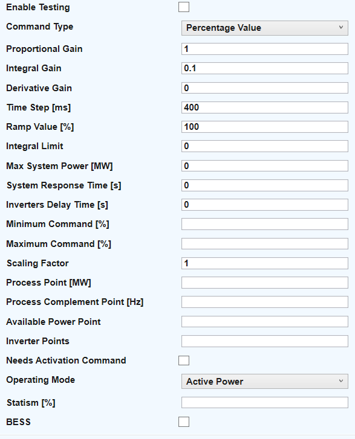
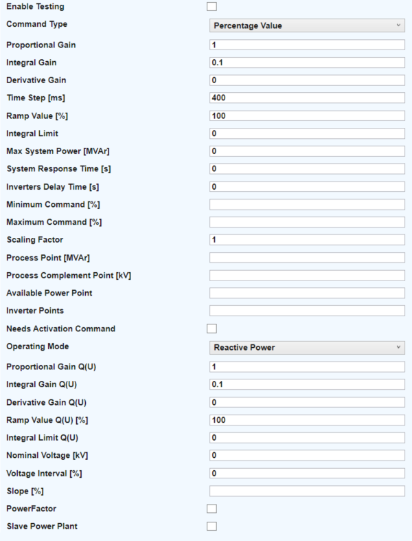
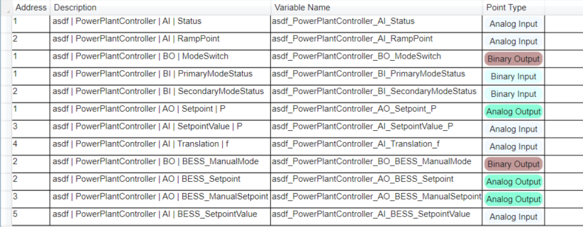
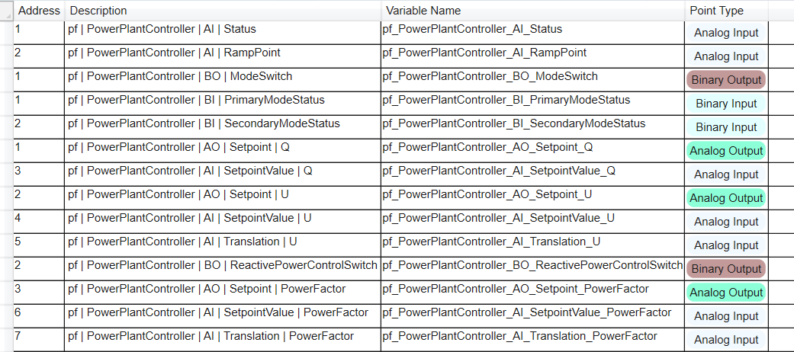

# ES200 Power Plant Controller Manual<!-- omit from toc -->

[**Table of Contents:**](#toc)
- [1. Introduction](#1-introduction)
- [2. Legal Information](#2-legal-information)
- [3. General dispositions](#3-general-dispositions)
- [4. Configuration Variables](#4-configuration-variables)
  - [4.1. Common Configuration](#41-common-configuration)
    - [4.1.1. Proportional Gain](#411-proportional-gain)
    - [4.1.2. Integral Gain](#412-integral-gain)
    - [4.1.3. Derivative Gain](#413-derivative-gain)
    - [4.1.4. Time Step](#414-time-step)
    - [4.1.5. System Response Time](#415-system-response-time)
    - [4.1.6. Inverter Delay Time](#416-inverter-delay-time)
    - [4.1.7. Ramp Value](#417-ramp-value)
    - [4.1.8. Max System Power](#418-max-system-power)
    - [4.1.9. Minimum and Maximum Command](#419-minimum-and-maximum-command)
    - [4.1.10. Scaling Factor](#4110-scaling-factor)
    - [4.1.11. Command Type](#4111-command-type)
    - [4.1.12. Operating Mode](#4112-operating-mode)
    - [4.1.13. Process Point](#4113-process-point)
    - [4.1.14. Process Complement Point](#4114-process-complement-point)
    - [4.1.15. Available Power Point](#4115-available-power-point)
    - [4.1.16. Inverter Points](#4116-inverter-points)
    - [4.1.17. Needs Activation Command](#4117-needs-activation-command)
    - [4.1.18. Inverter Activation Points](#4118-inverter-activation-points)
  - [4.2. Active Power Configuration](#42-active-power-configuration)
    - [4.2.1. Statism](#421-statism)
    - [4.2.2. BESS](#422-bess)
    - [4.2.3. BESS Configuration Variables](#423-bess-configuration-variables)
      - [4.2.3.1. Target SOC](#4231-target-soc)
      - [4.2.3.2. Lower SOC Bound](#4232-lower-soc-bound)
      - [4.2.3.3. Upper SOC Bound](#4233-upper-soc-bound)
      - [4.2.3.4. Charge Coefficient](#4234-charge-coefficient)
      - [4.2.3.5. Discharge Coefficient](#4235-discharge-coefficient)
      - [4.2.3.6. Deadband](#4236-deadband)
      - [4.2.3.7. Ramp Value](#4237-ramp-value)
      - [4.2.3.8. Max System Power](#4238-max-system-power)
      - [4.2.3.9. Minimum and Maximum Command](#4239-minimum-and-maximum-command)
      - [4.2.3.10. Scaling Factor](#42310-scaling-factor)
      - [4.2.3.11. Command Type](#42311-command-type)
      - [4.2.3.12. SOC Point](#42312-soc-point)
      - [4.2.3.13. Active Power Point](#42313-active-power-point)
      - [4.2.3.14. Command Points](#42314-command-points)
  - [4.3. Reactive Power Configuration](#43-reactive-power-configuration)
    - [4.3.1. Proportional Gain Q(U)](#431-proportional-gain-qu)
    - [4.3.2. Integral Gain Q(U)](#432-integral-gain-qu)
    - [4.3.3. Derivative Gain Q(U)](#433-derivative-gain-qu)
    - [4.3.4. Nominal Voltage](#434-nominal-voltage)
    - [4.3.5. Voltage Interval](#435-voltage-interval)
    - [4.3.6. Slope](#436-slope)
    - [4.3.7. Power Factor](#437-power-factor)
      - [4.3.7.1. Active Power Point](#4371-active-power-point)
    - [4.3.8. Slave Power Plant](#438-slave-power-plant)
- [5. Operating Modes](#5-operating-modes)
  - [5.1. Mode P](#51-mode-p)
  - [5.2. Mode P(f)](#52-mode-pf)
  - [5.3. Mode Q](#53-mode-q)
    - [5.3.1. Mode Q - Power Factor Control](#531-mode-q---power-factor-control)
  - [5.4. Mode Q(U)](#54-mode-qu)
    - [5.4.1. Mode Q(U) - Slave Power Plant(s)](#541-mode-qu---slave-power-plants)
- [6. Pre-configured points](#6-pre-configured-points)
  - [6.1. Active Power Mode Points](#61-active-power-mode-points)
  - [6.2. Reactive Power Mode Points](#62-reactive-power-mode-points)

## 1. Introduction
The **Power Plant Controller** is designed to manage and control power output in a dynamic and efficient manner. By leveraging PID control strategies, the controller is capable of handling both active and reactive power adjustments, as well as rapidly responding to system frequency and voltage deviations. 
This document provides detailed information about the configuration variables and operating modes that enable the controller to optimize performance under various conditions.

## 2. Legal Information

The information in this document is subject to change without prior notice and is not a commitment on the part of the supplier. Eximprod does not take responsibility for the use of the information in this document. 

Eximprod is not responsible for any direct or indirect matter of any nature that may result from the use of this document or any product mentioned in the document.

The software described in this document is licensed and may only be used in accordance with the terms of this license.

The information in this document cannot be reproduced or copied without the written permission of Eximprod and the content cannot be given to a third party for unauthorized use.

## 3. General dispositions

This document provides information about the ES200 Power Plant Controller software and its main features. The information available in this manual is intended for personnel who will use this product to configure the PPC equipment or for current use.

## 4. Configuration Variables

The Power Plant Controller is configured through a set of variables that define its behavior and operational parameters. These variables are set through the ES200 Dashboard interface.

  <figure style="margin:0; width:65%; text-align:center;">
    

      
    

    <figcaption style="margin-top:8px;">
      Figure 1: PPC configuration variables in ES200 Dashboard for Active Power mode
    </figcaption>
  </figure>

  <figure style="margin:0; width:65%; text-align:center;">
    

      
    

    <figcaption style="margin-top:8px;">
      Figure 2: PPC configuration variables in ES200 Dashboard for Reactive Power mode
    </figcaption>
  </figure>

### 4.1. Common Configuration
This section applies to configuration parameters that are present for all `PowerPlantController` modes regardless of which `Operating Mode` is being configured.

   #### 4.1.1. Proportional Gain
   - **Type:** *Numerical Value*  
   - **Purpose:** Represents the proportional gain of the PID controller.
   - **Default:** 1

   #### 4.1.2. Integral Gain
   - **Type:** *Numerical Value*  
   - **Purpose:** Represents the integral gain of the PID controller.
   - **Default:** 0.1

   #### 4.1.3. Derivative Gain
   - **Type:** *Numerical Value*  
   - **Purpose:** Represents the derivative gain of the PID controller.
   - **Default:** 0

   #### 4.1.4. Time Step
   - **Type:** *Time Value (ms)*  
   - **Purpose:** Determines the calculation time step for the controller. This value dictates how fast the controller calculates commands for the system and should be set according to how quickly the system can accept commands to avoid integral wind-up.
   - **Default:** 400 ms

   #### 4.1.5. System Response Time
   - **Type:** *Time Value (s)*  
   - **Purpose:** Represents how fast the system responds to a command in a closed loop. This defines the execution time for a command, only affected by the PID parameters and with no ramped output. This parameter is used to calculate the ramp points that will be used by the controller.
   - **Default:** 0 s

   #### 4.1.6. Inverter Delay Time
   - **Type:** *Time Value (s)*  
   - **Purpose:** Used for inverters or setups that have a known delay between receiving commands and starting execution. It works by sendind a *dummy command* to the inverter represented by the first ramp point calculated, and after the configured time has elapsed, the controller returns to its regular functionality.
   - **Default:** 0 s

   #### 4.1.7. Ramp Value
   - **Type:** *Percentage*  
   - **Purpose:** Determines the speed of the output ramp trend of the controller.
   - **Default:** 0

   #### 4.1.8. Max System Power
   - **Type:** *Power Value (MW/MVAr)*  
   - **Purpose:** Represents the maximum output power of the controlled system.
   - **Default:** 0

   #### 4.1.9. Minimum and Maximum Command
   - **Type:** *Boundary Values*  
   - **Purpose:** Lower and upper bounds for the control commands. The unit depends on the command type.
   - **For Absolute values:** 
   - **Default Lower Bound:** 0 for active power control or -Max System Power for reactive power control
   - **Default Upper Bound:** Max System Power
   - **For Percentage commands:** 
   - **Default Lower Bound:** 0 for active power control or -100 for reactive power control
   - **Default Upper Bound:** 100

   #### 4.1.10. Scaling Factor
   - **Type:** *Scalar Value*  
   - **Purpose:** Used to scale the output commands of the PID controller. Scaling is applied before the command is distributed to all connected points.

   #### 4.1.11. Command Type
   - **Type:** *Selection*  
   - **Purpose:** The controller can output commands as an **absolute value** or as a **percentage** (the percentage being based on the specified `Max System Power`).

   #### 4.1.12. Operating Mode
   - **Type:** *Mode Selection*  
   - **Purpose:** The controller operates in either `Active Power` or `Reactive Power` mode.
   - **Active Power Mode:** 
   - Setpoint-based active power control with automatic frequency response.
   - Active power control that strictly follows frequency changes within a narrow window while still accepting setpoints.
   - **Reactive Power Mode:** 
   - Setpoint-based reactive power control.
   - A hybrid reactive power control scheme that follows the voltage curve within a defined window while still accepting setpoints.

   #### 4.1.13. Process Point
   - **Type:** *Data Point*  
   - **Purpose:** The primary data point for the control process measurement. For `Active Power`, this should be the measured power output of the system; for `Reactive Power`, the measured reactive power output.

   #### 4.1.14. Process Complement Point
   - **Type:** *Data Point*  
   - **Purpose:** The auxiliary measurement data point. For `Active Power`, this is the system frequency; for `Reactive Power`, it is the system voltage.

   #### 4.1.15. Available Power Point
   - **Type:** *Data Point*  
   - **Purpose:** A data point providing an estimated `Available Power` for the system (e.g., an estimate from a weather station). This is an optional point to be set if an estimation is available.

   #### 4.1.16. Inverter Points
   - **Type:** *Data Points List*  
   - **Purpose:** Data points, formatted as a comma-separated list, representing the registers of the inverters to which the controller's commands should be sent.

   #### 4.1.17. Needs Activation Command
   - **Type:** *Boolean Flag*  
   - **Purpose:** Indicates whether the inverter requires an activation command to execute the current command being sent to them.

   #### 4.1.18. Inverter Activation Points
   - **Type:** *Data Points List*  
   - **Purpose:** Similar to **Inverter Points** in formatting, these represent the inverter registers that receive the activation commands. These only need to be specified if the **Needs Activation Command** flag is checked.

### 4.2. Active Power Configuration

#### 4.2.1. Statism
- **Type:** *Percentage*  
- **Purpose:** Describes the ratio between the relative deviation of frequency and the relative deviation of active power.

#### 4.2.2. BESS
- **Type:** *Boolean Flag*  
- **Purpose:** Enables the configuration of the `BESS` subprocess inside the `PowerPlantController`.

#### 4.2.3. BESS Configuration Variables
These configuration variables apply only if the `BESS` flag is enabled.

##### 4.2.3.1. Target SOC
- **Type:** *Percentage*  
- **Purpose:** Desired State of Charge for the battery system.  
- **Default:** 50%

##### 4.2.3.2. Lower SOC Bound
- **Type:** *Percentage*  
- **Purpose:** Minimum SOC limit below which the battery cannot discharge.  
- **Default:** 30%

##### 4.2.3.3. Upper SOC Bound
- **Type:** *Percentage*  
- **Purpose:** Maximum SOC limit above which the battery cannot charge.  
- **Default:** 70%

##### 4.2.3.4. Charge Coefficient
- **Type:** *Numerical Value*  
- **Purpose:** Scaling coefficient \[0,1\] for charging commands sent to the BMS.  
- **Default:** 1

##### 4.2.3.5. Discharge Coefficient
- **Type:** *Numerical Value*  
- **Purpose:** Scaling coefficient \[0,1\] for discharge commands sent to the BMS.  
- **Default:** 1

##### 4.2.3.6. Deadband
- **Type:** *Percentage*  
- **Purpose:** Defines a tolerance region where command deviation is considered acceptable.

##### 4.2.3.7. Ramp Value
- **Type:** *Percentage*  
- **Purpose:** Determines the speed of the output ramp trend for BESS active power control.

##### 4.2.3.8. Max System Power
- **Type:** *Power Value (MW)*  
- **Purpose:** Maximum active power output capability of the BESS controlled system.

##### 4.2.3.9. Minimum and Maximum Command
- **Type:** *Boundary Values*  
- **Purpose:** Lower and upper bounds for BESS power commands.  

- **For Absolute values:**  
   - **Lower Bound:** –Max System Power  
   - **Upper Bound:** +Max System Power  

- **For Percentage commands:**  
   - **Lower Bound:** –100  
   - **Upper Bound:** +100

##### 4.2.3.10. Scaling Factor
- **Type:** *Scalar Value*  
- **Purpose:** Scales BESS output commands before distribution to command points.

##### 4.2.3.11. Command Type
- **Type:** *Selection*  
- **Purpose:** Specifies whether commands are **absolute values** or **percentages** of `Max System Power`.

##### 4.2.3.12. SOC Point
- **Type:** *Data Point*  
- **Purpose:** Primary data point used to measure State of Charge.

##### 4.2.3.13. Active Power Point
- **Type:** *Data Point*  
- **Purpose:** Measurement point for BESS active power output.

##### 4.2.3.14. Command Points
- **Type:** *Data Points List*  
- **Purpose:** Comma-separated list of registers receiving BESS control commands.

### 4.3. Reactive Power Configuration

   #### 4.3.1. Proportional Gain Q(U)
   - **Type:** *Numerical Value*  
   - **Purpose:** Represents the proportional gain of the PID controller applied when switching to voltage control.
   - **Default:** 1

   #### 4.3.2. Integral Gain Q(U)
   - **Type:** *Numerical Value*  
   - **Purpose:** Represents the integral gain of the PID controller applied when switching to voltage control.
   - **Default:** 0.1

   #### 4.3.3. Derivative Gain Q(U)
   - **Type:** *Numerical Value*  
   - **Purpose:** Represents the derivative gain of the PID controller applied when switching to voltage control.
   - **Default:** 0

   #### 4.3.4. Nominal Voltage
   - **Type:** *Voltage Value (kV)*  
   - **Purpose:** The nominal voltage value of the system.

   #### 4.3.5. Voltage Interval
   - **Type:** *Percentage*  
   - **Purpose:** Describes the range within which the system voltage can vary. For example, for a 20 kV system with a voltage interval of 5%, the maximum allowed voltage setpoint is 21 kV.

   #### 4.3.6. Slope
   - **Type:** *Percentage*  
   - **Purpose:** Similar to the `Statism` property in `Active Power` mode, it represents the dependency between voltage and reactive power.

   #### 4.3.7. Power Factor
   - **Type:** *Boolean Flag*  
   - **Purpose:** Enables reactive power control in reference to power factor rather than the measured reactive power in the system.

   ##### 4.3.7.1. Active Power Point
   - **Type:** *Data Point*  
   - **Purpose:** Data point from which to read active power measurements.

   #### 4.3.8. Slave Power Plant
   - **Type:** *Boolean Flag*  
   - **Purpose:** Enables voltage control of multiple sites in parallel. 

   For the configuration of `Slave Power Plants` the following parameters must be specified:
      - Max System Power \[MVAr\]
      - Process Point \[MVAr\]
      - Process Complement Point \[kV\]
      - Inverter Points
      - Needs Activation Command
      - Inverter Activation Points

## 5. Operating Modes

The Power Plant Controller has two main operating modes, each with two submodes that offer distinct characteristics and functionality:

- **Active Power**
  - [Mode P (RFA-SC/CR)](#151-mode-p)
  - [Mode P(f) (RFA)](#152-mode-pf)
- **Reactive Power**
  - [Mode Q](#153-mode-q)
  - [Mode Q(U)](#154-mode-qu)

### 5.1. Mode P
This is the primary **Active Power** operating mode, responsible for processing incoming active power setpoints while dynamically responding to frequency deviations. Mode P validates new setpoints and continuously monitors system frequency, adjusting the active power output as needed to maintain stability.

**Default Setpoint:** The mode starts with a setpoint equal to `Max System Power`.

- **Setpoint Handling:** When a new active power setpoint is received, Mode P verifies that it is within acceptable bounds (i.e., between 0 and `Max System Power`). If the setpoint is out of bounds, it reverts to the last valid value and flags this with an appropriate status update.
- **Ramped Output Strategy:** For valid setpoints, Mode P initiates a ramped output strategy by breaking the transition from the current power level to the new setpoint into incremental steps. This ensures a smooth and controlled change.
- **Frequency Correction:** Mode P detects if the system frequency deviates beyond predefined thresholds. In such cases, it calculates a corrective command based on the deviation from the nominal frequency and adjusts the active power output accordingly. This frequency-based control is synchronized with inverter setup delays to ensure proper command execution.

### 5.2. Mode P(f)
This secondary **Active Power** operating mode is designed to rapidly counteract deviations in system frequency while accommodating active power setpoint adjustments. Mode P(f) operates within a very narrow insensibility band (±0.01) to promptly address any frequency variations.

- **Frequency Correction:** When the measured frequency deviates outside the defined reference limits, Mode P(f) computes a corrective command by comparing the nominal frequency to the current process measurement, thereby adjusting the active power output.
- **Inverter Setup and Timing:** Mode P(f) incorporates inverter setup delays and carefully manages timing intervals to ensure that frequency corrections are applied accurately and only when the system is ready.
- **Ramped Output Transition:** If a new active power setpoint is issued, Mode P(f) transitions to a ramped output strategy by generating intermediate ramp points to smoothly transition from the current power level to the new setpoint. This approach prevents sudden changes while prioritizing frequency corrections.
- **Internal Updates:** Mode P(f) continuously updates its internal parameters, such as the previous power value and insensibility limits, and uses status callbacks to signal key events (e.g., executing a frequency command, engaging ramp output, or detecting an out-of-bound setpoint).

### 5.3. Mode Q
This is the primary **Reactive Power** operating mode, dedicated to processing and executing reactive power setpoints with rapid response. Mode Q bypasses ramped output strategies in favor of immediate command execution.

**Default Setpoint:** The mode starts with a setpoint equal to `0`.

- **Setpoint Validation:** When a new reactive power setpoint is received, Mode Q first validates it against preset boundaries defined by `Max System Power`. If the setpoint exceeds these limits, it is automatically rejected and reverts to the previous valid value, with a corresponding status update.
- **Inverter Setup Delay:** For valid setpoint changes, a brief inverter setup delay may be initiated (as defined by the `Inverter Delay Time` parameter). During this delay, the new command is held until the system is ready to execute the change.
- **Immediate Execution:** Once the delay elapses, the reactive power command is committed, and the new setpoint is stored and executed immediately. Throughout this process, Mode Q provides continuous status feedback regarding the command's execution.

#### 5.3.1. Mode Q - Power Factor Control
This is a submode of the primary **Reactive Power** control, which is based on power factor calculations. If configured using the specified points in [Chapter 4](#437-power-factor), it allows the user to provide power factor setpoints to the controller, which are then computed using the active power measurements to compute the required reactive power setpoint. 

The range for the power factor command is \[-1, 1\] excluding `0`. 

The corresponding reactive power setpoint is computed using the following formula `Q = P * tg[arccos(PF)]`.

The user can freely transition between `Mode Q` and `Mode Q - Power Factor` and between `Mode Q(U)` and `Mode Q - Power Factor` using the `Reactive Power Control Switch` point. (todo: add link to point docs). The aim of the controller when switching between these modes, `Mode Q -> Mode Q - Power Factor` and `Mode Q(U) -> Mode Q - Power Factor`, is to compute the power factor setpoint so as to maintain the same reactive power value in the system as before the switch happened.

### 5.4. Mode Q(U)
This is the secondary **Reactive Power (Voltage)** operating mode, responsible for processing incoming voltage setpoints and converting them into reactive power commands for the system.

- **Setpoint and Safety Validation:** Mode Q(U) begins by validating the incoming voltage setpoint against fixed safety boundaries. Once validated, it computes dynamic, sliding voltage limits that define a permissible range around the setpoint.
- **Reactive Power Adjustment:** If the measured voltage deviates outside these sliding limits, Mode Q(U) calculates the necessary reactive power adjustment (ΔQ) by comparing the reference voltage to the current process value, and applies this ΔQ to drive the system back toward the desired voltage level.
- **Ramped Output Strategy:** To ensure smooth transitions and avoid abrupt changes, Mode Q(U) implements a ramped output strategy. It leverages a PID controller to generate a sequence of ramp points that gradually guide the system from its current state to the new setpoint.
- **Status Feedback:** Throughout its operation, Mode Q(U) employs status callbacks to indicate critical states (e.g., when a voltage command is attempted, when a setpoint is out of bounds, during ramp execution, or upon successful command execution), ensuring that the broader control system remains informed.

#### 5.4.1. Mode Q(U) - Slave Power Plant(s)
This is an alternative operating schedule for `Mode Q(U)`. If configured using the points presented in [Chapter 4](#438-slave-power-plant), then the controller will function as a so-called "Joint Voltage Regulator", meaning that it will compute and split the necessary commands to reach the given setpoint between all configured power plants proportional to their specified `Max System Power`.

The distributed control strategy relies on `black box` design, meaning that the controller has no knowledge of the state of each configured slave power plant, nor does it need to in order to achieve the target voltage. The only measured voltage being read is the one from the common connection point between all the power plants, and that is used as the voltage reference for the controller.

## 6. Pre-configured points
Whenever a **Power Plant Controller** equipment is added in the database configuration using ES200 Dashboard, a number of pre-configured points will be added to the equipment based on the specified configuration variables. These points will be different based on wether you select **Active Power** or **Reactive Power** as the operating mode. 
Additionally, some other points will be added based on the status of the **Testing** flag which will be showcased later in this section.

### 6.1. Active Power Mode Points

  
  
Figure 3: Pre-Configured points for Active Power operating mode in ES200 Dashboard without BESS

1. **[AO] Setpoint_P**  
   - **Point Type:** *Analog Output*  
   - **Purpose:** Represents the *desired active power setpoint* that the controller will attempt to maintain. This point is used for receiving setpoints which will act as an input into the controller logic (the SCADA or operator writes this value, and the PPC reads it). Measured in MW.

2. **[AI] SetpointValue_P**  
   - **Point Type:** *Analog Input*  
   - **Purpose:** Holds the *validated or current active power setpoint value* used internally by the controller. It may mirror or slightly differ from the raw “Setpoint” above if any validation (e.g., bounds checking) or processing is applied.

3. **[AI] Translation_f**  
   - **Point Type:** *Analog Input*  
   - **Purpose:** Stores the *frequency‐related command* value calculated by the PPC. For instance, when frequency deviations occur, the PPC needs to calculate a delta for that frequency deviation and *translate* it into an active power value which will be used as the new setpoint for the system.

4. **[AI] Status**  
   - **Point Type:** *Analog Input*  
   - **Purpose:** Reflects the *current status* of the Power Plant Controller. This is a numeric code indicating modes such as "Executing Ramp", "Setpoint Out of Bounds" or "Executing Command". All status point codes will be showcased in a later section of the documentation.

5. **[BO] ModeSwitch**  
   - **Point Type:** *Binary Output*  
   - **Purpose:** A *command from SCADA or an operator* to switch between secondary operating modes (e.g., from mode P to mode P(f)). Writing 0 or 1 to this point triggers the PPC to change to the specific secondary mode. For example, for **Active Power** the default secondary mode is **mode P**, so writing 1 to this point will switch the secondary mode to **mode P(f)**.

6. **[BI] PrimaryModeStatus**  
   - **Point Type:** *Binary Input*  
   - **Purpose:** Indicates what the *primary mode* (e.g., Active Power or Reactive Power) of the PPC is. A value of 0 means **Active Power**, and a value of 1 means **Reactive Power**. The primary operating mode cannot be changed once the equipment was initialised, but this point exists to be able to tell what type of PPC is currently running without relying on naming conventions or other arbitrary methods.

7. **[BI] SecondaryModeStatus**  
   - **Point Type:** *Binary Input*  
   - **Purpose:** Indicates which of the *secondary modes* (e.g., Mode P(f) or mode P for active power frequency and Mode Q or mode Q(U) for reactive power) is currently active.

8. **[AI] RampPoint**  
   - **Point Type:** *Analog Input*  
   - **Purpose:** Displays the *current ramp step or intermediate command value* during a transition. When the controller ramps from one power level to another, it calculates intermediate points; the active step is shown here.

When configuring the `Power Plant Controller` with `BESS` functionality, this will add an additional 4 points, as can be seen in Figure 4.

  
  
Figure 4: Pre-Configured points for Active Power operating mode in ES200 Dashboard with BESS

1. **[AO] BESS_Setpoint**  
   - **Point Type:** *Analog Output*  
   - **Purpose:** Represents the *desired active power setpoint* that the controller will attempt to maintain. This point is used for receiving setpoints which will act as an input into the controller logic (the SCADA or operator writes this value, and the PPC reads it). Measured in MW.

1. **[AO] BESS_ManualSetpoint**  
   - **Point Type:** *Analog Output*  
   - **Purpose:** Represents the *desired active power setpoint* that the controller will attempt to maintain. This point is used for receiving setpoints which will act as an input into the controller logic (the SCADA or operator writes this value, and the PPC reads it). Measured in MW.

2. **[AI] BESS_SetpointValue**  
   - **Point Type:** *Analog Input*  
   - **Purpose:** Holds the *validated or current active power setpoint value* used internally by the controller. It may mirror or slightly differ from the raw “Setpoint” above if any validation (e.g., bounds checking) or processing is applied.

4. **[AI] BESS_ManualMode**  
   - **Point Type:** *Binary Output*  
   - **Purpose:** A Binary switch flag which disables the `BESS_Setpoint` and only allows commands given from `BESS_ManualSetpoint`. This allows for configurations to route automatic commands to the `BESS_Setpoint` and allow a manual override in case of an issue.

### 6.2. Reactive Power Mode Points

  
  
Figure 5: Pre-Configured points for Reactive Power operating mode in ES200 Dashboard

As can be seen from the image, most of the generated points are very similar to their **Active Power** counterparts, except for the naming adjustments to reflect the parameters they actually operate on. A point that is unique to the **Reactive Power** operating mode is the **Setpoint_U** point with it's respective **SetpointValue_U**, so these shall be discussed in more detail below.

**[AO] Setpoint_U**  
   - **Point Type:** *Analog Output*  
   - **Purpose:** Represents the *desired voltage setpoint* that the controller will attempt to maintain. This point is used for receiving setpoints which will act as an input into the controller logic (the SCADA or operator writes this value, and the PPC reads it). Measured in kV. Unlike frequency, which has a desired fixed value according to national energy regulation, voltage can vary in a certain range so the operator needs to be able to specify the desired voltage, which will subsequently be translated into a reactive power command.

**[AI] SetpointValue_U**  
   - **Point Type:** *Analog Input*  
   - **Purpose:** Holds the *validated or current voltage setpoint value* used internally by the controller. It may mirror or slightly differ from the raw “Setpoint” above if any validation (e.g., bounds checking) or processing is applied.

Configuring the `Power Factor` version for the `Reactive Power` controller adds and extra 4 pre-configured points to enable this functionality

  
  
Figure 6: Pre-Configured points for Reactive Power operating mode in ES200 Dashboard with Power Factor control

1. **[AO] Setpoint_PowerFactor**  
   - **Point Type:** *Analog Output*  
   - **Purpose:** Represents the *desired power factor setpoint* that the controller will attempt to maintain. This point is used for receiving setpoints which will act as an input into the controller logic (the SCADA or operator writes this value, and the PPC reads it). Measured in MW.

1. **[AO] Translation_PowerFactor**  
   - **Point Type:** *Analog Input*  
   - **Purpose:** Stores the *reactive power‐related command* value calculated by the PPC. Whenever receiving a power factor setpoint, the PPC needs to translate that command into an anctionable unit, which in this case is reactive power and store that command.

2. **[AI] SetpointValue_PowerFactor**  
   - **Point Type:** *Analog Input*  
   - **Purpose:** Holds the *validated or current power factor setpoint value* used internally by the controller. It may mirror or slightly differ from the raw “Setpoint” above if any validation (e.g., bounds checking) or processing is applied.

4. **[AI] ReactivePowerControlSwitch**  
   - **Point Type:** *Binary Output*  
   - **Purpose:** A Binary switch flag which disables the `BESS_Setpoint` and only allows commands given from `BESS_ManualSetpoint`. This allows for configurations to route automatic commands to the `BESS_Setpoint` and allow a manual override in case of an issue.

The **Testing** flag allows for much faster iteration when trying to parametize the controller by way of allowing the person configuring and testing to switch the PID parameters while the process is running. Otherwise this would have to be done by going to the ES200 Dashboard, reconfiguring the equipment with the desired parameters and reloading the database onto ES200, which depending on database size, can be a time consuming operation to perform repeatedly. 
While the **Testing** flag is powerful and allows for a lot of flexibility, it is **strongly dicouraged** that this is checked whenever deploying the Power Plant Controller in a production scenario as it can turn into a serious liability, since anyone with access to the ES200 instance can modify the parameters of the controller.

  
  
Figure 7: Pre-Configured points for the Testing flag in ES200 Dashboard

When the **Testing** flag is enabled, these analog output points become writable in real time. This allows operators or engineers to adjust key PID and timing parameters on the fly while the controller is actively regulating power. Below is a breakdown of each point shown in the table:

1. **[AO] currentProportionalGain**  
   - **Point Type:** *Analog Output*  
   - **Purpose:** Allows the user to **manually override** the proportional (Kp) term of the PID controller while the system is running. Increasing or decreasing this value changes how aggressively the controller responds to the difference between the measured and desired setpoints.

2. **[AO] currentIntegralGain**  
   - **Point Type:** *Analog Output*  
   - **Purpose:** Enables real-time adjustments to the **integral (Ki) gain** of the PID loop. By modifying this value, users can influence how the controller accumulates and corrects for steady-state errors over time.

3. **[AO] currentSystemResponseTime**  
   - **Point Type:** *Analog Output*  
   - **Purpose:** Lets the operator **dynamically set** the expected system response time (in seconds) used by the controller’s logic. This value helps the controller estimate how quickly the plant can react to new setpoints or ramp commands, influencing ramp calculations.

4. **[AO] currentInverterDelayTime**  
   - **Point Type:** *Analog Output*  
   - **Purpose:** Used to **adjust** the inverter delay time (in seconds) on the fly. This delay accounts for the time needed by inverters to begin executing commands. Changing it in real time helps refine the coordination between command issuance and actual inverter response.