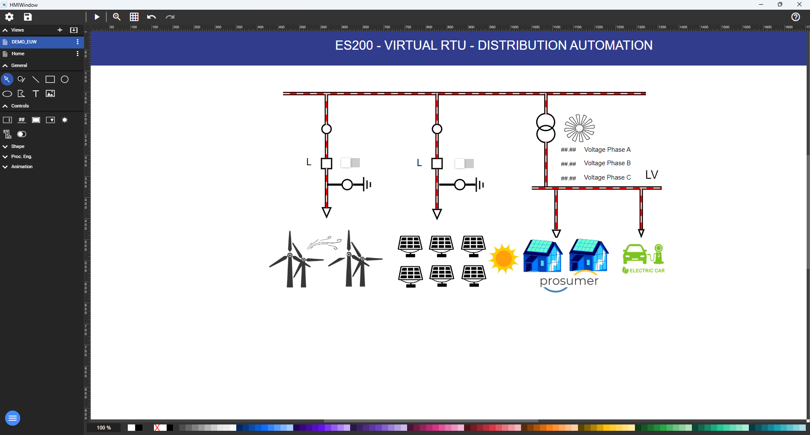
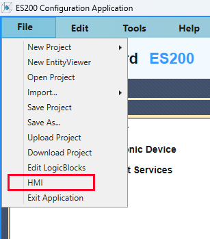
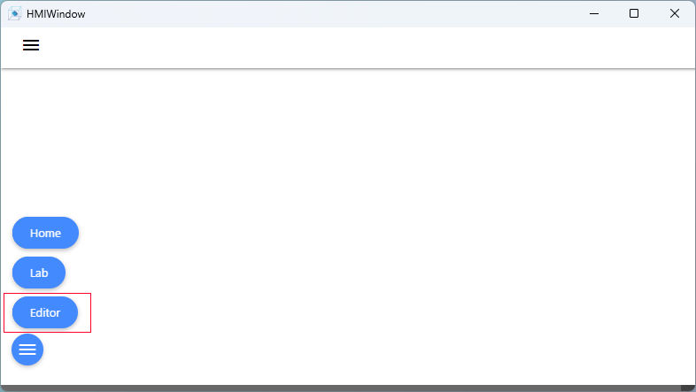
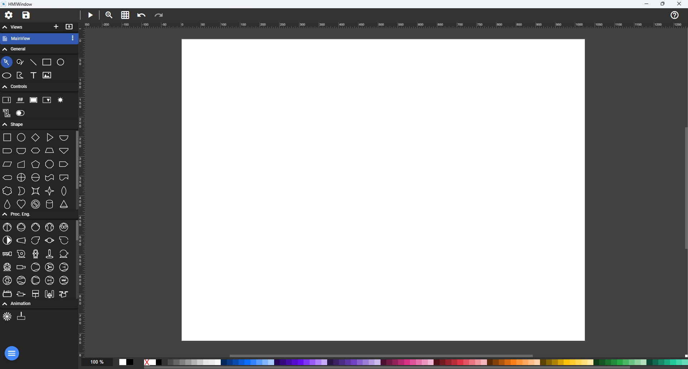
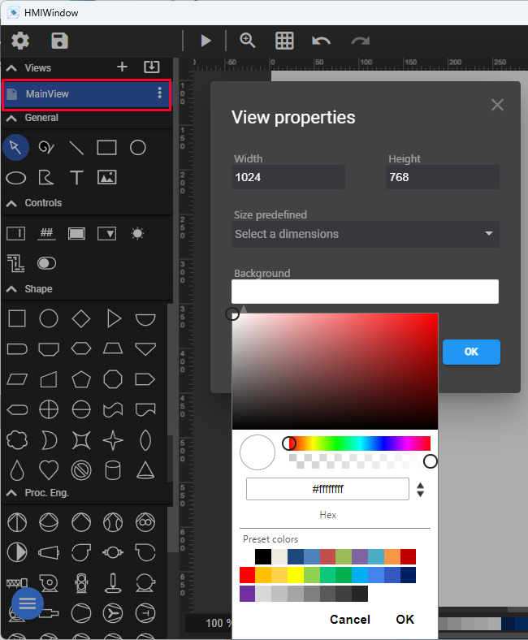
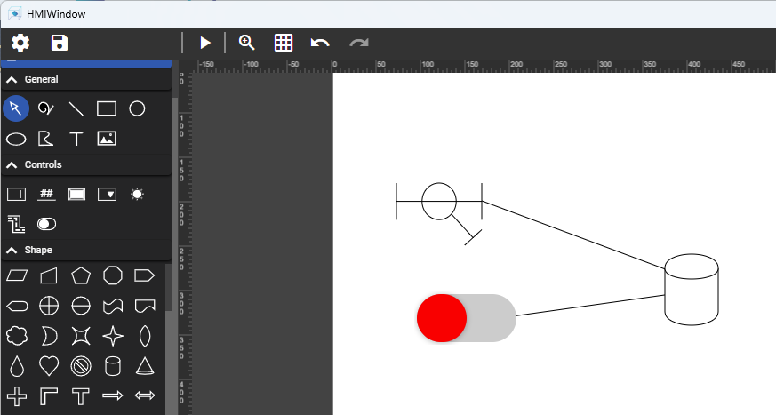
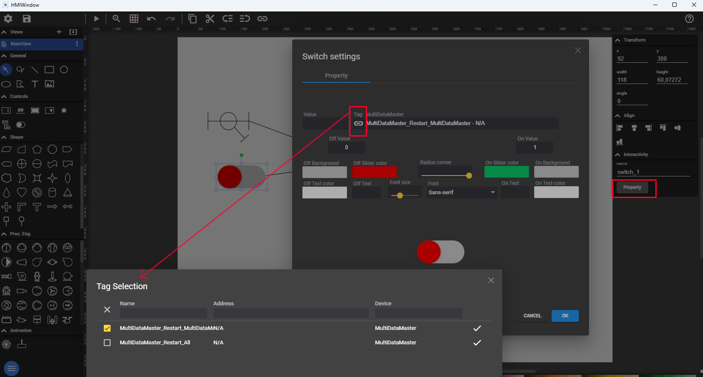
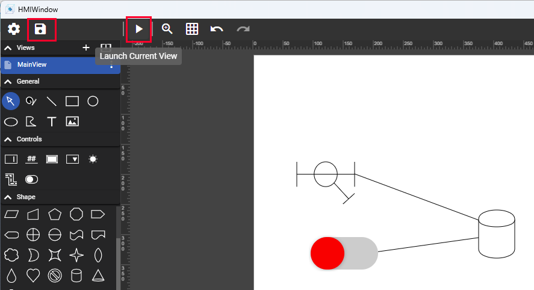
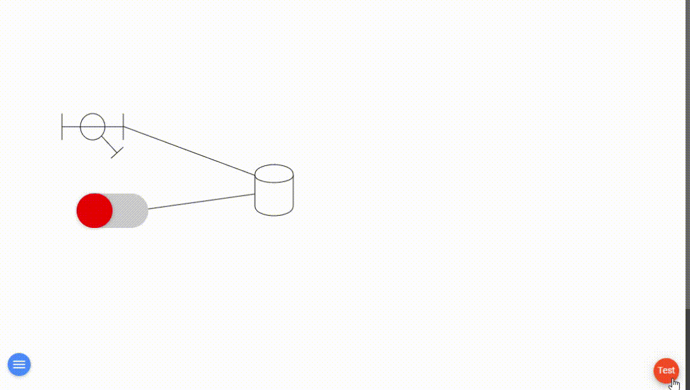

# Human Machine Interface <!-- omit from toc -->

[**Table of Contents:**](#toc)
- [1. Introduction](#1-introduction)
- [2. Configuration](#2-configuration)

The ES200 web based **Human Machine Interface** (HMI) is the easiest way to securely control your ES200 vRTU (virtual Remote Terminal Unit) deployments.

# 1. Introduction
---
The web HMI collects data from the ES200 vRTU and presents the information to an operator using customizable web pages. The HMI allows the operator to see what is going on in the plant in real time, including custom displays, alarms, trends, etc., to make decisions to adjust any device controls or settings.

# 2. Configuration
---

1. Using the ES200 Configuration Application (ES200 Dashboard)
    - Create a new Project or Load an existing Project
    - Select File -> HMI
  
        

2. Using the HMI Window
   - Select the Editor option from the bottom left menu
        

    - The HMI Editor Window will appear with all the configuration options

        

3. Modify the default page characteristics
    - view size and background color

        

   - Note: You can export the config of a view as json

4. Populate the page with content
    - Add the required control and process engineering shapes to your page

        
    
    - Link the control shapes to the appropriate datapoints

        

5. Save the Project and Launch the current view
    - 

6. Test the web HMI controls
   - 