# Table of contents

1. [Introduction](#introduction)
2. [JSON_MQTT Master](#json_mqtt-master)
3. [MQTT Slave](#mqtt-slave)
4. [Configuration Examples](#configuration-examples)
5. [Exchanged messages examples](#exchanged-messages-examples)
6. [Additional informations](#additional-informations)

## Introduction

This document will present how ES200 MQTT Master and Slave equipements can be configured and used

The messages that ES200 accepts are in JSON format

## JSON_MQTT Master

The JSON_MQTT is the implementation of an MQTT Client acting as a Master device. It is used to receive data from a broker on a subscribed topic

For more infromations please check: [MQTT Topics, Wildcards & Best Practices](https://www.hivemq.com/blog/mqtt-essentials-part-5-mqtt-topics-best-practices/)

More details of the message format will be in: [Exchanged messages examples](#exchanged-messages-examples)

### Adding JSON_MQTT Master and configuration properties

The following information will be available for editing:

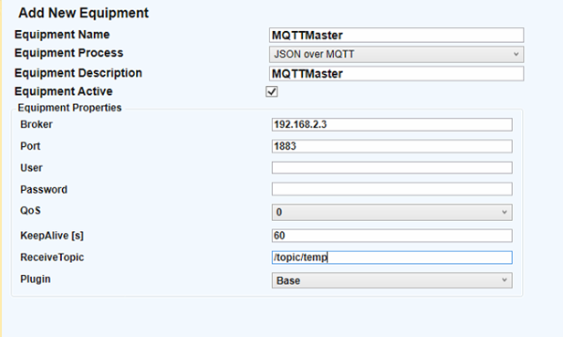

1. **Equipment Name** - the name of the MQTT communication master. It does not affect communication with devices and helps organize information
2. **Equipment Description** - the name of the MQTT communication master. It does not affect communication with devices and helps organize information
3. **Broker** - IP address of the MQTT broker
4. **Port** - the TCP port for MQTT communication with MQTT clients (1883)
5. **User&Pass** - username and password for the MQTT broker if credentials are set
6. **QoS** - quality of service for MQTT – the level of certainty for message delivery. This parameter must be set identically on both communication partners. We recommend using the value 0 – the client does not wait for acknowledgment of receipt from the recipient
7. **KeepAlive** - the waiting time for a response from the broker before considering the connection to be interrupted
8. **ReceiveTopic** - Description of the client's topic through which data is received
9. **Plugin** - different types of custom MQTT implementations can be used (Sparkplug, Veribox, or default)

### Adding Simple Digital Values (Boolean Sizes) and Analog Values (Numeric)

1. **Address** – The internal address of the information taken through MQTT in ES200. This identifier is NOT the specific MQTT protocol address; it is only used for internal ES200 processes. Changing these does not affect the retrieval in ES200 from MQTT clients (sensors, etc.) of the desired information
2. **Description** – Detailed description of the retrieved entity - for internal use (e.g., Maximum protection function level 1)
3. **Variable Name** – A unique TAG is filled in for each signal. This TAG will be the internal identifier for the respective signal and will be used in ES200 slave processes and for implementing automation logics
4. **JSONPointer**– can be associated with the MQTT protocol address and is in the form of a string formatted like /PT/sensorX/context (e.g., /PT10/sensor1/contact1)

[JSON Pointer standard](https://www.rfc-editor.org/rfc/rfc6901)

## MQTT Slave

The properties of MQTT Slave are the same as JSON_MQTT Master, in addition we have:

1. **File** - Certificate Authority
2. **Send Topic** - Description of the topic through which data is published
3. **Retransmit Time** - The time period between two "init" messages that contain the the entire dataset as oposed to "delta" messages that contain only the latest changes. (miliseconds)
4. **MQTTVersion** - The version of the MQTT protocol

MQTTSlave Equipment is capable of accepting commands and update states

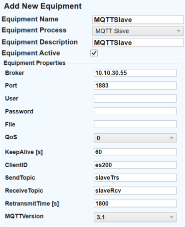

## Configuration Examples

### Example of JSON MQTT Master equipment properties

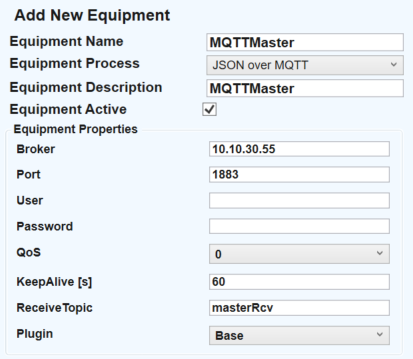

To add a point open the MQTTMaster and right click on the desired point to be added

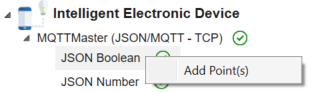

#### JSON MQTT Master point properties

<p>A JSON Pointer specifies the exact location within a JSON document from which a value can be accessed.</p>

The JSON MQTT Master will now receive data on topic **masterRcv** and the **cloudy** variable name will have the value taken from the json found at Json Pointer defined as **/cloud**.

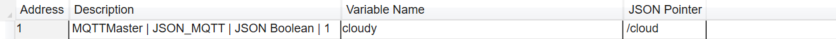

### Saving and uploading configuration

After finishing the configuration, you can either save the file locally, using the File-> Save option or you can send the file directly to the equipment running the ES200 using the File -> Upload project option. In the pop-up window, write the necessary information for connecting to the vRTU and your credentials. Then, the file will be exported.

### JSON MQTT Master data visualisation

To view the data open a new EntityViewer and [connect to the vRTU](#additional-informations)

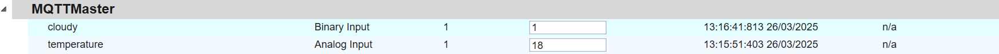

### Example of MQTT Slave equipment properties


#### Adding MQTT Slave points

Points can be added just as in the JSON MQTT Master example

#### Linking MQTT Master points to MQTT Slave

Create new Binary Output point type

In the point created we will retrieve the master point variable name to bind them

1. Click the Master Variable Name input
2. Select the proper variable name

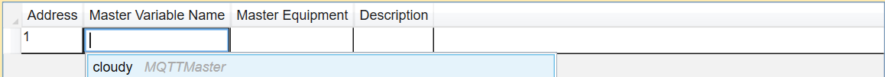

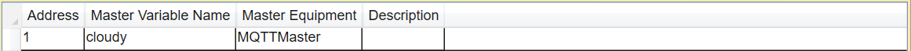

The value of **cloudy** will be received from JSON MQTT Master variable and will pe published on the **topic** **slaveTRS**

#### MQTT Slave retrieve data from broker <a name="mqtt-slave-retrieve-data-from-broker"></a>

For testing the receiving of commands in this example we will create a point in MultiDataMaster of the same point type that the MQTTSlave will receive data onto


1. Create new Binary Input point type in the Command Center MQTTSlave
2. Select Master Variable Name to be the one from MultiDataMaster

Data will be received on the **slaveRcv topic** and binded to the MultiDataMaster point

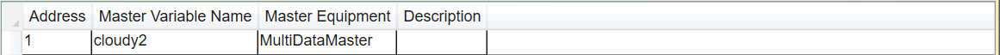

## Exchanged messages examples

### JSON MQTT Master example

We will use **Example of JSON MQTT Master equipment properties** from [Configuration Examples](#configuration-examples)

Given the configuration of one JSON Boolean and one JSON number from below we will overview the JSON format needed for these points to receive data.

1. JSON Boolean </br>
   
2. JSON Number </br>
   

Below is an example of JSON payload accepted by ES200

```json
{
  "cloud": true,
  "temp": 18
}
```

### MQTT Slave publish example

We will use **Example of MQTT Slave equipment properties** from [Configuration Examples](#configuration-examples)

Binding the previous created points to the MQTT Slave Binary Output and Analog Output the following message will be published on the **topic slaveTrs**

1. Binary Output </br>
   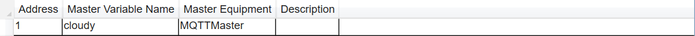
2. Analog output </br>
   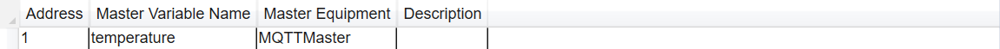

Below is the format of the published message

```json
{
  "Name": "MQTTSlave",
  "Points": [
    {
      "Address": 1,
      "PointType": 1,
      "Value": 1,
      "Status": 1,
      "Description": "",
      "SourceEquip": "MQTTMaster"
    },
    {
      "Address": 1,
      "PointType": 3,
      "Value": 18,
      "Status": 1,
      "Description": "",
      "SourceEquip": "MQTTMaster"
    }
  ]
}
```

### MQTT Slave receive example

We will use **Example of MQTT Slave equipment properties** from [Configuration Examples](#configuration-examples)

For the created point at [MQTT Slave retrieve data from broker](#mqtt-slave-retrieve-data-from-broker) the expected message by the slave should have the following JSON structure:

```json
{
  "Command": {
    "Address": 1,
    "Value": 1,
    "CommandType": 1,
    "PointType": 0
  }
}
```

Where:

1. Command - indentifier for ES200 to identify a message as a command
2. Address - point address, visible in Dashboard ES00
3. Value - value to be given to the point, for binary use 0 and 1
4. CommandType
   1. Undefined = -1
   2. Latch = 0
   3. Pulse = 1
   4. Pair = 2
5. PointType - use the value according to the specified point
   1. BinaryInput = 0
   2. BinaryOutput = 1
   3. AnalogInput = 2
   4. AnalogOutput = 3
   5. DoubleInput = 4
   6. DoubleOutput = 5

## Additional informations

For additional informations about the ES200 please visit: [ES200 Dasboard Manual](https://github.com/Eximprod/docs/blob/master/ES200/ES200_Dashboard_Manual.md#56-mqtt)
