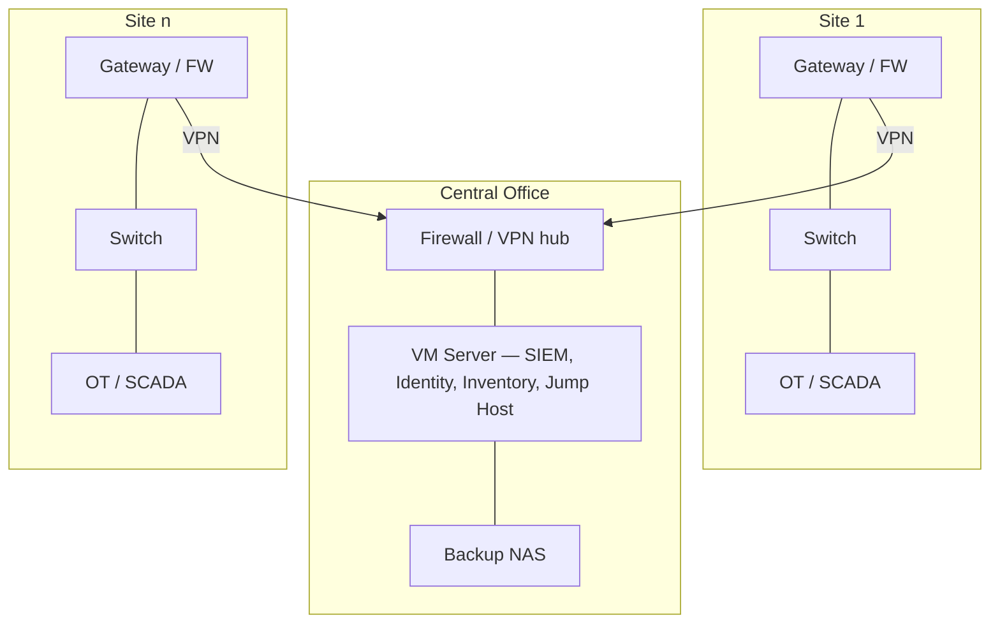

# SG200 — Site Guardian

**OT / SCADA cybersecurity and NIS2 compliance platform for distributed energy assets.**

SG200 is a turnkey platform developed by [Eximprod Engineering (EPG)](https://www.epg.ro) that brings renewable generation and storage sites — solar, wind, hydro, BESS, substations — to a defensible security baseline and a documented NIS2 compliance posture. It is designed for the reality of these sites: unmanned locations, mixed OT vendors, mobile or fibre backhaul, and small teams that cannot operate a SOC stack themselves.

---

## The problem it solves

Operators of distributed energy assets typically face the same combination of issues:

- Flat site networks where SCADA, PLCs, inverters and third-party equipment share one segment
- Remote access held by multiple third parties (O&M contractors, inverter vendors, integrators) with no central control or audit trail
- No asset inventory, no centralized logging, no incident detection — and therefore no evidence for a NIS2 audit
- NIS2 obligations landing on each operating entity (SPV), with registration and reporting deadlines enforced by the national authority

SG200 addresses these with one integrated package per site (or one central platform plus lightweight site kits), covering segmentation, secure remote access, monitoring, identity, backup and documentation.

## Editions

| | **SG200 Essential** | **SG200 Professional** |
|---|---|---|
| Positioning | NIS2 compliance baseline | Full OT visibility platform |
| Core stack | Open-source security stack on enterprise hardware | Essential stack + Cisco industrial security portfolio |
| OT asset discovery | Partial, passive (Zeek) | Full, automatic (Cisco Cyber Vision) |
| Industrial deep packet inspection | No | Yes — IEC 60870-5-104, IEC 61850, DNP3, Modbus/TCP, PROFINET, EtherNet/IP & CIP |
| OT risk scoring & CVE mapping | No | Yes |
| Compliance reporting | Basic | Advanced |
| Typical fit | Small / mid-size parks, tight budgets | Large sites, critical assets, essential entities |

Both editions share the same architecture and operating model, so an Essential deployment can be upgraded to Professional without redesign.

## Architecture

SG200 deploys in two models:

- **Standalone** — the full stack runs on a single virtualization host at one site.
- **Distributed** — a central platform (HQ, dispatch centre or datacentre) hosts the shared services (SIEM, identity, inventory, backup); each site gets a lightweight kit (gateway/firewall, managed switch, UPS, optional sensor) connected over VPN.

### Network segmentation

Each deployment enforces zone separation, adapted to the customer's network:

| VLAN | Purpose |
|---|---|
| 10 | Management |
| 20 | SCADA |
| 30 | PLC / OT |
| 40 | Security services |
| 50 | Remote access |
| 60 | Backup |

## Platform components

### SG200 Essential

| Component | Model | Function |
|---|---|---|
| Firewall | OPNsense appliance (virtual) | VPN, NAT, firewall rules, segmentation |
| Switch L3 | Cisco CBS350 | VLANs, trunking, port security, management |
| Server | HPE ProLiant DL20 Gen11 | Proxmox virtualization host |
| Backup & DR repository | QNAP TS-433 | Backups, snapshots, replication |
| UPS | APC / Eaton | Power protection and graceful shutdown |

Recommended host configuration: Intel Xeon E-2488 (8C/16T), 64 GB DDR5 ECC, 2 × 1.92 TB enterprise SSD in hardware RAID 1, redundant PSUs, HPE iLO 6 Advanced.

**Virtualized services (Proxmox VE):**

| Service | Role | Criticality |
|---|---|---|
| Wazuh | Centralized logging, SIEM / XDR, incident detection | High |
| OPNsense | Firewall, VPN, VLAN routing, NAT | High |
| WireGuard | Secure VPN access | High |
| FreeIPA *(optional)* | LDAP / Kerberos identity and access management | High |
| Zeek | Passive OT network visibility | Medium |
| NetBox | Asset inventory, documentation, IPAM | Medium |
| Guacamole *(optional)* | Jump host for controlled remote access | Medium |
| Suricata *(optional)* | Intrusion detection (IDS) | Medium |

Indicative resource footprint: 18 vCPU, 34 GB RAM, 0.6–0.9 TB storage (logging-dependent).

### SG200 Professional

| Component | Model | Function |
|---|---|---|
| Firewall | Cisco ISA3000 | Industrial security appliance: VPN, NAT, segmentation |
| Switch L3 | Cisco IE9300 Rugged | Industrial-grade VLANs, trunking, port security |
| Server | Cisco UCS C220 M8 | Proxmox virtualization host |
| Backup & DR repository | QNAP TS-h1277AXU-RP / TS-h1887XU-RP | Enterprise backups, snapshots, replication |
| UPS | APC / Eaton | Power protection and graceful shutdown |

Recommended host configuration: Intel Xeon Scalable (24C/48T), 128 GB DDR5 ECC, 4 × 1.92 TB enterprise SSD in hardware RAID 10, redundant PSUs, Cisco CIMC.

**Virtualized services (Proxmox VE):**

| Service | Role | Criticality |
|---|---|---|
| Cisco Cyber Vision Center | OT asset discovery, industrial DPI, risk scoring, OT monitoring | Critical |
| Wazuh | Centralized logging, SIEM / XDR, incident detection, compliance | Critical |
| FreeIPA | LDAP / Kerberos identity and access management | High |
| WireGuard | Secure VPN access | High |
| NetBox | Asset inventory, documentation, IPAM | Medium |
| Guacamole | Jump host for controlled remote access | Medium |
| Grafana | Operational dashboards and reporting | Medium |

Indicative resource footprint: 36 vCPU, 80 GB RAM, 1.5 TB storage.

## NIS2 control coverage

| NIS2 control area | Essential | Professional |
|---|---|---|
| Asset inventory | NetBox | Cisco Cyber Vision + NetBox |
| Logging | Wazuh | Wazuh |
| Incident detection | Wazuh | Cyber Vision + Wazuh |
| Passive monitoring | Zeek | Cisco Cyber Vision sensors |
| Network segmentation | OPNsense + CBS350 | Cisco ISA3000 + IE9300 |
| Secure remote access | WireGuard + Guacamole | WireGuard + Guacamole |
| Authentication & identity | FreeIPA | FreeIPA |
| Backup & disaster recovery | QNAP TS-433 | QNAP Enterprise (QuTS hero) |
| Documentation | NetBox | NetBox |

## Backup & disaster recovery

Both editions include daily VM backup, snapshot protection, monthly backup verification, and optional off-site replication. Professional adds a Proxmox Backup Server repository (NFS / iSCSI), scheduled configuration backup of the Cisco ISA3000 and IE switches, and quarterly restore testing.

## Choosing an edition

Essential covers the NIS2 baseline: inventory, logging, segmentation, controlled remote access, identity and backup. Its limitation is protocol depth — it does not perform industrial DPI, so it cannot analyze IEC 60870-5-104, IEC 61850, DNP3 or Modbus traffic at the application layer, and it does not provide automatic OT inventory, risk scoring or firmware vulnerability mapping. Sites where those capabilities matter — large parks, storage plants, entities classified as essential — are the target for Professional.

## Engagement process

1. **Scoping** — fill in the [pre-engagement questionnaire](./SG200_Questionnaire.md). Rough answers are enough.
2. **Design** — we propose the edition, deployment model (standalone or distributed) and site-kit composition.
3. **Offer** — budgetary offer, refined after a site survey.
4. **Implementation** — staged deployment respecting maintenance windows and zero-downtime constraints.
5. **Operation** — handover to your team, or ongoing monitoring and support by EPG.

Bill of materials and pricing are available on request.

## Contact

**Eximprod Engineering (EPG)** — [www.epg.ro](https://www.epg.ro)
