# ES200 server web - Manual de utilizare <!-- omit from toc -->

[**Cuprins:**](#toc)

- [1. Introducere](#1-introducere)
  - [1.1. Funcționalități ale interfeței web](#11-funcționalități-ale-interfeței-web)
  - [1.2. Versiuni browser minime](#12-versiuni-browser-minime)
  - [1.3. Abrevieri](#13-abrevieri)
- [2. Interfața web](#2-interfața-web)
  - [2.1. Conectare](#21-conectare)
  - [2.2. Entity Viewer](#22-entity-viewer)
    - [2.2.1. Informații generale afișate în antet](#221-informații-generale-afișate-în-antet)
    - [2.2.2. Vizualizarea punctelor](#222-vizualizarea-punctelor)
    - [2.2.3. Transmiterea comenzilor și Command Status](#223-transmiterea-comenzilor-și-command-status)
    - [2.2.4. Filtrarea punctelor](#224-filtrarea-punctelor)
  - [2.3. Baza de date](#23-baza-de-date)
    - [2.3.1. Upload DB](#231-upload-db)
    - [2.3.2. Download DB](#232-download-db)
  - [2.4. Logs](#24-logs)
    - [2.4.1. Categorii de log-uri](#241-categorii-de-log-uri)
    - [2.4.2. Filtrarea log-urilor](#242-filtrarea-log-urilor)
    - [2.4.3. Vizualizarea log-urilor de tip General](#243-vizualizarea-log-urilor-de-tip-general)
    - [2.4.4. Vizualizarea log-urilor de tip Events](#244-vizualizarea-log-urilor-de-tip-events)
    - [2.4.5. Vizualizarea log-urilor de tip Commands](#245-vizualizarea-log-urilor-de-tip-commands)
    - [2.4.6. Descărcarea log-urilor](#246-descărcarea-log-urilor)
  - [2.5. HMI](#25-hmi)
    - [2.5.1. Rolul interfeței HMI](#251-rolul-interfeței-hmi)
    - [2.5.2. Accesarea secțiunii HMI](#252-accesarea-secțiunii-hmi)
    - [2.5.3. Meniul HMI](#253-meniul-hmi)
    - [2.5.4. Pagina Home](#254-pagina-home)
    - [2.5.5. Vizualizarea paginii HMI](#255-vizualizarea-paginii-hmi)
    - [2.5.6. Panoul de alarme](#256-panoul-de-alarme)
    - [2.5.7. Opțiuni disponibile în panoul de alarme](#257-opțiuni-disponibile-în-panoul-de-alarme)
  - [2.6. Update Password](#26-update-password)
    - [2.6.1. Modificarea parolei](#261-modificarea-parolei)
  - [2.7. Update Certificates](#27-update-certificates)
    - [2.7.1. Actualizarea certificatelor](#271-actualizarea-certificatelor)
  - [2.8. Logout](#28-logout)

## 1. Introducere

ES200 este o aplicație software utilizată pentru monitorizarea și controlul echipamentelor industriale și pentru achiziția de date din teren. Sistemul funcționează ca un **RTU (Remote Terminal Unit) virtual**, permițând integrarea și schimbul de date cu alte echipamente și sisteme prin intermediul diferitelor protocoale de comunicație.

Aplicația ES200 poate rula pe diferite platforme hardware sau software care permit rularea de **aplicații containerizate**, inclusiv pe echipamente Cisco care suportă funcția **IOx** pentru execuția aplicațiilor.

Pentru accesarea funcțiilor principale ale sistemului este disponibilă o **interfață web**, accesibilă de la distanță folosind un browser modern. Prezentul manual descrie modul de utilizare al acestei interfețe web.

### 1.1. Funcționalități ale interfeței web

Interfața web ES200 oferă utilizatorului acces la funcțiile principale de monitorizare și administrare ale sistemului. Prin intermediul acesteia pot fi realizate operații precum:

* autentificarea în sistem folosind **username** și **parolă**;
* vizualizarea și controlul de la distanță al punctelor de date prin **Entity Viewer**;
* încărcarea și descărcarea bazei de date de configurare;
* consultarea log-urilor generate de sistem;
* accesarea interfeței **HMI**;
* actualizarea certificatelor **TLS**.

Interfața web oferă astfel un punct centralizat de acces pentru monitorizarea și interacțiunea cu sistemul ES200.

### 1.2. Versiuni browser minime

Aplicația web este compatibilă cu următoarele versiuni minime de browser:

* **Google Chrome:** 71
* **Microsoft Edge:** 80
* **Opera:** 58
* **Safari:** 13
* **Mozilla Firefox:** 65

Pentru o experiență de utilizare optimă, se recomandă utilizarea browserelor **Google Chrome** sau **Microsoft Edge**.

### 1.3. Abrevieri

Tabelul de mai jos conține o listă de abrevieri folosite de-a lungul documentului.

|                 |                                                                                 |
| --------------- | ------------------------------------------------------------------------------- |
| Abreviere       | Definiție                                                                       |
| CC              | Command Center (Centru de comandă)                                              |
| COMx            | Portul serial cu numărul X                                                      |
| DNP3            | Distributed Network Protocol (protocol de comunicație)                          |
| HMI             | Human-Machine Interface                                                         |
| I/O             | Input/output                                                                    |
| ID              | Identificator unic                                                              |
| IEC 60870-5-104 | International Electrotechnical Commission 60870-5-104 (protocol de comunicație) |
| IED             | Intelligent Electronic Devices (Echipament electronic inteligent)               |
| MDM             | MultiDataMaster                                                                 |
| RTU             | Remote Terminal Unit                                                            |
| SCADA           | Supervisory Control and Data Acquisition                                        |
| TCP             | Transmission Control Protocol (protocol de comunicație)                         |
| vRTU            | virtual Remote Terminal Unit                                                    |

## 2. Interfața web

După încărcarea configurației pe ES200, interfața web poate fi accesată din browser la următoarea adresă: [*https://IP\_masina:3000*](https://IP_masina:3000)

  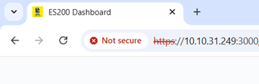
   
  <em>Figura 1</em>

Pentru autentificare, utilizatorul trebuie să introducă numele de utilizator și parola corespunzătoare.

  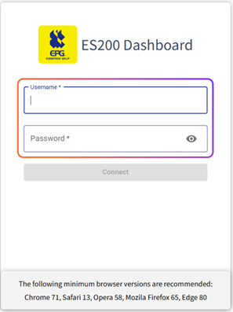
   
  <em>Figura 2</em>

### 2.1. Conectare

Pentru conectarea la interfața web, se introduc următoarele date de autentificare:

* **Username:** admin
* **Password:** admin

După completarea acestor câmpuri, se apasă butonul **Connect**.

  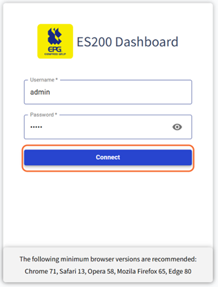
   
  <em>Figura 3</em>

### 2.2. Entity Viewer

După autentificare, utilizatorul este redirecționat în interfața principală a aplicației web. În mod implicit, se deschide tab-ul **Entity Viewer**.

  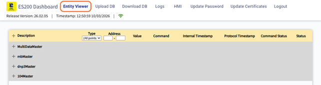
   
  <em>Figura 4</em>

În această secțiune, utilizatorul are acces la vizualizarea punctelor configurate în sistem, aferente echipamentelor de tip **master** și **MultiDataMaster**. Echipamentele de tip **slave** nu sunt afișate în tab-ul **Entity Viewer**.

Punctele sunt afișate într-o structură ierarhică, în funcție de entitățile disponibile, iar pentru acestea pot fi urmărite informații precum:

* tipul punctului;
* adresa;
* valoarea;
* comanda;
* protocol timestamp - momentul de timp înregistrat de către protocol
* internal timestamp - momentul de timp corespondent mașinii pe care ruleaza ES200
* statusul comenzii;
* statusul curent.

  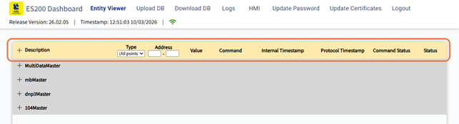
   
  <em>Figura 5</em>

Tab-ul **Entity Viewer** permite astfel monitorizarea punctelor definite în configurația încărcată în ES200, pentru entitățile disponibile de tip **master** și **MultiDataMaster**.

#### 2.2.1. Informații generale afișate în antet

În partea superioară a interfeței **Entity Viewer** sunt afișate o serie de informații generale privind starea aplicației și conexiunea cu sistemul ES200.

Aceste informații includ:

* **Release Version** – indică versiunea aplicației web / release-ul software afișat în interfață;
* **Timestamp** – indică data și ora curentă afișate de sistem;
* **Icon-ul de stare a conexiunii** – indică starea conexiunii dintre interfața web și ES200.

Pictograma de conexiune poate semnala una dintre următoarele stări:

* **connected** – interfața web este conectată la ES200;
* **disconnected** – interfața web nu este conectată la ES200.

  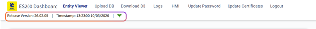
   
  <em>Figura 6</em>

Aceste informații permit utilizatorului să verifice rapid versiunea aplicației, referința temporală afișată în interfață și starea curentă a conexiunii cu sistemul ES200.

#### 2.2.2. Vizualizarea punctelor

În tab-ul **Entity Viewer**, utilizatorul poate vizualiza punctele disponibile în configurația încărcată pe ES200, aferente entităților de tip **master** și **Multi Data Master**. Punctele sunt organizate pe entități și pot fi extinse prin apăsarea simbolului **„+”** din partea stângă a fiecărei entități.

Pentru fiecare punct, interfața poate afișa următoarele informații:

* **Description**
* **Type**
* **Address**
* **Value**
* **Command**
* **Internal Timestamp**
* **Protocol Timestamp**
* **Command Status**
* **Status**

  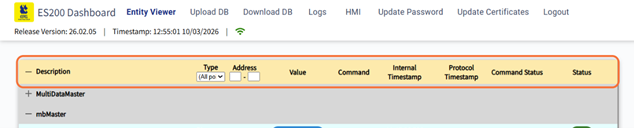
   
  <em>Figura 7</em>

În coloana **Type**, punctele pot fi de tip:

* Binary Input
* Binary Output
* Analog Input
* Analog Output
* Double Input
* Double Output

  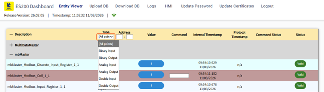
   
  <em>Figura 8</em>

În coloana **Value** este afișată valoarea curentă a punctului. Aceasta se actualizează în funcție de mecanismul de refresh al interfeței, astfel încât utilizatorul să poată urmări în timp real modificările primite de la ES200.

  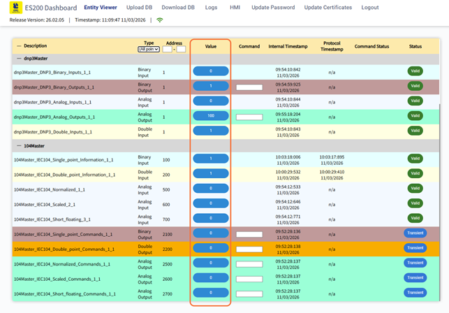
   
  <em>Figura 9</em>

În coloana **Status** este afișată starea curentă a punctului. Aceasta poate fi:

* **Valid** – punctul are o valoare validă și actualizată, care poate fi utilizată pentru monitorizare sau control. Această stare indică faptul că informația este disponibilă și comunicația cu sistemul funcționează corespunzător.
* **Invalid** – punctul nu are o valoare validă. Această situație poate apărea atunci când nu există comunicație cu echipamentul, datele nu au fost actualizate sau calitatea informației nu este corespunzătoare.
* **Transient** – punctul se află într-o stare temporară, specifică de regulă executării unei comenzi. În această situație, punctul de comandă reprezintă doar cererea de acțiune transmisă către echipament, iar modificarea efectivă a stării echipamentului este reflectată de un alt punct de stare. Prin urmare, valoarea punctului aflat în stare Transient nu trebuie interpretată ca o stare finală stabilă a procesului.

  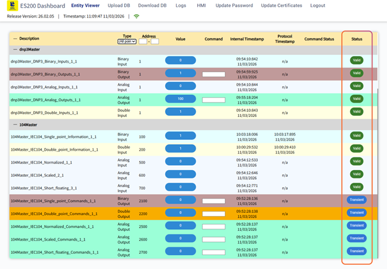
   
  <em>Figura 10</em>

Această secțiune permite utilizatorului să urmărească rapid starea și valorile punctelor configurate, direct din interfața web.

#### 2.2.3. Transmiterea comenzilor și Command Status

În tab-ul **Entity Viewer**, utilizatorul poate transmite comenzi către punctele de tip **Output** folosind coloana **Command**.

Pentru trimiterea unei comenzi, utilizatorul introduce valoarea dorită în câmpul din coloana **Command** și apasă tasta **Enter**. Comanda este transmisă imediat către sistemul ES200, fără o confirmare suplimentară în interfață.

După transmiterea cu succes a comenzii, câmpul de introducere a valorii este golit automat.

În coloana **Command Status** este afișată o informație referitoare la ultima comandă transmisă pentru punctul respectiv. Mesajul poate avea forma: `Sent<valoare>at<ora>`

Acest mesaj indică faptul că valoarea a fost transmisă către sistem la momentul respectiv. Informația afișată în **Command Status** are rol informativ și nu reprezintă o confirmare a executării comenzii în teren.

  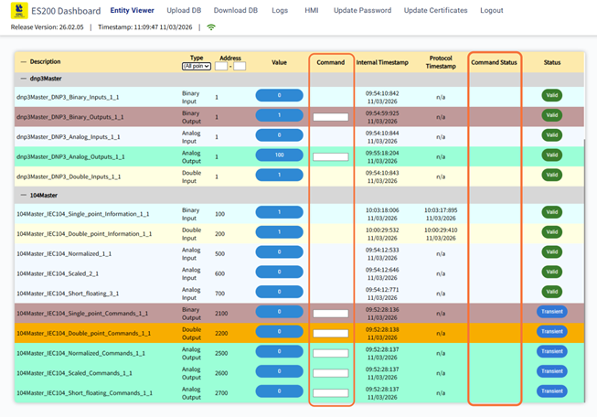
   
  <em>Figura 11</em>

La transmiterea unei noi comenzi pentru același punct, mesajul din **Command Status** este suprascris cu informația corespunzătoare ultimei comenzi trimise. Mesajul poate fi șters manual prin apăsarea butonului **X** din dreptul coloanei.

În funcție de tipul punctului și de modul în care este configurat sistemul, transmiterea unei comenzi poate avea comportamente diferite.

**Situația 1 – punct cu status Valid**

Pentru punctele care reflectă direct o valoare din sistem, transmiterea unei comenzi poate determina modificarea valorii afișate în coloana **Value**. După introducerea valorii în câmpul **Command** și apăsarea tastei **Enter**, valoarea punctului se actualizează, iar în coloana **Command Status** apare mesajul informativ corespunzător comenzii transmise.

  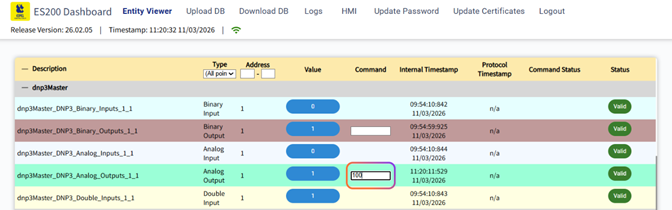
   
  <em>Figura 12</em>

  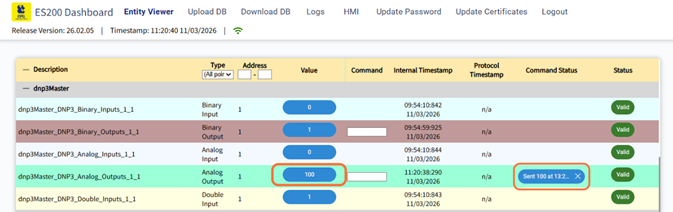
   
  <em>Figura 13</em>

**Situația 2 – punct cu status Transient**

În cazul punctelor de comandă (de tip control), valoarea punctului nu reprezintă neapărat starea finală a echipamentului. Aceste puncte pot avea status **Transient**, indicând faptul că punctul este utilizat pentru transmiterea unei acțiuni către sistem.

După trimiterea unei comenzi, în coloana **Command Status** este afișat mesajul informativ privind transmiterea comenzii, însă valoarea punctului respectiv poate rămâne neschimbată. În acest caz, comanda transmisă acționează asupra unui alt punct din sistem care reflectă starea reală a echipamentului.

  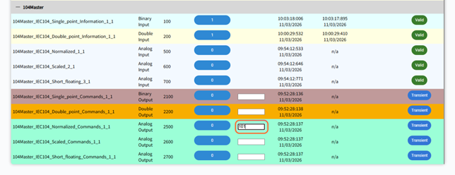
   
  <em>Figura 14</em>

  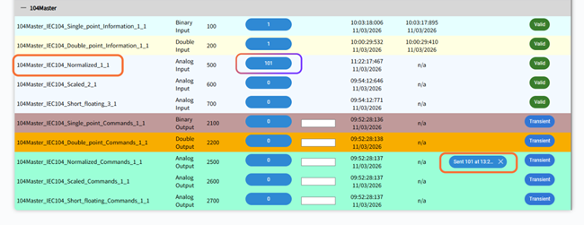
   
  <em>Figura 15</em>

Acest model separă **comanda transmisă de operator** de **starea efectivă a echipamentului**, permițând monitorizarea independentă a acțiunilor și a feedback-ului din sistem.

#### 2.2.4. Filtrarea punctelor

În tab-ul **Entity Viewer**, punctele afișate pot fi filtrate pentru a facilita identificarea rapidă a informațiilor dorite.

Filtrarea se poate realiza folosind câmpurile disponibile în partea superioară a tabelului:

* filtrare după **tipul punctului**, prin selectarea unei opțiuni din lista **Type**;

  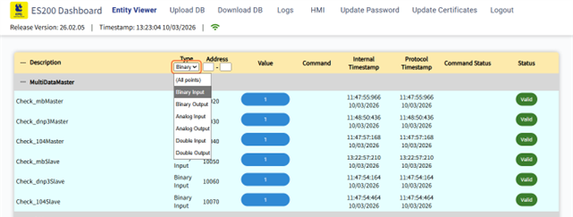
   
  <em>Figura 16</em>

* filtrare după **adresă**, prin introducerea valorilor dorite în câmpurile asociate coloanei **Address**.

  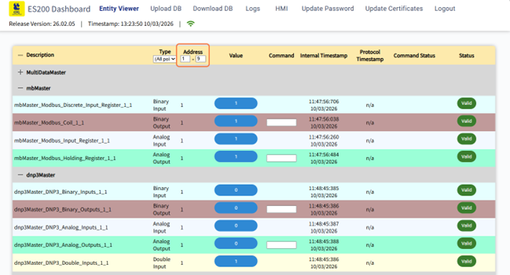
   
  <em>Figura 17</em>

Aceste opțiuni permit restrângerea listei de puncte afișate, astfel încât utilizatorul să poată analiza mai ușor doar punctele relevante pentru operația curentă.

### 2.3. Baza de date

Configurația sistemului ES200 este definită într-o bază de date creată cu aplicația **Dashboard ES200 pentru Windows**. Această configurație conține entitățile, punctele de date, protocoalele de comunicație și alte setări necesare funcționării sistemului.

Fișierul de configurare utilizat de ES200 are extensia **.epgd** și este generat sau modificat folosind aplicația **Dashboard ES200 Windows**. După realizarea configurației, acest fișier poate fi încărcat pe echipamentul ES200 prin intermediul interfeței web.

Prin intermediul secțiunilor **Upload DB** și **Download DB**, utilizatorul poate transfera baza de date între aplicația de configurare și sistemul ES200.

#### 2.3.1. Upload DB

Pentru încărcarea unei baze de date pe echipamentul ES200, utilizatorul accesează tab-ul **Upload DB** din bara de navigare a interfeței web.

  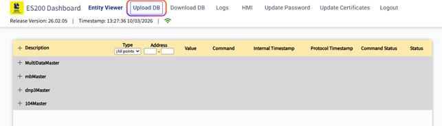
   
  <em>Figura 18</em>

Această secțiune este utilizată pentru transferul fișierului de configurare **.epgd** către sistemul ES200, astfel încât configurația realizată în aplicația **Dashboard ES200 Windows** să fie aplicată în funcționarea echipamentului.

După încărcarea bazei de date, se recomandă efectuarea unui **refresh al paginii web**, pentru a asigura actualizarea corectă a informațiilor afișate în interfață.

#### 2.3.2. Download DB

Pentru descărcarea bazei de date existente de pe echipamentul **ES200**, utilizatorul accesează tab-ul **Download DB** din bara de navigare a interfeței web.

  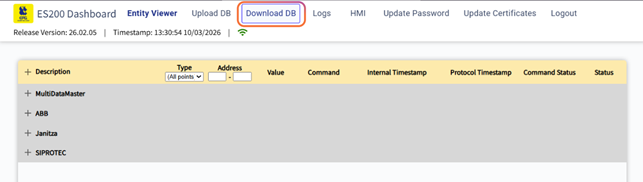
   
  <em>Figura 19</em>

Această secțiune permite exportul configurației curente a sistemului sub forma unui fișier **.epgd**. Fișierul descărcat poate fi utilizat pentru verificarea configurației, pentru realizarea unor copii de siguranță sau pentru modificări ulterioare în aplicația **Dashboard ES200 Windows**.

### 2.4. Logs

Pentru vizualizarea jurnalelor disponibile în interfața web, utilizatorul accesează tab-ul **Logs** din bara de navigare.

  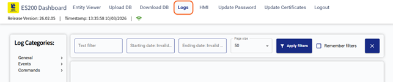
   
  <em>Figura 20</em>

Această secțiune permite consultarea fișierelor de tip log generate de sistem, organizate pe categorii, precum și filtrarea informațiilor afișate. În plus, utilizatorul poate descărca toate log-urile disponibile.

#### 2.4.1. Categorii de log-uri

În partea stângă a ferestrei este disponibilă secțiunea **Log Categories**, care conține log-urile grupate pe mai multe categorii.

  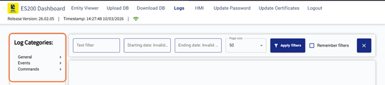
   
  <em>Figura 21</em>

Log-urile sunt organizate în următoarele categorii principale:

* **General**
* **Events**
* **Commands**

Fiecare categorie poate fi extinsă pentru afișarea log-urilor asociate diferitelor echipamente sau procese disponibile în sistem.

*Ex: ABB, Janitza, SIPROTEC, 104\_CC, ESRemote, MultiDataMaster, Watchdog, WebServer;*

  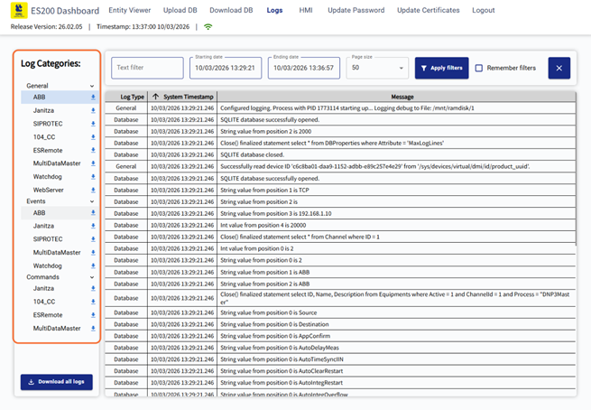
   
  <em>Figura 22</em>

Prin selectarea unui element din listă, în partea principală a ferestrei sunt afișate înregistrările corespunzătoare.

**Notă:** Indiferent de configurația activă, componentele **Watchdog**, **ESRemote**, **WebServer** și **MultiDataMaster** sunt disponibile permanent în sistem și, implicit, în secțiunea de log-uri. Acestea asigură funcții de bază necesare funcționării ES200 vRTU.

Rolul acestor componente este următorul:

* **Watchdog** – monitorizează procesele interne ale sistemului și detectează eventuale blocări sau funcționări anormale ale aplicației.
* **ESRemote** – gestionează funcțiile de comunicare și acces remote către sistemul ES200.
* **WebServer** – asigură funcționarea interfeței web și comunicarea dintre browser și aplicația ES200.
* **MultiDataMaster** – gestionează colectarea și centralizarea datelor provenite din diferite entități și protocoale din sistem.

#### 2.4.2. Filtrarea log-urilor

În partea superioară a paginii este disponibilă o zonă de filtrare, care permite restrângerea informațiilor afișate.

Utilizatorul poate filtra log-urile folosind următoarele opțiuni:

* câmpul **Text filter**;
* câmpul **Starting date**;
* câmpul **Ending date**;
* selecția **Page size**;
* butonul **Apply filters**;
* opțiunea **Remember filters**;
* butonul de resetare a filtrelor.

Aceste opțiuni permit afișarea doar a înregistrărilor relevante pentru intervalul de timp sau criteriul dorit.

  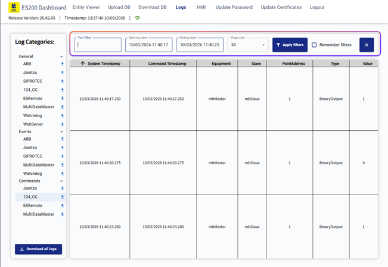
   
  <em>Figura 23</em>

#### 2.4.3. Vizualizarea log-urilor de tip General

Prin selectarea unei intrări din categoria **General**, sunt afișate mesajele generale de funcționare ale sistemului.

  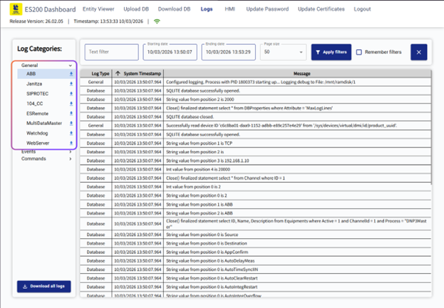
   
  <em>Figura 24</em>

În această zonă pot fi vizualizate informații precum:

* tipul log-ului;
* timestamp-ul sistemului;
* mesajul asociat.

Log-urile de tip general sunt utile pentru urmărirea funcționării generale a aplicației și a proceselor interne.

#### 2.4.4. Vizualizarea log-urilor de tip Events

Prin selectarea unei intrări din categoria **Events**, sunt afișate evenimentele înregistrate de sistem pentru echipamentele disponibile.

  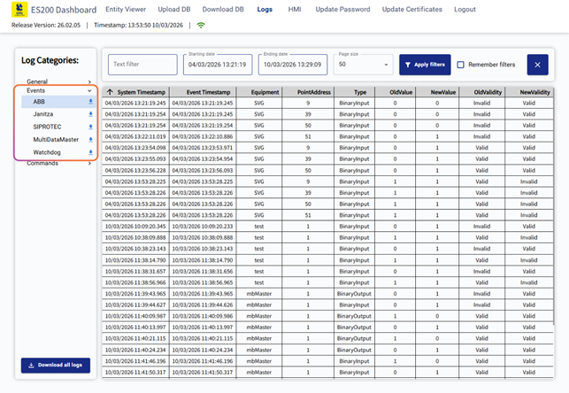
   
  <em>Figura 25</em>

Pentru aceste log-uri, tabelul poate include informații precum:

* **System Timestamp**;
* **Event Timestamp**;
* **Equipment**;
* **PointAddress**;
* **Type**;
* **OldValue**;
* **NewValue**;
* **OldValidity**;
* **NewValidity**.

Aceste informații permit urmărirea modificărilor de stare și a tranzițiilor apărute la nivelul punctelor monitorizate.

#### 2.4.5. Vizualizarea log-urilor de tip Commands

Prin selectarea unei intrări din categoria **Commands**, sunt afișate comenzile transmise în sistem.

  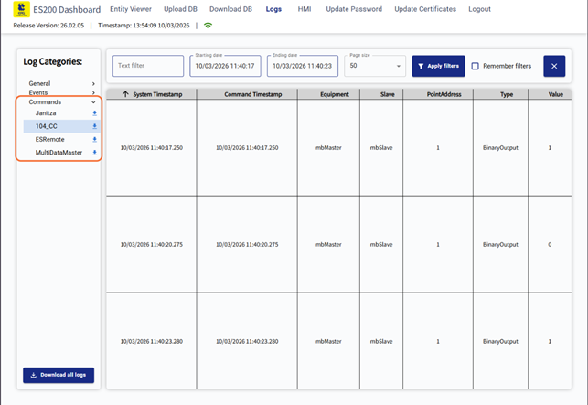
   
  <em>Figura 26</em>

Pentru aceste log-uri, tabelul poate conține informații precum:

* **System Timestamp**;
* **Command Timestamp**;
* **Equipment**;
* **Slave**;
* **PointAddress**;
* **Type**;
* **Value**.

Această secțiune este utilizată pentru urmărirea comenzilor executate și a valorilor asociate acestora.

#### 2.4.6. Descărcarea log-urilor

În partea inferioară a panoului din stânga este disponibil butonul **Download all logs**.

Prin utilizarea acestei opțiuni, utilizatorul poate descărca toate log-urile disponibile din sistem.

  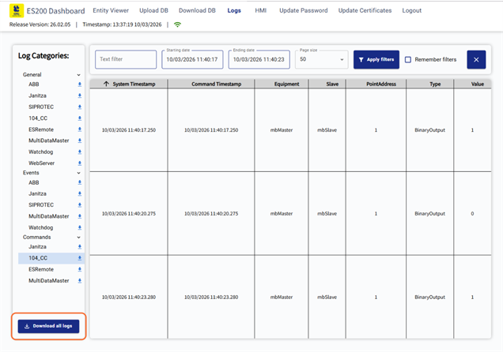
   
  <em>Figura 27</em>

De asemenea, log-urile pot fi descărcate și **individual**, pentru fiecare categorie disponibilă în lista **Log Categories**, utilizând pictograma de descărcare asociată fiecărei categorii.

Fișierele de log sunt descărcate în **format text (.txt)** și sunt structurate astfel încât informațiile să fie organizate într-o formă similară unui **tabel**, facilitând citirea și analiza ulterioară a datelor.

După inițierea descărcării, în partea inferioară a interfeței este afișat un **mesaj de confirmare** care indică faptul că procesul de descărcare a fost pornit pentru categoria selectată de log-uri.

  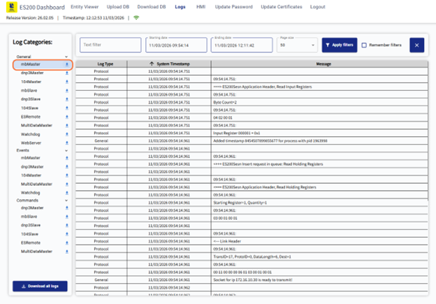
   
  <em>Figura 28</em>

  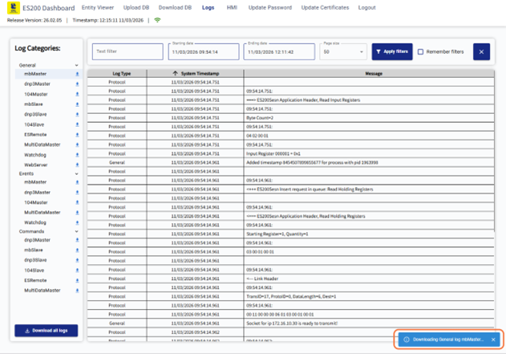
   
  <em>Figura 29</em>

### 2.5. HMI

Tab-ul **HMI** din interfața web permite accesarea interfeței grafice de tip **Human-Machine Interface**, utilizată pentru monitorizarea în timp real a instalației și pentru vizualizarea paginilor grafice configurate anterior în aplicația **ES200 Dashboard**.

Interfața web HMI colectează date din **ES200 vRTU** și le prezintă operatorului prin pagini web personalizabile. Prin intermediul acesteia, operatorul poate urmări în timp real starea instalației, inclusiv afișaje grafice, alarme și alte elemente vizuale necesare pentru supravegherea procesului și pentru luarea deciziilor de operare.

#### 2.5.1. Rolul interfeței HMI

Interfața HMI oferă operatorului o modalitate vizuală și accesibilă de supraveghere a procesului monitorizat de ES200.

Prin intermediul paginilor web personalizabile, operatorul poate vizualiza în timp real informațiile colectate din sistem și poate urmări starea instalației, alarmele și elementele grafice asociate procesului tehnologic.

#### 2.5.2. Accesarea secțiunii HMI

Pentru deschiderea interfeței HMI, utilizatorul accesează tab-ul **HMI** din bara superioară de navigare.

  
   
  <em>Figura 30</em>

După selectarea acestei opțiuni, se deschide pagina dedicată interfeței **Human-Machine Interface**, din care pot fi accesate view-urile grafice disponibile.

Utilizarea acestei interfețe presupune existența unei configurații ES200 realizate în aplicația **Dashboard ES200**, pe baza unui fișier de configurare specific, cu extensia **.epgd**, care conține entități preluate prin diferite protocoale de comunicație de la IED-uri.

  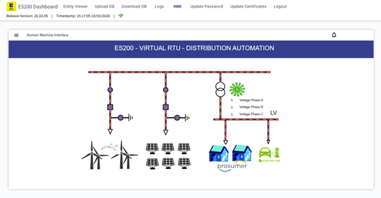
   
  <em>Figura 31</em>

#### 2.5.3. Meniul HMI

În partea stângă a interfeței HMI este disponibil un meniu lateral, care poate fi afișat prin apăsarea butonului de tip **menu** din partea superioară stângă.

  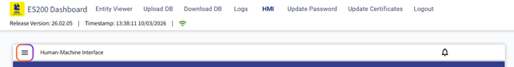
   
  <em>Figura 32</em>

Meniul lateral conține **view-urile (paginile)** configurate în aplicația **Dashboard ES200**. Aceste pagini reprezintă interfețele grafice utilizate pentru vizualizarea procesului și interacțiunea cu sistemul.

În exemplul prezentat sunt disponibile următoarele pagini:

* **Home**
* **HMI**

Aceste pagini permit navigarea între diferite view-uri ale interfeței grafice.

Numărul și denumirea paginilor nu sunt fixe. **View-urile sunt configurabile** în aplicația Dashboard ES200, iar utilizatorul poate defini și adăuga oricâte pagini HMI sunt necesare pentru monitorizarea și controlul sistemului.

#### 2.5.4. Pagina Home

Prin selectarea opțiunii **Home**, utilizatorul accesează pagina principală a interfeței HMI.

Această pagină poate conține elemente generale de prezentare, precum denumirea soluției, elemente grafice, sigle și informații descriptive. Rolul acestei secțiuni este de a oferi un punct de pornire pentru navigarea în interfața HMI.

  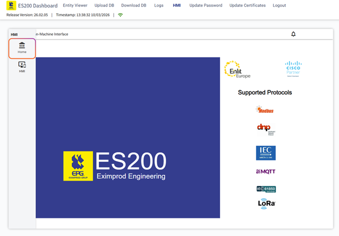
   
  <em>Figura 33</em>

#### 2.5.5. Vizualizarea paginii HMI

Prin selectarea opțiunii **HMI** din meniul lateral, utilizatorul accesează pagina grafică de proces.

Această pagină este realizată în aplicația **ES200 Dashboard**, prin opțiunea **File → HMI**, și poate fi configurată în editorul dedicat HMI. În cadrul editorului se pot modifica proprietățile implicite ale paginii, cum ar fi dimensiunea view-ului și culoarea de fundal, iar ulterior pagina poate fi populată cu elemente grafice și forme de proces.

Pagina HMI poate conține schema instalației, simboluri grafice, valori analogice, stări digitale și alte elemente vizuale asociate punctelor din configurația ES200. Formele de control și elementele grafice sunt legate de datapoint-urile corespunzătoare, astfel încât informațiile din teren să poată fi afișate în interfața web.

  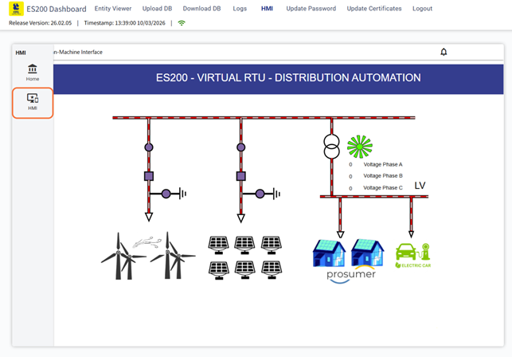
   
  <em>Figura 34</em>

#### 2.5.6. Panoul de alarme

În partea superioară a interfeței HMI este disponibil un buton dedicat alarmelor, reprezentat printr-o pictogramă de tip **bell**.

  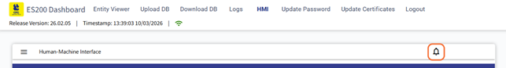
   
  <em>Figura 35</em>

La apăsarea acestui buton, în partea inferioară a ecranului se deschide panoul **Alarms**, în care sunt afișate informațiile referitoare la alarmele disponibile în sistem. În tabelul de alarme pot fi afișate coloane precum:

* **Date/Time**
* **Variable ID**
* **Text**
* **Type**
* **Group**

Această secțiune permite operatorului să urmărească rapid mesajele de alarmă și informațiile asociate acestora. În documentație, alarma este definită ca un eveniment care informează operatorul despre orice deviație a sistemului de la parametrii normali.

  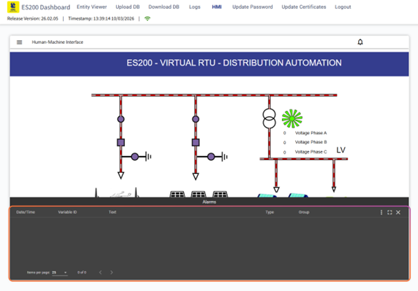
   
  <em>Figura 36</em>

#### 2.5.7. Opțiuni disponibile în panoul de alarme

Panoul de alarme include în partea dreaptă sus un buton de meniu suplimentar, prin care pot fi accesate opțiuni suplimentare de afișare.

  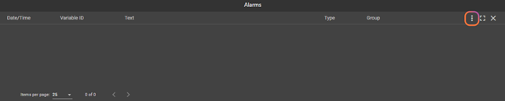
   
  <em>Figura 37</em>

Din acest meniu pot fi selectate, în funcție de context, opțiunile:

* **Alarms**
* **History Alarms**

Opțiunea **Alarms** permite afișarea alarmelor curente, iar opțiunea **History Alarms** permite afișarea istoricului de alarme.

Panoul include și controale suplimentare pentru afișare, precum opțiuni de extindere sau închidere a ferestrei, precum și setări legate de paginare.

  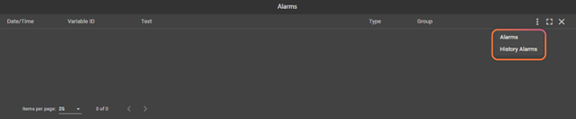
   
  <em>Figura 38</em>

### 2.6. Update Password

Pentru modificarea parolei utilizatorului curent, se accesează tab-ul **Update Password** din bara superioară de navigare a interfeței web.

  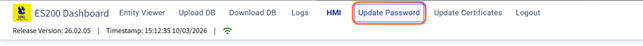
   
  <em>Figura 39</em>

După selectarea acestei opțiuni, este afișată o fereastră dedicată actualizării parolei.

#### 2.6.1. Modificarea parolei

În fereastra **Update Password**, utilizatorul trebuie să completeze următoarele câmpuri:

* **Current password**
* **New password**
* **Confirm new password**

După introducerea informațiilor necesare, se apasă butonul **Update password** pentru salvarea noii parole.

  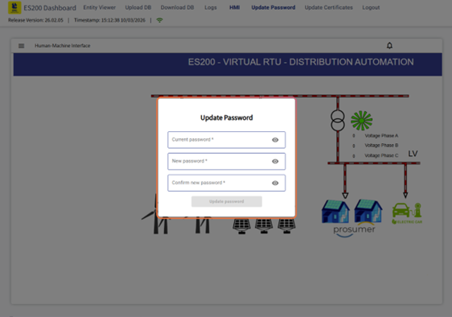
   
  <em>Figura 40</em>

Această funcționalitate permite actualizarea credențialelor de autentificare utilizate pentru accesul în interfața web. După actualizarea parolei, utilizatorul este **deconectat automat (logout)** din aplicație și trebuie să se autentifice din nou folosind noua parolă.

### 2.7. Update Certificates

Pentru actualizarea certificatelor utilizate de interfața web, se accesează tab-ul **Update Certificates** din bara superioară de navigare.

  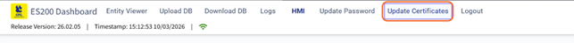
   
  <em>Figura 41</em>

După selectarea acestei opțiuni, este afișată o fereastră dedicată încărcării fișierelor necesare pentru actualizarea certificatelor.

#### 2.7.1. Actualizarea certificatelor

În fereastra **Update Certificates**, utilizatorul poate selecta fișierele necesare prin intermediul următoarelor opțiuni:

* **Select Key File**
* **Select Certificate File**

  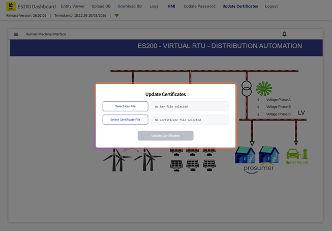
   
  <em>Figura 42</em>

După selectarea fișierelor corespunzătoare, se apasă butonul **Update Certificates** pentru aplicarea modificărilor. Această funcționalitate permite actualizarea certificatelor utilizate de aplicația web.

  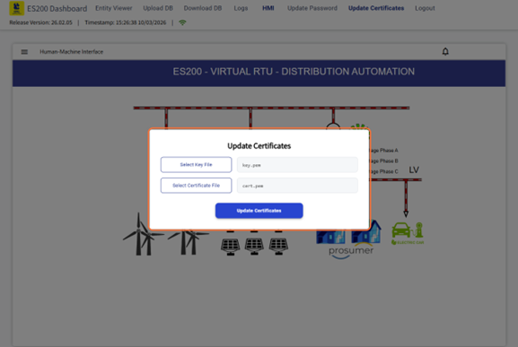
   
  <em>Figura 43</em>

După actualizarea certificatelor, se recomandă efectuarea unui **refresh al paginii web**, pentru a asigura aplicarea corectă a modificărilor în interfață.

### 2.8. Logout

Pentru ieșirea din interfața web, utilizatorul accesează opțiunea **Logout** din bara superioară de navigare. Prin utilizarea acestei opțiuni, sesiunea curentă este închisă, iar utilizatorul este deconectat din aplicație.

  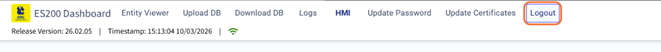
   
  <em>Figura 44</em>

De asemenea, dacă nu este detectată nicio activitate în interfață timp de **15 minute**, utilizatorul va fi **deconectat automat** din aplicație. Înainte de expirarea sesiunii, în interfață este afișat un mesaj de avertizare care informează utilizatorul că urmează să fie deconectat în cazul în care nu există activitate.