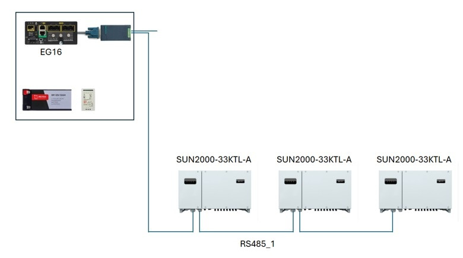
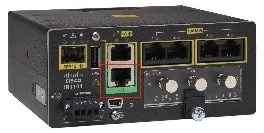
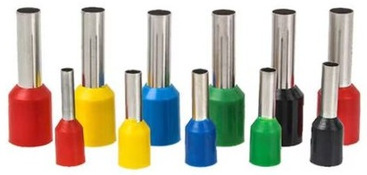
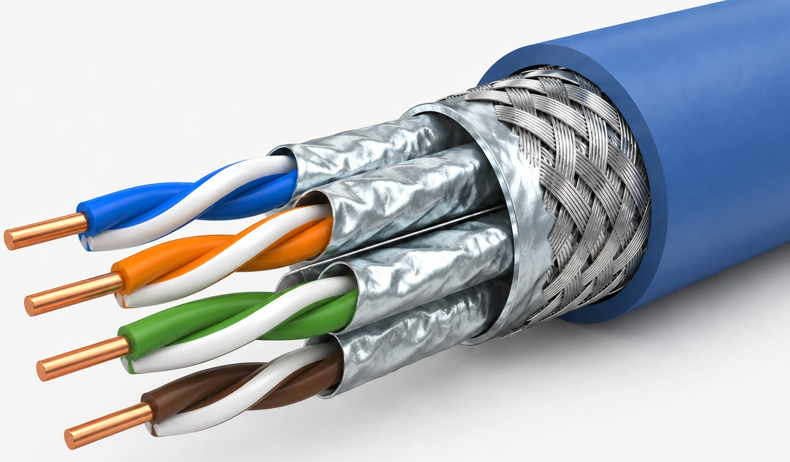
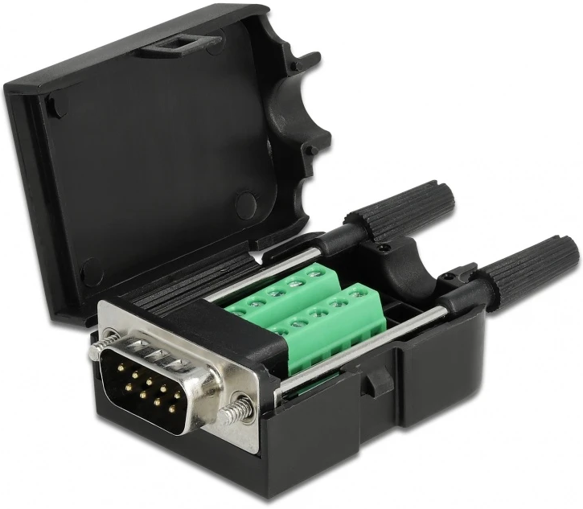
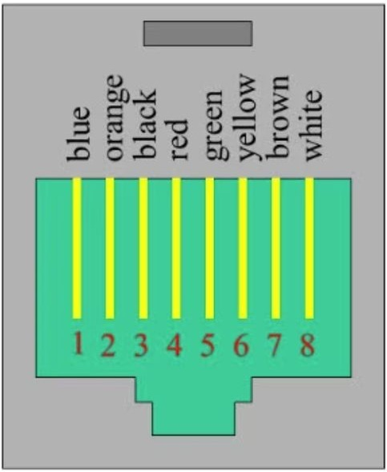
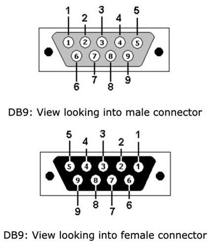
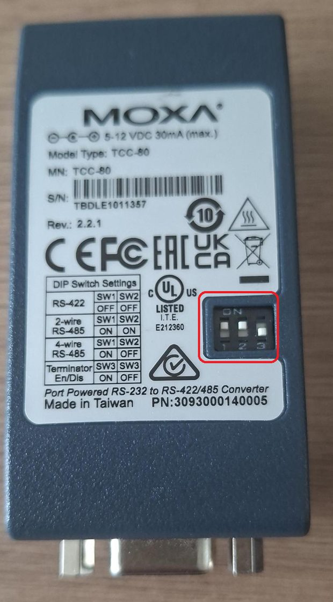
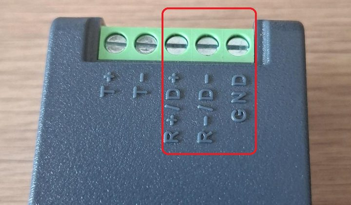

# Cablu serial RJ45 ↔ DB9 — Cisco IR1101 → invertoare <!-- omit from toc -->

> Conectarea interfeței seriale **RS‑232** a routerului **Cisco IR1101** la magistrala serială **RS‑485** a invertoarelor sau data-loggerelor, prin intermediul unui convertor **Moxa TCC‑80** (RS‑232 ↔ RS‑422/485).

- [1. Rolul cablului](#1-rolul-cablului)
- [2. Cablul Ethernet](#2-cablul-ethernet)
  - [2.1. Papuci pentru cablu litat](#21-papuci-pentru-cablu-litat)
  - [2.2. Obținerea cablului](#22-obținerea-cablului)
- [3. Materiale necesare](#3-materiale-necesare)
- [4. Confecționarea cablului](#4-confecționarea-cablului)
  - [4.1. Pregătirea cablului](#41-pregătirea-cablului)
  - [4.2. Cablarea adaptorului DB9](#42-cablarea-adaptorului-db9)
  - [4.3. Configurarea Moxa (DIP)](#43-configurarea-moxa-dip)
  - [4.4. Asamblarea cap la cap](#44-asamblarea-cap-la-cap)
  - [4.5. Conectarea la router](#45-conectarea-la-router)
  - [4.6. Conectarea la invertor](#46-conectarea-la-invertor)
- [5. Configurarea routerului (Modbus RTU)](#5-configurarea-routerului-modbus-rtu)
- [6. Fluxul de semnal](#6-fluxul-de-semnal)
- [7. Rolul masei (GND)](#7-rolul-masei-gnd)
- [8. Echipamente și referințe](#8-echipamente-și-referințe)
- [9. Revizii](#9-revizii)

---

## 1. Rolul cablului

Interfața serială a routerului **Cisco IR1101** suportă **doar RS‑232**, în timp ce invertoarele comunică pe **RS‑485** folosind protocolul **Modbus RTU**. Pentru a face legătura între cele două este nevoie de o conversie RS‑232 → RS‑485:

- Routerul interoghează (polling) invertoarele prin Modbus RTU; mai multe invertoare pot fi înlănțuite pe aceeași magistrală RS‑485.
- Interfața serială a routerului (RS‑232, conector **RJ45**) se conectează la portul **RS‑232 (DB9 mamă)** al convertorului **Moxa TCC‑80**.
- Borna **RS‑485** a convertorului Moxa se conectează mai departe la magistrala RS‑485 a invertoarelor (legătură pe 3 fire: `+` / `–` / `GND`).
- Între IR1101 (RJ45) și Moxa (DB9 mamă) se confecționează un **cablu special**, cu două capete: **RJ45** și **DB9 tată**.

<div align="center">



*Exemplu de instalare: routerul interoghează prin Modbus RTU mai multe invertoare înlănțuite pe RS‑485.*

</div>

<div align="center">



*Routerul Cisco IR1101 — portul serial RJ45 (RS-232) în care intră mufa cablului.*

</div>

---

## 2. Cablul Ethernet

Cablurile seriale se confecționează **pornind de la cablu Ethernet** — firele din interiorul cablului sunt cele care transportă semnalul.

Recomandări pentru cablu:

- **Cablu cu fir plin / monofilar (solid core).** Recomandăm conductorii solizi (un singur fir plin pe conductor), nu litați (stranded). Firul plin se așază și se fixează mai bine în contacte și asigură un contact mai stabil.
- **Cablu ecranat (shielded).** Folosiți cablu Ethernet **shielded**. Ecranul respinge perturbațiile electromagnetice și, legat corect la masă, scurge zgomotul indus în cablu.

### 2.1. Papuci pentru cablu litat

Dacă totuși folosiți cablu **litat** (mai multe fire subțiri pe conductor), terminați **obligatoriu** capetele firelor cu **papuci tubulari izolați** (bootlace ferrules), sertizați corespunzător, **înainte** de a-i introduce în borne.

Firul litat introdus direct în bornele cu șurub **se desface**, face contact slab/intermitent și firele pot atinge bornele vecine. Papucul adună toate firele într-un **capăt solid**, asigurând un contact ferm și sigur. Alegeți dimensiunea papucului în funcție de secțiunea conductorului (firele de Ethernet sunt subțiri, ~0,2 mm²).

<div align="center">



*Papuci tubulari izolați — se sertizează pe capătul firului litat.*

</div>

### 2.2. Obținerea cablului

| Variantă                           | Cum se procedează                                                                                                                     | Mufări             |
| ---------------------------------- | ------------------------------------------------------------------------------------------------------------------------------------- | ------------------ |
| **A. Ambele capete făcute manual** | Rolă de cablu (fir plin, ecranat) → tai la lungime (~100 cm) → mufezi **ambele** capete: RJ45 la unul, DB9 (prin adaptor) la celălalt | **2** (RJ45 & DB9) |
| **B. Cablu deja mufat**            | Cabluri Ethernet gata mufate (RJ45 din fabrică) → **tai un singur capăt** → mufezi acolo doar **DB9**                                 | **1** (doar DB9)   |

---

## 3. Materiale necesare

| Element                                                                 | Cantitate   | Observații                                                    |
| ----------------------------------------------------------------------- | ----------- | ------------------------------------------------------------- |
| Cablu Ethernet **cu fir plin (monofilar) și ecranat**                   | după nevoie | Rolă (var. A) sau cabluri gata mufate (var. B)                |
| Papuci tubulari izolați                                                 | după nevoie | **Doar** dacă se folosește cablu litat                        |
| Adaptor D‑Sub 9 **tată** → bloc terminal cu șuruburi + carcasă (Delock) | 1 / cablu   | Mufa DB9 dinspre Moxa; fire în șuruburi (papuci la fir litat) |
| Convertor **Moxa TCC‑80** RS‑232 ↔ RS‑485                               | 1           | Are DIP‑switch‑urile SW1/SW2/SW3 și bornele R+/D+, R‑/D‑, GND |

---

## 4. Confecționarea cablului

### 4.1. Pregătirea cablului

La capătul care va deveni DB9, dezizolați și separați firele din interiorul cablului Ethernet.

> **Atenție la culori:** codurile de culoare pot diferi. Dacă nu aveți aceleași culori, **orientați‑vă după numărul PIN‑ului**, nu după culoare.
> 
<div align="center">



*Cablul Ethernet: RJ45 la un capăt, firele dezizolate la celălalt.*

</div>

### 4.2. Cablarea adaptorului DB9
Folosiți adaptorul **Delock „Sub‑D 9 tată → bloc terminal cu șuruburi"**: fiecare fir dezizolat se prinde în șurubul terminalului corespunzător, conform tabelului de mai jos. Identificați firul după poziția lui în mufa RJ45 (culoare/PIN), apoi prindeți‑l în terminalul DB9 corespunzător.

<div align="center">



*Adaptor Delock Sub‑D 9 tată cu bloc terminal cu șuruburi și carcasă: fiecare fir se prinde în șurubul pinului corespunzător.*

</div>

**Tabel complet de corespondență RJ‑45 ↔ DB9:**

| Pin RJ‑45 | Pin DB9 |
| :-------: | :-----: |
|     1     |    6    |
|     2     |    1    |
|     3     |    4    |
|     4     |    5    |
|     5     |    2    |
|     6     |    3    |
|     7     |    8    |
|     8     |    7    |

**Fire efectiv utilizate** — doar 3 pini (2, 3, 5 pe partea DB9), liniile RS‑232:

| Pin RJ‑45 |   →   | Pin DB9 | Semnal RS‑232    |
| :-------: | :---: | :-----: | ---------------- |
|     4     |   →   |    5    | **GND (masă)**   |
|     5     |   →   |    2    | RxD (recepție)   |
|     6     |   →   |    3    | TxD (transmisie) |

> **Firul de masă (RJ45 4 → DB9 5) trebuie întotdeauna conectat** (vezi [secțiunea 7](#7-rolul-masei-gnd)).

<div align="center">



*Numerotarea pinilor RJ‑45 (1–8). Orientați‑vă după PIN, nu după culoare.*

</div>

<div align="center">



*Numerotarea pinilor DB9 — conector tată și mamă.*

</div>

**Coduri de culoare (informativ — pot diferi, verificați PIN‑ul):**

|  Pin  | Ethernet standard (T568B) | Cod Cisco  |
| :---: | ------------------------- | ---------- |
|   1   | alb‑portocaliu            | albastru   |
|   2   | portocaliu                | portocaliu |
|   3   | alb‑verde                 | negru      |
|   4   | albastru                  | roșu       |
|   5   | alb‑albastru              | verde      |
|   6   | verde                     | galben     |
|   7   | alb‑maro                  | maro       |
|   8   | maro                      | alb        |

### 4.3. Configurarea Moxa (DIP)
Setați **SW1, SW2, SW3** pe **ON, ON, OFF**.

<div align="center">



*Spatele convertorului Moxa TCC‑80: tabelul DIP și comutatoarele pe ON, ON, OFF.*

</div>

| Mod                                |  SW1   |  SW2   |
| ---------------------------------- | :----: | :----: |
| RS‑422 (full‑duplex)               |  OFF   |  OFF   |
| **RS‑485 pe 2 fire (half‑duplex)** | **ON** | **ON** |
| RS‑485 pe 4 fire (full‑duplex)     |   ON   |  OFF   |

| Terminator     |   SW3   |
| -------------- | :-----: |
| Activat        |   ON    |
| **Dezactivat** | **OFF** |

→ **ON, ON, OFF** = **RS‑485 pe 2 fire (half‑duplex)**, cu **terminatorul dezactivat**.

### 4.4. Asamblarea cap la cap
Conectați în serie: **Cablul (RJ45)** + **Adaptorul Sub‑D 9 tată** + **portul DB9 mamă al convertorului Moxa**.

### 4.5. Conectarea la router
Introduceți mufa **RJ45** a cablului confecționat în **portul RS (serial)** al routerului Cisco IR1101.

### 4.6. Conectarea la invertor
Firele RS‑485 de la blocul de borne al convertorului Moxa se conectează la bornele RS‑485 ale invertorului.

<div align="center">


*Convertorul Moxa TCC‑80 — portul DB9 (RS‑232) și blocul de borne RS‑485.*

</div>

<div align="center">



*Blocul de borne: T+ , T– , R+/D+ , R–/D– , GND. Pentru 2 fire se folosesc R+/D+, R–/D–, GND.*

</div>

| Fir                         |   →   | Borna Moxa  |
| --------------------------- | :---: | ----------- |
| Firul „ + "                 |   →   | **R+ / D+** |
| Firul „ – "                 |   →   | **R– / D–** |
| Firul de „masă/împământare" |   →   | **GND**     |

> Bornele Moxa sunt cu **șurub** → dacă firele sunt litate, montați **papuci** pe capete (vezi [secțiunea 2.1](#21-papuci-pentru-cablu-litat)).

---

## 5. Configurarea routerului (Modbus RTU)

Pe lângă cablare, portul serial al routerului trebuie configurat ca **linie de date asincronă transparentă**, astfel încât aplicația/serverul Modbus să poată comunica cu invertoarele prin portul RS‑232 (și mai departe RS‑485). Aplicați următoarea configurație:

```cisco
interface Async0/2/0
 no ip address
 encapsulation relay-line
 async mode dedicated
!
line 0/2/0
 exec-timeout 0 0
 no exec
 transport preferred none
 transport input all
 transport output none
 speed 9600
 databits 8
 parity none
 stopbits 1
!
relay line 0/2/0 0/0/0
!
```

> **Notă privind numerotarea:** identificatorii `0/2/0` și `0/0/0` depind de slotul și de modulul serial montat. Verificați liniile disponibile cu `show line` și ajustați‑i corespunzător.

> **Important — parametrii seriali:** valorile `speed 9600`, `databits 8`, `parity none`, `stopbits 1` (adică **9600 8N1**) sunt orientative. Acești parametri trebuie să corespundă **exact** cu setările Modbus RTU ale invertorului — altfel comunicația eșuează.

---

## 6. Fluxul de semnal

```
Cisco IR1101 (RS-232, RJ45)
        │  cablu RJ45 ↔ DB9 tată (pini 4→5 GND, 5→2 RxD, 6→3 TxD)
        ▼
Moxa TCC-80 (DB9 mamă, RS-232)  ──[ SW1=ON, SW2=ON, SW3=OFF ]──►  RS-485 2 fire
        │  bornă: R+/D+ , R-/D- , GND
        ▼
Invertor RS-485  ──►  invertoare înlănțuite (Modbus RTU)
( + → R+/D+ ,  - → R-/D- ,  masă → GND )
```

---

## 7. Rolul masei (GND)

Conectarea firului de masă **nu este opțională** — atât pe RS‑232 (pinul 5 DB9), cât și pe RS‑485 (borna GND). Motivele:

- **RS‑232 este un semnal raportat la masă (single‑ended).** Receptorul decide „1" / „0" comparând tensiunea liniei **față de masa comună**. Fără referință comună, nivelurile „plutesc" → date corupte, erori CRC, conexiune instabilă.
- **Diferențe de potențial între mase.** Fără un GND comun, offset‑ul dintre mase se adună peste semnal și poate ieși din pragurile valide RS‑232 → erori. Masa comună aduce ambele capete la aceeași referință.
- **Reducerea perturbațiilor (EMI).** Masa, împreună cu ecranul cablului, oferă o cale de scurgere pentru zgomot. Fără ea, perturbațiile se cuplează pe semnal → erori, retransmisii. De aici și **cablul ecranat**.
- **Pe RS‑485:** deși e diferențial, **GND** trebuie tot legat pentru a menține tensiunea de mod comun în domeniul admis de transceivere; altfel comunicația se poate bloca sau porturile se pot deteriora.

**Concluzie:** masa stabilizează nivelurile, reduce perturbațiile și asigură o conexiune serială fiabilă.

---

## 8. Echipamente și referințe

- [Cisco IR1101 — Catalyst IR1101 Rugged Series Router](https://www.cisco.com/c/en/us/products/collateral/routers/1101-industrial-integrated-services-router/datasheet-c78-741709.html)
- [Moxa TCC‑80 / TCC‑80I — convertor serial‑serial RS‑232 ↔ RS‑422/485](https://www.moxa.com/en/products/industrial-edge-connectivity/serial-converters/serial-to-serial-converters/tcc-80-80i-series)
- [Adaptor Delock D‑Sub 9 tată → bloc terminal cu șuruburi](https://conectica.ro/adaptoare-convertoare/bloc-terminal/terminal-block-10-pini-la-serial-d-sub-9-pini-tata-cu-suruburi-carcasa-delock-6)
- [Ghid Cisco RJ‑45 → DB9](https://www.cisco.com/c/en/us/td/docs/IIOT/routers/ir1101/hw-install-guide/b-ir1101-hig/m-connecting-the-router.html#con_1041724)
- [Cisco — configurarea portului serial](https://developer.cisco.com/docs/iotod/serial/#configure-serial-port-status-for-base-or-expansion-modules-to-cisco-gear)

---

## 9. Revizii

| Rev.  | Autor           | E‑mail                    | Data       |
| :---: | --------------- | ------------------------- | ---------- |
|   1   | Thomas Schaller | thomas.schaller@enedis.fr | 04.06.2025 |
|   2   | Mihnea Marin    | mihnea.marin@epg.ro       | 30.07.2025 |
|   3   | Alexandru Manea | alexandru.manea@epg.ro    | 02.06.2026 |
